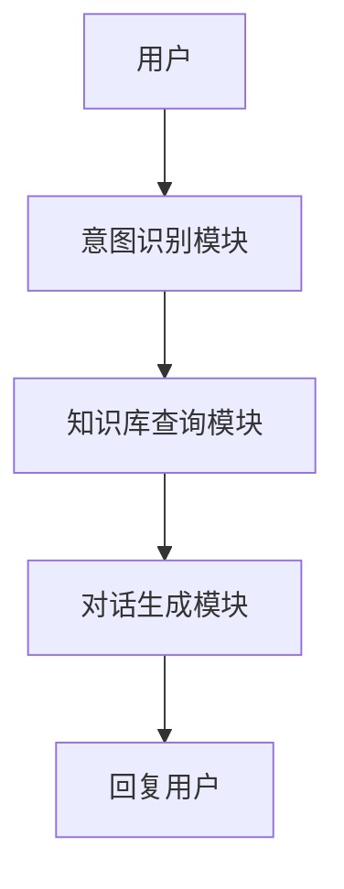
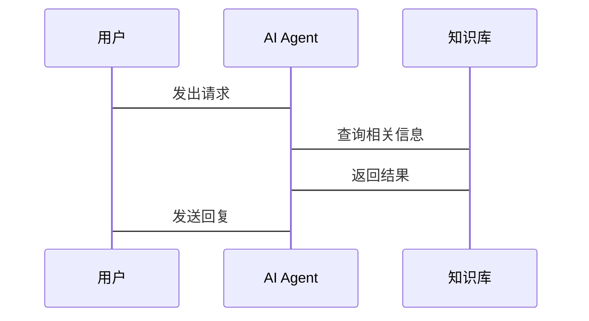

                 


# AI Agent在智能客服中的应用

> **关键词**：AI Agent, 智能客服, 自然语言处理, 机器学习, 深度学习, 系统架构

> **摘要**：本文深入探讨AI Agent在智能客服中的应用，从背景介绍、核心概念到算法原理、系统架构，再到项目实战和最佳实践，全面解析AI Agent如何提升智能客服的效率和用户体验。通过详细的技术分析和实际案例，展示AI Agent在智能客服中的潜力和未来发展方向。

---

## 第1章: AI Agent与智能客服的背景介绍

### 1.1 AI Agent的基本概念

#### 1.1.1 什么是AI Agent
AI Agent（人工智能代理）是一种能够感知环境并采取行动以实现目标的智能实体。它通过接收输入、处理信息、做出决策并执行操作，为用户提供服务或解决问题。AI Agent可以是软件程序，也可以是硬件设备，广泛应用于智能客服、推荐系统、自动驾驶等领域。

#### 1.1.2 AI Agent的核心属性
AI Agent的核心属性包括：
- **自主性**：能够在没有人工干预的情况下独立运作。
- **反应性**：能够实时感知环境并做出反应。
- **目标导向性**：基于设定的目标采取行动。
- **学习能力**：通过数据和经验不断优化自身性能。

#### 1.1.3 AI Agent与智能客服的关系
AI Agent是智能客服的核心技术之一，通过自然语言处理（NLP）和机器学习（ML）技术，AI Agent能够理解和处理用户的请求，提供高效的客服服务。

---

### 1.2 智能客服的发展历程

#### 1.2.1 传统客服模式的局限性
传统客服模式依赖人工坐席，存在以下问题：
- 人工成本高，效率低。
- 服务时间受限，无法24/7提供支持。
- 用户体验不稳定，取决于坐席的技能和状态。

#### 1.2.2 智能客服的兴起背景
随着AI技术的发展，智能客服逐渐兴起，利用AI Agent实现自动化服务，解决传统客服的痛点。

#### 1.2.3 当前智能客服的应用现状
目前，智能客服已广泛应用于多种场景，如在线客服、语音客服、智能推荐等，显著提升了服务效率和用户体验。

---

### 1.3 AI Agent在智能客服中的问题背景

#### 1.3.1 客服效率的痛点
传统客服模式效率低下，无法满足大规模用户需求，而AI Agent能够实现快速响应和自动化处理。

#### 1.3.2 用户体验的提升需求
用户希望获得个性化的服务体验，AI Agent通过深度学习和NLP技术能够实现精准需求识别和个性化服务。

#### 1.3.3 企业成本的优化目标
通过AI Agent实现自动化客服，能够显著降低企业的运营成本，提高资源利用效率。

---

### 1.4 本章小结

#### 1.4.1 AI Agent在智能客服中的定位
AI Agent是智能客服的核心技术，通过NLP和机器学习实现自动化服务。

#### 1.4.2 未来发展趋势的初步展望
随着AI技术的不断进步，AI Agent在智能客服中的应用将更加广泛，服务更加智能化和个性化。

---

## 第2章: AI Agent的核心概念与原理

### 2.1 AI Agent的定义与分类

#### 2.1.1 AI Agent的定义
AI Agent是一种能够感知环境并采取行动以实现目标的智能实体。

#### 2.1.2 基于规则的AI Agent
基于规则的AI Agent通过预定义的规则进行决策，适用于规则明确的场景，如简单的FAQ回答。

#### 2.1.3 基于模型的AI Agent
基于模型的AI Agent利用机器学习模型进行决策，能够处理复杂场景，如情感分析和意图识别。

---

### 2.2 自然语言处理（NLP）在AI Agent中的应用

#### 2.2.1 NLP的基本原理
NLP通过文本处理、语义分析等技术，帮助AI Agent理解用户输入的内容。

#### 2.2.2 分词、句法分析与语义理解
- **分词**：将输入文本分割成词语或短语。
- **句法分析**：分析句子的语法结构。
- **语义理解**：理解文本的深层含义。

#### 2.2.3 基于上下文的对话理解
通过上下文理解用户的需求，提供连贯的对话体验。

---

### 2.3 机器学习在AI Agent中的应用

#### 2.3.1 监督学习与无监督学习
- **监督学习**：基于标注数据进行训练。
- **无监督学习**：从未标注数据中发现模式。

#### 2.3.2 深度学习模型的应用
深度学习模型如BERT在自然语言处理中表现出色，能够实现复杂的语义理解任务。

#### 2.3.3 模型的训练与优化
通过大量数据训练模型，并不断优化以提高准确性。

---

### 2.4 AI Agent与智能客服的结合

#### 2.4.1 AI Agent在智能客服中的角色
AI Agent作为智能客服的核心，负责接收用户请求、理解需求、提供解决方案。

#### 2.4.2 AI Agent的核心功能模块
- **意图识别**：识别用户的意图。
- **知识库查询**：基于意图查询知识库。
- **对话生成**：生成自然的对话回复。

#### 2.4.3 AI Agent的交互流程
用户输入请求 → AI Agent解析需求 → 知识库查询 → 生成回复 → 返回用户。

---

### 2.5 本章小结

#### 2.5.1 AI Agent的核心技术总结
AI Agent结合NLP和机器学习技术，能够实现智能客服的自动化服务。

#### 2.5.2 智能客服中的应用模式
AI Agent通过意图识别和自然语言处理，提供高效、个性化的客服服务。

---

## 第3章: AI Agent的算法原理与实现

### 3.1 自然语言处理算法

#### 3.1.1 分词算法
- **分词工具**：如jieba。
- **实现步骤**：将输入文本分割成词语。

#### 3.1.2 词性标注与句法分析
- **词性标注**：如jieba的pos_tag函数。
- **句法分析**：使用依存句法分析工具，如spaCy。

#### 3.1.3 基于深度学习的语义理解
- **模型选择**：如BERT。
- **实现步骤**：加载预训练模型，输入文本，输出语义表示。

---

### 3.2 机器学习算法

#### 3.2.1 监督学习算法
- **分类任务**：如文本分类。
- **实现步骤**：收集数据，预处理，训练模型，评估性能。

#### 3.2.2 无监督学习算法
- **聚类任务**：如客户分群。
- **实现步骤**：数据预处理，选择聚类算法，训练模型，评估结果。

#### 3.2.3 增强学习算法
- **应用场景**：如对话策略优化。
- **实现步骤**：定义状态、动作、奖励，训练策略网络。

---

### 3.3 AI Agent的算法实现

#### 3.3.1 意图识别算法
- **数据准备**：收集用户请求和标签。
- **模型训练**：使用深度学习模型训练意图识别器。
- **结果评估**：计算准确率、召回率等指标。

#### 3.3.2 对话生成算法
- **数据准备**：收集对话数据，建立训练样本。
- **模型训练**：使用生成模型训练对话生成器。
- **结果评估**：评估生成对话的流畅性和相关性。

---

### 3.4 本章小结

#### 3.4.1 算法原理总结
AI Agent通过NLP和机器学习算法实现意图识别和对话生成。

#### 3.4.2 技术实现的关键点
- 数据预处理和特征提取。
- 模型选择和优化。
- 算法评估和调优。

---

## 第4章: AI Agent的系统分析与架构设计

### 4.1 问题场景介绍

#### 4.1.1 智能客服的核心问题
- 用户需求多样，服务效率低。
- 人工成本高，难以扩展。

#### 4.1.2 AI Agent的目标
- 提高服务效率。
- 提升用户体验。
- 降低运营成本。

---

### 4.2 系统功能设计

#### 4.2.1 领域模型设计
- **实体识别**：识别用户输入中的实体，如产品名称。
- **意图识别**：识别用户的意图，如查询产品信息。
- **知识库管理**：管理和查询知识库中的信息。

#### 4.2.2 功能模块设计
- **意图识别模块**：解析用户意图。
- **知识库查询模块**：查询相关信息。
- **对话生成模块**：生成回复。

---

### 4.3 系统架构设计

#### 4.3.1 系统架构图


#### 4.3.2 接口设计
- **输入接口**：接收用户请求。
- **输出接口**：返回回复内容。

#### 4.3.3 交互流程图


---

### 4.4 本章小结

#### 4.4.1 系统设计总结
AI Agent通过合理的系统架构设计，实现了高效、智能的客服服务。

#### 4.4.2 关键技术点
- 系统模块化设计。
- 接口标准化设计。
- 交互流程优化。

---

## 第5章: AI Agent的项目实战

### 5.1 环境安装

#### 5.1.1 Python环境搭建
- 安装Python和必要的库，如numpy、pandas、tensorflow、jieba等。

#### 5.1.2 开发工具配置
- 配置IDE，如PyCharm或VS Code。

---

### 5.2 系统核心实现

#### 5.2.1 意图识别实现
```python
import tensorflow as tf
from tensorflow.keras import layers

model = tf.keras.Sequential()
model.add(layers.Dense(64, activation='relu', input_shape=(input_dim,)))
model.add(layers.Dense(num_classes, activation='softmax'))
model.compile(optimizer='adam', loss='sparse_categorical_crossentropy', metrics=['accuracy'])
model.fit(X_train, y_train, epochs=10, batch_size=32)
```

#### 5.2.2 对话生成实现
```python
import tensorflow as tf
from tensorflow.keras import layers

model = tf.keras.Sequential()
model.add(layers.Embedding(input_dim=vocabulary_size, output_dim=embedding_dim))
model.add(layers.LSTM(128, return_sequences=True))
model.add(layers.Dense(vocabulary_size, activation='softmax'))
model.compile(optimizer='adam', loss='sparse_categorical_crossentropy', metrics=['accuracy'])
model.fit(X_train, y_train, epochs=10, batch_size=32)
```

---

### 5.3 案例分析

#### 5.3.1 实际案例分析
假设用户输入“我想要购买iphone”，AI Agent通过意图识别模块识别出用户的意图是“购买产品”，然后查询知识库，生成回复“您想了解哪款iPhone的信息？”

#### 5.3.2 分析与总结
通过案例分析，验证AI Agent在实际应用中的有效性，总结经验教训，优化系统性能。

---

### 5.4 本章小结

#### 5.4.1 项目实现总结
通过实际项目，展示了AI Agent在智能客服中的实现过程和技术细节。

#### 5.4.2 经验与教训
- 数据质量对模型性能影响重大。
- 系统设计需要充分考虑扩展性和可维护性。

---

## 第6章: 最佳实践与未来展望

### 6.1 最佳实践

#### 6.1.1 数据管理
- 数据清洗和预处理。
- 数据隐私保护。

#### 6.1.2 模型优化
- 模型调参和优化。
- 模型部署和监控。

#### 6.1.3 系统维护
- 定期更新模型。
- 监控系统性能。

---

### 6.2 未来展望

#### 6.2.1 技术发展
- 更加先进的NLP模型，如Transformer。
- 多模态交互，结合视觉和语音信息。

#### 6.2.2 应用场景扩展
- 智能客服的个性化服务。
- 智能客服的多语言支持。

---

### 6.3 注意事项

#### 6.3.1 数据隐私
- 遵守数据隐私法规，保护用户隐私。

#### 6.3.2 系统稳定
- 确保系统稳定运行，避免服务中断。

---

## 附录: 术语表与参考文献

### 附录A: 术语表

| 术语         | 定义                                 |
|--------------|--------------------------------------|
| AI Agent     | 人工智能代理，能够感知环境并采取行动以实现目标的智能实体。 |
| NLP          | 自然语言处理，研究计算机对人类语言的理解和生成的技术。   |
| 意图识别     | 通过分析用户输入，识别用户的意图或需求。               |

### 附录B: 参考文献

1. 周志华. 《机器学习》. 清华大学出版社, 2016.
2. 帅立. 《神经网络与深度学习》. 清华大学出版社, 2018.
3. 维基百科. AI Agent. [维基百科链接](https://zh.wikipedia.org/wiki/智能体).

---

## 作者：AI天才研究院 & 禅与计算机程序设计艺术

---

**本文是AI天才研究院（AI Genius Institute）的原创内容，转载请注明出处。**

