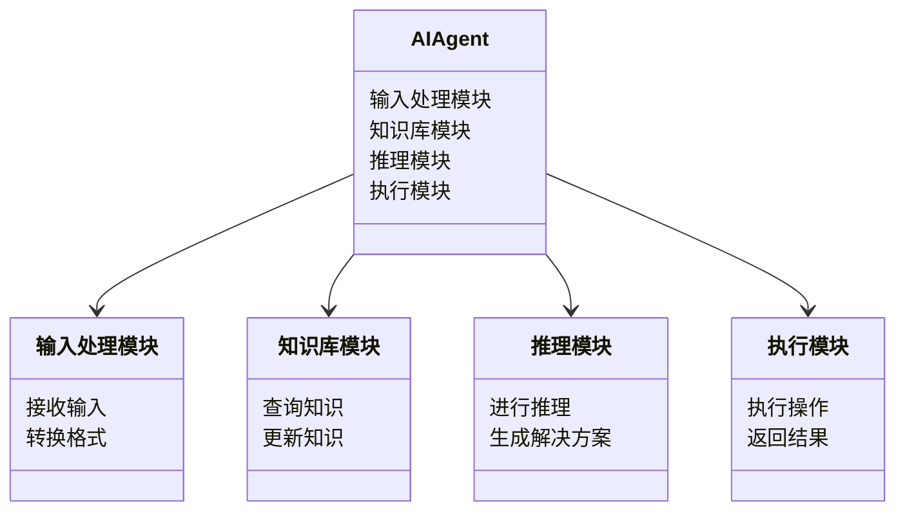
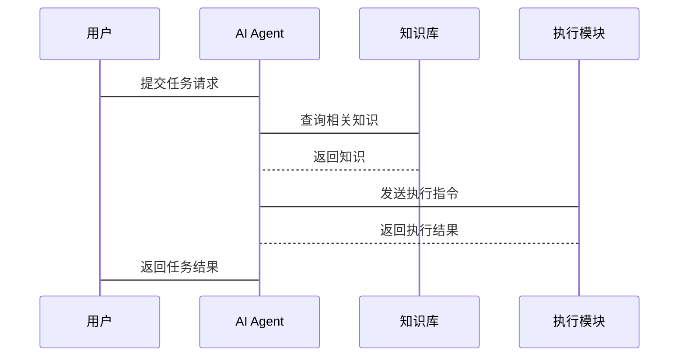

                 


# AI Agent的跨域任务泛化能力开发

> 关键词：AI Agent，跨域任务，泛化能力，生成式AI，强化学习，多模态数据处理

> 摘要：本文深入探讨了AI Agent在跨域任务中的泛化能力开发，从基本概念到算法原理，再到系统设计与实战应用，全面解析了如何提升AI Agent的跨域任务处理能力。通过生成式AI、强化学习和多模态数据处理的结合，本文为AI Agent的泛化能力开发提供了理论基础和实践指导。

---

## 第一部分: AI Agent的跨域任务泛化能力开发背景介绍

### 第1章: AI Agent的核心概念与问题背景

#### 1.1 AI Agent的定义与背景
- **AI Agent的基本定义**  
  AI Agent（人工智能代理）是指能够感知环境、自主决策并执行任务的智能实体。它可以是一个软件程序、机器人或其他智能系统，其核心目标是通过与环境交互来实现特定目标。

- **AI Agent的发展背景**  
  随着AI技术的快速发展，AI Agent逐渐从理论研究走向实际应用。特别是在自然语言处理、机器人技术和自动化系统领域，AI Agent展现出强大的潜力。

- **AI Agent的应用场景**  
  AI Agent广泛应用于智能家居、自动驾驶、智能助手、客户服务等领域。例如，智能音箱可以作为用户的AI Agent，根据用户的指令完成播放音乐、设置提醒等任务。

#### 1.2 跨域任务的定义与挑战
- **跨域任务的定义**  
  跨域任务指的是AI Agent需要在多个不同的领域或环境中完成任务。例如，一个AI Agent可能需要在医疗领域提供诊断建议，同时在金融领域进行数据分析。

- **跨域任务的分类**  
  跨域任务可以分为两类：**横向跨域**（在同一任务中涉及多个领域）和**纵向跨域**（在不同任务中涉及多个领域）。

- **跨域任务的挑战与难点**  
  跨域任务的泛化能力要求AI Agent能够适应不同领域的任务，这需要解决知识表示、任务推理和多模态数据处理等难题。

### 第2章: 跨域任务泛化能力的重要性

#### 2.1 泛化能力的定义
- **泛化能力的数学定义**  
  泛化能力是指AI Agent在未见过的数据集上表现良好的能力。具体来说，泛化能力可以通过测试集的准确率来衡量。

- **泛化能力的度量方法**  
  泛化能力的度量通常包括准确率、精确率、召回率和F1值等指标。例如，准确率 = 正确预测的数量 / 总预测数量。

#### 2.2 跨域任务泛化的应用场景
- **多领域任务处理**  
  在医疗领域完成诊断任务的同时，在金融领域进行数据分析。

- **动态环境下的任务适应**  
  在自动驾驶中，AI Agent需要实时适应道路、天气和交通等多种动态环境。

- **泛化能力对系统性能的影响**  
  泛化能力直接影响AI Agent的鲁棒性和适应性，是实现高效跨域任务处理的关键。

---

## 第二部分: AI Agent的核心概念与联系

### 第3章: AI Agent的核心原理

#### 3.1 AI Agent的组成与功能
- **感知模块**  
  负责接收输入数据并将其转化为可处理的形式。例如，自然语言处理模块可以将用户指令转化为结构化的数据。

- **决策模块**  
  基于感知模块提供的信息，进行推理和决策。例如，生成式AI可以根据任务需求生成解决方案。

- **执行模块**  
  根据决策模块的指令执行具体操作。例如，机器人可以根据决策结果完成物理动作。

#### 3.2 跨域任务的处理流程
- **任务接收与解析**  
  AI Agent首先接收任务，并将其解析为具体的子任务。例如，用户指令“预订机票”可以被解析为查询航班信息、选择航班和完成支付等子任务。

- **知识表示与推理**  
  AI Agent需要基于知识库进行推理。例如，根据航班信息推理出最佳的航班选择。

- **行动规划与执行**  
  AI Agent根据推理结果制定行动计划，并执行具体操作。例如，通过API调用完成机票预订。

### 第4章: 核心概念的属性对比与ER图

#### 4.1 核心概念的属性对比
| 核心概念 | 属性 | 描述 |
|----------|------|------|
| AI Agent | 输入 | 感知数据（如文本、图像） |
|          | 输出 | 执行操作（如动作、反馈） |
| 跨域任务 | 领域 | 多个领域或环境 |
|          | 类型 | 横向跨域和纵向跨域 |

#### 4.2 ER实体关系图
```mermaid
er
    Actor: 用户
    Role: AI Agent
    Task: 任务
    Knowledge: 知识库
    Action: 行动
    (Actor) -[请求]-> (Task)
    (Task) -[依赖]-> (Knowledge)
    (Knowledge) -[提供]-> (Action)
```

---

## 第三部分: AI Agent的算法原理与数学模型

### 第5章: 基于生成式AI的跨域任务处理

#### 5.1 生成式AI的基本原理
- **变量定义**  
  生成式AI的目标是根据输入生成输出，其中输入为$X$，输出为$Y$。例如，$X$可以是文本描述，$Y$可以是图像或文本生成。

- **概率分布**  
  生成式AI通常基于概率分布模型，如$P(Y|X)$。例如，生成式模型可以根据用户描述生成相应的图像。

- **模型训练过程**  
  生成式AI的训练过程包括数据预处理、模型构建、损失函数优化和模型评估。

#### 5.2 跨域任务的生成式AI实现
- **多模态输入处理**  
  跨域任务通常涉及多模态输入，例如文本和图像。生成式AI需要同时处理多种输入形式。

- **任务目标函数**  
  跨域任务的生成式AI需要定义目标函数，例如$F(X,Y)$，用于衡量生成结果的质量。

- **模型优化策略**  
  生成式AI的优化策略包括对抗训练、预训练-微调和多任务学习等。

### 第6章: 强化学习在跨域任务中的应用

#### 6.1 强化学习的基本原理
- **状态空间**  
  状态空间$S$表示环境的状态，例如在棋盘游戏中，状态可以是棋盘的当前布局。

- **行动空间**  
  行动空间$A$表示AI Agent可以执行的动作，例如在棋盘游戏中，移动棋子或攻击对手。

- **奖励函数**  
  奖励函数$R$定义了AI Agent在特定状态下执行动作后的奖励值。例如，在棋盘游戏中，每一步的奖励可以基于当前状态的优劣。

#### 6.2 跨域任务中的强化学习实现
- **状态转移模型**  
  状态转移模型$P(S'|S,A)$定义了在当前状态下执行动作后的状态转移概率。

- **动作选择策略**  
  动作选择策略$\pi(A|S)$定义了在当前状态下选择动作的概率分布。

- **激励机制设计**  
  跨域任务的激励机制需要考虑不同领域的任务目标，例如在医疗领域，完成诊断任务的奖励权重可能高于其他领域。

### 第7章: 多模态数据处理的数学模型

#### 7.1 多模态数据的表示方法
- **向量空间模型**  
  将多模态数据映射到向量空间，例如将文本表示为词向量，图像表示为特征向量。

- **概率图模型**  
  使用概率图模型（如贝叶斯网络）来表示多模态数据之间的关系。

- **数学表达式**  
  对于多模态数据$X = (X_1, X_2, ..., X_n)$，其联合概率分布可以表示为$P(X_1, X_2, ..., X_n)$。

#### 7.2 多模态数据处理的数学模型
- **模型结构**  
  多模态数据处理模型通常包括编码器和解码器两部分。编码器将多模态输入转化为隐层表示，解码器将隐层表示生成目标输出。

- **数学公式**  
  对于多模态输入$X$和目标输出$Y$，模型的优化目标可以表示为：
  $$\min_{\theta} \mathbb{E}_{(X,Y)}[\mathcal{L}(Y, f_\theta(X))]$$
  其中，$\mathcal{L}$是损失函数，$f_\theta$是模型参数化的函数。

---

## 第四部分: AI Agent的系统分析与架构设计

### 第8章: 跨域任务处理的系统功能设计

#### 8.1 系统功能模块
- **输入处理模块**  
  负责接收多模态输入并进行预处理。

- **知识库模块**  
  包含多个领域的知识库，用于任务推理。

- **推理模块**  
  基于知识库进行任务推理，生成解决方案。

- **执行模块**  
  根据推理结果执行具体操作，例如调用API或控制机器人。

#### 8.2 系统功能设计的领域模型


### 第9章: 系统架构设计与接口设计

#### 9.1 系统架构设计
- **分层架构**  
  系统分为输入层、处理层和输出层。输入层负责接收输入，处理层负责推理和决策，输出层负责执行操作。

- **模块化设计**  
  系统分为多个功能模块，例如输入处理模块、推理模块和执行模块，每个模块之间通过接口进行通信。

#### 9.2 系统接口设计
- **输入接口**  
  支持多种输入格式，例如文本、图像和语音。

- **输出接口**  
  支持多种输出格式，例如文本、图像和动作指令。

- **内部接口**  
  模块之间的接口用于传递数据和指令，例如推理模块向执行模块发送执行指令。

### 第10章: 系统交互流程设计

#### 10.1 系统交互流程
- **用户输入**  
  用户向AI Agent发送任务请求，例如“预订机票”。

- **任务解析**  
  AI Agent解析任务请求，将其分解为多个子任务。

- **知识查询**  
  AI Agent查询知识库，获取与任务相关的知识。

- **任务推理**  
  AI Agent基于知识库进行推理，生成解决方案。

- **任务执行**  
  AI Agent执行具体操作，例如调用机票预订系统。

#### 10.2 系统交互流程图


---

## 第五部分: AI Agent的项目实战

### 第11章: 跨域任务处理的环境配置

#### 11.1 环境配置
- **编程语言**  
  建议使用Python，因为它支持丰富的AI库，例如TensorFlow和PyTorch。

- **AI框架**  
  使用生成式AI框架，例如GPT-3或Diffusion模型。

- **知识库构建**  
  需要构建多领域的知识库，例如医疗知识库和金融知识库。

#### 11.2 工具安装
- **Python安装**  
  需要安装Python 3.8或更高版本。

- **AI框架安装**  
  使用pip安装所需的AI框架，例如：
  ```bash
  pip install torch transformers
  ```

- **知识库构建工具**  
  使用自然语言处理库（如spaCy）和知识图谱构建工具（如Neo4j）。

### 第12章: 跨域任务处理的核心代码实现

#### 12.1 输入处理模块
```python
class InputProcessor:
    def __init__(self):
        self.tokenizer = AutoTokenizer.from_pretrained("bert-base-uncased")

    def process_input(self, input_text):
        tokens = self.tokenizer(input_text, return_tensors="pt")
        return tokens
```

#### 12.2 推理模块
```python
class ReasoningModule:
    def __init__(self, model_name):
        self.model = AutoModelForMaskedLM.from_pretrained(model_name)

    def generate_solution(self, input_tokens):
        outputs = self.model.generate(input_tokens, max_length=50)
        return outputs
```

#### 12.3 执行模块
```python
class ExecutionModule:
    def __init__(self):
        pass

    def execute_action(self, action):
        # 示例：调用API
        response = requests.post("http://api.example.com/action", json={"action": action})
        return response.json()
```

#### 12.4 知识库查询模块
```python
class KnowledgeBase:
    def __init__(self, knowledge_file):
        self.knowledge = self.load_knowledge(knowledge_file)

    def load_knowledge(self, knowledge_file):
        # 示例：从文件加载知识库
        with open(knowledge_file, "r") as f:
            return json.load(f)
```

### 第13章: 跨域任务处理的实际案例分析

#### 13.1 案例分析
- **任务描述**  
  用户指令：“预订一张从北京到上海的机票，航班时间在明天上午。”

- **任务分解**  
  分解为查询航班信息、选择航班和完成支付三个子任务。

- **知识库查询**  
  查询航班信息，比较不同航班的价格和时间。

- **任务推理**  
  根据用户偏好（如价格和时间）选择最佳航班。

- **任务执行**  
  调用机票预订系统完成预订。

#### 13.2 代码实现
```python
def book_flight(from_city, to_city, departure_time):
    # 查询航班信息
    flights = get_available_flights(from_city, to_city, departure_time)
    # 选择最佳航班
    best_flight = select_best_flight(flights)
    # 完成支付
    payment_result = pay_for_flight(best_flight)
    return payment_result
```

### 第14章: 项目总结

#### 14.1 项目成果
- 成功实现了AI Agent的跨域任务处理能力。
- 提供了可扩展的知识库构建方法。
- 实现了生成式AI和强化学习的结合应用。

#### 14.2 项目经验
- 跨域任务的泛化能力需要多领域的知识库支持。
- 生成式AI和强化学习的结合能够显著提升任务处理能力。

---

## 第六部分: 总结与展望

### 第15章: 最佳实践 tips

#### 15.1 开发建议
- 在构建知识库时，建议使用结构化的知识表示方法。
- 在处理多模态数据时，建议使用深度学习模型进行特征提取。

#### 15.2 注意事项
- 跨域任务的泛化能力需要通过大量数据训练。
- 强化学习的奖励机制设计需要结合具体任务目标。

### 第16章: 小结

#### 16.1 本文总结
本文从AI Agent的核心概念到算法原理，再到系统设计与实战应用，全面探讨了AI Agent的跨域任务泛化能力开发。通过生成式AI、强化学习和多模态数据处理的结合，为AI Agent的泛化能力开发提供了理论基础和实践指导。

#### 16.2 展望
未来，随着AI技术的不断发展，AI Agent的跨域任务泛化能力将更加智能化和个性化。通过结合边缘计算和分布式系统，AI Agent将在更多领域展现出强大的应用潜力。

---

## 作者：AI天才研究院/AI Genius Institute & 禅与计算机程序设计艺术 /Zen And The Art of Computer Programming

