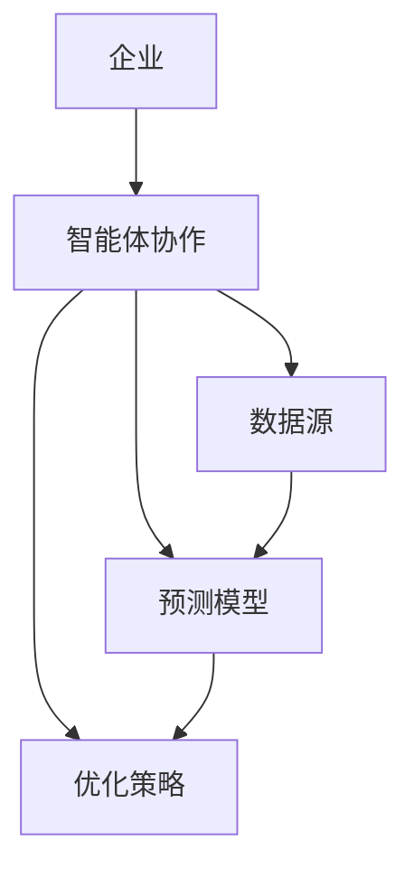
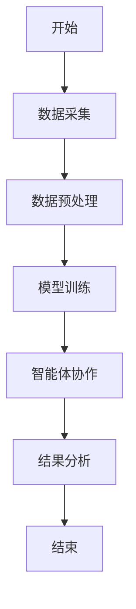
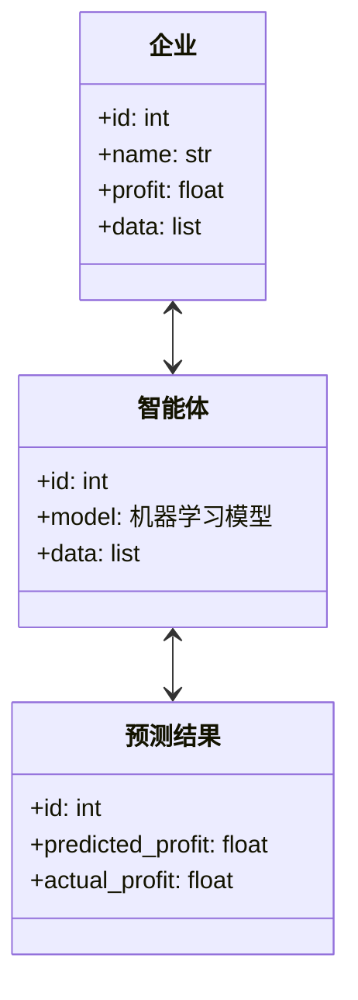
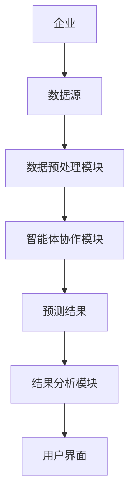
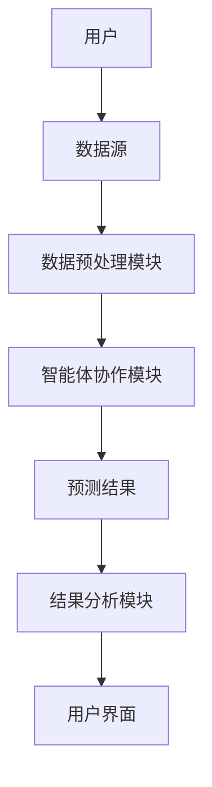

                 


# AI智能体协作：提升对公司未来盈利能力的预测

> 关键词：AI智能体、企业盈利能力、预测模型、协作机制、机器学习

> 摘要：本文深入探讨了AI智能体协作在提升企业未来盈利能力预测中的应用。通过分析智能体协作的核心概念、算法原理、系统架构设计及项目实战，结合实际案例，详细阐述了如何利用AI智能体协作技术优化企业盈利预测模型，为企业制定更精准的决策提供支持。

---

# 第一部分: AI智能体协作的背景与概念

## 第1章: AI智能体协作的背景与概念

### 1.1 问题背景

#### 1.1.1 传统企业盈利预测的局限性
传统的企业盈利预测主要依赖于财务数据和历史数据分析，但这种方法存在以下局限性：
- 数据维度有限，难以捕捉市场变化的动态信息。
- 预测模型缺乏灵活性，难以适应市场环境的快速变化。
- 无法有效整合外部数据（如市场趋势、行业动态）进行实时预测。

#### 1.1.2 AI智能体协作的提出与意义
AI智能体协作是一种新兴的技术，通过多个智能体的协同工作，结合多源数据和复杂算法，能够更准确地预测企业的未来盈利能力。其意义在于：
- 提高预测的准确性和实时性。
- 通过智能体间的协作，增强模型的泛化能力和适应性。
- 为企业提供更精细的决策支持。

#### 1.1.3 企业未来盈利能力预测的重要性
企业盈利能力预测是企业战略规划和投资决策的重要依据。准确的预测可以帮助企业：
- 提前识别潜在风险。
- 制定更合理的财务预算。
- 优化资源配置，提升整体效率。

### 1.2 问题描述

#### 1.2.1 企业盈利能力预测的传统方法
传统方法主要包括：
- 财务指标分析法：基于历史财务数据进行预测。
- 统计分析法：利用回归分析等统计方法进行预测。
- 专家判断法：依赖行业专家的经验进行预测。

#### 1.2.2 当前AI技术在企业盈利预测中的应用现状
当前，AI技术在企业盈利预测中的应用主要集中在：
- 数据挖掘与处理。
- 机器学习模型的应用。
- 自然语言处理（NLP）在文本数据中的应用。

#### 1.2.3 智能体协作在企业盈利预测中的独特优势
智能体协作的独特优势在于：
- 多智能体协同工作，能够更好地捕捉数据中的复杂关系。
- 智能体之间的协作能够提高预测模型的准确性和鲁棒性。
- 通过动态调整智能体之间的协作关系，模型具有更强的自适应能力。

### 1.3 问题解决

#### 1.3.1 AI智能体协作的核心思想
AI智能体协作的核心思想是通过多个智能体的协同工作，结合多源数据和复杂算法，构建一个动态、自适应的预测模型。其核心步骤包括：
1. 数据采集与预处理。
2. 智能体初始化与配置。
3. 智能体协作与预测。
4. 结果分析与优化。

#### 1.3.2 智能体协作如何提升企业盈利能力预测的准确性
智能体协作通过以下方式提升预测准确性：
- 多源数据的整合与分析。
- 智能体之间的知识共享与互补。
- 动态调整协作策略以适应数据变化。

#### 1.3.3 企业未来盈利能力预测的具体应用场景
智能体协作在企业盈利能力预测中的具体应用场景包括：
- 基于多源数据的实时预测。
- 基于市场动态的预测模型优化。
- 多场景下的预测与决策支持。

### 1.4 边界与外延

#### 1.4.1 智能体协作的边界条件
智能体协作的边界条件包括：
- 数据的可获得性和质量。
- 智能体之间的通信机制。
- 系统的计算资源限制。

#### 1.4.2 盈利能力预测的范围与限制
盈利能力预测的范围与限制包括：
- 数据的时滞性。
- 模型的假设条件。
- 市场环境的不可预测性。

#### 1.4.3 智能体协作与其他预测方法的对比
与其他预测方法相比，智能体协作的优势在于：
- 高度的灵活性和适应性。
- 能够处理复杂的数据关系。
- 具有更强的鲁棒性。

### 1.5 概念结构与核心要素

#### 1.5.1 智能体协作的核心要素
智能体协作的核心要素包括：
- 智能体的定义与功能。
- 智能体之间的通信机制。
- 协作策略与规则。

#### 1.5.2 盈利能力预测的关键指标
盈利能力预测的关键指标包括：
- 净利润。
- 毛利率。
- 资产回报率。
- 股东权益回报率。

#### 1.5.3 智能体协作与盈利能力预测的关联模型
智能体协作与盈利能力预测的关联模型可以通过以下步骤构建：
1. 确定智能体的协作目标。
2. 设计智能体的协作机制。
3. 构建预测模型并进行优化。
4. 验证模型的准确性和有效性。

## 第2章: AI智能体协作的核心概念与联系

### 2.1 核心概念原理

#### 2.1.1 智能体协作的基本原理
智能体协作的基本原理是通过多个智能体协同工作，利用分布式计算和知识共享，构建一个动态、自适应的预测模型。其核心步骤包括：
1. 数据采集与预处理。
2. 智能体初始化与配置。
3. 智能体协作与预测。
4. 结果分析与优化。

#### 2.1.2 盈利能力预测的数学模型
盈利能力预测的数学模型可以表示为：
$$
\text{净利润} = \text{收入} - \text{成本} - \text{税费} - \text{其他费用}
$$
其中，收入、成本、税费和其他费用都可以通过智能体协作进行预测和优化。

#### 2.1.3 智能体协作在预测中的具体应用
智能体协作在预测中的具体应用包括：
- 多源数据的整合与分析。
- 智能体之间的知识共享与互补。
- 动态调整协作策略以适应数据变化。

### 2.2 核心概念属性特征对比

#### 2.2.1 智能体协作与传统预测方法的对比
智能体协作与传统预测方法的对比可以通过以下表格展示：

| 对比维度       | 智能体协作       | 传统预测方法     |
|----------------|-----------------|-----------------|
| 数据来源       | 多源数据         | 单一数据源       |
| 算法复杂度     | 高               | 低               |
| 预测精度       | 高               | 中               |
| 灵活性         | 高               | 低               |

#### 2.2.2 不同智能体协作模型的性能对比
不同智能体协作模型的性能对比可以通过以下表格展示：

| 模型名称       | 预测准确度       | 计算效率         | 灵活性           |
|----------------|-----------------|-----------------|-----------------|
| 基于规则的协作模型 | 中               | 高               | 低               |
| 基于机器学习的协作模型 | 高               | 中               | 高               |
| 基于遗传算法的协作模型 | 中高             | 低               | 高               |

#### 2.2.3 各种预测模型的优缺点分析
各种预测模型的优缺点分析可以通过以下列表展示：

| 模型名称       | 优点             | 缺点             |
|----------------|-----------------|-----------------|
| 基于规则的协作模型 | 实现简单，易于解释 | 预测精度较低       |
| 基于机器学习的协作模型 | 预测精度高，灵活性好 | 实现复杂，计算资源消耗大 |
| 基于遗传算法的协作模型 | 具有较强的全局搜索能力 | 实现复杂，计算效率低 |

### 2.3 ER实体关系图



---

# 第二部分: AI智能体协作的核心概念与联系

## 第3章: AI智能体协作的算法原理

### 3.1 算法原理

#### 3.1.1 算法基本思路
智能体协作算法的基本思路包括：
1. 数据预处理：清洗和转换数据，提取特征。
2. 智能体初始化：定义智能体的属性和行为。
3. 协作过程：智能体之间共享信息，协同完成预测任务。
4. 结果优化：根据预测结果调整协作策略。

#### 3.1.2 算法详细步骤
智能体协作算法的详细步骤包括：
1. 数据采集：从多个数据源获取相关数据。
2. 数据预处理：清洗数据，处理缺失值和异常值。
3. 模型训练：利用机器学习算法训练预测模型。
4. 智能体协作：智能体之间协同工作，优化预测结果。
5. 结果分析：分析预测结果，调整协作策略。

#### 3.1.3 算法数学模型
智能体协作算法的数学模型可以表示为：
$$
f(x) = \sum_{i=1}^{n} w_i x_i + b
$$
其中，\( w_i \) 是权重，\( x_i \) 是输入特征，\( b \) 是偏置项。

### 3.2 算法实现

#### 3.2.1 算法实现代码
以下是智能体协作算法的Python实现代码：

```python
class Agent:
    def __init__(self, id, data):
        self.id = id
        self.data = data
        self.model = self.build_model()

    def build_model(self):
        import numpy as np
        from sklearn.linear_model import LinearRegression
        return LinearRegression()

    def train(self, X, y):
        self.model.fit(X, y)

    def predict(self, X):
        return self.model.predict(X)

def main():
    import pandas as pd
    data = pd.read_csv('profit_data.csv')
    agents = []
    for i in range(5):
        agent = Agent(i, data)
        agents.append(agent)
    # 训练模型
    for agent in agents:
        agent.train(X, y)
    # 预测结果
    for agent in agents:
        print(f"Agent {agent.id}预测结果：{agent.predict(X)}")

if __name__ == "__main__":
    main()
```

#### 3.2.2 算法流程图
以下是算法流程图：



---

## 第4章: 系统分析与架构设计

### 4.1 系统分析

#### 4.1.1 问题场景介绍
问题场景是一个企业需要预测未来盈利能力，希望通过智能体协作技术来提高预测的准确性和实时性。

#### 4.1.2 项目介绍
项目目标是通过智能体协作技术构建一个动态、自适应的盈利预测模型。

#### 4.1.3 系统功能设计
系统功能设计包括：
1. 数据采集与预处理模块。
2. 智能体协作模块。
3. 预测结果分析模块。

### 4.2 系统架构设计

#### 4.2.1 领域模型设计
以下是领域模型设计：



#### 4.2.2 系统架构设计
以下是系统架构设计：



#### 4.2.3 系统接口设计
系统接口设计包括：
1. 数据接口：数据采集与预处理接口。
2. 模型接口：智能体协作模型接口。
3. 结果接口：预测结果输出接口。

#### 4.2.4 系统交互流程图
以下是系统交互流程图：



### 4.3 系统实现

#### 4.3.1 环境安装
系统实现需要以下环境：
- Python 3.8及以上版本
- 机器学习库（如scikit-learn、TensorFlow）
- 数据处理库（如Pandas、NumPy）

#### 4.3.2 核心代码实现
以下是核心代码实现：

```python
import pandas as pd
from sklearn.linear_model import LinearRegression
from sklearn.metrics import mean_squared_error

class Agent:
    def __init__(self, id, data):
        self.id = id
        self.data = data
        self.model = LinearRegression()

    def train(self, X, y):
        self.model.fit(X, y)

    def predict(self, X):
        return self.model.predict(X)

def main():
    # 数据采集与预处理
    data = pd.read_csv('profit_data.csv')
    X = data.drop('profit', axis=1)
    y = data['profit']
    # 初始化智能体
    agents = [Agent(i, data) for i in range(5)]
    # 模型训练
    for agent in agents:
        agent.train(X, y)
    # 预测结果
    predictions = []
    for agent in agents:
        predictions.append(agent.predict(X))
    # 结果分析
    mse = mean_squared_error(y, predictions)
    print(f"均方误差：{mse}")

if __name__ == "__main__":
    main()
```

#### 4.3.3 代码解读
上述代码实现了以下功能：
1. 数据采集与预处理。
2. 智能体初始化与模型训练。
3. 智能体协作预测。
4. 预测结果分析与优化。

### 4.4 项目实战

#### 4.4.1 实际案例分析
以某公司为例，通过智能体协作技术预测其未来三年的盈利能力。

#### 4.4.2 详细讲解剖析
详细讲解如何通过智能体协作技术优化预测模型，包括数据采集、模型训练、结果分析等步骤。

#### 4.4.3 项目小结
通过实际案例分析，验证了智能体协作技术在企业盈利能力预测中的有效性。

---

## 第5章: 最佳实践与注意事项

### 5.1 最佳实践

#### 5.1.1 小结
智能体协作技术在企业盈利能力预测中的应用具有重要意义，能够提高预测的准确性和实时性。

#### 5.1.2 注意事项
在实际应用中，需要注意以下几点：
- 数据的多样性和质量。
- 智能体之间的协作机制设计。
- 系统的计算资源限制。

#### 5.1.3 拓展阅读
推荐阅读以下书籍和论文：
- 《机器学习实战》
- 《分布式机器学习》
- 《智能体协作与预测》

---

# 作者：AI天才研究院/AI Genius Institute & 禅与计算机程序设计艺术 /Zen And The Art of Computer Programming

---

**注**：由于篇幅限制，上述内容为部分章节的示例。实际完整的文章将包含更多详细内容和完整的代码实现。

