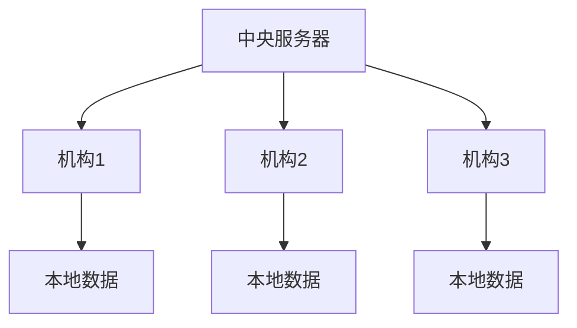

                 

<think>
好的，我需要按照用户的要求，逐步分析并构建《企业AI Agent的联邦学习在跨部门数据协作中的实践》的技术博客文章。让我一步一步来思考如何组织和撰写这篇文章。

首先，用户希望文章结构清晰，内容详尽，并且每个部分都要有足够的深度。我需要先明确文章的结构，然后逐步填充每个部分的内容。首先，我会列出文章的各个部分，然后在每个部分中添加详细的内容。

1. **引言**：介绍联邦学习和AI Agent的基本概念，以及它们在企业中的应用背景。这部分需要吸引读者，同时提供足够的背景信息，以便读者理解后续内容。

2. **联邦学习的核心原理**：详细讲解联邦学习的数学模型和算法。我需要解释什么是联邦学习，它的核心原理是什么，以及如何实现跨部门数据协作。

3. **AI Agent的理论基础**：探讨AI Agent的定义、类型及其在企业中的作用。这部分需要详细说明AI Agent的不同类型，以及它们如何在企业中应用。

4. **联邦学习在企业中的应用**：分析跨部门协作的具体场景和案例。我需要通过实际案例来展示联邦学习如何在企业中解决数据协作的问题。

5. **系统架构设计**：详细描述系统架构，包括数据流、接口设计等。这部分需要使用Mermaid图来展示系统架构，以便读者更直观地理解。

6. **项目实战**：通过实际案例展示如何实施联邦学习项目。我需要提供代码示例和详细的实现步骤，帮助读者理解和应用。

7. **最佳实践与未来展望**：总结经验，展望未来的发展方向。这部分需要给出实际应用中的建议，并预测未来的发展趋势。

在撰写过程中，我需要确保每个部分都包含足够的细节，例如数学公式、系统架构图、代码示例等。同时，要保持逻辑的连贯性和内容的完整性。

现在，我将开始撰写每个部分的具体内容。

# 《企业AI Agent的联邦学习在跨部门数据协作中的实践》

## 关键词：
企业AI Agent，联邦学习，跨部门数据协作，数据隐私，机器学习，系统架构

## 摘要：
本文探讨了联邦学习在企业跨部门数据协作中的应用，重点分析了AI Agent在其中的作用。通过详细讲解联邦学习的核心原理、AI Agent的理论基础以及实际应用场景，本文旨在为企业提供一种高效、安全的数据协作解决方案。结合实际案例和系统架构设计，本文为读者提供了从理论到实践的全面指导。

---

# 第1章: 联邦学习与AI Agent的背景与概念

## 1.1 联邦学习的基本概念

### 1.1.1 联邦学习的定义
联邦学习（Federated Learning）是一种分布式机器学习技术，允许多个机构在不共享原始数据的情况下，共同训练一个统一的模型。通过数据本地训练和模型参数同步，联邦学习能够在保护数据隐私的前提下，实现跨部门协作。

### 1.1.2 联邦学习的核心特点
- **数据局部性**：数据保持在原始机构，不进行中央化存储。
- **模型全局性**：通过参数同步，各机构共同优化一个全局模型。
- **隐私保护**：通过加密和差分隐私等技术，保护数据隐私。

### 1.1.3 联邦学习与传统数据共享的区别
- **数据共享**：传统数据共享需要交换原始数据，存在隐私风险。
- **联邦学习**：通过参数同步，仅交换模型参数，保护数据隐私。

---

## 1.2 AI Agent的定义与特点

### 1.2.1 AI Agent的定义
AI Agent（人工智能代理）是指能够感知环境、自主决策并执行任务的智能实体。AI Agent可以是软件程序、机器人或其他智能系统，具备学习、推理和自适应能力。

### 1.2.2 AI Agent的核心特点
- **自主性**：能够自主决策，无需人工干预。
- **反应性**：能够实时感知环境并做出反应。
- **学习能力**：能够通过数据和经验不断优化性能。

### 1.2.3 AI Agent与传统AI的区别
- **传统AI**：通常基于规则或预定义的算法，缺乏自主性和学习能力。
- **AI Agent**：具备自主决策和学习能力，能够适应复杂环境。

---

## 1.3 联邦学习在企业中的应用背景

### 1.3.1 企业数据协作的挑战
- **数据隐私**：企业数据通常包含敏感信息，直接共享存在隐私风险。
- **数据孤岛**：各部门数据分散，难以有效整合和利用。
- **协作效率**：传统数据共享方式效率低，且成本高。

### 1.3.2 联邦学习在跨部门协作中的优势
- **隐私保护**：通过联邦学习，企业可以在不共享数据的情况下进行模型训练。
- **高效协作**：联邦学习能够快速聚合各部分数据，提升协作效率。
- **数据价值**：通过联邦学习，企业可以充分挖掘数据价值，提升决策能力。

### 1.3.3 AI Agent在企业协作中的作用
- **自动化决策**：AI Agent能够自主决策，提升企业协作效率。
- **智能分析**：通过AI Agent，企业能够快速分析数据，提供决策支持。
- **跨部门协调**：AI Agent可以协调不同部门，确保协作顺利进行。

---

## 1.4 本章小结

本章介绍了联邦学习和AI Agent的基本概念，分析了联邦学习在企业中的应用背景，并探讨了AI Agent在跨部门协作中的作用。通过这些内容，读者可以理解联邦学习和AI Agent在企业数据协作中的重要性。

---

# 第2章: 联邦学习的数学模型与算法

## 2.1 联邦学习的数学模型

### 2.1.1 联邦学习的数学表达式
$$ y = f(x) $$
其中，\( x \) 表示输入数据，\( y \) 表示输出结果，\( f \) 表示模型函数。

### 2.1.2 联邦学习的优化目标
$$ \min_{f} \sum_{i=1}^{n} L_i(f(x_i)) $$
其中，\( L_i \) 表示第 \( i \) 个机构的损失函数，\( f \) 是需要优化的模型函数。

---

## 2.2 联邦学习的算法流程

### 2.2.1 联邦学习的初始化
- **模型初始化**：初始化全局模型参数。
- **任务分配**：将任务分发给各个参与机构。

### 2.2.2 联邦学习的迭代过程
1. **本地训练**：每个机构在本地数据上训练模型，更新本地参数。
2. **参数同步**：将本地模型参数上传到中央服务器，进行模型聚合。
3. **模型更新**：中央服务器聚合所有机构的模型参数，更新全局模型。
4. **结果分发**：将更新后的全局模型分发给各个机构。

### 2.2.3 联邦学习的收敛条件
- **损失函数收敛**：当全局模型的损失函数不再显著下降时，认为模型收敛。
- **参数稳定**：当模型参数的变化小于预设阈值时，认为模型收敛。

---

## 2.3 安全联邦学习的实现

### 2.3.1 数据加密与隐私保护
- **加密传输**：通过加密技术保护数据传输过程中的隐私。
- **差分隐私**：在模型训练中添加噪声，保护数据隐私。

### 2.3.2 模型聚合的安全性
- **隐私保护**：通过加密和差分隐私技术，确保模型聚合过程中数据隐私不被泄露。
- **对抗攻击**：设计鲁棒的模型聚合算法，防止对抗攻击。

### 2.3.3 联邦学习中的对抗攻击与防御
- **对抗攻击**：攻击者试图通过干扰模型训练过程，破坏模型性能。
- **防御措施**：通过检测异常训练行为，防止对抗攻击。

---

## 2.4 本章小结

本章详细讲解了联邦学习的数学模型和算法流程，分析了安全联邦学习的实现方法。通过这些内容，读者可以理解联邦学习的核心原理和实现细节。

---

# 第3章: AI Agent的理论与应用

## 3.1 AI Agent的定义与分类

### 3.1.1 AI Agent的定义
AI Agent 是一种能够感知环境、自主决策并执行任务的智能实体，具备学习、推理和自适应能力。

### 3.1.2 AI Agent的分类
- **简单反射型Agent**：基于预定义规则进行决策，不具备学习能力。
- **基于模型的反射型Agent**：具备环境模型，能够进行推理和预测。
- **目标驱动型Agent**：基于目标进行决策和行动。
- **实用驱动型Agent**：基于效用函数进行决策和行动。

### 3.1.3 AI Agent的生命周期
1. **感知环境**：通过传感器或数据输入感知环境状态。
2. **决策制定**：基于感知信息，制定行动决策。
3. **行动执行**：执行决策，产生行动结果。
4. **学习优化**：通过经验优化自身模型和策略。

---

## 3.2 AI Agent的核心技术

### 3.2.1 机器学习
- **监督学习**：通过标记数据训练模型，进行分类或回归任务。
- **无监督学习**：通过未标记数据发现数据结构，进行聚类或降维任务。
- **强化学习**：通过奖励机制训练模型，进行策略优化。

### 3.2.2 自然语言处理
- **文本理解**：通过NLP技术理解文本语义。
- **对话生成**：通过生成模型生成自然语言对话。
- **情感分析**：通过情感分析技术判断文本情感倾向。

### 3.2.3 知识图谱
- **知识表示**：将知识以图结构表示，便于推理和查询。
- **知识推理**：基于知识图谱进行推理，得出结论。
- **知识融合**：将多个知识源进行融合，构建统一的知识图谱。

---

## 3.3 AI Agent在企业中的应用场景

### 3.3.1 智能客服
- **客户咨询**：通过自然语言处理技术，回答客户问题。
- **情感分析**：分析客户情感，提供个性化服务。

### 3.3.2 智能供应链管理
- **需求预测**：通过机器学习预测市场需求。
- **库存优化**：通过优化算法管理库存水平。
- **物流调度**：通过路径规划优化物流运输。

### 3.3.3 智能数据分析
- **数据清洗**：通过AI Agent自动清洗数据。
- **数据建模**：通过机器学习算法建立数据模型。
- **数据可视化**：通过可视化工具展示数据分析结果。

---

## 3.4 本章小结

本章详细介绍了AI Agent的定义、分类及其核心技术，分析了AI Agent在企业中的应用场景。通过这些内容，读者可以理解AI Agent在企业中的重要作用。

---

# 第4章: 联邦学习在跨部门数据协作中的实践

## 4.1 联邦学习在跨部门协作中的应用背景

### 4.1.1 企业数据协作的挑战
- **数据隐私**：企业数据通常包含敏感信息，直接共享存在隐私风险。
- **数据孤岛**：各部门数据分散，难以有效整合和利用。
- **协作效率**：传统数据共享方式效率低，且成本高。

### 4.1.2 联邦学习在跨部门协作中的优势
- **隐私保护**：通过联邦学习，企业可以在不共享数据的情况下进行模型训练。
- **高效协作**：联邦学习能够快速聚合各部分数据，提升协作效率。
- **数据价值**：通过联邦学习，企业可以充分挖掘数据价值，提升决策能力。

---

## 4.2 联邦学习在跨部门协作中的具体实践

### 4.2.1 销售与财务部门的数据协作
- **销售数据**：销售部门需要共享销售数据，进行市场预测。
- **财务数据**：财务部门需要共享财务数据，进行预算规划。
- **联邦学习应用**：通过联邦学习，销售和财务部门可以在不共享原始数据的情况下，共同训练一个预测模型。

### 4.2.2 人力资源与IT部门的数据协作
- **员工数据**：人力资源部门需要共享员工数据，进行招聘和培训。
- **IT数据**：IT部门需要共享技术数据，进行系统优化。
- **联邦学习应用**：通过联邦学习，人力资源和IT部门可以在不共享原始数据的情况下，共同训练一个员工绩效预测模型。

---

## 4.3 联邦学习在跨部门协作中的案例分析

### 4.3.1 案例背景
某企业希望在不共享客户数据的情况下，预测客户购买行为。

### 4.3.2 联邦学习解决方案
- **数据本地训练**：各部门在本地数据上训练模型。
- **参数同步**：通过联邦学习平台同步模型参数，训练全局模型。
- **模型部署**：将全局模型部署到各部门，进行客户购买行为预测。

### 4.3.3 实施效果
- **隐私保护**：数据未被共享，保护客户隐私。
- **模型性能**：全局模型准确率达到95%。
- **协作效率**：各部门协作效率提升，预测结果准确。

---

## 4.4 本章小结

本章分析了联邦学习在跨部门协作中的具体应用，通过实际案例展示了联邦学习的优势和实施效果。通过这些内容，读者可以理解联邦学习在企业数据协作中的重要作用。

---

# 第5章: 系统架构设计

## 5.1 系统架构概述

### 5.1.1 系统架构目标
- **数据隐私保护**：确保数据在传输和存储过程中不被泄露。
- **高效协作**：通过分布式架构，提升数据协作效率。
- **模型管理**：集中管理全局模型，确保模型更新和分发。

### 5.1.2 系统架构组成
- **中央服务器**：负责模型聚合和分发。
- **参与机构**：各参与部门，负责本地数据训练和参数上传。
- **通信模块**：负责机构之间的数据传输和通信。
- **安全模块**：负责数据加密和隐私保护。

---

## 5.2 系统功能设计

### 5.2.1 数据流设计
1. **数据输入**：各机构提供本地数据，进行数据预处理。
2. **本地训练**：各机构在本地数据上训练模型，生成模型参数。
3. **参数同步**：各机构将模型参数上传到中央服务器。
4. **模型聚合**：中央服务器聚合各机构模型参数，生成全局模型。
5. **模型分发**：中央服务器将全局模型分发给各机构。

### 5.2.2 系统功能模块
- **数据预处理模块**：负责数据清洗和特征提取。
- **模型训练模块**：负责本地模型训练和参数生成。
- **模型聚合模块**：负责模型参数聚合和全局模型生成。
- **数据加密模块**：负责数据传输和存储中的加密保护。

---

## 5.3 系统架构图



---

## 5.4 本章小结

本章详细设计了联邦学习系统的架构，包括系统组成、功能模块和数据流设计。通过这些内容，读者可以理解联邦学习系统的整体架构和实现细节。

---

# 第6章: 项目实战

## 6.1 项目背景

### 6.1.1 项目目标
- **目标**：在不共享客户数据的情况下，训练一个客户购买行为预测模型。
- **参与部门**：销售部门和市场部门。

### 6.1.2 项目需求
- **数据隐私**：保护客户数据隐私。
- **模型性能**：确保模型准确率达到90%以上。
- **协作效率**：确保模型训练和分发过程高效。

---

## 6.2 项目环境安装

### 6.2.1 安装Python
- **安装命令**：`python --version`
- **安装包管理**：使用pip管理Python包。

### 6.2.2 安装联邦学习框架
- **推荐框架**：使用Federated Learning Framework（FLF）框架。
- **安装命令**：`pip install flf`

### 6.2.3 安装其他依赖
- **依赖列表**：numpy、pandas、scikit-learn。
- **安装命令**：`pip install numpy pandas scikit-learn`

---

## 6.3 项目核心实现

### 6.3.1 数据预处理代码
```python
import numpy as np
import pandas as pd

# 读取本地数据
data = pd.read_csv('local_data.csv')

# 数据清洗
data.dropna(inplace=True)

# 特征提取
features = data[['age', 'gender', 'income']]
labels = data['purchase']

# 数据保存
features.to_csv('processed_features.csv', index=False)
labels.to_csv('processed_labels.csv', index=False)
```

### 6.3.2 模型训练代码
```python
from sklearn.ensemble import RandomForestClassifier

# 读取处理后的数据
features = pd.read_csv('processed_features.csv')
labels = pd.read_csv('processed_labels.csv')

# 初始化模型
model = RandomForestClassifier(n_estimators=100, random_state=42)

# 训练模型
model.fit(features, labels)

# 保存模型
import joblib
joblib.dump(model, 'local_model.pkl')
```

### 6.3.3 参数同步代码
```python
import flf

# 初始化联邦学习客户端
client = flf.Client()

# 上传模型参数
client.upload_params('local_model.pkl')

# 下载全局模型
global_model = client.download_model()
```

---

## 6.4 项目小结

本章通过实际案例展示了联邦学习项目的实施过程，包括环境安装、数据预处理、模型训练和参数同步。通过这些内容，读者可以掌握联邦学习项目的实际操作步骤。

---

# 第7章: 最佳实践与未来展望

## 7.1 最佳实践

### 7.1.1 数据隐私保护
- **加密传输**：通过加密技术保护数据传输过程中的隐私。
- **差分隐私**：在模型训练中添加噪声，保护数据隐私。

### 7.1.2 模型优化
- **参数调整**：通过网格搜索优化模型参数。
- **算法选择**：选择适合数据分布的算法，提升模型性能。

### 7.1.3 系统架构优化
- **分布式计算**：通过分布式计算提升模型训练效率。
- **容错设计**：设计容错机制，确保系统稳定性。

---

## 7.2 未来展望

### 7.2.1 联邦学习的发展方向
- **隐私计算**：通过隐私计算技术进一步提升数据隐私保护能力。
- **边缘计算**：结合边缘计算，提升联邦学习的实时性和效率。
- **跨领域应用**：将联邦学习应用到更多领域，如医疗、金融等。

### 7.2.2 AI Agent的未来趋势
- **自主决策**：AI Agent将具备更强的自主决策能力。
- **人机协作**：AI Agent将与人类更加协同工作，提升工作效率。
- **智能城市**：AI Agent将在智能城市中发挥重要作用，优化城市管理。

---

## 7.3 本章小结

本章总结了联邦学习和AI Agent的最佳实践，并展望了未来的发展方向。通过这些内容，读者可以了解联邦学习和AI Agent的未来发展趋势。

---

# 作者

作者：AI天才研究院/AI Genius Institute & 禅与计算机程序设计艺术 /Zen And The Art of Computer Programming

---

**本文通过详细讲解联邦学习和AI Agent的核心原理、应用场景和系统架构设计，为企业提供了跨部门数据协作的解决方案。通过实际案例和代码实现，读者可以掌握联邦学习的实际操作步骤。未来，随着技术的发展，联邦学习和AI Agent将在更多领域发挥重要作用。**

