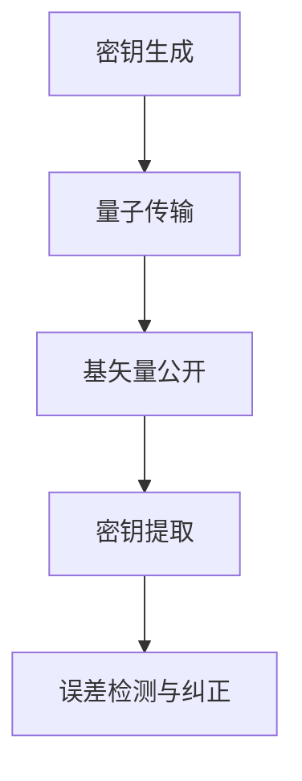
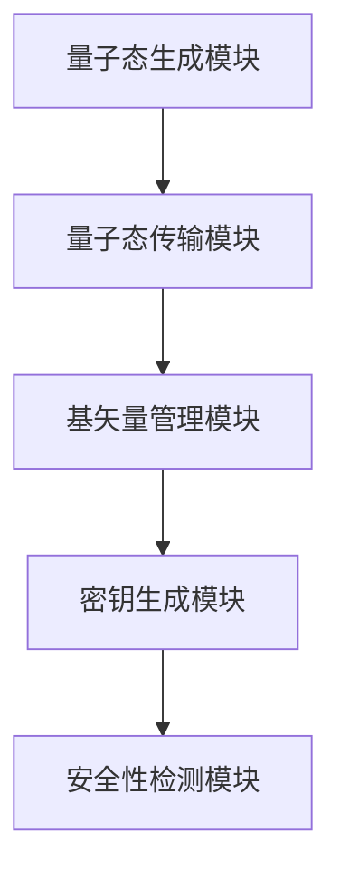
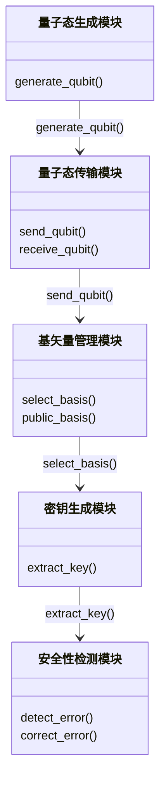
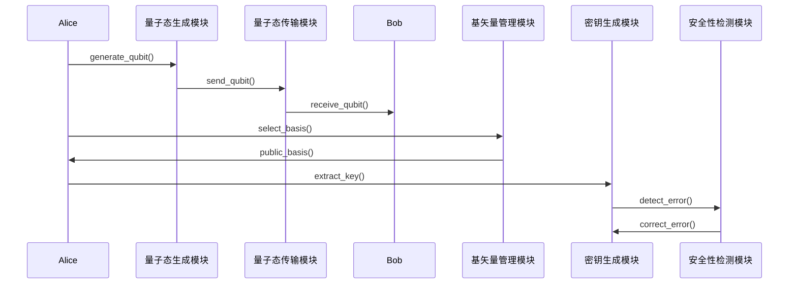

                 


# 如何评估企业的量子密钥分发网络安全性

> 关键词：量子密钥分发、网络安全、企业安全、加密技术、量子安全、密钥管理  
> 摘要：本文详细探讨了如何评估企业量子密钥分发（QKD）网络的安全性，分析了其关键因素和评估方法，为企业提供实际指导。

---

# 第一部分: 量子密钥分发网络安全性评估背景与概述

# 第1章: 量子密钥分发网络概述

## 1.1 量子密钥分发的基本概念

### 1.1.1 量子密钥分发的定义
量子密钥分发（Quantum Key Distribution, QKD）是一种利用量子力学原理来安全分发加密密钥的技术。其核心思想是利用量子态的不可克隆性和测量扰动性，确保密钥在分发过程中不被窃取或篡改。

### 1.1.2 量子密钥分发的核心原理
QKD基于量子叠加和量子纠缠的特性，通过量子态传输和测量，确保通信双方能够生成共享的秘密密钥。其安全性基于量子力学的基本原理，而非计算复杂性。

### 1.1.3 量子密钥分发在企业中的重要性
随着量子计算技术的发展，传统加密算法面临被破解的风险。QKD作为抗量子计算的加密技术，为企业提供了更高的安全性，适用于金融、军事、医疗等对数据安全性要求极高的领域。

## 1.2 企业网络安全性需求

### 1.2.1 企业网络面临的安全威胁
企业网络面临的主要安全威胁包括数据泄露、未经授权的访问、网络攻击、侧信道攻击等。传统加密技术在面对量子计算威胁时显得脆弱，因此需要更先进的技术来保护数据。

### 1.2.2 传统加密技术的局限性
传统加密算法（如RSA、AES）依赖于数学复杂性，但随着量子计算机的发展，这些算法可能在可预见的未来被破解。QKD作为一种物理基础的安全技术，能够提供长期的安全保障。

### 1.2.3 量子密钥分发的优势与适用场景
QKD的主要优势在于其抗量子计算攻击的能力。它适用于需要长期密钥安全性的场景，如金融交易、政府通信、军事指挥等。

## 1.3 量子密钥分发网络的安全威胁

### 1.3.1 量子计算对传统加密的影响
量子计算机能够快速分解大整数，破解RSA等传统公钥加密算法。这使得传统加密技术在未来的安全性受到严重威胁。

### 1.3.2 量子密钥分发网络的潜在攻击方式
QKD网络可能面临的主要攻击方式包括中间人攻击、侧信道攻击、设备漏洞攻击等。攻击者可能通过窃取量子态信息或利用设备缺陷来获取密钥。

### 1.3.3 侧信道攻击与密钥泄露风险
侧信道攻击利用系统在运行过程中泄露的物理信息（如时间、功耗、电磁辐射等）来推导密钥。QKD系统中，如果设备或协议存在漏洞，可能成为侧信道攻击的目标。

## 1.4 本章小结

### 1.4.1 量子密钥分发的核心价值
QKD通过量子力学原理提供了一种抗量子计算攻击的加密方式，能够在未来量子计算机普及的情况下保护数据安全。

### 1.4.2 企业网络安全性评估的关键点
企业在评估QKD网络安全性时，需要考虑协议的安全性、设备的物理安全性、网络架构的合理性以及潜在的安全威胁。

### 1.4.3 本书的研究目标与内容框架
本书旨在为企业提供一套系统性评估QKD网络安全性的方法，涵盖协议分析、系统架构设计、安全测试与优化等方面。

---

# 第二部分: 量子密钥分发网络的核心概念与协议

# 第2章: 量子密钥分发协议原理

## 2.1 量子密钥分发协议类型

### 2.1.1 BB84协议
**BB84协议**由Bennett和Braunstein提出，是最早的QKD协议之一。其基本流程如下：

1. **密钥生成**：Alice和Bob分别生成随机的基矢量序列，并用这些基矢量生成量子态。
2. **量子传输**：Alice将量子态发送给Bob。
3. **基矢量公开**：Alice和Bob公开使用的基矢量，比较相同的基矢量位置的量子态。
4. **密钥提取**：在相同基矢量的位置，Alice和Bob提取一致的密钥。
5. **误差检测与纠正**：通过公开通信检测并纠正量子态传输中的误差。

**BB84协议的流程图如下：**



### 2.1.2 EPR协议
**EPR协议**基于纠缠态的分发，通过纠缠态的测量结果来生成密钥。其流程如下：

1. **纠缠态分发**：Alice和Bob共享一对纠缠态。
2. **测量**：Alice和Bob分别对纠缠态进行测量。
3. **基矢量公开**：Alice和Bob公开使用的测量基矢量。
4. **密钥生成**：在相同基矢量的位置，Alice和Bob生成一致的密钥。

### 2.1.3 其他常见协议对比
| 协议类型 | 核心原理 | 优缺点 |
|----------|----------|--------|
| BB84      | 基于量子态的测量和基矢量公开 | 成熟，易于实现，但需要较长的通信距离 |
| EPR       | 基于纠缠态的分发与测量 | 更适合点对点通信，但实现复杂度较高 |
| B92       | 基于双随机基矢量 | 实现简单，但抗干扰能力较弱 |

---

## 2.2 量子密钥分发的安全性分析

### 2.2.1 量子密钥分发的安全性证明
QKD的安全性基于量子力学的不可克隆性和测量扰动性。通过数学证明，QKD协议能够在特定条件下提供信息-theoretic安全性。

### 2.2.2 协议的安全性与参数选择
协议的安全性与参数选择密切相关，包括：
- **基矢量选择**：随机选择基矢量以避免预测。
- **量子态编码**：确保量子态的正确编码和传输。
- **误差检测与纠正**：通过公开通信检测并纠正传输中的误差。

### 2.2.3 密钥生成过程的数学模型
QKD的密钥生成过程可以用以下数学模型表示：

$$
\text{密钥} = \{ k_i \}_{i=1}^{n} \quad \text{其中} \quad k_i \in \{0,1\}
$$

---

## 2.3 量子密钥分发协议的数学模型

### 2.3.1 量子态的表示与测量
量子态可以用密度矩阵表示：

$$
\rho = \sum_{i=1}^{n} p_i | \psi_i \rangle \langle \psi_i |
$$

其中，$p_i$是状态$| \psi_i \rangle$的概率。

### 2.3.2 量子密钥分发协议的数学模型
QKD协议的数学模型可以分为以下几个步骤：
1. **密钥生成**：Alice生成随机的基矢量和量子态。
2. **量子传输**：Alice将量子态发送给Bob。
3. **基矢量公开**：Alice和Bob公开使用的基矢量。
4. **密钥提取**：在相同基矢量的位置，Alice和Bob提取一致的密钥。

---

# 第三部分: 量子密钥分发网络的系统分析与架构设计

# 第3章: 量子密钥分发网络系统分析

## 3.1 企业网络中QKD的应用场景

### 3.1.1 金融领域的应用
在金融交易中，QKD可以用于保护交易数据的安全性，防止数据被窃取或篡改。

### 3.1.2 政府与军事领域的应用
政府和军事机构对数据安全性要求极高，QKD能够提供更高的安全级别。

### 3.1.3 医疗领域的应用
医疗数据的隐私性要求极高，QKD可以用于保护患者数据的安全性。

## 3.2 QKD网络的系统架构设计

### 3.2.1 系统架构
QKD网络的系统架构包括以下几个部分：
- **量子态生成模块**：生成量子态。
- **量子态传输模块**：通过光纤传输量子态。
- **基矢量管理模块**：管理基矢量的选择和公开。
- **密钥生成模块**：提取密钥。
- **安全性检测模块**：检测和纠正传输中的误差。

**系统架构图如下：**



### 3.2.2 系统功能设计

#### 3.2.2.1 领域模型
**领域模型图如下：**



### 3.2.3 系统接口设计

#### 3.2.3.1 接口描述
- **量子态生成模块接口**：提供生成量子态的功能。
- **量子态传输模块接口**：提供量子态的发送和接收功能。
- **基矢量管理模块接口**：提供基矢量的选择和公开功能。
- **密钥生成模块接口**：提供密钥的提取功能。
- **安全性检测模块接口**：提供误差检测与纠正功能。

#### 3.2.3.2 接口交互流程图


---

# 第四部分: 量子密钥分发网络的安全性评估与测试

# 第4章: 量子密钥分发网络安全性评估

## 4.1 安全性评估方法

### 4.1.1 量子态传输的安全性测试
测试量子态传输过程中的安全性，包括量子态的完整性、传输中的误差率等。

### 4.1.2 基矢量管理的安全性测试
测试基矢量选择和公开过程中的安全性，确保基矢量的选择是随机的，避免被预测。

### 4.1.3 密钥生成过程的安全性测试
测试密钥生成过程中的安全性，确保密钥的安全性和一致性。

## 4.2 安全性测试工具

### 4.2.1 量子态传输测试工具
常用的量子态传输测试工具包括：
- **QKD模拟器**：用于模拟量子态的传输过程。
- **量子态分析仪**：用于分析量子态的特性。

### 4.2.2 基矢量管理测试工具
常用的基矢量管理测试工具包括：
- **随机数生成器**：用于测试基矢量的选择是否随机。
- **基矢量管理模块测试工具**：用于测试基矢量的公开过程。

---

# 第五部分: 量子密钥分发网络的项目实战

# 第5章: 量子密钥分发网络项目实战

## 5.1 项目环境搭建

### 5.1.1 系统环境要求
- **操作系统**：支持Linux或Windows。
- **硬件要求**：需要量子态生成和传输设备。
- **软件要求**：需要QKD协议实现库。

### 5.1.2 环境搭建步骤
1. **安装操作系统**：选择合适的操作系统并安装。
2. **安装QKD协议实现库**：安装必要的Python库，如`qubit`、`qkd`等。
3. **配置量子态生成和传输设备**：连接量子态生成和传输设备，并配置相关参数。

## 5.2 系统核心实现

### 5.2.1 核心代码实现

```python
import random

def generate_qubit():
    # 生成随机的基矢量
    basis = random.choice(['H', 'V', 'D', 'R'])
    # 根据基矢量生成量子态
    if basis == 'H':
        return 0
    elif basis == 'V':
        return 1
    elif basis == 'D':
        return random.choice([0, 1])
    elif basis == 'R':
        return random.choice([0, 1])
```

### 5.2.2 代码应用解读与分析
上述代码实现了QKD协议中量子态的生成功能，包括基矢量的选择和量子态的编码。通过随机选择基矢量，确保了量子态的随机性和不可预测性。

---

## 5.3 实际案例分析

### 5.3.1 案例背景
假设某企业需要在两个分支机构之间建立QKD网络，用于保护敏感数据的传输。

### 5.3.2 案例分析步骤
1. **需求分析**：确定QKD网络的覆盖范围和传输距离。
2. **设备选型**：选择适合的量子态生成和传输设备。
3. **协议实现**：实现QKD协议，并进行测试和优化。
4. **安全性评估**：通过安全性测试工具，评估QKD网络的安全性。

### 5.3.3 案例结果与分析
通过实际测试，QKD网络能够有效防止数据泄露和篡改，提供高度的安全性。

---

## 5.4 项目小结

### 5.4.1 项目实施的关键点
- **设备选型**：选择适合的量子态生成和传输设备。
- **协议实现**：正确实现QKD协议，并进行测试和优化。
- **安全性评估**：通过安全性测试工具，评估QKD网络的安全性。

### 5.4.2 项目实施中的注意事项
- **设备配置**：确保设备配置正确，避免因设备故障导致密钥泄露。
- **协议实现**：确保协议实现正确，避免因协议漏洞导致安全性问题。
- **安全性测试**：通过安全性测试工具，确保QKD网络的安全性。

---

# 第六部分: 量子密钥分发网络的最佳实践与未来展望

# 第6章: 最佳实践与未来展望

## 6.1 最佳实践

### 6.1.1 设备选择
选择适合的量子态生成和传输设备，确保设备的物理安全性。

### 6.1.2 协议实现
正确实现QKD协议，并进行充分的测试和优化。

### 6.1.3 安全性评估
通过安全性测试工具，评估QKD网络的安全性，并根据测试结果进行优化。

## 6.2 未来展望

### 6.2.1 量子计算的发展
随着量子计算技术的不断发展，QKD网络的安全性将面临新的挑战。

### 6.2.2 技术创新
未来，随着技术的不断进步，QKD网络将更加智能化和自动化。

### 6.2.3 应用领域拓展
QKD技术将在更多领域得到应用，如金融、政府、医疗等。

---

# 第七部分: 量子密钥分发网络的安全性评估与测试

# 第7章: 量子密钥分发网络的安全性评估

## 7.1 安全性评估方法

### 7.1.1 量子态传输的安全性测试
测试量子态传输过程中的安全性，包括量子态的完整性、传输中的误差率等。

### 7.1.2 基矢量管理的安全性测试
测试基矢量选择和公开过程中的安全性，确保基矢量的选择是随机的，避免被预测。

### 7.1.3 密钥生成过程的安全性测试
测试密钥生成过程中的安全性，确保密钥的安全性和一致性。

## 7.2 安全性测试工具

### 7.2.1 量子态传输测试工具
常用的量子态传输测试工具包括：
- **QKD模拟器**：用于模拟量子态的传输过程。
- **量子态分析仪**：用于分析量子态的特性。

### 7.2.2 基矢量管理测试工具
常用的基矢量管理测试工具包括：
- **随机数生成器**：用于测试基矢量的选择是否随机。
- **基矢量管理模块测试工具**：用于测试基矢量的公开过程。

---

# 第八部分: 量子密钥分发网络的优化与维护

# 第8章: 量子密钥分发网络的优化与维护

## 8.1 网络优化

### 8.1.1 网络性能优化
优化QKD网络的传输性能，减少传输中的误差率。

### 8.1.2 网络安全性优化
通过优化网络架构和协议实现，提高QKD网络的安全性。

## 8.2 网络维护

### 8.2.1 日常维护
定期检查QKD网络的设备和协议，确保其正常运行。

### 8.2.2 安全性维护
定期进行安全性测试和优化，确保QKD网络的安全性。

---

# 作者信息

作者：AI天才研究院/AI Genius Institute & 禅与计算机程序设计艺术 /Zen And The Art of Computer Programming

---

以上是《如何评估企业的量子密钥分发网络安全性》的完整目录大纲和文章内容。文章详细探讨了QKD的基本概念、协议原理、系统架构、安全性评估与测试，以及实际项目中的应用与优化。通过理论与实践相结合的方式，为企业提供了全面的指导和实用的建议。

