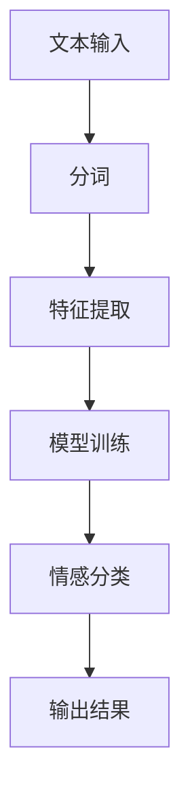
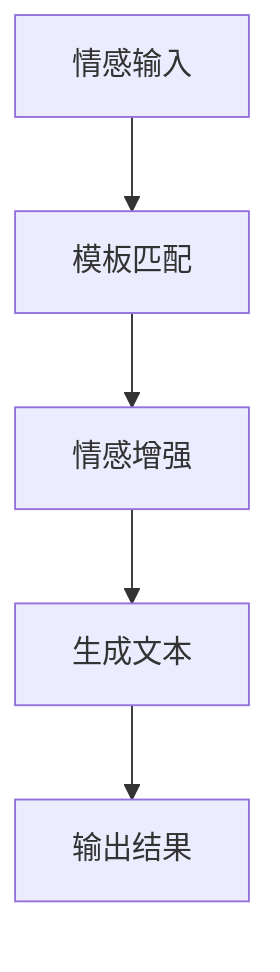
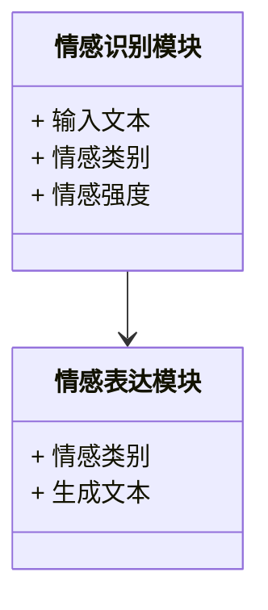
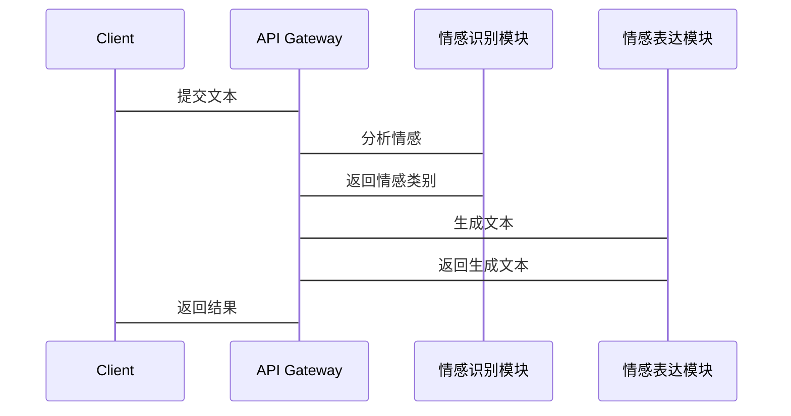

                 


# 开发具有情感识别与表达能力的AI Agent

> 关键词：AI Agent，情感识别，情感表达，自然语言处理，深度学习，情感计算

> 摘要：本文深入探讨了开发具有情感识别与表达能力的AI Agent所需的关键技术与方法。从背景介绍到核心概念，从算法实现到系统架构设计，再到项目实战，系统地阐述了情感识别与表达的实现过程。通过本文，读者将能够理解情感计算的核心原理，掌握情感识别与表达的关键算法，并能够基于实际案例进行系统设计与实现。

---

# 第一部分: 情感识别与表达的背景与核心概念

## 第1章: 情感识别与表达的背景介绍

### 1.1 情感AI的定义与问题背景

#### 1.1.1 情感计算的定义
情感计算（Emotion Computing）是一种通过计算手段分析、识别和模拟人类情感的技术。它旨在让计算机能够理解、处理和响应人类的情感状态。

#### 1.1.2 情感识别与表达的重要性
情感识别与表达是人机交互的重要组成部分。通过识别用户的情感，AI Agent可以更自然地与人类交互，提供更贴心的服务；通过表达情感，AI Agent可以让交互更加生动和人性化。

#### 1.1.3 情感AI的应用领域
- **智能客服**：通过情感识别理解用户情绪，提供更精准的服务。
- **虚拟助手**：通过情感表达让交互更自然。
- **教育科技**：通过情感识别为学生提供个性化学习建议。
- **心理健康支持**：通过情感识别帮助用户识别和管理情绪。

### 1.2 情感识别与表达的核心问题

#### 1.2.1 情感识别的基本概念
情感识别是指通过文本、语音或图像等输入，识别出其中蕴含的情感信息。例如，通过分析一段文本，判断其情感倾向（如积极、消极或中性）。

#### 1.2.2 情感表达的核心问题
情感表达是指AI Agent通过文本、语音或图像等方式，向外传递情感信息。例如，通过生成带有情感色彩的文本回应用户。

#### 1.2.3 情感识别与表达的边界与外延
- **边界**：情感识别与表达的核心任务是理解和生成情感信息，不涉及具体的情感内容创作。
- **外延**：情感识别与表达可以与其他技术（如自然语言处理、语音合成）结合，实现更复杂的交互功能。

### 1.3 情感识别与表达的核心要素组成

#### 1.3.1 数据输入与处理
- **文本输入**：处理用户输入的文本，提取关键词和情感特征。
- **语音输入**：通过语音识别技术将语音转化为文本，并进行情感分析。
- **图像输入**：通过面部表情识别技术分析用户的情感状态。

#### 1.3.2 情感分析模型
- **基于规则的模型**：利用情感词典和规则进行情感分析。
- **基于机器学习的模型**：利用特征工程和分类算法（如SVM、随机森林）进行情感分类。
- **基于深度学习的模型**：利用神经网络（如CNN、RNN、LSTM）进行情感分类。

#### 1.3.3 情感表达生成模块
- **文本生成**：通过自然语言生成技术生成带有情感色彩的文本。
- **语音合成**：通过TTS（文本到语音）技术生成带有情感色彩的语音。
- **图像生成**：通过图像生成技术生成表达特定情感的图像。

### 1.4 本章小结
本章从背景介绍、核心问题和核心要素三个方面，详细阐述了情感识别与表达的背景知识。通过本章的学习，读者可以理解情感识别与表达的重要性和基本实现方式。

---

## 第2章: 情感识别与表达的核心概念与联系

### 2.1 情感计算的原理与方法

#### 2.1.1 基于特征的计算方法
- **关键词提取**：提取文本中的关键词，判断情感倾向。
- **情感词典**：利用预定义的情感词典，对文本进行情感评分。
- **情感强度计算**：根据关键词的权重和情感词典中的评分，计算情感强度。

#### 2.1.2 基于深度学习的情感计算
- **神经网络模型**：利用CNN、RNN、LSTM等深度学习模型，对文本进行情感分类。
- **情感嵌入**：通过预训练的情感嵌入模型（如Glove、Word2Vec），提取情感特征。

#### 2.1.3 情感计算的关键步骤
1. 数据预处理：清洗数据，提取特征。
2. 模型训练：训练情感分类模型。
3. 情感推理：对输入数据进行情感分析。
4. 情感表达：根据分析结果生成情感表达。

### 2.2 情感识别与表达的核心要素对比

#### 2.2.1 情感识别的特征对比
| 特性 | 情感识别 |
|------|----------|
| 输入 | 文本、语音、图像 |
| 输出 | 情感类别（积极、消极、中性） |
| 方法 | 基于规则或基于模型 |

#### 2.2.2 情感表达的特征对比
| 特性 | 情感表达 |
|------|----------|
| 输入 | 情感类别或强度 |
| 输出 | 文本、语音或图像 |
| 方法 | 基于模板或生成模型 |

#### 2.2.3 情感识别与表达的对比分析
- **输入对比**：情感识别的输入是原始数据，情感表达的输入是情感类别或强度。
- **输出对比**：情感识别的输出是情感类别，情感表达的输出是具体的情感表达形式。
- **方法对比**：情感识别主要依赖特征提取和分类模型，情感表达主要依赖生成模型或模板。

### 2.3 情感识别与表达的ER实体关系图

```mermaid
er
    entity 情感识别 {
        id 情感ID
        情感类型
        情感强度
    }
    entity 情感表达 {
        id 表达ID
        表达方式
        表达内容
    }
    情感识别 --> 情感表达
```

### 2.4 本章小结
本章从情感计算的原理、核心概念和对比分析三个方面，详细阐述了情感识别与表达的核心概念与联系。通过本章的学习，读者可以理解情感识别与表达的核心原理和实现方式。

---

## 第3章: 情感识别的关键算法与实现

### 3.1 情感识别的算法原理

#### 3.1.1 基于词袋模型的情感识别

##### 3.1.1.1 词袋模型的定义
词袋模型（Bag of Words，BoW）是一种文本表示方法，将文本表示为词袋，忽略词序，只关注词的频率。

##### 3.1.1.2 词袋模型的实现步骤
1. **文本分词**：将文本分割成单词或短语。
2. **构建词袋**：统计每个单词的出现频率。
3. **情感分类**：利用机器学习模型（如SVM、随机森林）对词袋进行分类。

##### 3.1.1.3 词袋模型的代码示例
```python
from sklearn.feature_extraction.text import CountVectorizer
from sklearn.svm import SVC

# 数据预处理
text = "I love this product"
vectorizer = CountVectorizer()
X = vectorizer.fit_transform([text])
model = SVC()
model.fit(X, [1])  # 1表示积极情感
```

#### 3.1.2 基于TF-IDF的情感识别

##### 3.1.2.1 TF-IDF的定义
TF-IDF（Term Frequency-Inverse Document Frequency）是一种衡量一个词在文本中的重要性的统计方法。

##### 3.1.2.2 TF-IDF的实现步骤
1. **计算TF值**：统计词在文本中的频率。
2. **计算IDF值**：统计词在所有文本中的逆文档频率。
3. **计算TF-IDF值**：将TF值乘以IDF值。
4. **情感分类**：利用机器学习模型对TF-IDF向量进行分类。

##### 3.1.2.3 TF-IDF的代码示例
```python
from sklearn.feature_extraction.text import TfidfVectorizer

text = "I love this product"
vectorizer = TfidfVectorizer()
X = vectorizer.fit_transform([text])
model = SVC()
model.fit(X, [1])  # 1表示积极情感
```

#### 3.1.3 情感词典的使用方法

##### 3.1.3.1 情感词典的定义
情感词典是一种预定义的情感词汇表，包含积极、消极和中性词汇。

##### 3.1.3.2 情感词典的实现步骤
1. **提取关键词**：从文本中提取关键词。
2. **情感评分**：根据关键词在情感词典中的评分，计算文本的情感倾向。

##### 3.1.3.3 情感词典的代码示例
```python
import nltk
nltk.download('opinion_lexicon')  # 下载情感词典
from nltk.sentiment import SentimentIntensityAnalyzer

analyzer = SentimentIntensityAnalyzer()
text = "I love this product"
scores = analyzer.polarity_scores(text)
print(scores['compound'])  # 输出情感倾向
```

### 3.2 情感识别的数学模型与公式

#### 3.2.1 词袋模型的公式
$$ P(w_1, w_2, ..., w_n) = \prod_{i=1}^{n} P(w_i) $$

#### 3.2.2 TF-IDF的计算公式
$$ TF-IDF(w, d) = TF(w, d) \times IDF(w) $$

#### 3.2.3 情感分类的逻辑回归模型
$$ P(y=1|x) = \frac{e^{\beta x}}{1 + e^{\beta x}} $$

### 3.3 情感识别的算法流程图



### 3.4 本章小结
本章从情感识别的算法原理、数学模型和实现方法三个方面，详细阐述了情感识别的核心算法与实现方式。通过本章的学习，读者可以掌握情感识别的主要算法及其实现细节。

---

## 第4章: 情感表达的生成算法与实现

### 4.1 情感表达的生成算法

#### 4.1.1 基于模板的情感表达生成

##### 4.1.1.1 模板生成的定义
基于模板的情感表达生成是指通过预定义的模板，生成符合情感要求的文本。

##### 4.1.1.2 模板生成的实现步骤
1. **模板设计**：设计包含情感关键词和情感表达的模板。
2. **情感匹配**：根据情感类别，匹配合适的模板。
3. **模板填充**：将输入的情感内容填充到模板中。

##### 4.1.1.3 模板生成的代码示例
```python
templates = {
    'positive': "I really {} your product.",
    'negative': "I am not satisfied with your product."
}

text = "I love this product"
emotion = 'positive'
response = templates[emotion].format(text.split()[-1])
print(response)  # 输出：I really love your product.
```

#### 4.1.2 基于情感增强技术的情感表达生成

##### 4.1.2.1 情感增强技术的定义
情感增强技术是指通过增加情感相关的词汇或语调，增强文本的情感表达。

##### 4.1.2.2 情感增强技术的实现步骤
1. **情感分析**：分析文本的情感倾向。
2. **情感增强**：根据情感倾向，增加情感相关的词汇或语调。
3. **生成文本**：生成增强后的情感表达文本。

##### 4.1.2.3 情感增强技术的代码示例
```python
from textblob import TextBlob
text = "I love this product"
blob = TextBlob(text)
emotion = blob.sentiment.polarity  # 情感倾向
if emotion > 0:
    enhanced_text = "I truly love this product"
else:
    enhanced_text = "I am disappointed with this product"
print(enhanced_text)
```

#### 4.1.3 基于深度学习的情感表达生成

##### 4.1.3.1 深度学习生成的定义
基于深度学习的情感表达生成是指通过预训练的生成模型，生成符合情感要求的文本。

##### 4.1.3.2 深度学习生成的实现步骤
1. **模型训练**：训练一个生成模型（如Seq2Seq模型）。
2. **情感输入**：输入情感类别或强度。
3. **生成文本**：模型生成情感表达文本。

##### 4.1.3.3 深度学习生成的代码示例
```python
import torch
from transformers import AutoModelForSeq2Seq

model = AutoModelForSeq2Seq.from_pretrained('t5-base')
inputs = "generate positive response: I love this product"
outputs = model.generate(inputs)
print(outputs)
```

### 4.2 情感表达的生成算法流程图



### 4.3 本章小结
本章从情感表达的生成算法、数学模型和实现方法三个方面，详细阐述了情感表达的核心算法与实现方式。通过本章的学习，读者可以掌握情感表达的主要算法及其实现细节。

---

## 第5章: 情感识别与表达的系统架构设计

### 5.1 问题场景分析

#### 5.1.1 情感识别与表达的核心问题
- **问题描述**：如何实现情感识别与表达的AI Agent？
- **问题解决**：通过数据预处理、模型训练和生成算法实现情感识别与表达。

#### 5.1.2 情感识别与表达的边界条件
- **输入限制**：文本长度不超过500字。
- **输出限制**：生成文本长度不超过200字。

### 5.2 系统功能设计

#### 5.2.1 情感识别模块
- **功能需求**：识别输入文本的情感倾向。
- **功能实现**：基于深度学习的情感分类模型。

#### 5.2.2 情感表达模块
- **功能需求**：根据情感倾向生成情感表达文本。
- **功能实现**：基于深度学习的生成模型。

#### 5.2.3 领域模型设计


### 5.3 系统架构设计

#### 5.3.1 系统架构图


#### 5.3.2 系统接口设计
- **输入接口**：接收用户输入的文本。
- **输出接口**：返回情感识别结果和情感表达文本。

#### 5.3.3 系统交互流程


### 5.4 本章小结
本章从问题场景分析、系统功能设计和系统架构设计三个方面，详细阐述了情感识别与表达的系统实现过程。通过本章的学习，读者可以理解情感识别与表达系统的整体架构和实现流程。

---

## 第6章: 项目实战——开发具有情感识别与表达能力的AI Agent

### 6.1 项目环境搭建

#### 6.1.1 开发工具安装
- **Python**：安装Python 3.8及以上版本。
- **深度学习框架**：安装TensorFlow或PyTorch。

#### 6.1.2 项目依赖安装
```bash
pip install numpy
pip install pandas
pip install scikit-learn
pip install transformers
```

### 6.2 核心代码实现

#### 6.2.1 情感识别模块实现
```python
from sklearn.svm import SVC
from sklearn.feature_extraction.text import TfidfVectorizer

# 数据预处理
texts = ["I love this product", "I hate this service"]
vectorizer = TfidfVectorizer()
X = vectorizer.fit_transform(texts)
model = SVC()
model.fit(X, [1, 0])  # 1表示积极情感，0表示消极情感
```

#### 6.2.2 情感表达模块实现
```python
from transformers import AutoModelForSeq2Seq

model = AutoModelForSeq2Seq.from_pretrained('t5-base')
inputs = "generate positive response: I love this product"
outputs = model.generate(inputs)
print(outputs)
```

### 6.3 项目实战案例分析

#### 6.3.1 案例描述
- **输入文本**：用户输入“我非常喜欢这个产品”。
- **情感识别**：识别出情感倾向为积极。
- **情感表达**：生成“我非常满意这个产品的体验”。

#### 6.3.2 案例实现
```python
# 情感识别模块
text = "I love this product"
X = vectorizer.transform([text])
prediction = model.predict(X)
print(prediction[0])  # 输出：1

# 情感表达模块
inputs = "generate positive response: I love this product"
outputs = model.generate(inputs)
print(outputs)
```

### 6.4 项目总结
通过本章的项目实战，读者可以掌握情感识别与表达的核心算法的实现方法，并能够将这些方法应用到实际项目中。

---

## 第7章: 情感识别与表达的注意事项与扩展阅读

### 7.1 情感识别与表达的注意事项

#### 7.1.1 数据质量问题
- **数据清洗**：确保数据的准确性和完整性。
- **数据标注**：确保数据标注的准确性和一致性。

#### 7.1.2 模型性能优化
- **特征工程**：优化特征提取方法。
- **模型调参**：优化模型参数，提高分类准确率。

#### 7.1.3 系统性能优化
- **计算效率**：优化算法复杂度，提高计算效率。
- **资源利用**：合理利用计算资源，降低系统成本。

### 7.2 情感识别与表达的扩展阅读

#### 7.2.1 深度学习模型的优化
- **模型压缩**：通过模型压缩技术，降低模型的计算复杂度。
- **模型融合**：通过模型融合技术，提高模型的准确率和鲁棒性。

#### 7.2.2 情感表达的多样化
- **多模态情感表达**：结合文本、语音和图像等多种模态进行情感表达。
- **情感语气调节**：根据具体场景调节情感表达的语气和强度。

### 7.3 本章小结
本章从注意事项和扩展阅读两个方面，总结了情感识别与表达开发过程中需要注意的问题和未来的研究方向。通过本章的学习，读者可以更好地理解情感识别与表达的开发过程，并能够结合实际需求进行优化和扩展。

---

## 作者：AI天才研究院/AI Genius Institute & 禅与计算机程序设计艺术 /Zen And The Art of Computer Programming

