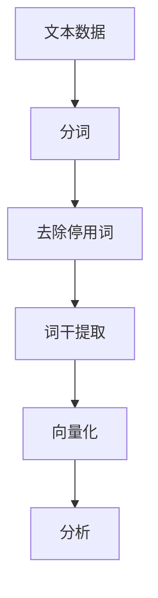
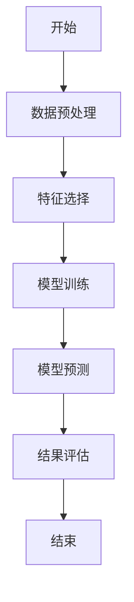
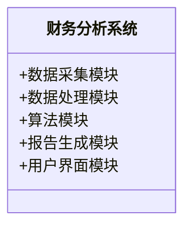
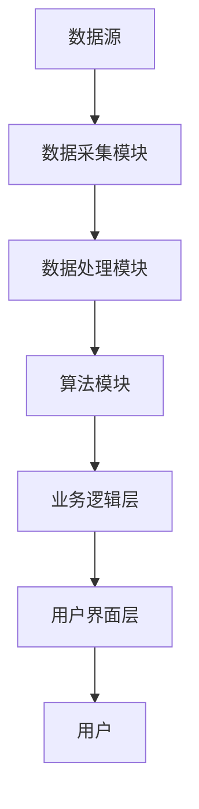
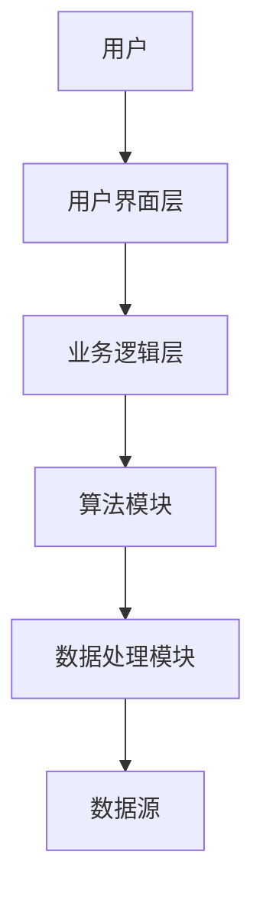

                 


# 构建智能化的企业财务分析系统

> 关键词：企业财务分析，人工智能，大数据，机器学习，自然语言处理，智能化系统

> 摘要：本文详细探讨了如何构建智能化的企业财务分析系统，从系统背景、核心概念、算法原理、数学模型到系统架构设计，再到项目实战，层层深入，全面解析了智能化财务分析系统的构建过程。文章通过实际案例分析，结合代码实现和数学公式推导，为读者提供了一套完整的智能化财务分析系统解决方案。

---

# 第1章: 企业财务分析系统的背景与现状

## 1.1 财务分析系统的概念与作用

### 1.1.1 财务分析的基本概念

财务分析是通过对企业的财务数据（如资产负债表、利润表、现金流量表等）进行分析，评估企业的财务状况、经营成果和未来发展趋势。它是企业管理、投资决策和风险管理的重要工具。

### 1.1.2 财务分析在企业管理中的作用

1. **评估企业财务状况**：通过分析财务报表，了解企业的资产、负债、所有者权益等状况。
2. **预测未来趋势**：基于历史数据，预测企业的收入、利润和现金流趋势。
3. **支持决策制定**：为企业管理者提供数据支持，帮助制定经营策略和投资决策。
4. **风险控制**：识别潜在的财务风险，如流动性风险、偿债风险等。

### 1.1.3 财务分析系统的分类与特点

财务分析系统可以根据功能、用户群体和应用场景进行分类：

1. **按功能分类**：
   - **基础分析系统**：主要用于数据录入、报表生成和简单分析。
   - **高级分析系统**：支持复杂的数据挖掘、预测分析和决策支持。
2. **按用户群体分类**：
   - **个人用户系统**：适用于小型企业或个人创业者。
   - **企业级系统**：适用于大型企业，支持多部门协作和数据共享。
3. **按应用场景分类**：
   - **内部管理分析系统**：用于企业内部的财务管理。
   - **外部投资分析系统**：用于投资者分析企业的财务状况。

---

## 1.2 企业财务分析的智能化需求

### 1.2.1 传统财务分析的局限性

1. **数据处理能力有限**：传统财务分析系统主要依赖人工录入和简单的数据处理，难以应对海量数据。
2. **分析效率低**：人工分析耗时长，且容易出错。
3. **缺乏预测能力**：传统系统难以进行精准的财务预测和风险评估。
4. **难以实时分析**：数据更新和分析滞后，无法满足实时需求。

### 1.2.2 智能化财务分析的优势

1. **高效的数据处理能力**：利用大数据技术，快速处理海量财务数据。
2. **智能化分析**：通过机器学习和人工智能技术，实现自动化分析和预测。
3. **实时监控**：系统能够实时更新数据并进行分析，帮助企业及时做出决策。
4. **个性化报告**：根据用户需求生成定制化的财务分析报告。

### 1.2.3 企业智能化转型的背景与趋势

随着企业数字化转型的推进，智能化财务分析系统的需求日益增长。企业希望通过智能化系统提高效率、降低成本，并在竞争激烈的市场中获得优势。

---

## 1.3 本章小结

本章介绍了财务分析系统的概念、作用和分类，并分析了传统财务分析的局限性和智能化财务分析的优势。随着企业智能化转型的推进，构建智能化财务分析系统已成为必然趋势。

---

# 第2章: 智能化企业财务分析系统的概念与架构

## 2.1 智能化财务分析系统的定义

### 2.1.1 系统的核心概念

智能化财务分析系统是一种基于人工智能、大数据和机器学习技术的财务分析工具，能够实现数据的自动采集、智能分析和预测，并为企业提供实时的财务决策支持。

### 2.1.2 系统的主要功能模块

1. **数据采集模块**：从企业内部和外部数据源（如ERP系统、公开财务报表等）采集财务数据。
2. **数据处理模块**：对采集的数据进行清洗、转换和预处理。
3. **数据分析模块**：利用机器学习算法对数据进行分析，生成预测结果。
4. **报告生成模块**：根据分析结果生成定制化的财务分析报告。
5. **用户交互模块**：提供友好的用户界面，支持用户与系统交互。

---

## 2.2 系统的核心要素与关系

### 2.2.1 数据源与数据处理

数据是智能化财务分析系统的核心，系统需要从多种数据源获取数据，并进行清洗和预处理。常见的数据源包括：

1. **内部数据**：企业的财务报表、销售数据、成本数据等。
2. **外部数据**：行业数据、市场数据、宏观经济数据等。

### 2.2.2 AI算法与模型

智能化财务分析系统的核心是算法和模型，常用的算法包括：

1. **机器学习算法**：如线性回归、随机森林、神经网络等。
2. **自然语言处理（NLP）算法**：用于分析财务报告和新闻数据。

### 2.2.3 用户交互界面

系统需要提供友好的用户界面，支持用户进行数据查询、分析结果展示和报告生成。

---

## 2.3 系统的架构设计

### 2.3.1 分层架构概述

智能化财务分析系统的架构通常采用分层设计，包括数据层、算法层、业务逻辑层和用户界面层。

### 2.3.2 数据流与信息流

数据从数据源流入系统，经过数据处理模块后，进入算法模块进行分析，生成结果后传递到业务逻辑层，并最终通过用户界面展示给用户。

### 2.3.3 模块之间的关系

1. **数据采集模块**与**数据处理模块**：数据采集模块负责获取数据，数据处理模块对数据进行清洗和预处理。
2. **数据处理模块**与**算法模块**：数据处理模块为算法模块提供干净的数据。
3. **算法模块**与**业务逻辑层**：算法模块生成分析结果，业务逻辑层将结果转化为用户可理解的形式。
4. **业务逻辑层**与**用户界面层**：业务逻辑层将结果传递给用户界面层，供用户查看和操作。

---

## 2.4 本章小结

本章详细介绍了智能化财务分析系统的定义、核心要素和架构设计，为后续的算法实现和系统开发奠定了基础。

---

# 第3章: 智能化财务分析系统的算法原理

## 3.1 机器学习在财务分析中的应用

### 3.1.1 监督学习与非监督学习

1. **监督学习**：用于有标签的数据，如财务预测任务。
2. **非监督学习**：用于无标签的数据，如聚类分析。

### 3.1.2 算法选择与优化

选择合适的算法是机器学习的核心，常用的算法包括：

1. **线性回归**：用于预测连续型变量。
2. **决策树**：用于分类和回归任务。
3. **随机森林**：用于特征重要性分析和分类任务。
4. **神经网络**：用于复杂非线性关系的建模。

### 3.1.3 案例分析：财务预测模型

以财务预测为例，我们可以使用随机森林算法进行分析。以下是Python代码实现：

```python
import pandas as pd
from sklearn.ensemble import RandomForestRegressor
from sklearn.model_selection import train_test_split
from sklearn.metrics import mean_squared_error

# 加载数据
data = pd.read_csv('financial_data.csv')

# 特征选择
features = data.columns.drop('target')
X = data[features]
y = data['target']

# 划分训练集和测试集
X_train, X_test, y_train, y_test = train_test_split(X, y, test_size=0.2, random_state=42)

# 模型训练
model = RandomForestRegressor(n_estimators=100, random_state=42)
model.fit(X_train, y_train)

# 预测
y_pred = model.predict(X_test)

# 评估
mse = mean_squared_error(y_test, y_pred)
print(f'均方误差：{mse}')
```

---

## 3.2 自然语言处理（NLP）的应用

### 3.2.1 文本数据的处理与分析

NLP技术可以用于分析财务报告和新闻数据。以下是NLP处理流程的mermaid图：



### 3.2.2 基于NLP的财务报告解读

以财务报告中的关键词提取为例，可以使用TF-IDF算法提取重要词汇。

---

## 3.3 算法实现与代码示例

### 3.3.1 Python代码实现

以下是随机森林算法的代码实现：

```python
import pandas as pd
from sklearn.ensemble import RandomForestRegressor
from sklearn.model_selection import train_test_split
from sklearn.metrics import mean_squared_error

# 加载数据
data = pd.read_csv('financial_data.csv')

# 特征选择
features = data.columns.drop('target')
X = data[features]
y = data['target']

# 划分训练集和测试集
X_train, X_test, y_train, y_test = train_test_split(X, y, test_size=0.2, random_state=42)

# 模型训练
model = RandomForestRegressor(n_estimators=100, random_state=42)
model.fit(X_train, y_train)

# 预测
y_pred = model.predict(X_test)

# 评估
mse = mean_squared_error(y_test, y_pred)
print(f'均方误差：{mse}')
```

### 3.3.2 算法流程图（Mermaid）

以下是随机森林算法的流程图：



### 3.3.3 数学模型与公式

随机森林算法的核心是袋装技术和特征重要性分析。以下是袋装技术的公式：

$$
\text{Bagging} = \bigcup_{i=1}^{n} B_i
$$

其中，$B_i$ 是第 $i$ 个袋中的数据集。

---

## 3.4 本章小结

本章详细介绍了机器学习和NLP在财务分析中的应用，并通过代码示例和流程图展示了算法的实现过程。

---

# 第4章: 系统的数学模型与公式

## 4.1 财务数据分析的数学模型

### 4.1.1 数据预处理与特征提取

数据预处理是财务分析的重要步骤，常见的预处理方法包括：

1. **数据清洗**：处理缺失值、异常值和重复值。
2. **数据转换**：对数据进行标准化、归一化或对数变换。

### 4.1.2 回归分析与聚类算法

1. **回归分析**：
   - 线性回归：$$y = \beta_0 + \beta_1x + \epsilon$$
   - 逻辑回归：$$P(y=1|x) = \frac{1}{1 + e^{-\beta_0 - \beta_1x}}$$

2. **聚类算法**：
   - K-means：$$\min \sum_{i=1}^{k} \sum_{j=1}^{n_i} (x_j - \mu_i)^2$$
   - 层次聚类：基于距离矩阵进行聚类。

### 4.1.3 时间序列分析

时间序列分析常用于财务预测，常用的模型包括ARIMA和LSTM。

---

## 4.2 常见的数学公式与模型

### 4.2.1 线性回归公式：$$y = \beta_0 + \beta_1x + \epsilon$$

### 4.2.2 聚类算法的距离公式：$$d(x_i, x_j) = \sqrt{(x_i - x_j)^2}$$

### 4.2.3 时间序列预测公式：$$\hat{y}_t = a + (1 - \alpha)(\hat{y}_{t-1} + \beta d_{t-1})$$

---

## 4.3 模型优化与调参

### 4.3.1 超参数优化方法

常用的超参数优化方法包括网格搜索（Grid Search）和随机搜索（Random Search）。

### 4.3.2 正则化技术

正则化技术用于防止过拟合，常用的包括L1正则化和L2正则化。

### 4.3.3 模型评估指标

常用的模型评估指标包括均方误差（MSE）、平均绝对误差（MAE）和R平方值。

---

## 4.4 本章小结

本章详细介绍了财务数据分析中的数学模型和公式，包括回归分析、聚类算法和时间序列分析，并展示了它们在财务分析中的应用。

---

# 第5章: 系统分析与架构设计方案

## 5.1 项目背景与目标

### 5.1.1 项目背景

随着企业数字化转型的推进，智能化财务分析系统的需求日益增长。

### 5.1.2 项目目标

本项目旨在构建一个智能化的财务分析系统，实现数据的自动采集、智能分析和预测，并为企业提供实时的财务决策支持。

---

## 5.2 系统功能设计

### 5.2.1 领域模型设计（Mermaid 类图）

以下是系统功能模块的类图：



### 5.2.2 系统架构设计

智能化财务分析系统的架构通常包括数据层、算法层、业务逻辑层和用户界面层。

---

## 5.3 系统架构设计

### 5.3.1 系统架构图（Mermaid）

以下是系统架构图：



---

## 5.4 系统接口设计

### 5.4.1 数据接口

系统需要与企业的ERP系统、财务报表等数据源对接。

### 5.4.2 API接口

系统提供API接口，方便其他系统调用财务分析结果。

---

## 5.5 系统交互流程图（Mermaid）

以下是系统交互流程图：



---

## 5.6 本章小结

本章详细介绍了智能化财务分析系统的架构设计和接口设计，为后续的系统开发提供了指导。

---

# 第6章: 项目实战

## 6.1 环境安装

### 6.1.1 安装Python和相关库

安装Python和以下库：

```bash
pip install pandas scikit-learn matplotlib
```

### 6.1.2 安装开发环境

安装Jupyter Notebook或PyCharm作为开发环境。

---

## 6.2 系统核心实现

### 6.2.1 数据采集模块

编写代码从CSV文件中读取数据：

```python
import pandas as pd

data = pd.read_csv('financial_data.csv')
```

### 6.2.2 数据处理模块

对数据进行清洗和预处理：

```python
data.dropna(inplace=True)
data = pd.get_dummies(data)
```

### 6.2.3 算法模块

实现随机森林算法：

```python
from sklearn.ensemble import RandomForestRegressor

model = RandomForestRegressor(n_estimators=100)
model.fit(X_train, y_train)
```

---

## 6.3 代码应用解读与分析

### 6.3.1 数据分析结果展示

通过可视化工具展示分析结果，如matplotlib。

### 6.3.2 案例分析

以某企业为例，分析其财务状况，并生成报告。

---

## 6.4 项目小结

本章通过实际案例展示了智能化财务分析系统的实现过程，包括环境安装、代码实现和案例分析。

---

# 第7章: 总结与展望

## 7.1 本章总结

智能化财务分析系统的构建需要结合大数据、人工智能和机器学习技术，通过系统的架构设计和算法实现，为企业提供高效的财务分析和决策支持。

---

## 7.2 未来展望

未来，随着人工智能和大数据技术的不断发展，智能化财务分析系统将更加智能化和自动化，为企业提供更精准的财务预测和决策支持。

---

# 附录

## 附录A: 常用数据处理函数

```python
import pandas as pd
import numpy as np

# 删除缺失值
data.dropna(inplace=True)

# 填充缺失值
data.fillna(0, inplace=True)

# 标准化处理
from sklearn.preprocessing import StandardScaler
scaler = StandardScaler()
data_scaled = scaler.fit_transform(data)
```

---

## 附录B: 代码示例

```python
import pandas as pd
from sklearn.ensemble import RandomForestRegressor
from sklearn.model_selection import train_test_split
from sklearn.metrics import mean_squared_error

# 加载数据
data = pd.read_csv('financial_data.csv')

# 特征选择
features = data.columns.drop('target')
X = data[features]
y = data['target']

# 划分训练集和测试集
X_train, X_test, y_train, y_test = train_test_split(X, y, test_size=0.2, random_state=42)

# 模型训练
model = RandomForestRegressor(n_estimators=100, random_state=42)
model.fit(X_train, y_train)

# 预测
y_pred = model.predict(X_test)

# 评估
mse = mean_squared_error(y_test, y_pred)
print(f'均方误差：{mse}')
```

---

## 附录C: 索引

（根据实际文章内容生成索引）

---

# 作者

作者：AI天才研究院/AI Genius Institute & 禅与计算机程序设计艺术 /Zen And The Art of Computer Programming

