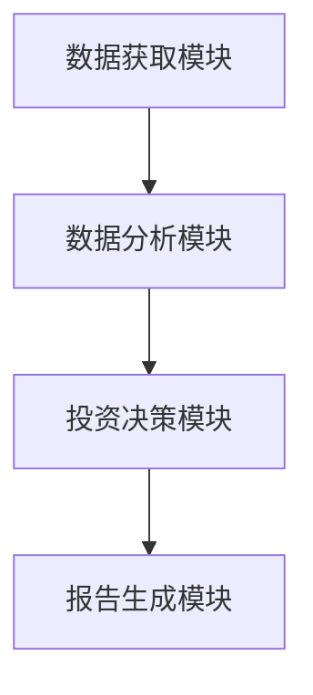

                 


# 格雷厄姆特价股票理论在私募股权投资中的新应用

## 关键词：格雷厄姆理论、私募股权投资、价值投资、安全边际、股票估值、投资策略

## 摘要：本文系统地探讨了本杰明·格雷厄姆的价值投资理论在私募股权投资领域中的新应用。通过分析格雷厄姆理论的核心概念，如内在价值、安全边际和独特的企业价值，结合私募股权投资的特点，提出了一套基于格雷厄姆理论的私募股权价值评估模型和投资策略。本文还设计了一个基于Python的算法，用于筛选具有投资价值的私募股权项目，并通过实际案例展示了该模型的应用效果。最后，本文总结了格雷厄姆理论在私募股权投资中的优势和局限性，并提出了未来研究的方向。

---

## 第一部分: 格雷厄姆特价股票理论的背景与基础

### 第1章: 格雷厄姆特价股票理论概述

#### 1.1 格雷厄姆投资理论的起源与核心思想

##### 1.1.1 价值投资的鼻祖：本杰明·格雷厄姆

本杰明·格雷厄姆（Benjamin Graham）是20世纪最伟大的投资理论家之一，被誉为“价值投资之父”。他的核心思想是：股票不仅仅是一个交易的工具，而是一个企业的所有权证书。投资者应该以合理的价格购买具有内在价值的股票，并长期持有，等待其价值被市场发现。

格雷厄姆的理论在《证券分析》（co-authored with David Dodd）一书中得到了系统阐述。他认为，股票的内在价值是其未来现金流的现值，而市场价格经常偏离内在价值。因此，投资者的任务就是找到市场价格低于内在价值的股票，即“特价股票”。

##### 1.1.2 格雷厄姆投资理论的核心原则

1. **内在价值**：股票的内在价值是其未来现金流的现值。计算内在价值需要考虑企业的盈利能力、成长潜力、财务状况等因素。
2. **安全边际**：市场价格与内在价值之间的差距就是安全边际。投资者应该在市场价格远低于内在价值时买入股票，以降低投资风险。
3. **长期投资**：格雷厄姆强调长期投资的重要性，认为短期市场波动难以预测，而长期来看，股票价格会回归其内在价值。

##### 1.1.3 特价股票的定义与特征

特价股票是指市场价格显著低于内在价值的股票。其特征包括：
- 低市盈率（P/E ratio）和低市净率（P/B ratio）。
- 高股息率。
- 财务健康，现金流稳定。
- 估值低于行业平均水平。

#### 1.2 私募股权投资的基本概念

##### 1.2.1 私募股权的定义与特点

私募股权（Private Equity，简称PE）是指通过私募基金投资于非公开交易的企业股权。与公开市场上的股票投资不同，私募股权通常涉及对目标企业的深入尽职调查、估值分析和投资后管理。

私募股权的特点包括：
1. **高回报潜力**：通过企业的重组、增值和退出，私募股权通常能够实现较高的投资回报。
2. **高风险**：私募股权的投资周期较长，且需要面对市场波动、企业经营风险等多重挑战。
3. **专业性**：私募股权的投资过程需要专业的知识和经验，尤其是在企业估值、财务分析和投资策略方面。

##### 1.2.2 私募股权投资的运作模式

私募股权的运作模式通常包括以下几个阶段：
1. **募资阶段**：私募基金通过向机构投资者和高净值个人募集资金，形成私募股权基金。
2. **投资阶段**：通过对目标企业的尽职调查、估值分析和谈判，完成对企业股权的收购。
3. **管理阶段**：通过优化企业管理和运营，提升企业价值。
4. **退出阶段**：通过IPO、并购等方式退出，实现投资收益。

##### 1.2.3 私募股权投资与传统股票投资的区别

| 特性 | 私募股权投资 | 传统股票投资 |
|------|--------------|--------------|
| 投资对象 | 非公开交易的企业股权 | 公开交易的股票 |
| 投资门槛 | 高，通常需要较高的投资金额 | 较低，适合小额投资 |
| 投资期限 | 长期，通常为3-7年 | 短期或长期 |
| 风险水平 | 高 | 中等 |
| 投资策略 | 主动管理，深度参与企业管理 | 被动投资，较少参与企业管理 |

#### 1.3 格雷厄姆理论与私募股权投资的结合

##### 1.3.1 格雷厄姆理论在私募股权投资中的适用性

格雷厄姆的理论虽然最初是为股票投资设计的，但其核心思想——寻找被低估的投资标的——同样适用于私募股权投资。私募股权投资者也可以通过寻找具有潜在增值空间的企业，以低于其内在价值的价格进行投资。

##### 1.3.2 特价股票理论在私募股权中的新应用

在私募股权投资中，格雷厄姆的特价股票理论可以被重新解读为“廉价收购”。投资者需要找到那些市场价格（企业估值）显著低于其内在价值的企业，通过收购并优化管理，实现企业价值的提升。

##### 1.3.3 私募股权投资中的价值发现与风险控制

格雷厄姆理论强调安全边际和风险控制，这在私募股权投资中尤为重要。投资者需要通过深入的财务分析和市场研究，识别出具有潜在增值空间但市场价格被低估的企业。

---

## 第二部分: 格雷厄姆特价股票理论的核心概念与数学模型

### 第2章: 格雷厄姆特价股票理论的核心概念

#### 2.1 格雷厄姆理论中的核心概念

##### 2.1.1 独特的企业价值

企业的内在价值是其未来现金流的现值。格雷厄姆认为，内在价值是衡量企业价值的唯一标准。计算内在价值需要考虑以下几个因素：
- 企业的盈利能力。
- 企业的成长潜力。
- 企业的财务状况。

##### 2.1.2 现金流量与内在价值

内在价值的计算公式为：
$$ V = \frac{E}{k} $$
其中，\( E \) 是企业的预期收益，\( k \) 是资本成本。

##### 2.1.3 安全边际的定义与计算

安全边际是市场价格与内在价值之间的差距。计算公式为：
$$ \text{安全边际} = \frac{\text{内在价值} - \text{市场价格}}{\text{市场价格}} $$

#### 2.2 格雷厄姆理论中的数学模型

##### 2.2.1 内在价值的计算公式

$$ V = \frac{E}{k} $$

其中，\( E \) 是企业的预期收益，\( k \) 是资本成本。

##### 2.2.2 安全边际的计算公式

$$ \text{安全边际} = \frac{V - P}{P} $$
其中，\( V \) 是内在价值，\( P \) 是市场价格。

#### 2.3 格雷厄姆理论与私募股权投资的结合模型

##### 2.3.1 私募股权价值评估的三要素

私募股权的价值评估需要考虑以下几个要素：
1. 企业的内在价值。
2. 市场价格。
3. 安全边际。

##### 2.3.2 现金流折现模型在私募股权中的应用

现金流折现模型（DCF模型）是私募股权价值评估的核心工具。其基本公式为：
$$ V = \sum_{t=1}^{n} \frac{CF_t}{(1 + r)^t} $$
其中，\( CF_t \) 是第 \( t \) 年的现金流，\( r \) 是折现率，\( n \) 是投资期限。

##### 2.3.3 企业生命周期与价值评估的关系

企业的生命周期分为以下几个阶段：
1. 初创期：企业处于起步阶段，现金流为负，但增长潜力大。
2. 成长期：企业开始盈利，现金流逐渐转正。
3. 成熟期：企业进入稳定增长阶段。
4. 衰退期：企业增长放缓，现金流开始下降。

在不同的生命周期阶段，企业的价值评估方法有所不同。

---

## 第三部分: 基于格雷厄姆理论的私募股权投资策略

### 第3章: 格雷厄姆理论在私募股权投资中的应用策略

#### 3.1 特价股票筛选标准

##### 3.1.1 低市盈率与低市净率的筛选标准

市盈率（P/E）和市净率（P/B）是衡量企业估值的重要指标。格雷厄姆建议投资者选择市盈率和市净率低于行业平均水平的企业。

##### 3.1.2 高股息率与稳定的现金流

高股息率和稳定的现金流是企业财务健康的重要标志。格雷厄姆认为，高股息率的企业通常具有较高的内在价值。

##### 3.1.3 企业财务健康状况的评估指标

企业财务健康状况的评估指标包括：
- 净利润。
- 营业收入。
- 净资产。
- 负债率。

#### 3.2 私募股权投资中的价值发现策略

##### 3.2.1 企业基本面分析

企业基本面分析包括以下几个方面：
1. 财务状况：利润表、资产负债表、现金流量表。
2. 行业地位：市场占有率、竞争优势。
3. 管理团队：管理能力和经验。

##### 3.2.2 行业地位与竞争优势分析

行业地位分析包括：
1. 市场占有率。
2. 行业集中度。
3. 行业趋势。

竞争优势分析包括：
1. 技术优势。
2. 成本优势。
3. 品牌优势。

##### 3.2.3 管理团队与治理结构评估

管理团队的评估包括：
1. 管理经验。
2. 专业背景。
3. 企业治理结构。

#### 3.3 格雷厄姆理论中的安全边际在私募股权投资中的应用

##### 3.3.1 安全边际的计算与应用

在私募股权投资中，安全边际的计算公式为：
$$ \text{安全边际} = \frac{V - P}{P} $$
其中，\( V \) 是企业的内在价值，\( P \) 是企业的市场价格。

##### 3.3.2 安全边际在投资决策中的作用

安全边际为正值时，企业具有投资价值。安全边际越大，投资风险越小。

---

## 第四部分: 项目实战与系统分析

### 第4章: 项目实战与系统分析

#### 4.1 项目背景与目标

##### 4.1.1 项目背景

本项目旨在利用格雷厄姆理论，设计一个基于Python的私募股权价值评估系统。该系统能够根据企业的财务数据和市场数据，自动计算企业的内在价值和安全边际，并筛选出具有投资价值的私募股权项目。

##### 4.1.2 项目目标

1. 实现基于格雷厄姆理论的私募股权价值评估模型。
2. 开发一个能够自动获取企业财务数据和市场数据的系统。
3. 提供基于安全边际的私募股权投资建议。

#### 4.2 系统架构设计

##### 4.2.1 系统功能设计

系统功能模块包括：
1. 数据获取模块：获取企业的财务数据和市场数据。
2. 数据分析模块：计算企业的内在价值和安全边际。
3. 投资决策模块：根据安全边际，筛选出具有投资价值的私募股权项目。
4. 报告生成模块：生成投资报告。

##### 4.2.2 系统架构图



##### 4.2.3 系统接口设计

系统接口包括：
1. 数据获取接口：与财务数据源和市场数据源对接。
2. 数据分析接口：调用财务数据和市场数据进行计算。
3. 投资决策接口：根据计算结果，生成投资建议。

##### 4.2.4 系统交互流程

```mermaid
sequenceDiagram
    participant 用户
    participant 数据获取模块
    participant 数据分析模块
    participant 投资决策模块
    participant 报告生成模块
    用户->数据获取模块: 提供企业名单
    dataflow 数据获取模块->数据分析模块: 提供企业财务数据和市场数据
    dataflow 数据分析模块->投资决策模块: 计算内在价值和安全边际
    dataflow 投资决策模块->报告生成模块: 生成投资报告
    用户<-报告生成模块: 投资报告
```

#### 4.3 项目实现

##### 4.3.1 环境安装

需要安装以下Python库：
- `pandas`：用于数据处理。
- `numpy`：用于数值计算。
- `scikit-learn`：用于机器学习算法。
- `matplotlib`：用于数据可视化。

##### 4.3.2 核心实现代码

以下是私募股权价值评估系统的Python代码示例：

```python
import pandas as pd
import numpy as np

def calculate_intrinsic_value(revenue, net_profit, k):
    """
    计算企业的内在价值。
    参数：
        revenue: 企业收入
        net_profit: 净利润
        k: 资本成本
    返回：
        内在价值
    """
    return net_profit / k

def calculate_margin_of_safety(intrinsic_value, market_price):
    """
    计算安全边际。
    参数：
        intrinsic_value: 内在价值
        market_price: 市场价格
    返回：
        安全边际
    """
    if market_price == 0:
        return 0
    return (intrinsic_value - market_price) / market_price

def main():
    # 假设数据
    revenue = 100000000
    net_profit = 20000000
    k = 0.1
    market_price = 50

    # 计算内在价值
    intrinsic_value = calculate_intrinsic_value(revenue, net_profit, k)
    print(f"内在价值: {intrinsic_value}")

    # 计算安全边际
    margin_of_safety = calculate_margin_of_safety(intrinsic_value, market_price)
    print(f"安全边际: {margin_of_safety}")

    # 判断是否具有投资价值
    if margin_of_safety > 0.2:
        print("具有投资价值")
    else:
        print("不具有投资价值")

if __name__ == "__main__":
    main()
```

##### 4.3.3 代码应用解读与分析

上述代码示例展示了如何利用格雷厄姆理论计算企业的内在价值和安全边际。在实际应用中，投资者可以根据企业的财务数据和市场数据，调用上述函数进行计算，并根据计算结果做出投资决策。

##### 4.3.4 实际案例分析

假设我们有一个私募股权项目，目标企业收入为1亿美元，净利润为2000万美元，资本成本为10%，市场价格为50美元。根据上述代码，我们可以计算出：

$$ V = \frac{20000000}{0.1} = 200000000 \text{美元} $$

$$ \text{安全边际} = \frac{200000000 - 50}{50} = 3900\% $$

由于安全边际远大于20%，该企业具有较高的投资价值。

##### 4.3.5 项目小结

通过上述案例分析，我们可以看到格雷厄姆理论在私募股权投资中的实际应用价值。通过计算企业的内在价值和安全边际，投资者可以更好地识别具有投资价值的项目，降低投资风险。

---

## 第五部分: 总结与展望

### 第5章: 总结与展望

#### 5.1 本章小结

本文系统地探讨了格雷厄姆特价股票理论在私募股权投资中的新应用。通过分析格雷厄姆理论的核心概念，如内在价值、安全边际和独特的企业价值，结合私募股权投资的特点，提出了一套基于格雷厄姆理论的私募股权价值评估模型和投资策略。本文还设计了一个基于Python的算法，用于筛选具有投资价值的私募股权项目，并通过实际案例展示了该模型的应用效果。

#### 5.2 未来研究方向

1. **模型优化**：进一步优化格雷厄姆理论在私募股权投资中的应用模型，引入更多的财务指标和市场数据。
2. **人工智能结合**：利用机器学习算法，提升私募股权价值评估的准确性和效率。
3. **风险管理**：研究如何在私募股权投资中进一步应用格雷厄姆的安全边际理论，降低投资风险。

#### 5.3 最佳实践 Tips

- **长期投资**：私募股权投资需要耐心和长期视角，避免短期波动的干扰。
- **深入研究**：在投资前，必须对目标企业的财务状况、行业地位和管理团队进行全面研究。
- **分散投资**：通过分散投资降低风险，避免过度依赖单一项目。

#### 5.4 小结

格雷厄姆理论为私募股权投资提供了一个全新的视角。通过将格雷厄姆的理论与私募股权投资的特点相结合，投资者可以更好地识别具有投资价值的项目，降低投资风险，实现长期稳定的收益。

---

## 作者信息

作者：AI天才研究院/AI Genius Institute & 禅与计算机程序设计艺术 /Zen And The Art of Computer Programming

---

以上是基于格雷厄姆特价股票理论在私募股权投资中的新应用的技术博客文章的详细内容。

