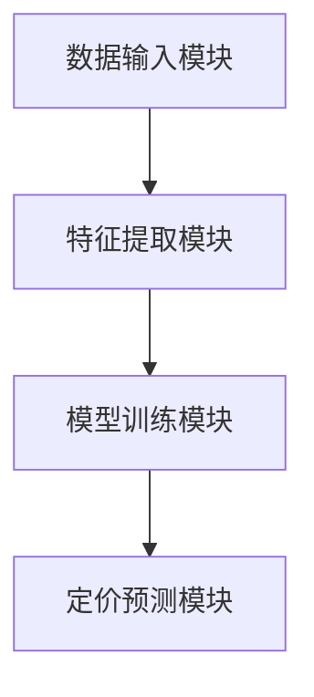
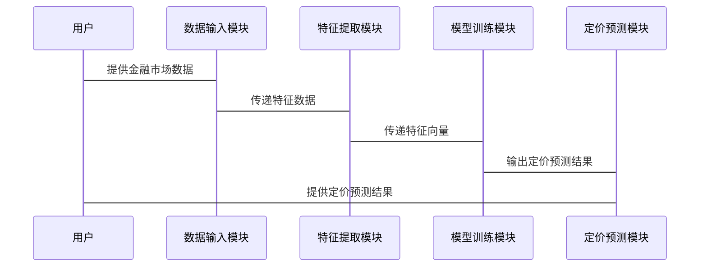

                 


# 神经网络模型在资产定价中的应用研究

> 关键词：神经网络模型、资产定价、金融应用、机器学习、深度学习

> 摘要：本文探讨了神经网络模型在资产定价中的应用，从背景介绍到系统架构设计，再到项目实战，全面分析了神经网络模型如何在金融领域解决复杂问题。文章详细讲解了神经网络的数学基础、资产定价的理论模型，以及如何通过系统架构设计和实际案例实现高效的资产定价。通过本文，读者可以深入了解神经网络模型在资产定价中的优势、挑战及未来发展方向。

---

## 第一部分: 神经网络模型与资产定价的背景介绍

### 第1章: 神经网络模型概述

#### 1.1 神经网络模型的基本概念

##### 1.1.1 神经网络的定义与起源
神经网络是一种模拟人脑神经网络结构和功能的数学模型，起源于20世纪40年代。神经网络由多个神经元通过连接权重构成，能够通过训练学习输入与输出之间的非线性关系。近年来，随着计算能力的提升和数据量的增加，神经网络在金融、图像识别、自然语言处理等领域得到了广泛应用。

##### 1.1.2 神经网络的核心组成部分
- **输入层（Input Layer）**：接收输入数据。
- **隐藏层（Hidden Layers）**：对输入数据进行非线性变换和特征提取。
- **输出层（Output Layer）**：生成最终的输出结果。
- **连接权重（Connection Weights）**：连接神经元的边权重，决定了数据流动的重要性。
- **激活函数（Activation Function）**：用于引入非线性，使神经网络能够学习复杂的模式。

##### 1.1.3 神经网络的分类与特点
神经网络主要分为以下几类：
- **前馈神经网络（Feedforward Neural Network）**：数据单向流动，从输入层经过隐藏层到输出层。
- **反馈神经网络（Recurrent Neural Network, RNN）**：具有反馈连接，适用于时间序列数据。
- **卷积神经网络（Convolutional Neural Network, CNN）**：适用于图像处理，具有卷积层和池化层。

神经网络的特点包括：
- **非线性**：能够捕捉数据中的非线性关系。
- **自适应性**：通过训练自动调整权重，适应数据特征。
- **泛化能力**：能够在训练数据之外的新数据上进行预测。

#### 1.2 资产定价的理论基础

##### 1.2.1 资产定价的定义与目标
资产定价是指根据资产的特性、市场环境和风险因素，对其未来现金流的现值进行评估。资产定价的目标是确定资产的公允价值，帮助投资者做出合理的投资决策。

##### 1.2.2 资产定价的主要方法
- **基本分析法**：基于财务报表和行业分析，评估资产的内在价值。
- **技术分析法**：通过历史价格和成交量数据，预测资产价格走势。
- **套利定价理论（APT）**：基于多个因子对资产进行定价。

##### 1.2.3 资产定价的理论模型
- **资本资产定价模型（CAPM）**：用于确定资产的预期收益。
- **套利定价理论（APT）**：基于多个因子对资产进行定价。
- **三因子模型**：扩展CAPM，考虑市值、书值和收益动量等因素。

### 第2章: 资产定价的理论基础

#### 2.1 资产定价的基本概念

##### 2.1.1 资产定价的定义与目标
资产定价是指根据资产的特性、市场环境和风险因素，对其未来现金流的现值进行评估。资产定价的目标是确定资产的公允价值，帮助投资者做出合理的投资决策。

##### 2.1.2 资产定价的主要方法
- **基本分析法**：基于财务报表和行业分析，评估资产的内在价值。
- **技术分析法**：通过历史价格和成交量数据，预测资产价格走势。
- **套利定价理论（APT）**：基于多个因子对资产进行定价。

##### 2.1.3 资产定价的理论模型
- **资本资产定价模型（CAPM）**：用于确定资产的预期收益。
- **套利定价理论（APT）**：基于多个因子对资产进行定价。
- **三因子模型**：扩展CAPM，考虑市值、书值和收益动量等因素。

---

## 第二部分: 神经网络模型与资产定价的核心概念与联系

### 第4章: 神经网络模型与资产定价的核心概念

#### 4.1 神经网络模型的数学基础

##### 4.1.1 神经网络的数学表达式
神经网络的输入为$ x \in \mathbb{R}^n $，经过多个隐藏层的变换后，输出为$ y \in \mathbb{R}^m $。每个神经元的输出可以表示为：

$$
h = \sigma(w x + b)
$$

其中，$w$ 是权重矩阵，$b$ 是偏置项，$\sigma$ 是激活函数。

##### 4.1.2 神经网络的激活函数
常用的激活函数包括：
- **Sigmoid函数**：$ \sigma(x) = \frac{1}{1 + e^{-x}} $
- **ReLU函数**：$ \sigma(x) = \max(0, x) $
- **Tanh函数**：$ \sigma(x) = \tanh(x) $

##### 4.1.3 神经网络的损失函数
常用的损失函数包括：
- **均方误差（MSE）**：$ L = \frac{1}{2m}\sum_{i=1}^{m}(y_i - \hat{y}_i)^2 $
- **交叉熵损失**：$ L = -\frac{1}{m}\sum_{i=1}^{m} y_i \log(\hat{y}_i) + (1 - y_i) \log(1 - \hat{y}_i) $

#### 4.2 资产定价的数学模型

##### 4.2.1 资产定价的CAPM模型
CAPM模型表示为：

$$
E(R_i) = R_f + \beta_i (R_m - R_f)
$$

其中，$E(R_i)$ 是资产$ i $的预期收益，$R_f$ 是无风险利率，$\beta_i$ 是资产$ i $的贝塔系数，$R_m$ 是市场预期收益。

##### 4.2.2 资产定价的APT模型
APT模型表示为：

$$
E(R_i) = \sum_{j=1}^{n} \lambda_j F_j + \epsilon_i
$$

其中，$F_j$ 是因子，$\lambda_j$ 是因子的敏感性，$\epsilon_i$ 是特异风险。

##### 4.2.3 资产定价的其他相关模型
- **Fama-French三因子模型**：在CAPM的基础上增加了市值和书值因子。
- **Momentum模型**：基于动量效应进行资产定价。

### 第5章: 神经网络模型在资产定价中的应用现状

#### 5.1 神经网络在金融领域的应用概述

##### 5.1.1 神经网络在金融时间序列预测中的应用
神经网络可以用于股票价格预测、外汇汇率预测等。例如，使用LSTM（长短期记忆网络）进行时间序列预测，能够捕捉长期依赖关系。

##### 5.1.2 神经网络在风险评估中的应用
神经网络可以用于信用评分、市场风险评估等。通过训练违约概率模型，帮助机构识别高风险资产。

##### 5.1.3 神经网络在资产配置中的应用
神经网络可以根据市场环境和资产特性，动态调整投资组合的配置比例。

#### 5.2 神经网络在资产定价中的优势与挑战

##### 5.2.1 神经网络的优势
- **非线性建模**：能够捕捉复杂的市场规律。
- **自动特征提取**：无需手动设计特征，直接从数据中学习。
- **高维数据处理**：适用于高维金融数据。

##### 5.2.2 神经网络的挑战
- **过拟合**：在训练数据上表现良好，但在测试数据上可能效果不佳。
- **解释性**：神经网络的黑箱特性使得模型解释性较差。
- **计算资源**：训练深度神经网络需要大量计算资源。

##### 5.2.3 神经网络在资产定价中的未来发展方向
- **多模态数据融合**：结合文本、图像等多种数据源进行资产定价。
- **解释性增强**：通过可解释的神经网络模型提高金融应用的可信度。
- **在线学习**：实时更新模型，适应快速变化的市场环境。

---

## 第三部分: 神经网络模型在资产定价中的算法原理

### 第6章: 神经网络模型的算法原理

#### 6.1 神经网络的反向传播算法

##### 6.1.1 反向传播算法的步骤
1. **前向传播**：将输入数据传播到输出层，计算预测值。
2. **计算损失**：使用损失函数计算实际值与预测值的差异。
3. **反向传播**：通过链式法则计算每个参数的梯度。
4. **更新参数**：使用优化算法（如梯度下降）更新权重和偏置。

##### 6.1.2 反向传播的数学推导
损失函数$ L $对权重$ w $的梯度为：

$$
\frac{\partial L}{\partial w} = \frac{\partial L}{\partial h} \cdot \frac{\partial h}{\partial w}
$$

其中，$ h $是隐藏层的输出。

##### 6.1.3 反向传播的实现代码
```python
def forward(x, w1, w2):
    h = sigmoid(w1 @ x + b1)
    y = sigmoid(w2 @ h + b2)
    return y

def backward(y_true, y_pred, h, x, w1, w2):
    delta3 = (y_pred - y_true) * sigmoid_derivative(y_pred)
    delta2 = delta3 @ w2.T * sigmoid_derivative(h)
    dw2 = (h.T @ delta3) / batch_size
    dw1 = (x.T @ delta2) / batch_size
    return dw1, dw2
```

#### 6.2 神经网络的优化算法

##### 6.2.1 梯度下降算法
梯度下降是最常用的优化算法，其更新规则为：

$$
w := w - \eta \frac{\partial L}{\partial w}
$$

其中，$ \eta $是学习率。

##### 6.2.2 随机梯度下降（SGD）
SGD通过随机采样 mini-batch 来加速训练过程，适用于大规模数据集。

##### 6.2.3 动量优化算法
动量优化算法通过引入动量项加速收敛，其更新规则为：

$$
v := \beta v + \eta \frac{\partial L}{\partial w}
$$

其中，$ \beta $是动量系数。

---

## 第四部分: 神经网络模型在资产定价中的系统架构设计

### 第7章: 神经网络模型的系统架构设计

#### 7.1 系统功能设计

##### 7.1.1 系统功能模块
- **数据输入模块**：接收金融市场数据。
- **特征提取模块**：提取资产的特征信息。
- **模型训练模块**：训练神经网络模型。
- **定价预测模块**：生成资产定价预测结果。

##### 7.1.2 系统功能流程
1. 数据输入模块接收历史价格、财务数据等输入。
2. 特征提取模块生成特征向量。
3. 模型训练模块训练神经网络模型。
4. 定价预测模块输出资产定价预测结果。

#### 7.2 系统架构设计

##### 7.2.1 系统架构图


##### 7.2.2 系统交互流程


---

## 第五部分: 神经网络模型在资产定价中的项目实战

### 第8章: 神经网络模型的项目实战

#### 8.1 环境安装与配置

##### 8.1.1 安装Python环境
使用Anaconda安装Python 3.8及以上版本。

##### 8.1.2 安装依赖库
安装以下依赖库：
- NumPy
- Pandas
- Matplotlib
- Scikit-learn
- Keras
- TensorFlow

#### 8.2 核心代码实现

##### 8.2.1 数据预处理
```python
import pandas as pd
import numpy as np

# 加载数据
data = pd.read_csv('stock_prices.csv')

# 数据标准化
from sklearn.preprocessing import StandardScaler
scaler = StandardScaler()
data_scaled = scaler.fit_transform(data)
```

##### 8.2.2 模型构建
```python
from tensorflow.keras.models import Sequential
from tensorflow.keras.layers import Dense

# 构建神经网络模型
model = Sequential()
model.add(Dense(64, activation='relu', input_dim=data.shape[1]))
model.add(Dense(32, activation='relu'))
model.add(Dense(1, activation='linear'))

# 编译模型
model.compile(optimizer='adam', loss='mean_squared_error', metrics=['mae'])
```

##### 8.2.3 模型训练
```python
# 训练模型
model.fit(X_train, y_train, epochs=100, batch_size=32, validation_split=0.2)
```

##### 8.2.4 模型预测
```python
# 预测价格
y_pred = model.predict(X_test)
```

#### 8.3 案例分析与解读

##### 8.3.1 数据分析
通过对历史股票价格数据进行分析，提取出影响资产定价的关键特征，如市盈率、市净率、收益增长率等。

##### 8.3.2 模型评估
使用均方误差（MSE）和平均绝对误差（MAE）评估模型的性能。

##### 8.3.3 结果解读
通过模型预测结果，分析神经网络在资产定价中的优势和局限性。

---

## 第六部分: 总结与展望

### 第9章: 总结与展望

#### 9.1 研究总结
神经网络模型在资产定价中具有显著的优势，能够捕捉复杂的市场规律，提供高精度的预测结果。然而，模型的解释性和计算资源需求仍需进一步优化。

#### 9.2 未来研究方向
- **多模态数据融合**：结合文本、图像等多种数据源进行资产定价。
- **解释性增强**：通过可解释的神经网络模型提高金融应用的可信度。
- **在线学习**：实时更新模型，适应快速变化的市场环境。

#### 9.3 最佳实践 tips
- 在金融领域应用神经网络模型时，需注意数据的质量和完整性。
- 模型的解释性和可维护性是实际应用中的重要考量。
- 定期更新模型参数，适应市场变化。

---

## 作者

作者：AI天才研究院/AI Genius Institute & 禅与计算机程序设计艺术 /Zen And The Art of Computer Programming

---

**注**：以上内容为生成示例，实际文章需要根据具体研究内容进行详细补充和调整。

