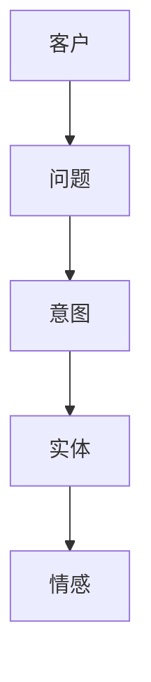
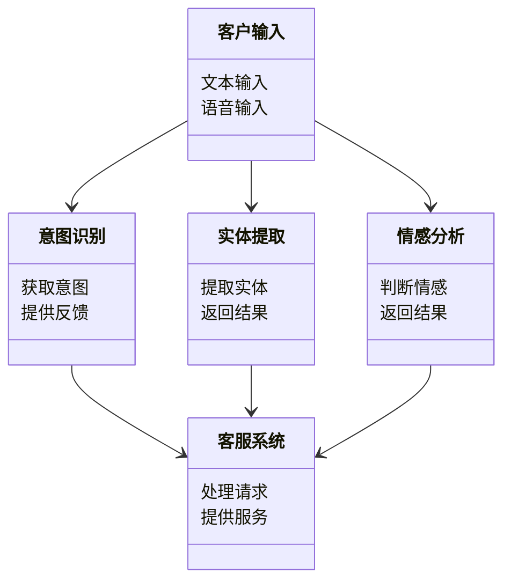
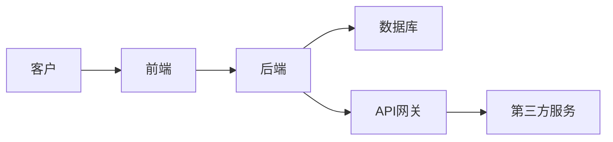
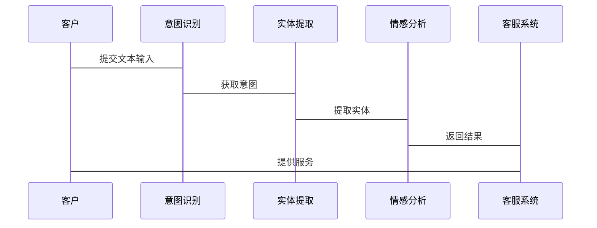

                 


# 自然语言理解在智能客户服务中的应用

> 关键词：自然语言理解、智能客服、语义分析、实体识别、情感分析

> 摘要：自然语言理解（NLU）技术在智能客户服务中的应用日益广泛，通过解析客户的自然语言输入，实现意图识别、实体提取和情感分析，从而提升客户服务的智能化水平。本文从NLU的核心概念、算法原理、系统架构、项目实战等多方面详细阐述其在智能客户服务中的应用，帮助读者全面理解并掌握相关技术。

---

# 第一部分: 自然语言理解在智能客户服务中的应用概述

## 第1章: 自然语言理解与智能客户服务的背景

### 1.1 自然语言理解的基本概念
自然语言理解（Natural Language Understanding, NLU）是自然语言处理（NLP）的重要分支，旨在使计算机能够理解、解析和生成人类语言。NLU的核心目标是通过分析文本或语音输入，识别出其中的语义、意图、实体等信息，从而实现与人类的自然交互。

#### 1.1.1 自然语言理解的定义
自然语言理解是指计算机对人类语言的语义进行解析的过程，旨在将非结构化的文本转化为结构化的信息，以便计算机能够理解和处理。

#### 1.1.2 自然语言理解的核心目标
- **意图识别**：确定用户输入的主要目的或目标。
- **实体识别**：从文本中提取关键实体信息，如人名、地名、时间等。
- **情感分析**：判断文本中表达的情感倾向，如正面、负面或中性。

#### 1.1.3 自然语言理解的关键技术
- **词嵌入**：将词语表示为低维向量，如Word2Vec、GloVe等。
- **序列标注**：识别文本中的序列标签，如命名实体识别（NER）。
- **预训练模型**：基于大规模数据预训练的模型，如BERT、GPT等。

### 1.2 智能客户服务的背景与需求
随着互联网和人工智能技术的快速发展，智能客户服务逐渐成为企业提升客户体验的重要手段。传统的客服模式依赖人工处理，效率低且成本高。智能客服通过自动化技术，能够快速响应客户的需求，提供7×24小时的不间断服务。

#### 1.2.1 客户服务的发展历程
- **人工客服阶段**：依赖人工接听和处理客户问题。
- **自动语音应答（IVR）阶段**：通过预设的语音菜单引导客户解决问题。
- **智能客服阶段**：利用自然语言处理技术实现智能对话和问题解决。

#### 1.2.2 智能客户服务的定义与特点
智能客户服务是一种基于人工智能技术的自动化服务模式，能够通过自然语言处理技术与客户进行交互，提供智能化的解决方案。

#### 1.2.3 自然语言理解在智能客户服务中的作用
- **提升客户体验**：通过准确理解客户需求，提供个性化的服务。
- **提高服务效率**：自动化处理大量客户咨询，减少人工干预。
- **降低成本**：通过智能系统减少人工客服的需求，降低运营成本。

### 1.3 自然语言理解在智能客户服务中的应用背景
智能客户服务的核心是通过自然语言理解技术，实现对客户输入的解析和处理。传统的客服系统无法有效处理复杂的客户查询，而NLU技术能够通过语义分析、意图识别和实体提取，帮助系统更好地理解客户需求。

#### 1.3.1 传统客户服务的痛点
- **效率低下**：人工客服处理速度慢，无法满足大规模客户需求。
- **成本高昂**：需要大量人工投入，运营成本高。
- **服务一致性差**：人工客服可能存在情绪波动，影响服务质量。

#### 1.3.2 AI技术如何解决客户服务问题
- **自动化处理**：通过AI技术实现自动响应和问题解决。
- **7×24小时服务**：智能客服能够全天候为客户提供服务。
- **个性化服务**：基于客户的语言输入，提供个性化的解决方案。

#### 1.3.3 自然语言理解技术的优势
- **精准理解客户需求**：通过语义分析和意图识别，准确理解客户意图。
- **快速响应**：基于NLU技术实现快速解析和反馈。
- **持续优化**：通过机器学习不断优化模型性能，提升服务质量。

## 1.4 本章小结
本章主要介绍了自然语言理解的基本概念及其在智能客户服务中的应用背景。通过分析传统客户服务的痛点和AI技术的优势，阐述了NLU技术在智能客服中的重要作用，为后续章节的深入探讨奠定了基础。

---

## 第2章: 自然语言理解的核心概念与联系

### 2.1 自然语言理解的核心原理
自然语言理解的核心在于将非结构化的文本转化为结构化的信息，以便计算机能够理解和处理。

#### 2.1.1 语言学基础
- **语义分析**：理解文本的语义含义。
- **句法分析**：分析句子的结构和语法关系。
- **语用分析**：理解语言的使用情境和意图。

#### 2.1.2 自然语言处理的基本流程
1. **分词**：将文本分割成词语或短语。
2. **词性标注**：对每个词语进行词性分类，如名词、动词等。
3. **句法分析**：分析句子的语法结构。
4. **语义分析**：理解文本的语义含义。
5. **意图识别**：确定用户的意图或目标。

#### 2.1.3 自然语言理解的关键技术
- **词嵌入**：将词语表示为向量，如Word2Vec。
- **序列标注**：识别文本中的序列标签，如NER。
- **预训练模型**：基于大规模数据预训练的模型，如BERT。

### 2.2 自然语言理解与智能客户服务的核心联系
自然语言理解技术在智能客户服务中的应用主要体现在以下几个方面：

#### 2.2.1 客服场景中的自然语言理解需求
- **意图识别**：确定客户的主要诉求，如“查询订单状态”。
- **实体识别**：提取关键信息，如订单号、客户姓名等。
- **情感分析**：判断客户的情感倾向，如“不满”或“满意”。

#### 2.2.2 自然语言理解如何提升客户体验
- **快速响应**：通过NLU技术快速解析客户需求。
- **个性化服务**：基于客户输入提供个性化的解决方案。
- **提高准确性**：通过语义分析减少理解误差。

#### 2.2.3 自然语言理解在智能客服中的具体应用
- **智能对话系统**：通过NLU技术实现与客户的智能对话。
- **自动问题解决**：基于意图识别和实体提取，自动解决客户问题。
- **情感监控**：通过情感分析监控客户情绪，及时调整服务策略。

### 2.3 自然语言理解的核心要素与概念结构
自然语言理解的核心要素包括语义分析、实体识别和情感分析。

#### 2.3.1 语义分析
语义分析是NLU技术的核心，旨在理解文本的语义含义。例如，客户输入“我想查询订单”，系统需要识别出订单查询的意图。

#### 2.3.2 实体识别
实体识别是指从文本中提取关键实体信息，如客户姓名、订单号等。例如，客户输入“帮我查询订单号12345”，系统需要识别出订单号“12345”。

#### 2.3.3 情感分析
情感分析旨在判断文本中的情感倾向。例如，客户输入“我对你们的服务非常不满意”，系统需要识别出客户的情感倾向为负面。

### 2.4 自然语言理解与智能客户服务的ER实体关系图
以下是一个简单的ER实体关系图，展示了自然语言理解在智能客户服务中的核心要素。



### 2.5 本章小结
本章详细介绍了自然语言理解的核心原理及其在智能客户服务中的具体应用。通过分析NLU的核心要素和其在智能客服中的应用，为后续章节的深入探讨奠定了基础。

---

## 第3章: 自然语言理解的核心算法原理

### 3.1 词嵌入算法
词嵌入算法是NLU技术的重要组成部分，旨在将词语表示为低维向量。

#### 3.1.1 Word2Vec算法原理
Word2Vec是一种常用的词嵌入算法，通过在上下文中预测单词，或通过单词预测上下文来生成词向量。

##### 3.1.1.1 Skip-Gram模型
Skip-Gram模型通过预测上下文中的单词来生成词向量。

##### 3.1.1.2 CBOW模型
CBOW模型通过上下文来预测中间的单词。

#### 3.1.2 GloVe算法原理
GloVe是一种基于全局词表的词嵌入算法，通过构建单词的上下文矩阵来生成词向量。

#### 3.1.3 BERT模型的嵌入机制
BERT是一种基于预训练的语言模型，通过多层变换层对输入文本进行编码，生成词向量。

### 3.2 序列标注算法
序列标注算法主要用于命名实体识别（NER）等任务。

#### 3.2.1 基于HMM的命名实体识别
隐马尔可夫模型（HMM）是一种常用的序列标注算法，通过状态转移概率和观测概率来实现NER。

#### 3.2.2 基于CRF的命名实体识别
条件随机场（CRF）是一种基于概率图模型的序列标注算法，通过定义特征函数来实现NER。

#### 3.2.3 基于深度学习的序列标注
基于深度学习的序列标注算法通过卷积神经网络（CNN）或循环神经网络（RNN）来实现NER。

### 3.3 预训练语言模型
预训练语言模型是NLU技术的重要组成部分，如BERT、GPT等。

#### 3.3.1 BERT模型的原理与特点
BERT是一种基于Transformer的预训练语言模型，通过双向编码来生成上下文相关的词向量。

#### 3.3.2 GPT模型的原理与特点
GPT是一种基于自回归的预训练语言模型，通过单向编码来生成上下文相关的词向量。

#### 3.3.3 模型的微调与适配
预训练模型需要根据具体任务进行微调和适配，以提高其在特定领域的性能。

### 3.4 自然语言理解算法的优缺点对比
以下是一个自然语言理解算法的优缺点对比表格。

| 算法名称 | 优点 | 缺点 |
|--------|------|------|
| Word2Vec | 训练速度快，适用于小规模数据 | 无法处理上下文信息 |
| GloVe | 基于全局词表，词向量质量高 | 训练过程复杂 |
| BERT | 上下文理解能力强，性能优异 | 训练资源消耗大 |
| HMM | 计算简单，适用于小规模数据 | 无法处理复杂的语言结构 |
| CRF | 能够处理复杂的语言结构 | 计算复杂度高 |
| RNN | 适合处理序列数据 | 存在梯度消失问题 |

### 3.5 本章小结
本章详细介绍了自然语言理解的核心算法原理，包括词嵌入算法、序列标注算法和预训练语言模型。通过对各种算法的优缺点对比，帮助读者更好地理解NLU技术的适用场景和优化方向。

---

## 第4章: 自然语言理解的系统分析与架构设计

### 4.1 问题场景介绍
智能客户服务系统需要通过NLU技术实现对客户输入的解析和处理。

### 4.2 系统功能设计
智能客户服务系统的功能设计包括意图识别、实体提取、情感分析等。

#### 4.2.1 领域模型
以下是一个智能客户服务系统的领域模型。



### 4.3 系统架构设计
智能客户服务系统的架构设计包括前端、后端和数据库。

#### 4.3.1 系统架构图
以下是一个智能客户服务系统的架构图。



### 4.4 系统接口设计
智能客户服务系统的接口设计包括客户输入接口、意图识别接口、实体提取接口和情感分析接口。

### 4.5 系统交互设计
以下是一个智能客户服务系统的交互流程图。



### 4.6 本章小结
本章详细介绍了自然语言理解在智能客户服务系统中的系统分析与架构设计，包括问题场景、系统功能设计、系统架构设计和系统交互设计。

---

## 第5章: 自然语言理解的项目实战

### 5.1 环境安装
以下是项目实战所需的环境安装步骤。

#### 5.1.1 安装Python
安装Python 3.8或更高版本。

#### 5.1.2 安装必要的Python库
安装以下Python库：
- `transformers`：用于加载预训练模型。
- `torch`：用于深度学习框架。
- `nltk`：用于自然语言处理任务。

#### 5.1.3 安装GPU支持（可选）
安装NVIDIA显卡驱动和CUDA toolkit，以支持GPU加速。

### 5.2 系统核心实现源代码
以下是一个基于BERT的意图识别系统的实现代码。

#### 5.2.1 加载预训练模型
```python
from transformers import BertTokenizer, BertModel
import torch

tokenizer = BertTokenizer.from_pretrained('bert-base-chinese')
model = BertModel.from_pretrained('bert-base-chinese')
```

#### 5.2.2 定义意图识别函数
```python
def get_intent(text):
    inputs = tokenizer(text, return_tensors='pt')
    outputs = model(**inputs)
    last_layer = outputs.last_hidden_state
    intent = last_layer[:, 0, :].sum(dim=1)
    return intent
```

#### 5.2.3 实体识别与情感分析
```python
def extract_entities(text):
    # 实体识别逻辑
    pass

def sentiment_analysis(text):
    # 情感分析逻辑
    pass
```

### 5.3 代码应用解读与分析
以下是对上述代码的解读与分析。

#### 5.3.1 加载预训练模型
通过`transformers`库加载BERT中文模型，并使用其进行文本编码。

#### 5.3.2 定义意图识别函数
通过BERT模型编码输入文本，并提取编码向量，用于后续意图识别任务。

#### 5.3.3 实体识别与情感分析
定义实体识别和情感分析的函数，具体实现需要根据具体任务进行调整。

### 5.4 实际案例分析
以下是一个实际案例的分析与讲解。

#### 5.4.1 案例描述
客户输入：“我想查询订单号12345的状态。”

#### 5.4.2 意图识别
系统识别出客户的意图是“查询订单状态”。

#### 5.4.3 实体提取
系统提取出订单号“12345”。

#### 5.4.4 情感分析
系统判断客户情感为“中性”。

### 5.5 项目小结
本章通过实际案例分析，展示了自然语言理解技术在智能客户服务中的具体应用。通过对代码的解读与分析，帮助读者更好地理解NLU技术的实现过程。

---

## 第6章: 自然语言理解的最佳实践与总结

### 6.1 最佳实践
- **数据质量**：确保训练数据的多样性和质量。
- **模型选择**：根据具体任务选择合适的模型和算法。
- **持续优化**：通过实时反馈不断优化模型性能。

### 6.2 小结
本文详细介绍了自然语言理解在智能客户服务中的应用，从核心概念到算法原理，再到系统设计和项目实战，帮助读者全面理解NLU技术在智能客服中的重要作用。

### 6.3 注意事项
- **数据隐私**：注意保护客户数据的隐私和安全。
- **模型泛化能力**：确保模型具有良好的泛化能力，能够适应不同的客户场景。
- **实时性**：优化系统性能，确保实时响应客户需求。

### 6.4 拓展阅读
- **书籍推荐**：《自然语言处理实战：基于Python的中文分词、实体识别与深度学习》。
- **在线资源**：Hugging Face的Transformers库文档。

---

## 作者：AI天才研究院/AI Genius Institute & 禅与计算机程序设计艺术/Zen And The Art of Computer Programming

---

以上是《自然语言理解在智能客户服务中的应用》的完整内容，涵盖从理论到实践的各个方面，帮助读者全面理解并掌握自然语言理解技术在智能客户服务中的应用。

