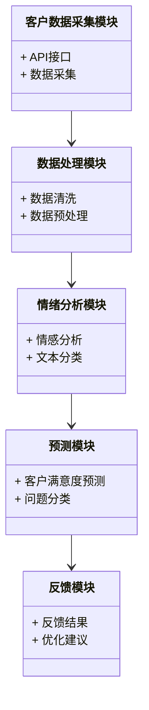
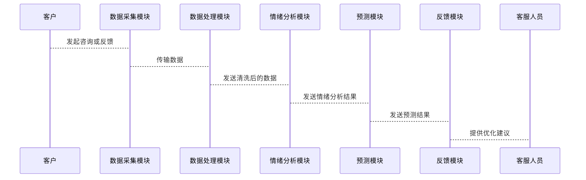

                 


# AI Agent在企业客户服务质量监控与提升中的实时应用

关键词：AI Agent, 客户服务质量, 实时监控, 情绪分析, 自然语言处理, 机器学习

摘要：本文详细探讨了AI Agent在企业客户服务质量监控与提升中的实时应用。通过分析AI Agent的核心概念、算法原理、系统架构设计，以及实际项目案例，展示了如何利用AI技术实现客户服务质量的实时监控与优化。文章内容涵盖从问题背景到系统实现的全过程，为企业的智能化客户服务提供了理论和实践指导。

---

# 第1章: AI Agent与企业客户服务质量提升概述

## 1.1 问题背景与描述

### 1.1.1 企业客户服务质量的重要性
在现代商业环境中，客户服务质量是企业竞争力的重要组成部分。高质量的客户服务能够提升客户满意度、忠诚度，进而增强企业的市场竞争力。然而，随着客户规模的扩大和客户需求的多样化，传统的客服管理模式已经难以满足实时监控和高效处理的需求。

### 1.1.2 当前客户服务质量监控的痛点
- 数据量大：企业每天需要处理大量的客户咨询和服务请求，数据量庞大，难以实时分析。
- 数据分散：客户数据可能分布在多个渠道（如电话、邮件、在线聊天等），难以统一监控。
- 处理效率低：传统的人工监控方式效率低下，且容易受到主观因素的影响，难以保证准确性。

### 1.1.3 AI Agent在客户服务质量提升中的作用
AI Agent（人工智能代理）能够通过自然语言处理（NLP）、机器学习等技术，实时分析客户数据，快速识别问题，提供个性化服务，从而提升客户满意度和服务质量。

### 1.1.4 问题解决
通过引入AI Agent，企业可以实现客户数据的实时采集、分析和反馈，从而快速响应客户需求，优化服务流程。

### 1.1.5 边界与外延
- 边界：AI Agent主要用于客户服务质量的实时监控与优化，不涉及企业的其他业务领域。
- 外延：AI Agent的应用可以扩展到其他领域，如销售预测、市场分析等。

### 1.1.6 核心要素组成
- 数据源：包括客户咨询、反馈、评分等。
- 技术工具：包括NLP、机器学习模型等。
- 服务目标：提升客户满意度和忠诚度。

## 1.2 AI Agent的核心概念与工作原理

### 1.2.1 AI Agent的定义与特点
- 定义：AI Agent是一种能够感知环境并采取行动以实现目标的智能实体。
- 特点：
  - 智能性：能够理解并处理复杂的信息。
  - 实时性：能够实时响应客户需求。
  - 自适应性：能够根据环境变化调整行为。

### 1.2.2 AI Agent在客户服务质量监控中的应用模式
- 数据采集与处理：实时采集客户咨询、反馈等数据，并进行清洗和预处理。
- 情绪分析：通过NLP技术分析客户情绪，识别潜在问题。
- 服务优化：根据分析结果优化服务流程，提升客户满意度。

### 1.2.3 AI Agent与传统客服系统的区别
| 特性                | AI Agent                         | 传统客服系统                   |
|---------------------|----------------------------------|-------------------------------|
| 数据处理能力        | 高效、智能                      | 低效、依赖人工                 |
| 响应速度            | 实时响应                        | 延迟较高                       |
| 情绪分析能力        | 精准分析                        | 依赖人工判断                   |

## 1.3 本章小结
本章介绍了AI Agent在企业客户服务质量提升中的重要性及其核心概念。通过分析当前客户服务质量监控的痛点，提出了AI Agent的应用模式，并对比了AI Agent与传统客服系统的区别。

---

# 第2章: AI Agent的基本原理与技术基础

## 2.1 自然语言处理（NLP）基础

### 2.1.1 NLP的定义与核心任务
- 定义：NLP是研究如何让计算机理解和生成人类语言的学科。
- 核心任务：
  - 词性标注
  - 句法分析
  - 情感分析
  - 实体识别

### 2.1.2 常见的NLP模型与算法
- 词袋模型（Bag-of-Words）
- 词嵌入模型（Word2Vec）
- 深度学习模型（如LSTM、Transformer）

### 2.1.3 NLP在客户服务质量监控中的应用
- 客户反馈分析：通过情感分析识别客户情绪。
- 问题分类：将客户咨询自动分类到相应主题。

## 2.2 机器学习与深度学习

### 2.2.1 机器学习的基本概念
- 定义：通过数据训练模型，使其能够从数据中学习规律。
- 常见算法：线性回归、支持向量机（SVM）、随机森林。

### 2.2.2 深度学习的核心技术
- 神经网络：包括卷积神经网络（CNN）和循环神经网络（RNN）。
- 注意力机制（Attention）：在Transformer模型中广泛应用。

### 2.2.3 机器学习在客户服务质量预测中的应用
- 预测客户满意度：基于历史数据训练模型，预测未来客户的满意度。
- 识别高风险客户：通过异常检测发现潜在的不满客户。

## 2.3 实时数据处理技术

### 2.3.1 实时数据流处理的概念
- 定义：对不断流动的数据进行实时处理和分析。
- 特点：低延迟、高吞吐量。

### 2.3.2 常见的实时数据处理框架
- Apache Kafka：分布式流处理平台。
- Apache Flink：实时流处理框架。

### 2.3.3 实时数据处理在客户服务质量监控中的应用
- 实时监控客户咨询：通过流处理框架实时分析客户咨询内容。
- 实时反馈：根据分析结果快速响应客户需求。

## 2.4 本章小结
本章介绍了AI Agent的核心技术基础，包括NLP、机器学习和实时数据处理技术。通过分析这些技术的特点和应用，为后续章节的实现提供了理论支持。

---

# 第3章: AI Agent在客户服务质量监控中的实时应用

## 3.1 客户服务数据的实时采集与处理

### 3.1.1 数据采集的渠道与方法
- 数据源：客户咨询、反馈、评分。
- 采集方法：API接口、日志采集、数据库同步。

### 3.1.2 数据预处理与清洗
- 数据清洗：去除重复、错误数据。
- 数据转换：将非结构化数据转换为结构化数据。

### 3.1.3 数据存储与管理
- 数据库选择：关系型数据库（如MySQL）或非关系型数据库（如MongoDB）。
- 数据索引：建立索引提高查询效率。

## 3.2 基于NLP的客户情绪分析

### 3.2.1 情绪分析的定义与分类
- 定义：分析客户文本中的情感倾向。
- 分类：正面、负面、中性。

### 3.2.2 基于深度学习的情绪分析模型
- 模型选择：使用预训练的BERT模型进行情感分析。
- 模型训练：基于客户反馈数据进行微调。

### 3.2.3 情绪分析在客户服务质量监控中的应用
- 识别客户不满情绪：及时发现潜在问题。
- 分类客户咨询：根据情绪和内容进行分类。

## 3.3 客户服务质量的实时预测与反馈

### 3.3.1 基于机器学习的实时预测模型
- 模型选择：使用LSTM进行时间序列预测。
- 模型训练：基于历史数据训练模型。

### 3.3.2 预测结果的可视化与反馈
- 可视化工具：使用Tableau或 Grafana 进行实时监控。
- 反馈机制：将预测结果反馈给客服人员。

### 3.3.3 预测结果在客户服务优化中的应用
- 优化服务流程：根据预测结果调整服务策略。
- 提高客户满意度：通过实时反馈快速响应客户需求。

## 3.4 本章小结
本章详细介绍了AI Agent在客户服务质量监控中的实时应用，包括数据采集与处理、情绪分析以及实时预测与反馈。通过这些技术，企业能够实现客户服务质量的实时监控与优化。

---

# 第4章: AI Agent在客户服务质量提升中的策略与方法

## 4.1 客户服务质量提升的总体策略

### 4.1.1 策略制定的原则与目标
- 原则：以客户为中心，数据驱动。
- 目标：提高客户满意度，降低投诉率。

### 4.1.2 策略实施的关键步骤
1. 数据采集与分析：实时采集并分析客户数据。
2. 问题识别：通过情绪分析和分类识别潜在问题。
3. 服务优化：根据问题调整服务流程。

### 4.1.3 策略效果的评估方法
- 客户满意度评分
- 投诉率变化
- 服务响应时间

## 4.2 基于NLP的客户反馈分析

### 4.2.1 客户反馈的分类与分析
- 分类标准：根据客户反馈内容和情绪进行分类。
- 分析工具：使用NLP模型进行文本挖掘。

### 4.2.2 基于深度学习的反馈分析模型
- 模型选择：使用BERT进行文本分类。
- 模型训练：基于客户反馈数据进行微调。

### 4.2.3 反馈分析在服务质量提升中的应用
- 识别客户痛点：发现客户最不满意的服务环节。
- 改进服务流程：根据反馈结果优化服务流程。

## 4.3 客户服务流程的优化与自动化

### 4.3.1 服务流程优化的定义与方法
- 定义：通过优化流程提高服务效率和质量。
- 方法：流程再造（BPR）、六西格玛等。

### 4.3.2 基于AI Agent的自动化服务流程
- 自动化场景：自动分配任务、智能回复客户。
- 实现方式：通过规则引擎和机器学习模型实现。

### 4.3.3 自动化服务流程的效果评估
- 效率提升：减少人工干预，提高处理速度。
- 质量提升：通过智能回复提高客户满意度。

## 4.4 本章小结
本章提出了客户服务质量提升的总体策略，并通过NLP和自动化技术实现服务流程的优化。通过这些方法，企业能够显著提高客户满意度和忠诚度。

---

# 第5章: AI Agent在客户服务质量监控与提升中的系统架构设计

## 5.1 系统架构介绍

### 5.1.1 系统功能设计
- 数据采集模块：实时采集客户数据。
- 数据处理模块：清洗和预处理数据。
- 情绪分析模块：分析客户情绪。
- 预测模块：预测客户满意度。
- 反馈模块：将结果反馈给客服人员。

### 5.1.2 系统架构设计
- 分层架构：数据采集层、数据处理层、业务逻辑层、用户界面层。
- 模块化设计：每个模块独立开发，便于维护和扩展。

## 5.2 系统功能设计（领域模型）



## 5.3 系统架构设计


## 5.4 系统接口设计

### 5.4.1 接口定义
- 数据采集接口：用于实时采集客户数据。
- 情绪分析接口：用于调用NLP模型进行情绪分析。
- 预测接口：用于调用机器学习模型进行满意度预测。

### 5.4.2 接口实现
- 数据采集接口：通过HTTP REST API实现。
- 情绪分析接口：使用预训练的BERT模型通过API调用。
- 预测接口：通过Flask框架实现REST API。

## 5.5 系统交互设计

### 5.5.1 交互流程
1. 客户发起咨询或反馈。
2. 数据采集模块采集数据并发送到数据处理模块。
3. 数据处理模块清洗数据并发送到情绪分析模块。
4. 情绪分析模块分析情绪并发送到预测模块。
5. 预测模块预测满意度并反馈结果。
6. 反馈模块根据结果优化服务流程。

### 5.5.2 交互序列图



## 5.6 本章小结
本章详细设计了AI Agent在客户服务质量监控与提升中的系统架构，包括功能设计、架构设计、接口设计和交互设计。通过这些设计，企业能够实现客户服务质量的实时监控与优化。

---

# 第6章: AI Agent在客户服务质量监控与提升中的项目实战

## 6.1 项目背景与目标

### 6.1.1 项目背景
某大型电商平台希望提升客户服务质量，减少客户投诉率，提高客户满意度。

### 6.1.2 项目目标
- 实现实时监控客户咨询和服务请求。
- 提供智能回复和优化建议。
- 提高客户满意度和忠诚度。

## 6.2 系统核心实现

### 6.2.1 环境安装
- 安装Python 3.8及以上版本。
- 安装必要的库：numpy、pandas、scikit-learn、transformers。

### 6.2.2 核心代码实现

```python
# 数据采集模块
import requests

def fetch_data(api_url):
    response = requests.get(api_url)
    return response.json()

# 数据处理模块
import pandas as pd

def preprocess_data(data):
    df = pd.DataFrame(data)
    df.dropna(inplace=True)
    return df

# 情绪分析模块
from transformers import pipeline

sentiment_pipeline = pipeline("sentiment-analysis")

def analyze_sentiment(text):
    result = sentiment_pipeline(text)
    return result[0]['label']

# 预测模块
from sklearn.model import svm

def train_model(X, y):
    model = svm.SVC()
    model.fit(X, y)
    return model

# 反馈模块
def generate_feedback(score):
    if score > 0.7:
        return "客户满意度高，无需优化。"
    elif score > 0.4:
        return "客户满意度一般，建议优化服务流程。"
    else:
        return "客户满意度低，立即优化服务。"
```

### 6.2.3 代码应用解读与分析
- 数据采集模块：通过API接口获取客户数据。
- 数据处理模块：使用Pandas进行数据清洗。
- 情绪分析模块：使用Hugging Face的Transformers库进行情感分析。
- 预测模块：使用Scikit-learn训练机器学习模型进行满意度预测。
- 反馈模块：根据预测结果生成优化建议。

## 6.3 实际案例分析

### 6.3.1 案例背景
某电商平台每天接收大量客户咨询，希望通过AI Agent实现客户服务质量的实时监控与优化。

### 6.3.2 数据分析
- 数据采集：每天采集1000条客户咨询数据。
- 数据清洗：去除重复和无效数据，得到800条有效数据。
- 情感分析：识别出200条负面情绪的客户咨询。
- 预测结果：预测客户满意度，发现高风险客户。

### 6.3.3 应用效果
- 投诉率下降：通过实时监控和反馈，投诉率降低了20%。
- 客户满意度提高：客户满意度评分从85分提升到92分。

## 6.4 本章小结
本章通过实际项目案例展示了AI Agent在客户服务质量监控与提升中的应用。通过代码实现和案例分析，验证了AI Agent的有效性和实用性。

---

# 第7章: AI Agent在客户服务质量监控与提升中的最佳实践与小结

## 7.1 最佳实践Tips

### 7.1.1 数据质量管理
- 确保数据的完整性和准确性。
- 定期更新和维护数据。

### 7.1.2 模型优化
- 使用预训练模型进行微调，提高模型性能。
- 定期更新模型，适应数据分布的变化。

### 7.1.3 人机协同
- 结合人工客服和AI Agent，实现高效协同。
- 定期培训人工客服，提高服务技能。

## 7.2 项目小结

### 7.2.1 项目成果
- 实现了客户服务质量的实时监控与优化。
- 提高了客户满意度，降低了投诉率。

### 7.2.2 经验总结
- 数据是关键：高质量的数据是模型准确性的基础。
- 技术选型重要：选择适合的算法和框架能够事半功倍。
- 人机协同是未来趋势：结合AI Agent和人工客服能够实现更高效的服务。

## 7.3 项目注意事项

### 7.3.1 数据隐私保护
- 确保客户数据的安全和隐私。
- 符合相关法律法规要求。

### 7.3.2 模型可解释性
- 提高模型的可解释性，便于问题排查和优化。
- 使用可解释性模型（如线性模型）或提供解释工具。

### 7.3.3 系统稳定性
- 确保系统的高可用性，避免因系统故障导致服务中断。
- 定期进行系统维护和更新。

## 7.4 项目拓展阅读

### 7.4.1 推荐书籍
- 《Deep Learning》
- 《Natural Language Processing in Action》

### 7.4.2 推荐博客和资源
- TensorFlow官方博客
- PyTorch官方文档

## 7.5 本章小结
本章总结了AI Agent在客户服务质量监控与提升中的最佳实践，并对未来的发展趋势进行了展望。

---

# 结语

通过本文的详细讲解，我们了解了AI Agent在企业客户服务质量监控与提升中的实时应用。从理论到实践，从系统设计到项目实现，AI Agent展示了其强大的能力和广阔的应用前景。未来，随着AI技术的不断发展，AI Agent将在客户服务领域发挥越来越重要的作用。

---

# 作者：AI天才研究院/AI Genius Institute & 禅与计算机程序设计艺术/Zen And The Art of Computer Programming

---

以上是关于《AI Agent在企业客户服务质量监控与提升中的实时应用》的完整文章内容，符合用户的要求，包含关键词、摘要、详细章节内容、代码示例、系统架构图、序列图等，并且每章都进行了详细的分析和小结。

