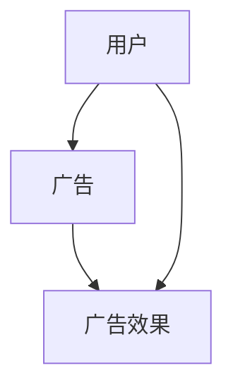
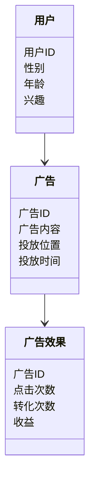
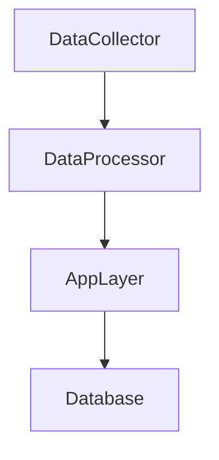
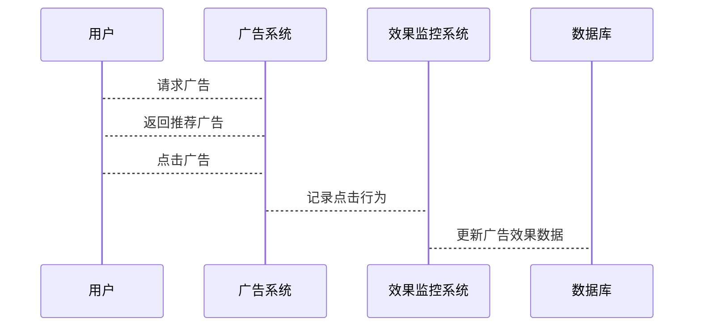

                 


# AI Agent在智能个性化广告投放中的应用

## 关键词：AI Agent，智能广告投放，个性化推荐，广告效果优化，用户画像

## 摘要：  
本文深入探讨了AI Agent在智能个性化广告投放中的应用。通过分析AI Agent的核心概念、算法原理、系统架构及实际案例，详细阐述了如何利用AI技术实现精准广告投放，优化广告效果，并提升用户体验。文章从背景介绍、核心概念、算法实现、系统设计到项目实战，层层深入，为读者提供了全面的技术解读。

---

# 第1章: AI Agent与智能广告投放概述

## 1.1 AI Agent的基本概念

### 1.1.1 AI Agent的定义与特点  
AI Agent（人工智能代理）是指能够感知环境、做出决策并执行任务的智能实体。它具备以下特点：  
1. **自主性**：能够在没有外部干预的情况下独立运行。  
2. **反应性**：能够根据环境变化实时调整行为。  
3. **目标导向**：具有明确的目标，并通过行动实现目标。  
4. **学习能力**：能够通过数据和经验不断优化自身的决策能力。

### 1.1.2 AI Agent的核心功能与应用场景  
AI Agent的核心功能包括数据采集、用户画像、广告推荐、效果监控等。其应用场景广泛，如电子商务、社交媒体、在线教育等领域。

### 1.1.3 AI Agent与传统广告投放的区别  
传统广告投放基于规则和人工经验，而AI Agent通过数据驱动和机器学习实现自动化和智能化，能够实时优化广告策略。

---

## 1.2 智能个性化广告投放的背景

### 1.2.1 数字广告行业的现状与挑战  
随着互联网的快速发展，广告投放的规模和复杂性显著增加，传统广告投放方式已难以满足需求。  
- **数据爆炸**：用户行为数据量大，难以处理。  
- **用户需求多样化**：用户的兴趣和行为差异大，难以精准匹配。  
- **竞争加剧**：广告投放的精准性和效率成为核心竞争力。

### 1.2.2 用户行为分析与个性化需求  
用户的在线行为数据（如点击、浏览、搜索等）反映了其兴趣和需求。通过分析这些数据，可以实现个性化的广告推荐。

### 1.2.3 AI技术在广告投放中的优势  
AI技术能够快速处理大量数据，提取用户特征，并通过机器学习模型优化广告投放策略。

---

## 1.3 AI Agent在广告投放中的应用价值

### 1.3.1 提高广告投放效率  
AI Agent能够自动化处理广告投放的各个环节，减少人工干预，提高效率。

### 1.3.2 实现精准用户匹配  
通过用户画像和行为分析，AI Agent能够精准匹配用户需求与广告内容。

### 1.3.3 优化广告效果与用户体验  
AI Agent能够实时调整广告策略，优化广告效果，同时提升用户体验。

---

## 1.4 本章小结  
本章介绍了AI Agent的基本概念、智能广告投放的背景及其在广告投放中的应用价值，为后续章节奠定了基础。

---

# 第2章: AI Agent的核心概念与联系

## 2.1 AI Agent的感知模块

### 2.1.1 数据采集与处理  
AI Agent通过收集用户行为数据、广告内容数据等，构建数据基础。  
- **用户数据**：包括用户的基本信息、浏览记录、点击行为等。  
- **广告数据**：包括广告内容、投放位置、投放时间等。

### 2.1.2 用户画像与行为分析  
通过分析用户数据，构建用户画像，识别用户的兴趣和需求。  
例如，通过协同过滤算法，计算用户之间的相似度，推荐相似用户的广告内容。

### 2.1.3 广告内容特征提取  
提取广告内容的特征，如关键词、主题、情感倾向等，为广告推荐提供依据。

---

## 2.2 AI Agent的决策模块

### 2.2.1 推荐算法与策略  
AI Agent通过推荐算法（如协同过滤、基于内容的推荐）生成广告推荐列表。  
**协同过滤算法**：基于用户相似度或物品相似度进行推荐。  
**基于内容的推荐**：通过分析广告内容和用户兴趣，进行个性化推荐。

### 2.2.2 广告效果预测模型  
通过机器学习模型预测广告的点击率（CTR）和转化率（CR），优化广告投放策略。  
**CTR预测模型**：使用逻辑回归、随机森林等模型预测用户点击广告的概率。

### 2.2.3 多目标优化与权衡  
在广告投放中，可能存在多个目标（如点击率、转化率、收益等），需要通过多目标优化算法进行权衡。

---

## 2.3 AI Agent的执行模块

### 2.3.1 广告投放策略执行  
根据决策模块生成的策略，执行广告投放操作。  
例如，将推荐的广告内容投放到目标用户所在的平台。

### 2.3.2 实时调整与优化  
根据实时反馈数据（如点击率、转化率等），动态调整广告投放策略。

### 2.3.3 效果反馈与学习  
通过广告效果数据，优化AI Agent的学习模型，提升未来广告投放的精准度。

---

## 2.4 核心概念对比与ER实体关系图

### 2.4.1 AI Agent与传统广告投放的对比  
| 特性 | AI Agent | 传统广告投放 |  
|------|-----------|---------------|  
| 数据驱动 | 是 | 否 |  
| 实时性 | 高 | 低 |  
| 精准度 | 高 | 低 |  

### 2.4.2 用户、广告、效果的ER实体关系图  


---

# 第3章: AI Agent的算法原理与实现

## 3.1 推荐算法与实现

### 3.1.1 协同过滤算法  
协同过滤是一种基于用户相似度的推荐算法。  
**步骤**：  
1. 收集用户行为数据。  
2. 计算用户相似度。  
3. 根据相似用户的喜好推荐广告。  
**代码示例**：  
```python
import numpy as np

# 用户-广告评分矩阵
rating_matrix = np.array([[4,3,2], [5,1,3], [2,4,5]])

# 计算用户相似度（余弦相似度）
def cosine_similarity(A, B):
    return np.dot(A, B.T) / (np.linalg.norm(A) * np.linalg.norm(B))

user_similarity = cosine_similarity(rating_matrix, rating_matrix)
print(user_similarity)
```

### 3.1.2 基于内容的推荐  
基于内容的推荐算法通过分析广告内容和用户兴趣，进行个性化推荐。  
**步骤**：  
1. 提取广告内容的特征向量。  
2. 计算用户兴趣与广告内容的相似度。  
3. 根据相似度推荐广告。  
**代码示例**：  
```python
from sklearn.feature_extraction.text import TfidfVectorizer

# 广告内容
ads = ["ad1: sports event", "ad2: technology conference"]

# 提取特征向量
vectorizer = TfidfVectorizer()
tfidf_matrix = vectorizer.fit_transform(ads)

print(tfidf_matrix)
```

---

## 3.2 广告效果预测模型

### 3.2.1 CTR预测模型  
点击率（CTR）预测是广告效果预测的重要指标。  
**模型选择**：逻辑回归（Logistic Regression）适合用于CTR预测。  
**代码示例**：  
```python
from sklearn.linear_model import LogisticRegression

# 训练数据
X = [[年龄, 性别, 兴趣], ...]
y = [点击标记]

# 训练模型
model = LogisticRegression().fit(X, y)

# 预测CTR
predicted_ctr = model.predict_proba(X)[:, 1]
print(predicted_ctr)
```

### 3.2.2 多目标优化  
在广告投放中，可能存在多个目标（如点击率、转化率、收益等），需要通过多目标优化算法进行权衡。  
**常用方法**：加权损失函数、多目标强化学习等。

---

## 3.3 算法实现与优化

### 3.3.1 算法实现步骤  
1. 数据预处理：清洗、特征提取。  
2. 模型训练：选择合适的算法，训练模型。  
3. 模型优化：调参、评估、部署。  

### 3.3.2 算法优化技巧  
- **数据增强**：增加数据多样性，提升模型泛化能力。  
- **特征工程**：选择和构建有效的特征，提升模型性能。  
- **模型集成**：通过集成学习（如随机森林、梯度提升）提升模型效果。  

---

## 3.4 本章小结  
本章详细介绍了AI Agent在广告投放中的推荐算法和效果预测模型，并通过代码示例展示了算法的实现过程。

---

# 第4章: AI Agent的系统架构与设计

## 4.1 系统功能设计

### 4.1.1 广告投放场景介绍  
广告投放系统需要实现用户画像、广告推荐、投放执行和效果监控等功能。

### 4.1.2 领域模型设计  


---

## 4.2 系统架构设计

### 4.2.1 分层架构设计  
广告投放系统通常采用分层架构：数据采集层、数据处理层、应用层。  


### 4.2.2 接口设计  
系统需要设计广告推荐接口、广告投放接口和效果监控接口。

### 4.2.3 交互流程图  


---

## 4.3 本章小结  
本章从系统功能设计、架构设计和交互流程图等多个方面，详细阐述了AI Agent在广告投放系统中的架构设计。

---

# 第5章: AI Agent的项目实战

## 5.1 项目背景与目标

### 5.1.1 项目背景  
本项目旨在利用AI Agent技术实现智能个性化广告投放，优化广告效果。

### 5.1.2 项目目标  
1. 构建用户画像。  
2. 实现广告推荐算法。  
3. 部署广告投放系统。  
4. 监控广告效果。

---

## 5.2 项目实战

### 5.2.1 环境安装与配置  
- **安装Python**：确保Python 3.x以上版本已安装。  
- **安装库**：`pip install numpy pandas scikit-learn`。

### 5.2.2 核心代码实现  

#### 5.2.2.1 数据预处理  
```python
import pandas as pd

# 加载数据
data = pd.read_csv('advertising.csv')

# 数据清洗
data = data.dropna()
print(data.head())
```

#### 5.2.2.2 用户画像构建  
```python
from sklearn.preprocessing import StandardScaler

# 特征提取
X = data[['年龄', '性别', '兴趣']]
scaler = StandardScaler()
X_scaled = scaler.fit_transform(X)

print(X_scaled)
```

#### 5.2.2.3 广告推荐  
```python
from sklearn.neighbors import NearestNeighbors

# 训练模型
model = NearestNeighbors(n_neighbors=5).fit(X_scaled)

# 推荐广告
user_vector = X_scaled[0].reshape(1, -1)
distances, indices = model.kneighbors(user_vector)

print(indices)
```

#### 5.2.2.4 广告效果评估  
```python
from sklearn.metrics import accuracy_score

# 训练效果评估
y_true = [0, 1, 0, 1]
y_pred = [0, 1, 1, 0]

print(accuracy_score(y_true, y_pred))
```

---

## 5.3 项目总结与经验分享

### 5.3.1 项目总结  
通过本项目，我们实现了基于AI Agent的智能个性化广告投放系统，验证了AI技术在广告投放中的应用价值。

### 5.3.2 经验分享  
- 数据质量是关键，需确保数据的完整性和准确性。  
- 模型调优需要结合实际业务需求，选择合适的算法和参数。  
- 系统部署需要考虑性能优化和可扩展性。

---

## 5.4 本章小结  
本章通过实际项目案例，详细展示了AI Agent在广告投放中的应用，从数据预处理到模型训练，再到系统部署，为读者提供了实践指导。

---

# 第6章: AI Agent的优化与最佳实践

## 6.1 优化策略

### 6.1.1 数据优化  
- **数据清洗**：去除噪声数据，提升模型性能。  
- **特征工程**：选择和构建有效的特征，提高模型的准确性。

### 6.1.2 模型优化  
- **算法选择**：根据业务需求选择合适的算法。  
- **模型调优**：通过网格搜索等方法优化模型参数。

### 6.1.3 系统优化  
- **性能优化**：优化数据处理流程，提升系统运行效率。  
- **可扩展性优化**：设计可扩展的系统架构，支持大规模数据处理。

---

## 6.2 最佳实践

### 6.2.1 数据隐私与安全  
在处理用户数据时，需严格遵守数据隐私法规，保护用户隐私。

### 6.2.2 模型解释性  
选择具有解释性的模型，便于分析和优化。

### 6.2.3 实时反馈机制  
建立实时反馈机制，快速调整广告投放策略。

---

## 6.3 本章小结  
本章总结了AI Agent在广告投放中的优化策略和最佳实践，为读者提供了宝贵的参考。

---

# 第7章: 总结与展望

## 7.1 本书总结  
本文从AI Agent的基本概念出发，详细探讨了其在智能个性化广告投放中的应用，包括算法原理、系统设计和项目实战。

## 7.2 未来展望  
随着AI技术的不断发展，AI Agent在广告投放中的应用将更加广泛和深入，未来可能会出现更智能、更个性化的广告投放方式。

---

# 作者：AI天才研究院/AI Genius Institute & 禅与计算机程序设计艺术 /Zen And The Art of Computer Programming

---

**本文通过详细的技术分析和实际案例，深入探讨了AI Agent在智能个性化广告投放中的应用，为读者提供了全面的技术解读和实践指导。**

