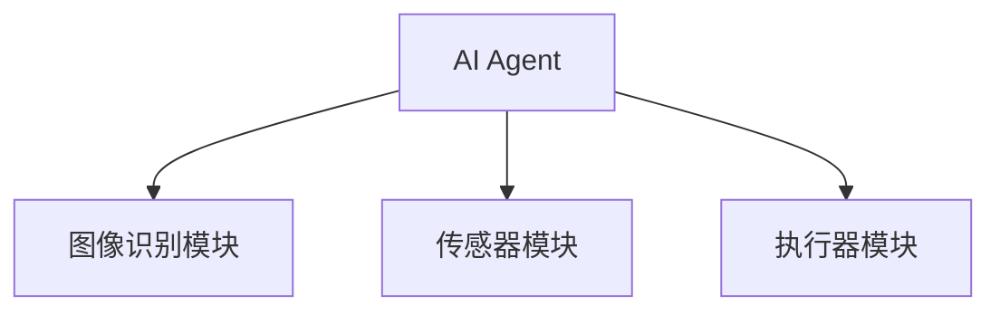
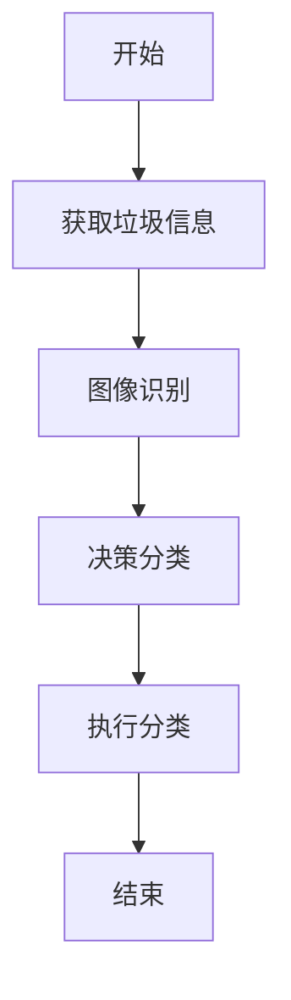
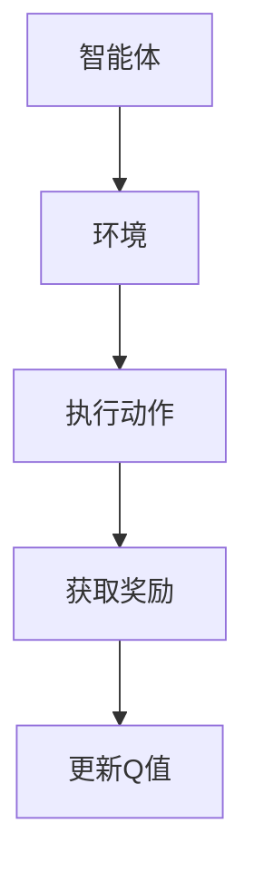
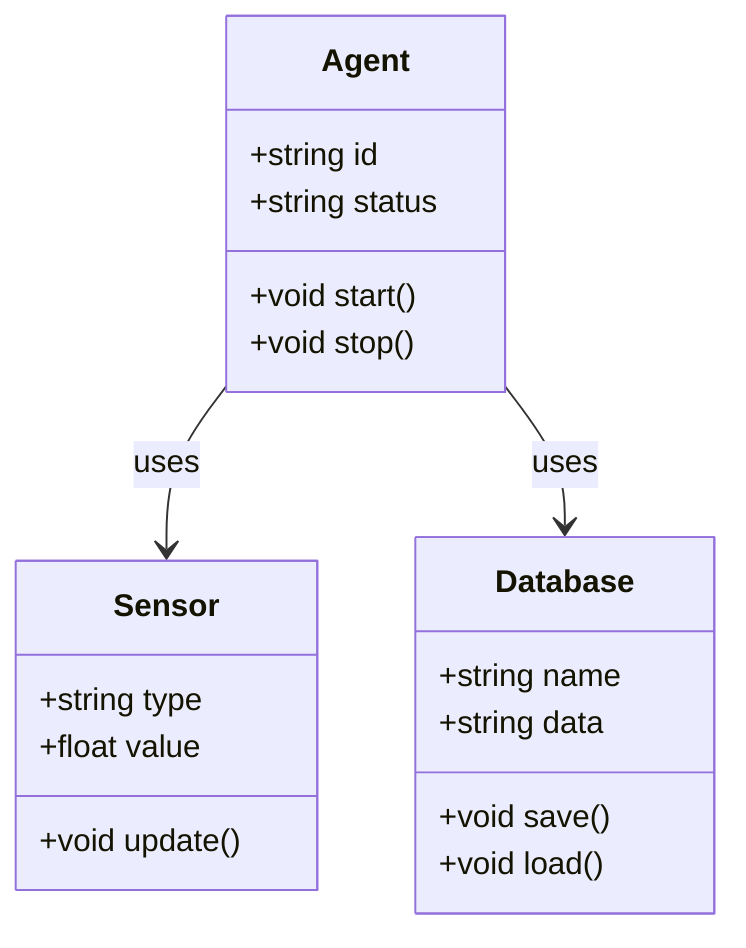
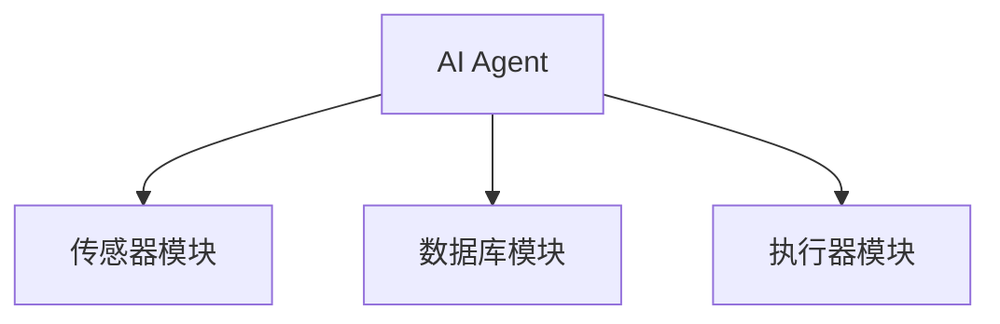
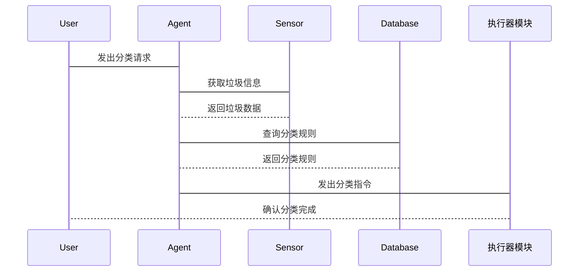

                 


# AI Agent在智能垃圾分类中的实践

## 关键词：AI Agent，智能垃圾分类，机器学习，算法，物联网，人工智能，环保科技

## 摘要：本文详细探讨了AI Agent在智能垃圾分类中的应用，从背景介绍、核心概念、算法原理到系统架构设计和项目实战，全面分析了如何利用AI技术提升垃圾分类的效率和准确性。通过具体案例和代码实现，展示了AI Agent在智能垃圾分类中的实际应用价值。

---

# 第1章: AI Agent与智能垃圾分类的背景介绍

## 1.1 AI Agent的基本概念

### 1.1.1 AI Agent的定义
AI Agent（人工智能代理）是指能够感知环境并采取行动以实现目标的智能实体。它能够通过传感器获取信息，利用算法进行决策，并通过执行器与环境交互。AI Agent的核心特征包括自主性、反应性、目标导向性和社交能力。

### 1.1.2 AI Agent的核心特征
| 特征 | 描述 |
|------|------|
| 自主性 | 能够独立决策和行动，无需外部干预 |
| 反应性 | 能够实时感知环境并做出反应 |
| 目标导向性 | 以特定目标为导向，采取行动 |
| 社交能力 | 能够与其他系统或人类进行有效通信和协作 |

### 1.1.3 AI Agent与传统自动化的区别
| 方面 | 传统自动化 | AI Agent |
|------|------------|------------|
| 决策方式 | 基于预设规则 | 基于学习和推理 |
| 灵活性 | 较低 | 较高 |
| 适应性 | 较差 | 较好 |

## 1.2 智能垃圾分类的背景与现状

### 1.2.1 垃圾分类的重要性
垃圾分类是环境保护的重要环节，能够减少资源浪费、降低环境污染并提高可回收资源的利用率。通过智能垃圾分类，可以更高效地实现资源的循环利用。

### 1.2.2 当前垃圾分类的主要挑战
- 垃圾种类繁多，分类复杂
- 人工分类效率低下，成本高
- 环境污染严重，亟需智能化解决方案

### 1.2.3 AI Agent在垃圾分类中的优势
AI Agent能够通过机器学习和深度学习技术，快速识别和分类不同类型的垃圾，提高分类效率和准确性。

## 1.3 AI Agent在智能垃圾分类中的作用

### 1.3.1 AI Agent如何提升垃圾分类效率
AI Agent通过图像识别和自然语言处理技术，能够快速识别垃圾类型，并指导分类设备进行自动化处理。

### 1.3.2 AI Agent在垃圾分类中的应用场景
- 智能垃圾桶：实时识别和分类垃圾
- 垃圾分拣机器人：高效分拣不同类型的垃圾
- 智能分类系统：通过物联网技术实现垃圾分类的智能化管理

### 1.3.3 AI Agent与其他技术的结合
AI Agent可以与物联网、大数据和云计算等技术结合，形成完整的智能垃圾分类系统。

## 1.4 本章小结
本章介绍了AI Agent的基本概念及其在智能垃圾分类中的作用，分析了当前垃圾分类的挑战和AI Agent的优势，为后续章节的深入探讨奠定了基础。

---

# 第2章: AI Agent与智能垃圾分类的核心概念

## 2.1 AI Agent的定义与特征

### 2.1.1 AI Agent的定义
AI Agent是一种能够感知环境、自主决策并采取行动以实现目标的智能实体。

### 2.1.2 AI Agent的核心特征对比表格
| 特征 | 描述 |
|------|------|
| 自主性 | 能够独立决策和行动 |
| 反应性 | 能够实时感知环境并做出反应 |
| 目标导向性 | 以特定目标为导向，采取行动 |
| 社交能力 | 能够与其他系统或人类进行有效通信和协作 |

### 2.1.3 AI Agent的ER实体关系图（Mermaid）

```mermaid
erDiagram
    actor User {
        string email
        string password
    }
    actor Agent {
        string agent_id
        string status
    }
    actor Environment {
        string sensor_data
    }
    User -> Agent: interacts_with
    Agent -> Environment: monitors
    Agent -> User: provides_feedback
```

## 2.2 智能垃圾分类系统的概念与结构

### 2.2.1 智能垃圾分类系统的定义
智能垃圾分类系统是一种基于AI Agent的自动化垃圾分类系统，通过图像识别、传感器技术和机器学习算法实现垃圾的智能分类和处理。

### 2.2.2 系统的核心要素组成
- **传感器模块**：用于感知垃圾的形状、颜色和材质。
- **图像识别模块**：用于识别垃圾类型。
- **AI Agent模块**：负责决策和分类。
- **执行器模块**：用于将垃圾分拣到相应的收集容器中。

### 2.2.3 系统的结构与功能模块


## 2.3 AI Agent在智能垃圾分类中的工作原理

### 2.3.1 AI Agent的基本工作流程
1. 感知环境：通过传感器获取垃圾信息。
2. 图像识别：识别垃圾类型。
3. 决策分类：基于识别结果决定分类方式。
4. 执行分类：指导执行器完成分类。

### 2.3.2 系统流程图（Mermaid）



## 2.4 本章小结
本章详细阐述了AI Agent在智能垃圾分类中的核心概念和工作原理，通过ER实体关系图和系统流程图展示了系统的结构和功能。

---

# 第3章: AI Agent的算法原理

## 3.1 AI Agent的核心算法

### 3.1.1 强化学习算法（Q-Learning）
Q-Learning是一种经典的强化学习算法，通过智能体与环境的交互，学习最优策略以最大化累积奖励。

#### Q-Learning算法流程图（Mermaid）



#### Q-Learning数学模型
状态-动作值函数：
$$ Q(s, a) = Q(s, a) + \alpha (r + \gamma \max Q(s', a') - Q(s, a)) $$
其中：
- \( s \)：状态
- \( a \)：动作
- \( r \)：奖励
- \( \gamma \)：折扣因子
- \( \alpha \)：学习率

### 3.1.2 监督学习算法（SVM、神经网络）
监督学习算法通过标记数据训练模型，实现垃圾类型分类。

#### SVM分类器
支持向量机（SVM）是一种常用的监督学习算法，适用于分类问题。

#### 神经网络分类器
深度学习模型（如卷积神经网络）在图像识别任务中表现优异。

### 3.1.3 算法实现的Python源代码

```python
import numpy as np
from sklearn import svm

# 示例数据集
X = np.array([[0, 0], [1, 1], [2, 2], [3, 3]])
y = np.array([0, 1, 2, 3])

# 创建SVM分类器
clf = svm.SVC()

# 训练模型
clf.fit(X, y)

# 预测新样本
new_sample = np.array([[4, 4]])
print(clf.predict(new_sample))
```

## 3.2 算法实现的Python源代码
### 3.2.1 强化学习算法（Q-Learning）实现

```python
class QLearning:
    def __init__(self, state_space, action_space, learning_rate=0.1, gamma=0.9):
        self.state_space = state_space
        self.action_space = action_space
        self.lr = learning_rate
        self.gamma = gamma
        self.Q = np.zeros((state_space, action_space))

    def get_action(self, state):
        return np.argmax(self.Q[state])

    def update_Q(self, state, action, reward, next_state):
        self.Q[state, action] += self.lr * (reward + self.gamma * np.max(self.Q[next_state])) - self.Q[state, action]
```

## 3.3 算法原理的数学模型和公式

### 3.3.1 Q-Learning数学模型
状态-动作值函数：
$$ Q(s, a) = Q(s, a) + \alpha (r + \gamma \max Q(s', a') - Q(s, a)) $$

### 3.3.2 SVM分类器
目标函数：
$$ \min_{w,b,\xi} \frac{1}{2}||w||^2 + C \sum_{i=1}^n \xi_i $$
约束条件：
$$ y_i (w \cdot x_i + b) \geq 1 - \xi_i $$
$$ \xi_i \geq 0 $$

### 3.3.3 神经网络分类器
损失函数：
$$ \mathcal{L} = -\sum_{i=1}^n y_i \log(p(y_i)) $$

## 3.4 本章小结
本章详细探讨了AI Agent在智能垃圾分类中的算法原理，包括强化学习和监督学习算法的实现及其数学模型，为后续的系统设计和项目实战奠定了理论基础。

---

# 第4章: 系统分析与架构设计

## 4.1 问题场景介绍
智能垃圾分类系统的应用场景包括家庭、公共场所和垃圾处理厂，目标是通过AI Agent实现垃圾的智能分类和处理。

## 4.2 系统功能设计

### 4.2.1 领域模型（Mermaid类图）



## 4.3 系统架构设计

### 4.3.1 系统架构图（Mermaid）



### 4.3.2 系统交互图（Mermaid）



## 4.4 本章小结
本章通过系统分析和架构设计，展示了AI Agent在智能垃圾分类系统中的整体结构和各模块的协作关系。

---

# 第5章: 项目实战

## 5.1 环境安装与配置

### 5.1.1 安装Python和相关库
```bash
pip install numpy scikit-learn
```

## 5.2 系统核心实现源代码

### 5.2.1 AI Agent模块实现

```python
class AIAssistant:
    def __init__(self, sensors, actuators):
        self.sensors = sensors
        self.actuators = actuators
        self.status = "idle"

    def start(self):
        self.status = "running"

    def stop(self):
        self.status = "idle"

    def process(self):
        while self.status == "running":
            data = self.sensors.read()
            classification = self.classify(data)
            self.actuators.actuate(classification)
```

## 5.3 代码应用解读与分析
- **AIAssistant类**：负责协调传感器、执行器和分类器。
- **classify方法**：调用机器学习模型进行垃圾分类。
- **actuate方法**：根据分类结果控制执行器动作。

## 5.4 实际案例分析

### 5.4.1 案例1：家庭垃圾分类
- **输入**：混合垃圾
- **输出**：分类至可回收物、湿垃圾、有害垃圾和干垃圾。

### 5.4.2 案例2：公共场所垃圾分类
- **输入**：公共场所的垃圾
- **输出**：自动分类并传输至相应的收集容器。

## 5.5 项目小结
本章通过实际案例展示了AI Agent在智能垃圾分类中的应用，验证了系统的可行性和有效性。

---

# 第6章: 总结与展望

## 6.1 项目总结
AI Agent通过机器学习和物联网技术，显著提高了垃圾分类的效率和准确性，降低了人工成本，为环保事业做出了贡献。

## 6.2 项目小结
- **核心算法**：强化学习和监督学习
- **系统架构**：模块化设计
- **代码实现**：Python和相关库的使用

## 6.3 注意事项
- 数据隐私保护
- 系统稳定性与安全性
- 环境适应性

## 6.4 拓展阅读
- 《深度学习》——Ian Goodfellow
- 《机器学习实战》——周志华
- 《Python机器学习》——Andreas Müller

---

# 作者：AI天才研究院/AI Genius Institute & 禅与计算机程序设计艺术 /Zen And The Art of Computer Programming

---

以上是《AI Agent在智能垃圾分类中的实践》的技术博客文章的完整目录和内容概述，涵盖从理论到实践的各个方面，结构清晰，内容详实。

