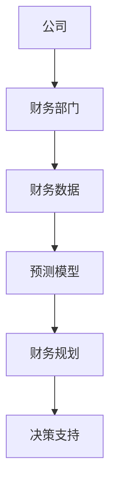
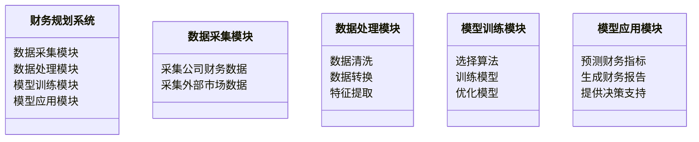
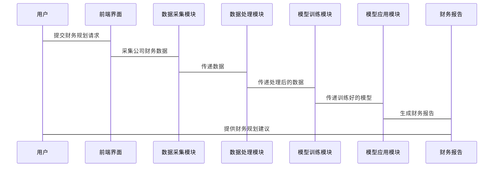

                 


# AI驱动的公司财务规划工具

> 关键词：AI驱动、财务规划、机器学习、自然语言处理、系统架构

> 摘要：本文深入探讨了AI驱动的公司财务规划工具的原理、架构和实现方法。通过结合财务规划的核心概念与人工智能技术，本文详细分析了如何利用机器学习和自然语言处理等技术构建高效的财务规划系统。文章从背景介绍、核心概念、算法原理、系统架构到项目实战，全面解读了AI在财务规划中的应用，并提供了详细的代码实现和实际案例分析。

---

# 第一部分: 背景与概念

# 第1章: 公司财务规划概述

## 1.1 财务规划的基本概念

### 1.1.1 财务规划的定义

财务规划是指通过分析公司当前的财务状况、预测未来的财务趋势，并制定相应的财务目标和策略，以优化公司的资金使用效率、降低成本、提高利润的过程。财务规划通常包括预算制定、资金分配、风险评估等核心内容。

$$\text{财务规划的核心目标是实现公司财务资源的最优配置。}$$

### 1.1.2 财务规划的核心目标

- **优化资金使用效率**：通过科学的预测和分配，确保公司资金的高效利用。
- **降低财务风险**：通过预测和分析，提前识别潜在的财务风险，并制定应对策略。
- **提高盈利能力**：通过合理的财务规划，最大化公司的利润。

### 1.1.3 财务规划的实施步骤

1. **数据收集与整理**：收集公司历史财务数据、市场数据等。
2. **目标设定**：根据公司战略目标，设定财务规划的具体目标。
3. **模型构建**：选择合适的财务模型，进行预测和分析。
4. **方案制定**：根据模型结果，制定具体的财务规划方案。
5. **方案实施与监控**：执行财务规划方案，并持续监控和调整。

## 1.2 AI技术的基本概念

### 1.2.1 人工智能的定义

人工智能（Artificial Intelligence，AI）是指通过计算机模拟人类的智能行为，包括学习、推理、决策等能力。AI的核心目标是帮助人类完成复杂的任务，并通过数据驱动的方式不断优化自身的性能。

### 1.2.2 机器学习的核心原理

机器学习（Machine Learning，ML）是AI的重要组成部分，是一种通过数据训练模型，并利用模型进行预测和决策的技术。机器学习的核心在于模型的训练过程，通过大量的数据，模型能够学习到数据中的规律，并利用这些规律进行预测。

### 1.2.3 自然语言处理的简介

自然语言处理（Natural Language Processing，NLP）是AI的另一个重要分支，主要研究如何让计算机理解和处理人类语言。NLP在财务规划中的应用包括文本挖掘、情感分析等，能够帮助公司从非结构化数据中提取有价值的信息。

## 1.3 AI驱动的财务规划工具

### 1.3.1 AI在财务规划中的应用

AI技术在财务规划中的应用主要体现在以下几个方面：

- **数据处理与分析**：利用AI技术快速处理大量财务数据，并提取关键信息。
- **预测模型构建**：通过机器学习算法，构建财务预测模型，帮助公司进行精准的财务预测。
- **智能决策支持**：基于AI的分析结果，为公司提供智能化的财务决策支持。

### 1.3.2 财务规划工具的演变

传统的财务规划工具主要依赖人工操作，效率较低且容易出错。随着AI技术的发展，财务规划工具逐渐智能化，能够通过自动化的方式完成数据处理、预测和决策支持。

### 1.3.3 AI驱动工具的优势

- **高效性**：AI能够快速处理大量数据，提高财务规划的效率。
- **准确性**：通过机器学习模型，AI能够提高财务预测的准确性。
- **智能化**：AI能够根据实时数据动态调整财务规划方案。

## 1.4 本章小结

本章主要介绍了财务规划的基本概念、AI技术的核心原理，以及AI驱动的财务规划工具的优势。通过结合AI技术，财务规划工具能够实现高效、准确、智能化的财务管理和决策支持。

---

# 第二部分: 核心概念与联系

# 第2章: AI与财务规划的核心概念

## 2.1 AI在财务规划中的核心概念

### 2.1.1 数据驱动的财务分析

数据驱动的财务分析是指通过大量的财务数据，利用AI技术进行分析和预测。数据驱动的分析能够帮助公司发现潜在的财务问题，并制定相应的解决方案。

### 2.1.2 自动化预测模型

自动化预测模型是指通过机器学习算法，自动构建和优化财务预测模型。自动化预测模型的核心在于通过数据驱动的方式，提高预测的准确性和效率。

### 2.1.3 智能决策支持系统

智能决策支持系统是指通过AI技术，为公司提供智能化的财务决策支持。系统能够根据实时数据和历史数据，为公司提供个性化的财务决策建议。

## 2.2 财务规划与AI的结合

### 2.2.1 数据的采集与处理

数据的采集与处理是AI驱动的财务规划工具的核心步骤。通过采集公司历史财务数据、市场数据等，利用AI技术对数据进行清洗、转换和特征提取，为后续的预测和分析提供高质量的数据支持。

### 2.2.2 模型的构建与训练

模型的构建与训练是AI驱动的财务规划工具的关键步骤。通过选择合适的机器学习算法，构建财务预测模型，并通过大量的数据进行训练，优化模型的性能。

### 2.2.3 模型的部署与应用

模型的部署与应用是指将训练好的AI模型应用到实际的财务规划中，通过模型进行实时预测和决策支持，帮助公司实现高效的财务管理和决策。

## 2.3 AI与财务规划的核心要素

### 2.3.1 数据采集与处理

数据采集与处理是AI驱动的财务规划工具的基石。通过采集公司内外部的财务数据，利用AI技术对数据进行清洗、转换和特征提取，为后续的预测和分析提供高质量的数据支持。

### 2.3.2 模型构建与优化

模型构建与优化是AI驱动的财务规划工具的核心步骤。通过选择合适的机器学习算法，构建财务预测模型，并通过数据训练优化模型的性能，提高预测的准确性和效率。

### 2.3.3 系统集成与应用

系统集成与应用是指将训练好的AI模型集成到公司的财务管理系统中，通过系统化的流程和界面，为公司提供智能化的财务规划和决策支持。

## 2.4 AI与财务规划的实体关系图



---

# 第三部分: 算法原理讲解

# 第3章: AI驱动的财务规划算法

## 3.1 机器学习算法的核心原理

### 3.1.1 线性回归模型

线性回归模型是一种常用的回归算法，适用于预测连续型变量。线性回归模型的数学公式如下：

$$ y = \beta_0 + \beta_1 x + \epsilon $$

其中，$y$ 是目标变量，$x$ 是自变量，$\beta_0$ 和 $\beta_1$ 是回归系数，$\epsilon$ 是误差项。

### 3.1.2 决策树算法

决策树是一种基于树状结构的分类和回归算法。决策树的核心在于通过特征分裂，构建一棵树，使得每个节点代表一个特征，每个分支代表一个决策，叶子节点代表最终的预测结果。

### 3.1.3 支持向量机

支持向量机（Support Vector Machine，SVM）是一种监督学习算法，适用于分类和回归问题。SVM的核心在于通过构建超平面，将数据点分开，使得不同类别的数据点尽可能远离超平面。

## 3.2 自然语言处理算法

### 3.2.1 词嵌入技术

词嵌入技术是一种将词语转化为低维向量的技术，常用的词嵌入算法包括Word2Vec、GloVe等。词嵌入的核心在于通过上下文信息，捕捉词语的语义特征。

### 3.2.2 文本分类

文本分类是将文本按照类别进行分类的技术，常用的文本分类算法包括朴素贝叶斯、支持向量机、随机森林等。文本分类的核心在于通过特征提取和模型训练，实现对文本的自动分类。

---

# 第四部分: 系统分析与架构设计

# 第4章: 系统分析与架构设计

## 4.1 系统功能设计

### 4.1.1 领域模型



### 4.1.2 系统架构


## 4.2 系统接口设计

### 4.2.1 数据接口

数据接口是系统与外部数据源之间的接口，主要用于数据的采集和交换。数据接口的设计需要考虑数据格式、数据频率、数据安全性等因素。

### 4.2.2 模型接口

模型接口是系统与AI模型之间的接口，主要用于模型的调用和结果的获取。模型接口的设计需要考虑模型的输入输出格式、模型的调用方式、模型的性能指标等因素。

## 4.3 系统交互流程



---

# 第五部分: 项目实战

# 第5章: 项目实战

## 5.1 环境安装与配置

### 5.1.1 安装Python环境

```bash
python --version
pip install --upgrade pip
```

### 5.1.2 安装必要的库

```bash
pip install numpy pandas scikit-learn matplotlib
```

## 5.2 系统核心实现

### 5.2.1 数据采集模块

```python
import pandas as pd
import numpy as np

# 采集公司财务数据
def load_financial_data():
    data = pd.read_csv('financial_data.csv')
    return data
```

### 5.2.2 数据处理模块

```python
import pandas as pd
import numpy as np

# 数据清洗
def data_cleaning(data):
    data.dropna(inplace=True)
    return data
```

### 5.2.3 模型训练模块

```python
from sklearn.linear_model import LinearRegression
from sklearn.metrics import mean_squared_error

# 训练线性回归模型
def train_model(X, y):
    model = LinearRegression()
    model.fit(X, y)
    return model
```

### 5.2.4 模型应用模块

```python
import matplotlib.pyplot as plt

# 预测财务指标
def predict_financial_indicators(model, X_test):
    y_pred = model.predict(X_test)
    return y_pred
```

## 5.3 案例分析与解读

### 5.3.1 案例分析

假设我们有一个公司的财务数据，包括收入、成本、利润等指标。我们可以通过AI驱动的财务规划工具，预测未来的财务状况，并制定相应的财务规划方案。

### 5.3.2 代码实现

```python
import pandas as pd
import numpy as np
from sklearn.linear_model import LinearRegression
from sklearn.metrics import mean_squared_error

# 加载数据
data = pd.read_csv('financial_data.csv')

# 数据清洗
data.dropna(inplace=True)

# 分割数据
X = data[['收入', '成本']]
y = data['利润']

# 训练模型
model = LinearRegression()
model.fit(X, y)

# 预测结果
X_test = [[100000, 50000]]
y_pred = model.predict(X_test)

# 输出结果
print(f'预测利润：{y_pred[0]:.2f}')
```

### 5.3.3 案例分析与解读

通过上述代码，我们可以看到，AI驱动的财务规划工具能够根据公司的收入和成本数据，预测未来的利润。这种预测结果可以帮助公司制定更加科学的财务规划方案，优化资金使用效率，降低财务风险。

## 5.4 项目总结

通过本项目的实践，我们可以看到，AI驱动的财务规划工具能够显著提高财务规划的效率和准确性。通过结合机器学习算法和自然语言处理技术，公司可以实现智能化的财务管理和决策支持。

---

# 第六部分: 总结与展望

# 第6章: 总结与展望

## 6.1 最佳实践 tips

- **数据质量**：确保数据的准确性和完整性，是AI驱动的财务规划工具的核心。
- **模型选择**：根据具体的财务问题，选择合适的机器学习算法，能够提高预测的准确性。
- **系统集成**：将AI模型集成到公司现有的财务管理系统中，能够实现高效的财务管理和决策支持。

## 6.2 本章小结

本章总结了AI驱动的财务规划工具的核心概念、算法原理和系统架构，并通过具体的项目实战，展示了AI在财务规划中的应用。通过本章的学习，读者能够掌握AI驱动的财务规划工具的实现方法，并能够将其应用到实际的财务管理中。

## 6.3 注意事项

- **数据隐私**：在处理财务数据时，需要注意数据的隐私和安全问题。
- **模型解释性**：在实际应用中，模型的解释性也是一个重要的问题，需要确保模型的预测结果能够被理解和解释。
- **持续优化**：AI模型的性能需要通过持续的优化和更新，以适应不断变化的市场环境。

## 6.4 拓展阅读

- **《机器学习实战》**：深入讲解机器学习算法的实现和应用。
- **《自然语言处理入门》**：详细介绍了自然语言处理技术的核心原理和应用。
- **《数据驱动的财务分析》**：结合数据驱动的方法，深入分析财务管理的核心问题。

---

# 作者：AI天才研究院/AI Genius Institute & 禅与计算机程序设计艺术/Zen And The Art of Computer Programming

