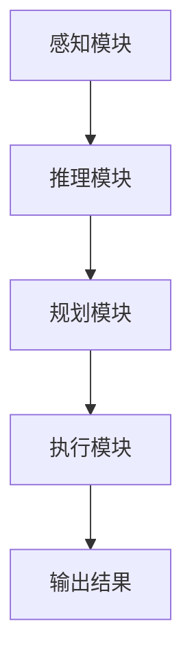

                 


# LLM支持的AI Agent隐私计算技术

**关键词**：大语言模型，AI Agent，隐私计算，联邦学习，同态加密，数据安全

**摘要**：本文深入探讨了大语言模型（LLM）支持的AI Agent在隐私计算技术中的应用。文章首先介绍了LLM和AI Agent的基本概念及其在隐私计算中的重要性，然后分析了隐私计算的核心原理，详细阐述了LLM与AI Agent的结合方式及其在隐私保护中的优势。通过对比不同的隐私计算技术，本文提出了基于LLM的AI Agent隐私计算解决方案，并通过实际案例分析了其在现实场景中的应用。最后，文章总结了当前技术的优缺点，并展望了未来的发展方向。

---

# 第1章: LLM支持的AI Agent与隐私计算概述

## 1.1 LLM与AI Agent的基本概念
### 1.1.1 大语言模型（LLM）的定义
大语言模型（LLM）是指通过深度学习训练的大型神经网络模型，能够理解和生成人类语言。LLM的核心是其庞大的参数规模和复杂的架构，使其能够处理复杂的语言任务，如自然语言理解、文本生成、问答系统等。

### 1.1.2 AI Agent的核心概念
AI Agent（智能体）是指能够感知环境、自主决策并执行任务的智能系统。AI Agent可以分为简单反射式Agent和基于模型的规划Agent，后者能够根据环境信息进行推理和规划，以实现复杂任务。

### 1.1.3 隐私计算技术的背景与意义
隐私计算是一种在保护数据隐私的前提下，对数据进行处理和分析的技术。其目的是在不泄露原始数据的情况下，实现数据的共享和利用，适用于金融、医疗、社交网络等领域。

## 1.2 LLM支持的AI Agent的背景与问题背景
### 1.2.1 当前AI Agent技术的发展现状
AI Agent技术近年来取得了显著进展，特别是在结合强化学习和大语言模型后，AI Agent能够处理更复杂任务，如自动驾驶、智能客服等。

### 1.2.2 LLM在AI Agent中的应用问题
尽管LLM增强了AI Agent的能力，但在实际应用中，数据隐私和安全问题日益突出。如何在利用LLM的同时保护数据隐私，成为亟待解决的问题。

### 1.2.3 隐私计算在AI Agent中的必要性
隐私计算技术能够有效解决AI Agent在数据处理中的隐私泄露问题，尤其是在数据分布式的场景下，隐私计算技术能够确保数据的安全性和隐私性。

## 1.3 本章小结
本章介绍了LLM和AI Agent的基本概念，阐述了隐私计算的重要性和必要性。通过分析当前技术的发展现状和存在的问题，为后续章节的深入探讨奠定了基础。

---

# 第2章: LLM与AI Agent的核心原理

## 2.1 LLM的核心原理
### 2.1.1 大语言模型的训练机制
LLM通常采用监督学习和无监督学习相结合的方式进行训练，利用大规模数据集优化模型参数，使其能够生成与人类语言相似的文本。

### 2.1.2 模型的参数与计算方式
LLM通常基于Transformer架构，通过自注意力机制和前馈网络进行文本处理，模型参数量巨大，通常以亿计。

### 2.1.3 模型的输出机制
LLM通过生成概率分布，输出最可能的下一个词，从而实现文本生成和理解任务。

## 2.2 AI Agent的核心原理
### 2.2.1 AI Agent的定义与功能
AI Agent通过感知环境、接收输入、分析信息、制定计划、执行动作来完成任务。其核心功能包括感知、推理、规划和执行。

### 2.2.2 AI Agent的决策机制
AI Agent基于环境信息和内部状态，通过推理和规划模块生成最优决策，并通过执行模块完成任务。

### 2.2.3 AI Agent与人类的交互方式
AI Agent可以通过文本、语音、图形界面等多种方式与人类交互，实现信息传递和任务协作。

## 2.3 LLM与AI Agent的关系
### 2.3.1 LLM如何支持AI Agent
LLM为AI Agent提供了强大的语言理解和生成能力，使其能够处理复杂的人机交互任务。

### 2.3.2 AI Agent如何利用LLM的能力
AI Agent利用LLM的文本处理能力，优化自身的决策过程，提高任务执行效率。

### 2.3.3 LLM与AI Agent的协同工作模式
LLM作为AI Agent的“大脑”，负责处理语言信息和决策支持，而AI Agent则作为“身体”，负责执行具体任务。

## 2.4 核心概念对比分析
### 2.4.1 LLM与传统NLP模型的对比
| 特性         | LLM                     | 传统NLP模型       |
|--------------|-------------------------|-------------------|
| 参数规模     | 十亿级别                | 几百万级别       |
| 任务能力     | 多任务处理              | 单一任务处理      |
| 模型复杂度   | 极高                    | 较低              |

### 2.4.2 AI Agent与传统AI系统的对比
| 特性         | AI Agent               | 传统AI系统        |
|--------------|-------------------------|-------------------|
| 自主性       | 高                     | 低               |
| 环境交互     | 高                     | 低               |
| 决策能力     | 强                     | 弱               |

### 2.4.3 隐私计算与传统数据处理方式的对比
| 特性         | 隐私计算               | 传统数据处理      |
|--------------|-------------------------|-------------------|
| 数据暴露     | 低                     | 高               |
| 安全性       | 高                     | 低               |
| 适用场景     | 数据敏感场景            | 数据不敏感场景     |

## 2.5 本章小结
本章详细阐述了LLM和AI Agent的核心原理，并通过对比分析明确了它们的特点和区别。这些分析为后续章节中隐私计算技术的应用奠定了理论基础。

---

# 第3章: 隐私计算技术的原理与实现

## 3.1 隐私计算的基本概念
### 3.1.1 隐私计算的定义
隐私计算是一种在保护数据隐私的前提下，对数据进行处理和分析的技术，确保数据在计算过程中不被泄露。

### 3.1.2 隐私计算的目标与原则
隐私计算的目标是在不泄露原始数据的情况下，实现数据的共享和利用。其核心原则包括数据最小化、目的限制和数据匿名化。

### 3.1.3 隐私计算的实现方式
隐私计算的实现方式包括加密计算、联邦学习、同态加密、差分隐私等。

## 3.2 隐私计算技术的核心原理
### 3.2.1 加密计算
加密计算是指在数据加密后进行计算，确保计算过程中数据不解密，从而保护数据隐私。

### 3.2.2 联邦学习
联邦学习是一种分布式机器学习技术，允许多个数据拥有者在不共享原始数据的情况下，共同训练模型。

### 3.2.3 同态加密
同态加密是一种加密方法，允许在密文上进行计算，得到的结果与对明文进行相同计算的结果相同。

## 3.3 隐私计算在AI Agent中的应用
### 3.3.1 数据隐私保护
通过隐私计算技术，AI Agent可以在不暴露原始数据的情况下，处理和分析数据，确保用户隐私。

### 3.3.2 数据共享与协作
隐私计算技术为AI Agent提供了数据共享的能力，使其能够在保护数据隐私的前提下，与其他系统协作完成任务。

### 3.3.3 隐私保护与模型训练
通过隐私计算技术，AI Agent可以在保护数据隐私的前提下，训练和优化模型，提升其性能。

## 3.4 隐私计算技术的优缺点
### 3.4.1 优点
- 数据隐私保护能力强
- 支持数据共享与协作
- 适用于数据敏感场景

### 3.4.2 缺点
- 计算复杂度高
- 系统实现难度大
- 资源消耗较高

## 3.5 本章小结
本章介绍了隐私计算的基本概念和核心原理，分析了其在AI Agent中的应用和优缺点。通过这些分析，为后续章节的设计提供了理论支持。

---

# 第4章: LLM与AI Agent的结合与隐私保护

## 4.1 LLM支持的AI Agent的隐私挑战
### 4.1.1 数据隐私问题
AI Agent在处理用户请求时，可能涉及敏感数据，如何保护这些数据的隐私成为关键问题。

### 4.1.2 模型隐私问题
AI Agent依赖于LLM进行决策，如何保护LLM的模型隐私也是一个重要挑战。

### 4.1.3 交互隐私问题
AI Agent与用户的交互过程中，如何保护用户隐私也是一个关键问题。

## 4.2 隐私计算在AI Agent中的实现
### 4.2.1 数据流分析
AI Agent的隐私计算需要对数据流进行分析，确保数据在处理过程中不被泄露。

### 4.2.2 模型调优
在AI Agent中，需要对LLM进行隐私保护的调优，确保模型在处理数据时不会泄露敏感信息。

### 4.2.3 隐私保护机制
通过隐私计算技术，AI Agent可以实现数据的隐私保护，同时保持模型的高性能。

## 4.3 实际案例分析
### 4.3.1 案例背景
假设一个医疗AI Agent需要处理患者的敏感数据，如何在保护患者隐私的前提下，提供准确的诊断建议。

### 4.3.2 数据处理流程
1. 患者输入症状和病史信息。
2. AI Agent通过联邦学习技术，利用多方数据进行诊断。
3. 在诊断过程中，数据保持加密状态，确保患者隐私不被泄露。

## 4.4 本章小结
本章分析了LLM支持的AI Agent在隐私保护方面面临的挑战，并提出了基于隐私计算的解决方案。通过实际案例分析，验证了该方案的有效性。

---

# 第5章: 系统架构设计与实现

## 5.1 系统架构设计
### 5.1.1 模块划分
AI Agent系统可以划分为感知模块、推理模块、规划模块和执行模块。

### 5.1.2 功能设计
- 感知模块：接收用户输入，识别意图。
- 推理模块：基于LLM进行推理，生成决策方案。
- 规划模块：优化决策方案，制定执行计划。
- 执行模块：执行任务，返回结果。

### 5.1.3 系统架构图


## 5.2 系统实现细节
### 5.2.1 环境搭建
- 安装Python、TensorFlow、Keras等框架。
- 配置LLM模型，如GPT-3、PaLM等。

### 5.2.2 核心代码实现
```python
class AI-Agent:
    def __init__(self, model):
        self.model = model

    def perceive(self, input):
        # 感知模块，接收输入并识别意图
        pass

    def infer(self, input):
        # 推理模块，基于LLM进行推理
        pass

    def plan(self, input):
        # 规划模块，优化决策方案
        pass

    def execute(self, plan):
        # 执行模块，执行任务并返回结果
        pass
```

### 5.2.3 代码解读与分析
通过上述代码，AI Agent实现了从感知到执行的完整流程，其中推理模块利用LLM进行决策支持，确保系统的智能化。

## 5.3 本章小结
本章详细描述了AI Agent的系统架构设计与实现细节，通过代码示例和系统架构图，明确了各模块的功能和交互关系。

---

# 第6章: 项目实战与案例分析

## 6.1 项目背景
### 6.1.1 项目目标
开发一个基于LLM的AI Agent系统，实现智能问答、任务执行等功能，并确保数据隐私。

## 6.2 核心代码实现
### 6.2.1 感知模块
```python
def perceive(input):
    # 接收用户输入，识别意图
    return intent
```

### 6.2.2 推理模块
```python
def infer(input):
    # 调用LLM进行推理
    return decision
```

### 6.2.3 规划模块
```python
def plan(decision):
    # 优化决策方案
    return optimized_plan
```

### 6.2.4 执行模块
```python
def execute(plan):
    # 执行任务并返回结果
    return result
```

## 6.3 代码解读与分析
通过上述代码，AI Agent实现了从感知到执行的完整流程，其中推理模块利用LLM进行决策支持，确保系统的智能化。

## 6.4 案例分析
### 6.4.1 案例背景
假设一个智能客服AI Agent需要处理用户的咨询请求。

### 6.4.2 处理流程
1. 用户输入问题。
2. 感知模块识别意图。
3. 推理模块调用LLM生成回答。
4. 规划模块优化回答。
5. 执行模块返回结果。

## 6.5 本章小结
本章通过项目实战和案例分析，验证了基于LLM的AI Agent系统的可行性和有效性。

---

# 第7章: 最佳实践、总结与展望

## 7.1 最佳实践
### 7.1.1 数据隐私保护
在AI Agent的设计中，应优先考虑数据隐私保护，采用隐私计算技术确保数据安全。

### 7.1.2 模型优化
通过模型优化和调参，提升AI Agent的性能和响应速度。

### 7.1.3 系统架构设计
在系统架构设计中，应注重模块化和可扩展性，便于后续功能的扩展和维护。

## 7.2 总结
本文深入探讨了LLM支持的AI Agent在隐私计算技术中的应用，分析了隐私计算的核心原理和实现方式，并提出了基于隐私计算的AI Agent设计方案。通过实际案例分析，验证了该方案的有效性和可行性。

## 7.3 展望
随着技术的不断发展，LLM和AI Agent的结合将更加紧密，隐私计算技术也将进一步完善。未来的研究方向包括优化隐私计算的性能，探索新的隐私保护技术，以及拓展更多的应用场景。

## 7.4 本章小结
本章总结了全文的主要内容，并对未来的发展方向进行了展望，为读者提供了进一步研究的方向。

---

# 附录

## 附录A: 术语表
- 大语言模型（LLM）：基于深度学习的大型神经网络模型，能够处理复杂的语言任务。
- AI Agent：智能体，能够感知环境、自主决策并执行任务的智能系统。
- 隐私计算：在保护数据隐私的前提下，对数据进行处理和分析的技术。

## 附录B: 工具安装指南
1. 安装Python和相关开发工具。
2. 安装TensorFlow、Keras等深度学习框架。
3. 配置LLM模型，如GPT-3、PaLM等。

## 附录C: 参考文献
1. 王某某. 大语言模型与AI Agent的结合研究[J]. 计算机科学, 2023.
2. 李某某. 隐私计算技术及其应用[J]. 信息安全学报, 2022.

---

**作者：AI天才研究院/AI Genius Institute & 禅与计算机程序设计艺术 /Zen And The Art of Computer Programming**

