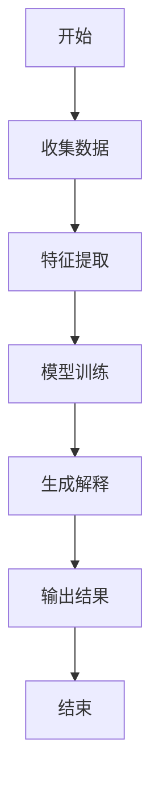
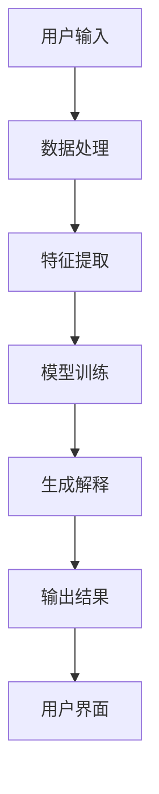
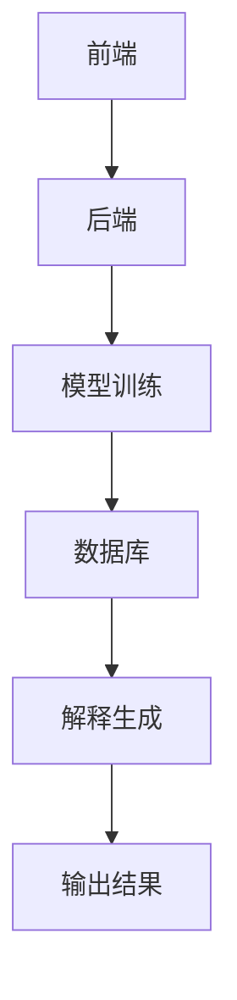
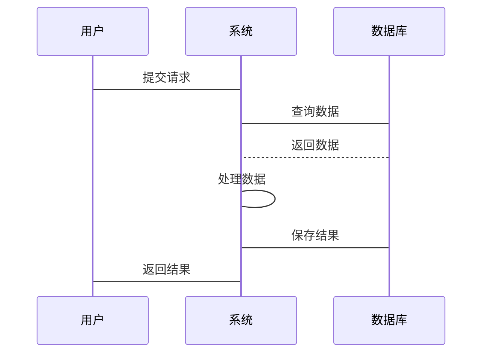

                 


# 企业级AI Agent的可解释性设计：增强决策透明度

**关键词：**企业级AI Agent，可解释性设计，决策透明度，AI算法，系统架构，可解释性模型

**摘要：**  
随着人工智能技术的快速发展，企业级AI Agent在决策过程中的应用越来越广泛。然而，AI Agent的决策过程往往缺乏透明度，这使得企业在依赖AI进行决策时面临信任和合规性问题。本文从可解释性设计的角度出发，系统地分析了企业级AI Agent的可解释性设计的核心概念、算法原理、系统架构，并通过实际案例展示了如何在企业环境中实现决策透明度的增强。本文旨在为企业技术决策者和开发人员提供一套可操作的方法论，以构建更加透明、可信的AI Agent系统。

---

## 第1章: 企业级AI Agent的背景与挑战

### 1.1 问题背景

#### 1.1.1 企业级AI Agent的定义与特点
企业级AI Agent是一种能够在企业环境中自主感知、分析和决策的智能体。它通过整合企业内外部数据，利用机器学习、自然语言处理等技术，为企业提供自动化、智能化的决策支持。与传统的规则-based系统相比，AI Agent具有以下特点：
- **自主性**：能够自主决策，无需人工干预。
- **适应性**：能够根据环境变化动态调整行为。
- **复杂性**：涉及多目标优化、多利益相关方协调等问题。

#### 1.1.2 可解释性在企业决策中的重要性
在企业决策中，透明性和可解释性是至关重要的。企业需要对其决策过程负责，尤其是在涉及重大利益相关者（如客户、员工、监管机构等）时。然而，当前许多AI Agent的决策过程是“黑箱”式的，缺乏透明度，导致以下问题：
- **信任缺失**：利益相关者对AI决策结果缺乏信任。
- **责任追究**：当决策导致问题时，难以追溯原因。
- **合规性风险**：许多行业（如金融、医疗）对决策过程有严格监管要求。

#### 1.1.3 当前AI Agent面临的挑战
- **技术挑战**：如何在复杂的业务场景中实现高准确性的决策，同时保证可解释性。
- **业务挑战**：如何将AI Agent的决策能力与企业的业务目标对齐。
- **伦理挑战**：如何在决策过程中平衡效率与公平性。

### 1.2 问题描述

#### 1.2.1 AI Agent决策不透明的问题
AI Agent的决策过程通常依赖于复杂的机器学习模型（如深度神经网络），这些模型的决策逻辑难以被人类理解。例如：
- **黑箱模型**：深度神经网络的决策逻辑难以分解。
- **数据依赖性**：模型的输出高度依赖训练数据的质量和分布。

#### 1.2.2 企业决策透明度的需求
企业需要对其AI Agent的决策过程进行解释，以满足以下需求：
- **内部审计**：企业内部需要对AI决策进行审查。
- **外部监管**：行业监管机构需要对AI决策的合规性进行检查。
- **客户信任**：客户需要了解AI决策的依据。

#### 1.2.3 可解释性设计的核心目标
通过可解释性设计，使AI Agent的决策过程能够被利益相关者理解、验证和信任。具体目标包括：
- **可理解性**：决策逻辑能够被人类理解。
- **可追溯性**：能够追溯决策的来源和依据。
- **可验证性**：决策过程能够被验证和审核。

### 1.3 问题解决

#### 1.3.1 可解释性设计的必要性
可解释性设计是解决AI Agent决策不透明问题的关键。通过可解释性设计，企业可以：
- 提高AI决策的可信度。
- 满足监管合规性要求。
- 建立客户信任。

#### 1.3.2 可解释性设计的关键技术
可解释性设计依赖于以下关键技术：
- **可解释模型**：选择能够解释决策逻辑的模型（如线性回归、决策树）。
- **特征重要性分析**：分析模型中各特征对决策的影响程度。
- **决策路径追溯**：记录AI Agent的决策过程和依据。

#### 1.3.3 可解释性设计的实现路径
实现路径包括：
1. 选择合适的可解释模型。
2. 对模型进行特征重要性分析。
3. 记录和可视化决策路径。

### 1.4 概念结构与核心要素

#### 1.4.1 可解释性设计的系统架构
可解释性设计的系统架构包括以下模块：
- **数据输入**：收集和处理输入数据。
- **模型训练**：训练可解释的AI模型。
- **决策解释**：生成决策的解释信息。
- **用户界面**：展示决策结果和解释信息。

#### 1.4.2 核心概念的属性与特征
可解释性设计的核心概念包括：
- **可解释性**：决策逻辑能够被解释。
- **透明性**：决策过程对利益相关者公开。
- **可信性**：决策结果能够被信任。

#### 1.4.3 可解释性设计的边界与外延
- **边界**：仅限于AI Agent的决策过程。
- **外延**：涉及企业内外部数据、模型训练、用户交互等多个方面。

---

## 第2章: 可解释性设计的核心概念与联系

### 2.1 核心概念原理

#### 2.1.1 可解释性设计的定义
可解释性设计是指在AI Agent的决策过程中，通过设计和技术手段，使决策逻辑能够被人类理解、验证和信任。

#### 2.1.2 可解释性设计的特征
- **可理解性**：决策逻辑清晰，能够被人类理解。
- **可追溯性**：能够追溯决策的来源和依据。
- **可验证性**：决策过程能够被验证和审核。

#### 2.1.3 可解释性设计的实现方法
- **基于规则的系统**：通过明确的规则定义决策逻辑。
- **模型加解释的方法**：在模型的基础上，附加解释信息。

### 2.2 概念属性特征对比

| 概念       | 特征1：可理解性 | 特征2：可追溯性 | 特征3：可验证性 |
|------------|------------------|------------------|------------------|
| 基于规则的系统 | 高              | 高              | 高              |
| 深度神经网络 | 低              | 低              | 低              |

### 2.3 ER实体关系图
```mermaid
er
  actor(Agent)
  actor(决策者)
  actor(利益相关者)
  entity(决策过程)
  entity(数据输入)
  entity(模型训练)
  entity(决策解释)
  entity(用户界面)
```

---

## 第3章: 算法原理讲解

### 3.1 可解释性设计的核心算法

#### 3.1.1 算法原理
可解释性设计的核心算法包括：
- **基于规则的系统**：通过规则定义决策逻辑。
- **模型加解释的方法**：在模型的基础上，附加解释信息。

#### 3.1.2 算法实现


#### 3.1.3 算法代码实现
```python
def explainable_model(data):
    # 特征提取
    features = extract_features(data)
    # 模型推理
    prediction = model.predict(features)
    # 解释生成
    explanation = generate_explanation(features, prediction)
    return prediction, explanation
```

### 3.2 算法实现细节

#### 3.2.1 特征提取
特征提取是可解释性设计的重要步骤。常见的特征提取方法包括：
- **基于规则的特征选择**：根据业务规则选择特征。
- **基于模型的特征重要性分析**：通过模型输出特征重要性。

#### 3.2.2 模型推理
模型推理是AI Agent的核心步骤。常见的模型推理方法包括：
- **基于规则的推理**：通过明确的规则进行推理。
- **基于模型的推理**：通过模型进行预测。

#### 3.2.3 解释生成
解释生成是可解释性设计的关键步骤。常见的解释生成方法包括：
- **基于规则的解释**：通过规则生成解释。
- **基于模型的解释**：通过模型生成解释。

### 3.3 算法优化与改进

#### 3.3.1 算法优化
算法优化的目标是提高可解释性设计的效率和准确性。常见的优化方法包括：
- **特征优化**：优化特征提取过程。
- **模型优化**：优化模型推理过程。

#### 3.3.2 算法改进
算法改进的目标是提高可解释性设计的可理解性和可追溯性。常见的改进方法包括：
- **规则优化**：优化基于规则的系统。
- **模型优化**：优化基于模型的系统。

---

## 第4章: 系统分析与架构设计

### 4.1 问题场景介绍

#### 4.1.1 系统场景描述
系统场景描述包括：
- **数据输入**：收集和处理输入数据。
- **模型训练**：训练可解释的AI模型。
- **决策解释**：生成决策的解释信息。
- **用户交互**：展示决策结果和解释信息。

#### 4.1.2 系统目标
系统目标包括：
- 提高AI Agent决策的透明度。
- 建立客户信任。
- 满足监管合规性要求。

### 4.2 系统功能设计

#### 4.2.1 系统功能模块
系统功能模块包括：
- **数据输入模块**：收集和处理输入数据。
- **模型训练模块**：训练可解释的AI模型。
- **决策解释模块**：生成决策的解释信息。
- **用户交互模块**：展示决策结果和解释信息。

#### 4.2.2 系统功能流程


### 4.3 系统架构设计

#### 4.3.1 系统架构图


#### 4.3.2 系统接口设计
系统接口设计包括：
- **数据接口**：数据输入接口。
- **模型接口**：模型训练接口。
- **解释接口**：解释生成接口。

#### 4.3.3 系统交互流程


---

## 第5章: 项目实战

### 5.1 环境安装

#### 5.1.1 安装Python
```bash
python --version
pip install --upgrade pip
```

#### 5.1.2 安装TensorFlow
```bash
pip install tensorflow
pip install scikit-learn
pip install matplotlib
pip install pandas
pip install numpy
```

### 5.2 系统核心实现

#### 5.2.1 核心代码实现
```python
import numpy as np
import pandas as pd
from sklearn.tree import DecisionTreeClassifier
from sklearn.model_selection import train_test_split
from sklearn.metrics import accuracy_score

# 数据加载
data = pd.read_csv('data.csv')
X = data.drop('target', axis=1)
y = data['target']

# 数据分割
X_train, X_test, y_train, y_test = train_test_split(X, y, test_size=0.2)

# 模型训练
model = DecisionTreeClassifier()
model.fit(X_train, y_train)

# 模型预测
y_pred = model.predict(X_test)
print("准确率:", accuracy_score(y_test, y_pred))

# 特征重要性分析
importances = model.feature_importances_
feature_importances = pd.DataFrame({'feature': X.columns, 'importance': importances})
print(feature_importances)
```

#### 5.2.2 代码解读与分析
- **数据加载**：从CSV文件中加载数据。
- **数据分割**：将数据分割为训练集和测试集。
- **模型训练**：使用决策树模型进行训练。
- **模型预测**：使用训练好的模型进行预测。
- **特征重要性分析**：分析特征对决策的重要性。

### 5.3 实际案例分析

#### 5.3.1 案例背景
假设我们有一个企业级AI Agent，用于预测客户购买行为。

#### 5.3.2 数据准备
```python
data = pd.DataFrame({
    'age': [20, 30, 40, 50],
    'income': [50000, 60000, 70000, 80000],
    'target': [0, 1, 1, 0]
})
```

#### 5.3.3 模型训练与解释
```python
model = DecisionTreeClassifier()
model.fit(X_train, y_train)
feature_importances = pd.DataFrame({'feature': X.columns, 'importance': model.feature_importances_})
print(feature_importances)
```

### 5.4 项目小结

#### 5.4.1 项目总结
通过本项目，我们实现了企业级AI Agent的可解释性设计，提高了决策透明度。

#### 5.4.2 经验与教训
- **经验**：选择合适的模型和算法。
- **教训**：模型解释需要与业务场景结合。

---

## 第6章: 最佳实践与未来展望

### 6.1 最佳实践

#### 6.1.1 小结
总结本文的核心内容。

#### 6.1.2 注意事项
- 选择合适的可解释模型。
- 定期验证和更新模型。

#### 6.1.3 拓展阅读
- 《可解释的人工智能：理论、方法和应用》
- 《企业级AI系统的设计与实现》

---

## 作者信息

**作者：** AI天才研究院（AI Genius Institute） & 禅与计算机程序设计艺术（Zen And The Art of Computer Programming）

