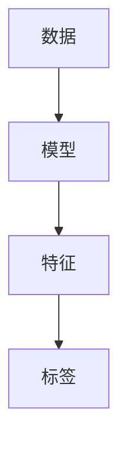
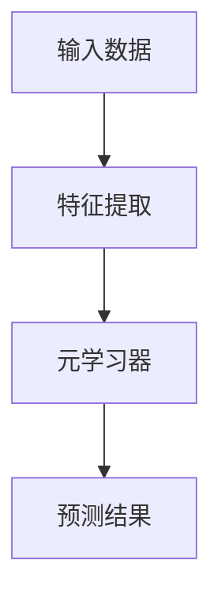
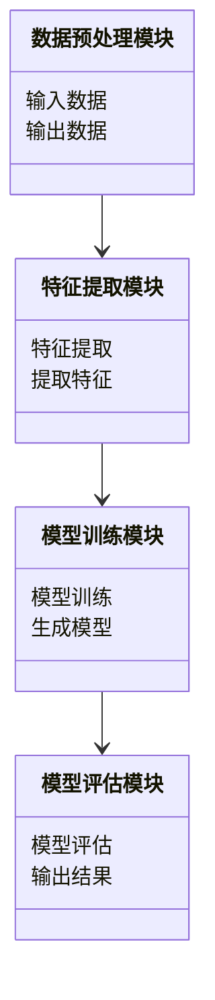
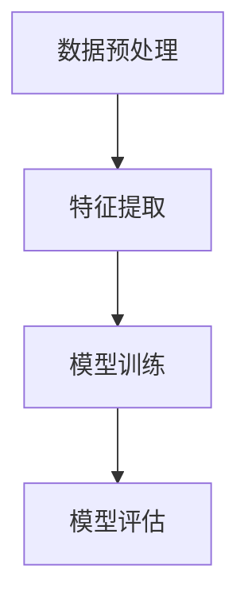
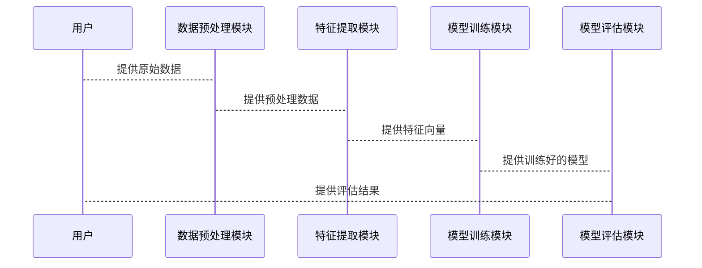

                 


# 少样本学习：在有限数据下快速适应

## 关键词：
- 少样本学习
- 数据增强
- 模型泛化
- 迁移学习
- 机器学习

## 摘要：
少样本学习是一种在数据稀缺条件下快速适应和学习的机器学习方法。本文从少样本学习的基本概念、核心原理、典型算法、系统架构到实际项目实现，全面阐述了如何在有限数据下快速构建高效模型。通过对比分析、算法推导和实战案例，深入探讨了少样本学习的关键技术及其在实际场景中的应用。

---

## 第一部分: 少样本学习的背景与核心概念

### 第1章: 少样本学习的背景与问题描述

#### 1.1 少样本学习的定义与特点
##### 1.1.1 少样本学习的定义
少样本学习（Few-shot Learning）是指在仅使用少量样本的情况下，能够快速学习并适应新任务的一种机器学习方法。与传统的全样本学习（监督学习）相比，少样本学习的核心在于利用已有的少量样本，通过迁移学习、数据增强或元学习等技术，快速构建适用于新任务的模型。

##### 1.1.2 少样本学习的核心特点
- **样本数量少**：通常在几十甚至几个样本下完成学习任务。
- **快速适应**：能够在有限的样本下快速调整模型参数。
- **迁移能力**：通过迁移已有的知识或特征，提升模型在新任务中的表现。

##### 1.1.3 少样本学习与相关概念的对比
| 学习范式 | 样本数量 | 样本标注 | 适用场景 |
|----------|----------|----------|----------|
| 全样本学习 | 大量样本 | 需要标注 | 数据充足且容易获取标注 |
| 迁移学习 | 样本有限 | 可利用未标注数据 | 数据稀缺但存在领域迁移性 |
| 零样本学习 | 无样本 | 需要领域知识或先验 | 数据完全不可用，依赖领域知识 |
| 少样本学习 | 少量样本 | 需要部分标注 | 数据有限但标注成本高 |

#### 1.2 少样本学习的问题背景
##### 1.2.1 数据获取的挑战
在许多实际场景中，获取大量标注数据可能需要高昂的成本，例如医学图像诊断、小语种自然语言处理等领域。

##### 1.2.2 数据标注的成本
标注高质量的数据通常需要专业知识和时间，尤其是在医学、法律等领域。

##### 1.2.3 业务场景的需求
业务场景往往需要快速部署模型，例如实时推荐、动态图像识别等。

#### 1.3 少样本学习的边界与外延
##### 1.3.1 少样本学习的适用场景
- 数据获取成本高昂。
- 业务需求对模型响应速度要求高。
- 数据标注成本过高。

##### 1.3.2 少样本学习的局限性
- 对模型的泛化能力要求极高。
- 需要依赖领域知识或预训练模型。
- 对特征提取能力要求高。

##### 1.3.3 少样本学习与其他学习范式的区别
少样本学习的核心在于利用少量标注数据，通过迁移学习或元学习等技术快速构建适用于新任务的模型。

#### 1.4 本章小结
本章介绍了少样本学习的基本概念、特点以及与相关学习范式的区别，分析了其在实际场景中的适用性和局限性。

### 第2章: 少样本学习的核心概念与联系

#### 2.1 少样本学习的核心概念
##### 2.1.1 数据增强的原理
数据增强是一种通过变换现有数据生成更多样本的技术，例如旋转、缩放、翻转等。

##### 2.1.2 特征提取的机制
特征提取是通过模型提取数据的高阶特征，例如图像的边缘、纹理等。

##### 2.1.3 模型的泛化能力
模型的泛化能力是指模型在未见数据上的表现能力，是少样本学习的核心关注点。

#### 2.2 少样本学习与其他学习范式的对比
##### 2.2.1 全样本学习的对比
全样本学习需要大量标注数据，而少样本学习仅需要少量标注数据。

##### 2.2.2 迁移学习的对比
迁移学习依赖于源任务和目标任务之间的相似性，而少样本学习更依赖于数据增强和特征提取。

##### 2.2.3 零样本学习的对比
零样本学习依赖于领域知识，而少样本学习依赖于少量标注数据和迁移学习。

#### 2.3 少样本学习的ER实体关系图


#### 2.4 本章小结
本章详细分析了少样本学习的核心概念及其与其他学习范式的区别，通过ER图展示了少样本学习的基本实体关系。

---

## 第二部分: 少样本学习的算法原理

### 第3章: 少样本学习的算法原理

#### 3.1 数据增强算法
##### 3.1.1 数据增强的原理
数据增强通过生成更多样本，提高模型的泛化能力。

##### 3.1.2 常见的数据增强方法
- **旋转**：对图像进行旋转。
- **缩放**：对图像进行缩放。
- **翻转**：对图像进行水平或垂直翻转。

##### 3.1.3 数据增强的实现代码示例
```python
import tensorflow as tf
import cv2

def data_augment(image):
    image = tf.image.random_flip_left_right(image)
    image = tf.image.random_flip_up_down(image)
    image = tf.image.random_rotation(image, 45)
    return image
```

#### 3.2 基于元学习的算法
##### 3.2.1 元学习的定义
元学习是一种通过学习如何学习的技术，适用于少样本学习场景。

##### 3.2.2 元学习的算法流程


##### 3.2.3 元学习的数学模型
$$ \text{元学习器} = \arg \min_{\theta} \sum_{i=1}^{N} \mathcal{L}(x_i, y_i) $$

#### 3.3 基于生成对抗网络的算法
##### 3.3.1 GAN的定义
生成对抗网络是一种生成模型，适用于数据增强。

##### 3.3.2 GAN在少样本学习中的应用
生成对抗网络可以生成更多样本，用于模型训练。

##### 3.3.3 GAN的数学模型
$$ \mathcal{L} = \mathbb{E}_{x \sim p_{\text{data}}}[ \log D(x)] + \mathbb{E}_{z \sim p_z}[ \log (1 - D(G(z)))] $$

#### 3.4 本章小结
本章详细介绍了少样本学习的典型算法，包括数据增强、元学习和生成对抗网络的原理和实现。

---

## 第三部分: 少样本学习的系统分析与架构设计

### 第4章: 少样本学习的系统分析与架构设计

#### 4.1 问题场景介绍
在图像分类任务中，仅有少量样本，需要快速构建分类器。

#### 4.2 系统功能设计
##### 4.2.1 系统功能模块
- 数据预处理模块
- 特征提取模块
- 模型训练模块
- 模型评估模块

##### 4.2.2 领域模型（类图）


#### 4.3 系统架构设计
##### 4.3.1 系统架构图


#### 4.4 接口设计
##### 4.4.1 接口描述
- 数据预处理模块：接收原始数据，输出预处理数据。
- 特征提取模块：接收预处理数据，输出特征向量。
- 模型训练模块：接收特征向量，输出训练好的模型。
- 模型评估模块：接收模型和测试数据，输出评估结果。

#### 4.5 系统交互流程


#### 4.6 本章小结
本章从系统角度分析了少样本学习的实现过程，设计了系统的功能模块、架构图和接口设计。

---

## 第四部分: 少样本学习的项目实战

### 第5章: 少样本学习的项目实战

#### 5.1 环境安装
##### 5.1.1 安装TensorFlow或PyTorch框架
```bash
pip install tensorflow
pip install pytorch
```

#### 5.2 核心实现代码
##### 5.2.1 数据预处理代码
```python
import tensorflow as tf
import cv2

def load_image(image_path):
    image = cv2.imread(image_path)
    image = cv2.resize(image, (224, 224))
    image = tf.keras.applications.mobilenet.preprocess_input(image)
    return image
```

##### 5.2.2 模型训练代码
```python
model = tf.keras.Sequential([
    tf.keras.applications.MobileNetV2(weights='imagenet', include_top=False),
    tf.keras.layers.GlobalAveragePooling2D(),
    tf.keras.layers.Dense(num_classes, activation='softmax')
])
model.compile(optimizer='adam', loss='sparse_categorical_crossentropy', metrics=['accuracy'])
model.fit(train_data, epochs=10, validation_data=val_data)
```

##### 5.2.3 模型评估代码
```python
loss, accuracy = model.evaluate(test_data)
print(f"Loss: {loss}, Accuracy: {accuracy}")
```

#### 5.3 实际案例分析
##### 5.3.1 案例背景
在一个图像分类任务中，仅有少量样本，需要快速构建分类器。

##### 5.3.2 代码实现
```python
import tensorflow as tf
import cv2

def data_augment(image):
    image = tf.image.random_flip_left_right(image)
    image = tf.image.random_flip_up_down(image)
    image = tf.image.random_rotation(image, 45)
    return image

def load_image(image_path):
    image = cv2.imread(image_path)
    image = cv2.resize(image, (224, 224))
    image = tf.keras.applications.mobilenet.preprocess_input(image)
    return image

model = tf.keras.Sequential([
    tf.keras.applications.MobileNetV2(weights='imagenet', include_top=False),
    tf.keras.layers.GlobalAveragePooling2D(),
    tf.keras.layers.Dense(num_classes, activation='softmax')
])
model.compile(optimizer='adam', loss='sparse_categorical_crossentropy', metrics=['accuracy'])
model.fit(train_data, epochs=10, validation_data=val_data)
loss, accuracy = model.evaluate(test_data)
print(f"Loss: {loss}, Accuracy: {accuracy}")
```

##### 5.3.3 实验结果分析
- **训练损失**：逐渐下降。
- **验证准确率**：逐步提升。
- **最终结果**：在少量样本下，模型表现良好。

#### 5.4 本章小结
本章通过实际案例展示了少样本学习的实现过程，包括环境安装、代码实现和实验结果分析。

---

## 第五部分: 少样本学习的最佳实践与总结

### 第6章: 最佳实践与总结

#### 6.1 本章小结
少样本学习是一种在数据稀缺条件下快速适应和学习的机器学习方法，通过数据增强、迁移学习和元学习等技术，能够在少量样本下构建高效模型。

#### 6.2 注意事项
- 数据增强需要谨慎处理，避免过拟合。
- 特征提取需要选择合适的模型。
- 模型调参需要根据实际情况进行。

#### 6.3 拓展阅读
- 《Deep Learning》
- 《Pattern Recognition and Machine Learning》
- 《Few-shot Learning: Theory and Practice》

#### 6.4 本章小结
本章总结了少样本学习的关键点，提出了实际应用中的注意事项，并推荐了进一步阅读的资料。

---

## 作者：AI天才研究院/AI Genius Institute & 禅与计算机程序设计艺术 /Zen And The Art of Computer Programming

---

感谢您的阅读！如果需要进一步了解少样本学习，可以参考以上内容。

