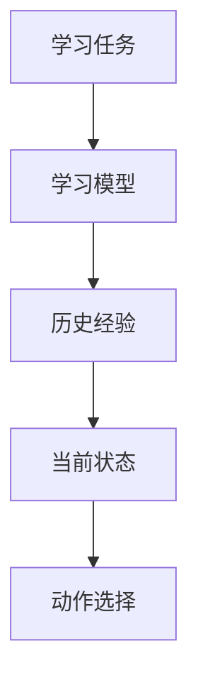
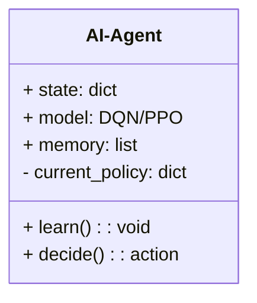
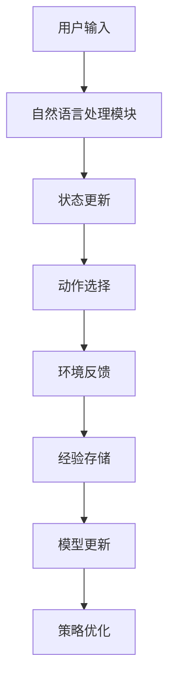
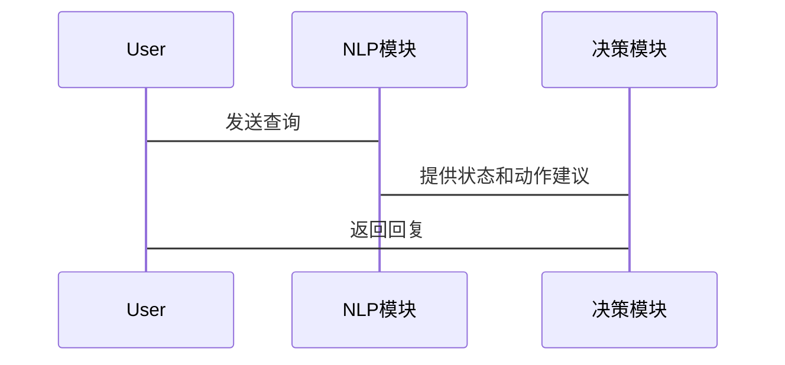

                 


# 开发具有持续学习能力的AI Agent

> 关键词：持续学习AI Agent、机器学习、深度强化学习、DQN算法、PPO算法、系统架构设计、AI应用开发

> 摘要：本文将深入探讨如何开发具有持续学习能力的AI Agent。首先介绍持续学习AI Agent的背景、核心概念及其应用场景；接着分析持续学习的核心原理，包括经验重放机制、策略梯度方法等；然后详细讲解基于DQN和PPO的持续学习算法及其数学模型；进一步探讨AI Agent的系统架构设计，包括功能模块设计、架构图和接口设计；最后通过项目实战和最佳实践，提供开发持续学习AI Agent的实用指南。

---

# 第一部分: 开发具有持续学习能力的AI Agent概述

# 第1章: 持续学习AI Agent的背景与概念

## 1.1 问题背景与需求分析

### 1.1.1 传统AI Agent的局限性

传统AI Agent通常依赖于预训练的数据集，一旦部署后，难以适应新环境或新任务的变化。例如，在自动驾驶系统中，如果遇到未见过的交通规则或道路标识，传统的AI Agent可能无法有效应对，导致系统失效或出现错误。

### 1.1.2 持续学习的必要性

为了使AI Agent能够适应不断变化的环境，持续学习成为必要。通过持续学习，AI Agent可以在新任务中快速调整其模型参数，提高其在复杂场景中的适应性和灵活性。

### 1.1.3 持续学习AI Agent的核心目标

持续学习AI Agent的核心目标是通过与环境的交互，不断优化自身的决策能力和学习能力，以应对多样化和动态变化的任务场景。

---

## 1.2 持续学习AI Agent的定义与特点

### 1.2.1 持续学习的定义

持续学习是指AI Agent在动态环境中，通过与环境的持续交互，逐步优化自身的模型参数，以实现对新任务的快速适应。

### 1.2.2 AI Agent的核心特点

- **自主性**：AI Agent能够在没有外部干预的情况下，自主决策和学习。
- **反应性**：AI Agent能够根据环境反馈实时调整其行为。
- **持续性**：AI Agent能够通过不断学习，逐步提高其性能。

### 1.2.3 持续学习与传统机器学习的区别

| **特性**       | **持续学习**               | **传统机器学习**           |
|----------------|---------------------------|---------------------------|
| 数据来源       | 动态环境中的实时数据       | 静态数据集                 |
| 模型更新频率   | 高频更新                   | 低频更新                   |
| 适应性         | 高                          | 低                          |

---

## 1.3 持续学习AI Agent的应用场景

### 1.3.1 在自动驾驶中的应用

自动驾驶系统需要实时感知环境并做出决策，持续学习AI Agent能够帮助车辆快速适应不同的道路条件和交通规则。

### 1.3.2 在自然语言处理中的应用

自然语言处理任务（如机器翻译）需要不断适应新的语言数据和上下文信息，持续学习AI Agent能够提高模型的泛化能力。

### 1.3.3 在游戏AI中的应用

游戏AI需要在复杂的游戏环境中不断学习和优化策略，持续学习AI Agent能够帮助AI在多人在线游戏中做出更智能的决策。

---

## 1.4 本章小结

本章介绍了持续学习AI Agent的背景、定义和特点，并通过应用场景的分析，展示了持续学习AI Agent的重要性和广泛的应用潜力。

---

# 第二部分: 持续学习的核心概念与原理

# 第2章: 持续学习的核心概念

## 2.1 持续学习的基本原理

### 2.1.1 经验重放机制

经验重放机制是持续学习中的关键方法之一。通过存储历史经验（状态、动作、奖励）并随机采样，AI Agent可以更好地探索状态空间，避免陷入局部最优。

### 2.1.2 策略梯度方法

策略梯度方法通过优化策略函数，直接从状态空间到动作空间的映射中学习最优策略。这种方法能够避免传统Q-learning中值函数估计的困难。

### 2.1.3 知识蒸馏技术

知识蒸馏技术通过将复杂模型的知识迁移到简单模型中，提升简单模型的性能。这在持续学习中特别有用，可以帮助AI Agent快速适应新任务。

---

## 2.2 持续学习的关键属性对比

### 2.2.1 学习效率对比表

| **方法**       | **学习效率** | **优点**               | **缺点**               |
|----------------|--------------|-----------------------|-----------------------|
| 经验重放         | 高            | 能够探索更多状态空间   | 需要存储大量经验数据   |
| 策略梯度         | 中            | 直接优化策略函数       | 需要处理高维状态空间   |
| 知识蒸馏         | 高            | 降低计算复杂度         | 依赖于教师模型的质量   |

### 2.2.2 稳定性对比表

| **方法**       | **稳定性** | **适用场景**       |
|----------------|------------|-------------------|
| 经验重放         | 高          | 动态环境           |
| 策略梯度         | 中          | 静态环境           |
| 知识蒸馏         | 高          | 多任务学习         |

---

## 2.3 持续学习的ER实体关系图



---

# 第三部分: 持续学习的算法原理

# 第3章: 基于DQN的持续学习算法

## 3.1 DQN算法概述

### 3.1.1 DQN的基本原理

DQN（Deep Q-Network）是一种基于深度强化学习的算法，通过神经网络近似Q值函数，实现从状态到动作的映射。

### 3.1.2 DQN的核心组件

- **经验回放缓冲区**：存储历史经验（状态、动作、奖励、下一状态）。
- **神经网络模型**：用于近似Q值函数。
- **目标网络**：用于稳定值函数的更新。

### 3.1.3 DQN的数学模型

$$ Q(s,a) = r + \gamma \max_{a'} Q(s',a') $$

---

## 3.2 DQN算法的实现

### 3.2.1 环境与动作空间定义

假设我们开发一个简单的游戏AI，环境为一个二维网格，动作空间包括上下左右移动。

### 3.2.2 神经网络结构设计

```python
import torch
import torch.nn as nn

class DQN(nn.Module):
    def __init__(self, state_dim, action_dim):
        super(DQN, self).__init__()
        self.fc1 = nn.Linear(state_dim, 64)
        self.fc2 = nn.Linear(64, 64)
        self.fc3 = nn.Linear(64, action_dim)
        
    def forward(self, x):
        x = torch.relu(self.fc1(x))
        x = torch.relu(self.fc2(x))
        x = self.fc3(x)
        return x
```

### 3.2.3 动作选择与经验回放

```python
def select_action(model, state, epsilon):
    if random.random() < epsilon:
        return random.randint(0, action_dim-1)
    else:
        with torch.no_grad():
            return model.forward(state).argmax().item()
```

---

## 3.3 DQN算法的优化

### 3.3.1 目标网络的引入

通过引入目标网络，可以稳定值函数的更新，避免主网络更新过快导致的不稳定。

### 3.3.2 惩罚项的添加

在动作选择中引入惩罚项，防止AI Agent选择过于冒险的动作。

### 3.3.3 经验回放机制的改进

通过优先级经验回放，优先采样那些具有较大优势值的经验，提高学习效率。

---

# 第4章: 基于PPO的持续学习算法

## 4.1 PPO算法概述

### 4.1.1 PPO的原理

PPO（Proximal Policy Optimization）是一种基于策略梯度的算法，通过优化策略函数，确保每次更新后的策略与原策略足够接近。

### 4.1.2 PPO的核心组件

- **优势函数**：衡量动作的优劣。
- **概率比**：衡量新策略与旧策略的差异。
- **KL散度**：衡量策略变化的大小。

---

## 4.2 PPO算法的实现

### 4.2.1 动作选择

```python
def select_action(model, state):
    with torch.no_grad():
        action_probs = model.forward(state)
        action = torch.multinomial(action_probs, 1).item()
        return action
```

### 4.2.2 优势函数计算

$$ A(s,a) = r + \gamma V(s') - Q(s,a) $$

---

## 4.3 PPO算法的优化

### 4.3.1 KL散度约束

通过约束KL散度，确保策略更新的稳定性。

### 4.3.2 惩罚项的添加

在目标函数中引入惩罚项，确保策略更新的幅度在可控范围内。

### 4.3.3 多轮优化

通过多轮优化，逐步调整策略，确保策略的稳定性和最优性。

---

# 第四部分: 持续学习AI Agent的系统架构设计

# 第5章: 系统分析与架构设计方案

## 5.1 问题场景介绍

假设我们开发一个智能助手AI Agent，需要在用户与AI Agent的交互过程中，持续优化其对话理解和生成能力。

---

## 5.2 系统功能设计

### 5.2.1 领域模型设计



---

## 5.3 系统架构设计



---

## 5.4 系统接口设计

### 5.4.1 输入接口

- **文本输入**：接收用户的自然语言输入。
- **状态更新**：更新AI Agent的当前状态。

### 5.4.2 输出接口

- **文本输出**：生成对话回复。
- **动作执行**：根据决策结果执行相应动作。

---

## 5.5 系统交互流程图



---

# 第五部分: 持续学习AI Agent的项目实战

# 第6章: 项目实战与案例分析

## 6.1 环境安装

安装必要的Python库：

```bash
pip install torch numpy gym
```

---

## 6.2 系统核心实现

### 6.2.1 核心代码实现

```python
import gym
import torch
import torch.nn as nn
import torch.optim as optim

class AI-Agent:
    def __init__(self, state_dim, action_dim):
        self.model = DQN(state_dim, action_dim)
        self.memory = []
        self.optimizer = optim.Adam(self.model.parameters(), lr=0.001)
        
    def remember(self, state, action, reward, next_state):
        self.memory.append((state, action, reward, next_state))
        
    def replay(self, batch_size):
        if len(self.memory) < batch_size:
            return
        batch = random.sample(self.memory, batch_size)
        states = torch.stack([x[0] for x in batch])
        actions = torch.tensor([x[1] for x in batch])
        rewards = torch.tensor([x[2] for x in batch])
        next_states = torch.stack([x[3] for x in batch])
        
        current_q = self.model(states).gather(1, actions.unsqueeze(1))
        next_q = self.model(next_states).max(1)[0].detach()
        target = rewards + gamma * next_q
        
        loss = (target - current_q.squeeze()).pow(2).mean()
        self.optimizer.zero_grad()
        loss.backward()
        self.optimizer.step()
```

### 6.2.2 模型保存与加载

```python
torch.save(model.state_dict, 'dqn.pth')
model.load_state_dict(torch.load('dqn.pth'))
```

---

## 6.3 案例分析

### 6.3.1 训练过程

通过训练循环逐步优化AI Agent的模型参数，记录训练过程中的损失值和奖励值。

### 6.3.2 评估与测试

在测试环境中评估AI Agent的性能，分析其在不同场景下的表现。

---

## 6.4 项目小结

通过本章的项目实战，我们详细展示了如何开发一个基于DQN的持续学习AI Agent，并通过训练和测试验证了其有效性。

---

# 第六部分: 持续学习AI Agent的最佳实践

# 第7章: 最佳实践与经验总结

## 7.1 小结

持续学习AI Agent的核心在于通过经验重放和策略优化，实现模型的持续改进。

---

## 7.2 注意事项

- **数据质量**：确保经验数据的多样性和代表性。
- **模型选择**：根据任务需求选择合适的算法框架。
- **性能监控**：实时监控模型的性能，及时调整参数。

---

## 7.3 拓展阅读

- 《Deep Reinforcement Learning》
- 《Neural Networks and Deep Learning》
- 《Reinforcement Learning: Theory and Algorithms》

---

# 作者

**作者：AI天才研究院/AI Genius Institute & 禅与计算机程序设计艺术 /Zen And The Art of Computer Programming**

---

通过以上结构和内容安排，我们希望为读者提供一个系统、全面的开发具有持续学习能力的AI Agent的指南，从理论到实践，帮助读者深入理解和掌握这一前沿技术。

