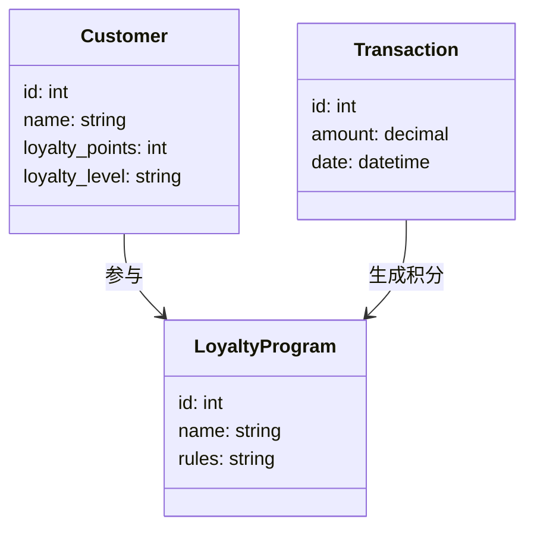
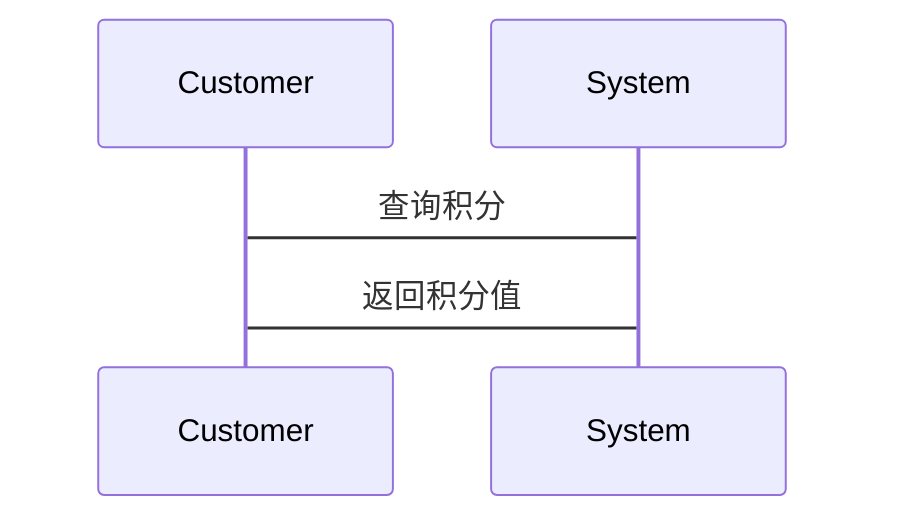

                 


# 彼得林奇如何分析公司的客户忠诚度程序

> 关键词：客户忠诚度，程序分析，彼得林奇，投资分析，客户保留，客户行为，企业战略

> 摘要：本文详细解析了彼得林奇分析客户忠诚度程序的核心方法，从背景、概念、分析框架到系统架构、实战案例和系统实现，全面揭示了如何通过客户忠诚度程序评估企业价值，帮助投资者做出明智决策。

---

# 第一部分: 客户忠诚度程序的背景与核心概念

# 第1章: 客户忠诚度程序的背景介绍

## 1.1 客户忠诚度的核心概念

### 1.1.1 问题背景与问题描述

客户忠诚度是企业在市场竞争中的一项关键指标，反映了客户对企业产品或服务的满意度和依赖程度。在彼得林奇的投资分析框架中，客户忠诚度程序是评估企业长期盈利能力的重要指标之一。一个高效的客户忠诚度程序可以帮助企业吸引并保留客户，从而在竞争中占据优势。

客户忠诚度程序通常包括积分计划、会员体系、优惠活动等，旨在通过奖励机制提升客户的购买频率和忠诚度。然而，如何设计和优化这些程序，以最大化客户忠诚度和企业收益，是彼得林奇分析的核心问题。

### 1.1.2 问题解决的必要性

在现代商业环境中，客户忠诚度程序是企业吸引客户的重要工具。通过分析这些程序，投资者可以评估企业的客户保留能力、市场策略和长期发展潜力。彼得林奇强调，客户忠诚度程序不仅仅是营销工具，更是企业战略的重要组成部分。

### 1.1.3 客户忠诚度的边界与外延

客户忠诚度程序的边界包括客户参与度、积分规则、奖励机制、客户行为分析等。其外延则涉及客户生命周期管理、客户体验优化、市场反馈机制等多个方面。彼得林奇的分析框架将客户忠诚度程序与企业的财务表现、市场地位和客户满意度紧密联系。

### 1.1.4 核心要素与组成结构

客户忠诚度程序的核心要素包括：
- 客户身份识别
- 积分规则
- 奖励机制
- 客户行为分析
- 反馈机制

其组成结构通常包括客户数据库、积分系统、奖励系统和数据分析模块。

## 1.2 客户忠诚度程序的定义与特点

### 1.2.1 客户忠诚度程序的定义

客户忠诚度程序是一种通过积分、奖励或其他激励机制，提升客户对企业产品或服务的购买频率和满意度的程序。它旨在增强客户与企业之间的关系，从而提高客户保留率和企业收益。

### 1.2.2 核心属性特征对比表

| 特性                  | 定义与描述                                                                 |
|-----------------------|--------------------------------------------------------------------------|
| 客户参与度            | 客户参与程序的积极性和频率                                                 |
| 积分规则              | 客户获得积分的方式和规则                                                   |
| 奖励机制              | 积分兑换的具体奖励形式和价值                                               |
| 客户行为分析          | 基于客户数据的行为模式分析                                                 |
| 反馈机制              | 客户对企业产品或服务的反馈收集与处理机制                                 |

### 1.2.3 ER实体关系图（Mermaid）

```mermaid
erDiagram
    customer[客户] {
        +id: int
        +name: string
        +loyalty_points: int
    }
    company[公司] {
        +id: int
        +name: string
        +loyalty_program_id: int
    }
    loyalty_program[客户忠诚度程序] {
        +id: int
        +name: string
        +rules: string
    }
    customer --> loyalty_program: 参与
    company --> loyalty_program: 提供
```

## 1.3 本章小结

本章介绍了客户忠诚度程序的核心概念和基本结构，强调了其在企业战略中的重要性。通过定义和特征对比，读者可以更好地理解彼得林奇分析框架的基础。

---

# 第二部分: 客户忠诚度程序的分析方法

# 第2章: 客户忠诚度程序的核心概念与联系

## 2.1 核心概念原理

### 2.1.1 客户忠诚度的层次模型

彼得林奇将客户忠诚度分为三个层次：
1. **基础层**：客户对企业产品的基本满意度。
2. **行为层**：客户主动选择企业产品或服务的行为。
3. **情感层**：客户对企业品牌的情感依赖和忠诚度。

### 2.1.2 彼得林奇的分析框架

彼得林奇的分析框架包括以下步骤：
1. **数据收集**：通过客户反馈、销售数据和市场调研收集客户行为数据。
2. **指标选择**：选择关键指标，如客户保留率、客户满意度、客户生命周期价值等。
3. **程序分析**：评估客户忠诚度程序的有效性，包括积分规则、奖励机制和客户参与度。
4. **竞争对手分析**：比较竞争对手的忠诚度程序，找出企业的竞争优势和改进空间。

## 2.2 核心概念属性特征对比

### 2.2.1 不同客户忠诚度程序的对比分析

| 程序名称       | 积分规则               | 奖励机制               | 客户参与度         |
|----------------|-----------------------|-----------------------|-------------------|
| 亚马逊Prime    | 每消费1美元得1积分       | 免费配送、会员专属优惠   | 高                 |
| 星巴克奖励计划  | 每消费20美元得1星礼卡     | 星礼卡兑换商品或优惠券   | 中                 |
| 联合航空里程计划| 每飞行1英里得1里程       | 兑换机票、酒店或礼品     | 高                 |

### 2.2.2 彼得林奇分析方法的独特性

彼得林奇的独特性在于他将客户忠诚度程序与企业的财务表现和市场地位紧密结合，通过分析客户忠诚度程序的有效性，评估企业的长期盈利能力。

## 2.3 实体关系图（Mermaid）

```mermaid
erDiagram
    customer[客户] {
        +id: int
        +name: string
        +loyalty_level: string
    }
    transaction[交易] {
        +id: int
        +amount: decimal
        +date: datetime
    }
    loyalty_program[客户忠诚度程序] {
        +id: int
        +name: string
        +rules: string
    }
    customer --> loyalty_program: 参与
    customer --> transaction: 进行
    transaction --> loyalty_program: 生成积分
```

---

# 第三部分: 客户忠诚度程序的系统分析与架构设计

# 第3章: 客户忠诚度程序的系统架构设计

## 3.1 问题场景介绍

客户忠诚度程序的系统架构设计需要考虑客户数据管理、积分计算、奖励发放和数据分析等多个方面。彼得林奇的分析框架强调系统的可扩展性和数据的准确性。

## 3.2 项目介绍

本项目旨在设计一个高效的客户忠诚度程序系统，包括客户数据库、积分计算模块、奖励发放模块和数据分析模块。

## 3.3 系统功能设计

### 3.3.1 领域模型（Mermaid类图）



### 3.3.2 系统架构设计（Mermaid架构图）


## 3.4 系统接口设计

系统接口设计包括客户登录、积分查询、奖励兑换等功能。

## 3.5 系统交互（Mermaid序列图）



---

# 第四部分: 客户忠诚度程序的实战案例

# 第4章: 客户忠诚度程序的实战案例分析

## 4.1 环境安装与数据准备

### 4.1.1 环境安装

安装Python、Pandas和Matplotlib。

### 4.1.2 数据准备

收集客户交易数据和忠诚度积分数据。

## 4.2 系统核心实现

### 4.2.1 客户积分计算

使用Python代码计算客户的忠诚度积分。

### 4.2.2 客户等级划分

根据积分值划分客户等级。

### 4.2.3 奖励发放

根据客户等级发放奖励。

## 4.3 代码实现与解读

### 4.3.1 客户积分计算代码

```python
import pandas as pd

# 读取数据
transactions = pd.read_csv('transactions.csv')

# 计算积分
transactions['loyalty_points'] = transactions['amount'] * 0.01

# 输出结果
print(transactions)
```

### 4.3.2 客户等级划分代码

```python
import pandas as pd

# 读取数据
customers = pd.read_csv('customers.csv')

# 划分等级
customers['loyalty_level'] = pd.qcut(customers['loyalty_points'], 5, labels=['Bronze', 'Silver', 'Gold', 'Platinum', 'Diamond'])

# 输出结果
print(customers)
```

## 4.4 案例分析与详细解读

通过具体案例分析，展示如何通过彼得林奇的分析框架评估客户的忠诚度程序，并提出改进建议。

---

# 第五部分: 客户忠诚度程序的系统实现

# 第5章: 客户忠诚度程序的系统实现

## 5.1 环境安装与数据准备

### 5.1.1 环境安装

安装Python、Django和PostgreSQL。

### 5.1.2 数据准备

创建客户数据库和交易数据库。

## 5.2 系统核心实现

### 5.2.1 客户积分计算

使用Django编写积分计算模块。

### 5.2.2 客户等级划分

根据积分值划分客户等级。

### 5.2.3 奖励发放

根据客户等级发放奖励。

## 5.3 代码实现与解读

### 5.3.1 客户积分计算代码

```python
from django.shortcuts import render
from .models import Transaction

def calculate_loyalty(request):
    transactions = Transaction.objects.all()
    for transaction in transactions:
        loyalty_points = transaction.amount * 0.01
        # 更新客户积分
    return render(request, 'loyalty_calculated.html')
```

### 5.3.2 客户等级划分代码

```python
from django.shortcuts import render
from .models import Customer

def assign_loyalty_level(request):
    customers = Customer.objects.all()
    for customer in customers:
        if customer.loyalty_points >= 1000:
            customer.level = 'Platinum'
        elif customer.loyalty_points >= 500:
            customer.level = 'Gold'
        # 更新等级
    return render(request, 'levels_assigned.html')
```

## 5.4 系统测试与优化

通过系统测试验证程序的正确性，并根据测试结果进行优化。

---

# 第六部分: 总结与最佳实践

# 第6章: 总结与最佳实践

## 6.1 本章小结

总结彼得林奇分析客户忠诚度程序的核心方法，强调其在企业战略中的重要性。

## 6.2 投资建议

根据分析结果，提出投资建议，重点关注客户忠诚度程序有效的企业。

## 6.3 注意事项

在分析客户忠诚度程序时，需注意数据的准确性和分析方法的科学性。

## 6.4 拓展阅读

推荐进一步阅读彼得林奇的相关著作，深入理解其分析框架。

---

# 作者：AI天才研究院/AI Genius Institute & 禅与计算机程序设计艺术 /Zen And The Art of Computer Programming

