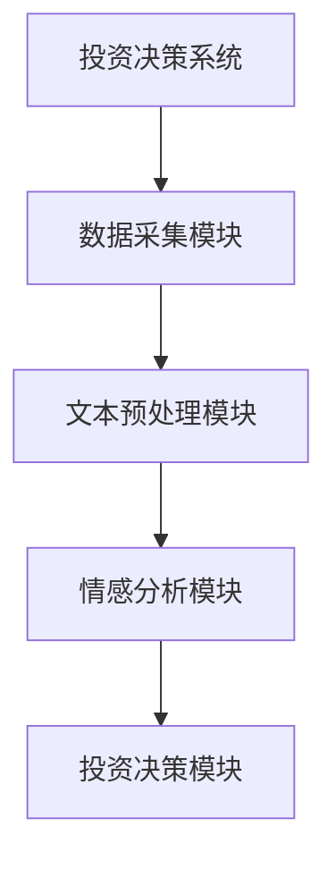
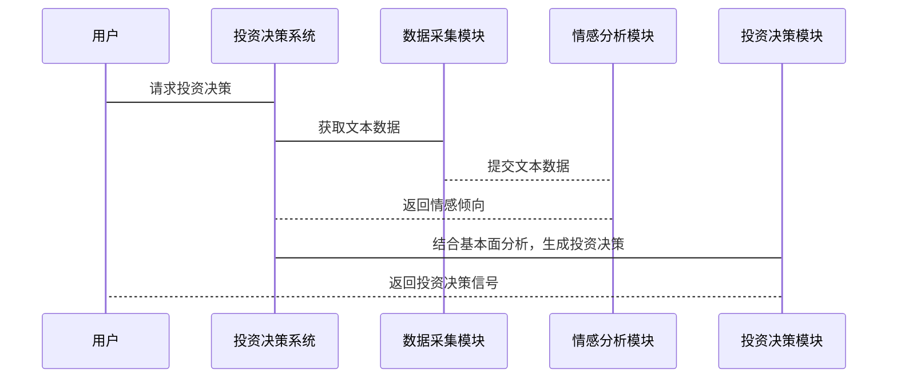

                 


# 情感分析在投资决策中的应用

> 关键词：情感分析，投资决策，文本挖掘，市场情绪，机器学习，深度学习，金融分析

> 摘要：情感分析在投资决策中的应用是近年来人工智能领域的重要研究方向。本文从情感分析的基本概念出发，系统地介绍了其在投资决策中的核心作用，详细分析了情感分析在股票市场、投资组合管理等场景中的具体应用，并结合实际案例展示了如何利用情感分析技术进行投资决策优化。通过本文，读者可以全面了解情感分析在投资决策中的技术实现、应用场景和未来发展方向。

---

## 第一部分: 情感分析在投资决策中的应用基础

### 第1章: 情感分析的定义与技术发展

#### 1.1 情感分析的定义

##### 1.1.1 情感分析的背景与概念

情感分析（Sentiment Analysis）是自然语言处理（NLP）领域的重要分支，旨在通过分析文本中的情感倾向（如正面、负面或中性）来理解作者的情感态度。情感分析的核心目标是将文本数据转化为可量化的信息，从而为决策提供支持。

情感分析在投资决策中的应用始于2010年代初，随着社交媒体的兴起，投资者开始关注社交媒体上的评论、帖子和新闻，以获取市场情绪的信息。市场情绪（Market Sentiment）是指市场参与者对某一资产或市场的整体看法，通常可以用情感分析技术来量化。

##### 1.1.2 情感分析的核心目标

情感分析的核心目标是通过分析文本数据，识别出文本中的情感倾向，并将其转化为可用于投资决策的信息。具体目标包括：

1. **市场情绪监测**：通过分析社交媒体、新闻媒体等来源的文本数据，实时监测市场情绪的变化。
2. **投资决策支持**：基于市场情绪的变化，辅助投资者做出买卖决策。
3. **风险预警**：通过分析负面情绪的集中度，提前预警潜在的市场风险。

##### 1.1.3 情感分析的分类与应用场景

情感分析可以分为以下几种类型：

1. **整体情感分析**：对一段文本的整体情感倾向进行分类（如正面、负面、中性）。
2. **方面情感分析**：对文本中的特定方面（如产品性能、服务质量）进行情感分析。
3. **情绪强度分析**：量化文本中情感的强度（如非常正面、轻微负面）。

情感分析在投资决策中的应用场景包括：

- **社交媒体分析**：分析Twitter、Reddit等平台上的用户评论，监测市场情绪。
- **新闻媒体分析**：分析新闻标题和正文，提取市场情绪信息。
- **机构报告分析**：分析机构发布的研究报告，提取分析师的观点和情绪。

---

#### 1.2 情感分析的技术发展

##### 1.2.1 传统情感分析方法

传统的感情分析方法主要基于规则和统计模型。例如：

1. **基于规则的方法**：通过预定义的规则和情感词典，对文本进行情感分类。例如，VADER（Valence Aware Dictionary and sEntiment Reasoning）是一种常用的基于规则的情感分析工具。
2. **统计模型**：基于机器学习的分类算法（如支持向量机SVM、随机森林等）对文本进行情感分类。

##### 1.2.2 基于深度学习的情感分析技术

随着深度学习的兴起，基于神经网络的情感分析技术逐渐成为主流。常用的深度学习模型包括：

1. **词嵌入模型**：如Word2Vec、GloVe，用于将文本中的词语转化为向量表示。
2. **卷积神经网络（CNN）**：通过卷积操作提取文本的局部特征。
3. **循环神经网络（RNN）**：用于处理序列数据，如LSTM（长短期记忆网络）。
4. **Transformer模型**：如BERT、GPT，通过自注意力机制捕获文本中的长距离依赖关系。

##### 1.2.3 当前情感分析领域的研究热点

当前情感分析领域的研究热点包括：

1. **多模态情感分析**：结合文本、图像、语音等多种模态的信息进行情感分析。
2. **在线情感分析**：实时分析社交媒体上的动态内容。
3. **情感强度分析**：不仅分类情感倾向，还量化情感的强度。

---

### 第2章: 投资决策中的情感分析应用背景

#### 2.1 投资决策的基本概念

##### 2.1.1 投资决策的定义与分类

投资决策是指投资者在金融市场中对资产配置、买卖时机等决策的选择。投资决策可以分为以下几类：

1. **股票投资决策**：基于对个股或市场的分析，做出买卖决策。
2. **基金投资决策**：基于对基金产品和市场的分析，做出申购或赎回决策。
3. **风险管理决策**：基于对市场风险的评估，调整投资组合的风险水平。

##### 2.1.2 投资决策的核心要素

投资决策的核心要素包括：

1. **市场信息**：包括股票价格、成交量、市场指数等。
2. **市场情绪**：包括投资者的心理预期和行为。
3. **基本面分析**：包括公司的财务数据、行业地位等。

##### 2.1.3 投资决策中的信息来源

投资决策中的信息来源主要包括：

1. **公开信息**：如公司财报、新闻公告等。
2. **社交媒体信息**：如Twitter、Reddit等平台上的用户评论。
3. **机构报告**：如券商发布的研究报告。

#### 2.2 情感分析在投资中的价值

##### 2.2.1 情感分析在市场情绪分析中的作用

市场情绪是影响股票价格的重要因素之一。情感分析可以通过分析社交媒体、新闻媒体等来源的文本数据，实时监测市场情绪的变化。例如：

1. **社交媒体情绪指数**：通过分析Twitter上的用户评论，计算市场情绪指数，作为投资决策的参考。
2. **新闻情绪指数**：通过分析新闻标题和正文，计算新闻情绪指数，作为市场情绪的补充信息。

##### 2.2.2 情感分析如何辅助投资决策

情感分析可以通过以下方式辅助投资决策：

1. **交易信号生成**：通过分析市场情绪的变化，生成买入或卖出信号。
2. **风险预警**：通过分析负面情绪的集中度，预警潜在的市场风险。
3. **投资组合优化**：通过分析市场情绪的变化，动态调整投资组合的配置。

##### 2.2.3 情感分析在投资风险管理中的应用

情感分析可以通过以下方式应用于投资风险管理：

1. **市场情绪监测**：通过分析社交媒体和新闻媒体的情绪，监测市场情绪的变化。
2. **风险预警**：通过分析负面情绪的集中度，预警潜在的市场风险。
3. **风险管理策略**：根据市场情绪的变化，动态调整风险管理策略。

---

### 第3章: 情感分析的基本技术与实现

#### 3.1 文本预处理技术

##### 3.1.1 分词与词干提取

文本预处理是情感分析的基础步骤之一。分词是指将文本分割成词语或短语，词干提取是指将词语转换为其基本形式（如“computing”转换为“compute”）。常用的分词工具包括NLTK、spaCy等。

##### 3.1.2 停用词处理与词向量表示

停用词处理是指去除文本中的常见词汇（如“and”、“the”等），以减少对情感分析的干扰。词向量表示是将词语转换为数值向量，常用的词向量模型包括Word2Vec、GloVe等。

##### 3.1.3 文本清洗与标准化

文本清洗是指去除文本中的噪声（如标点符号、特殊字符等），文本标准化是指将文本转换为统一的格式（如小写、去除停用词等）。

#### 3.2 情感分析算法实现

##### 3.2.1 基于规则的情感分析

基于规则的情感分析通过预定义的情感词典和规则，对文本进行情感分类。例如，VADER情感分析工具就是基于规则的情感分析工具。

##### 3.2.2 基于机器学习的情感分析

基于机器学习的情感分析通过训练模型，对文本进行情感分类。常用的机器学习算法包括支持向量机（SVM）、随机森林（Random Forest）等。

##### 3.2.3 基于深度学习的情感分析

基于深度学习的情感分析通过神经网络模型对文本进行情感分类。常用的深度学习模型包括卷积神经网络（CNN）、长短期记忆网络（LSTM）等。

---

### 第4章: 情感分析在金融领域的数据集与工具

#### 4.1 金融领域的情感分析数据集

##### 4.1.1 Twitter金融数据集

Twitter金融数据集是情感分析领域的重要数据集之一，包含了大量的Twitter帖子，涉及股票、金融市场的评论。

##### 4.1.2 股票新闻数据集

股票新闻数据集包含了大量的股票相关新闻，可用于情感分析和市场情绪研究。

##### 4.1.3 其他金融情感分析数据集

其他金融情感分析数据集包括Reddit金融评论数据集、新闻头条数据集等。

#### 4.2 情感分析的主要工具与框架

##### 4.2.1 NLTK与spaCy

NLTK和spaCy是常用的文本处理工具，支持分词、词向量表示等功能。

##### 4.2.2 TensorFlow与Keras

TensorFlow和Keras是常用的深度学习框架，支持情感分析模型的训练和部署。

##### 4.2.3 PyTorch与Hugging Face

PyTorch和Hugging Face是常用的深度学习框架，支持情感分析模型的训练和部署。

---

## 第二部分: 情感分析在投资决策中的具体应用

### 第5章: 情感分析在股票市场中的应用

#### 5.1 股票市场的基本概念

##### 5.1.1 股票市场的运作机制

股票市场是投资者买卖股票的场所，股票价格受多种因素影响，包括市场情绪、公司业绩、宏观经济指标等。

##### 5.1.2 影响股票价格的主要因素

影响股票价格的主要因素包括：

1. **市场情绪**：投资者的心理预期和行为。
2. **公司业绩**：公司的财务数据、行业地位等。
3. **宏观经济指标**：GDP、利率、通货膨胀等。

##### 5.1.3 市场情绪对股票价格的影响

市场情绪是影响股票价格的重要因素之一。当市场情绪乐观时，股票价格通常会上涨；当市场情绪悲观时，股票价格通常会下跌。

#### 5.2 情感分析在股票市场中的具体应用

##### 5.2.1 社交媒体对股票价格的影响

社交媒体上的评论和帖子可以反映市场情绪，进而影响股票价格。例如，Twitter上的用户评论可以作为股票价格预测的依据。

##### 5.2.2 新闻媒体对股票市场情绪的影响

新闻媒体对股票市场情绪的影响也非常重要。例如，正面的新闻报道可以提升市场情绪，进而推动股票价格上涨。

##### 5.2.3 机构投资者的情感分析应用

机构投资者可以通过情感分析技术，分析市场情绪的变化，优化投资策略。例如，通过分析社交媒体和新闻媒体的情绪，机构投资者可以提前发现市场趋势，做出更明智的投资决策。

### 第6章: 情感分析在投资组合管理中的应用

#### 6.1 投资组合管理的基本概念

##### 6.1.1 投资组合管理的目标

投资组合管理的目标是通过合理配置资产，实现投资收益的最大化，同时控制风险。

##### 6.1.2 投资组合的风险与收益分析

投资组合的风险与收益分析是投资组合管理的核心内容之一。情感分析可以通过分析市场情绪的变化，动态调整投资组合的配置。

##### 6.1.3 市场情绪对投资组合的影响

市场情绪是影响投资组合的重要因素之一。当市场情绪乐观时，投资者可以增加风险资产的配置；当市场情绪悲观时，投资者可以减少风险资产的配置。

#### 6.2 情感分析在投资组合管理中的具体应用

##### 6.2.1 市场情绪监测与投资组合调整

通过情感分析技术，投资者可以实时监测市场情绪的变化，动态调整投资组合的配置。

##### 6.2.2 风险预警与投资组合优化

通过分析市场情绪的变化，投资者可以提前预警潜在的市场风险，优化投资组合的风险收益比。

##### 6.2.3 投资决策支持与情感分析结合

通过将情感分析技术与投资组合管理相结合，投资者可以更好地理解市场情绪，做出更明智的投资决策。

---

## 第三部分: 情感分析在投资决策中的系统实现与项目实战

### 第7章: 情感分析在投资决策中的系统实现

#### 7.1 项目背景与目标

##### 7.1.1 项目背景

随着社交媒体的兴起，市场情绪对股票价格的影响日益显著。如何通过情感分析技术，实时监测市场情绪的变化，辅助投资决策，是当前研究的热点。

##### 7.1.2 项目目标

本项目旨在通过情感分析技术，实时监测社交媒体和新闻媒体的市场情绪，辅助投资者做出投资决策。

#### 7.2 项目核心实现

##### 7.2.1 数据采集与预处理

数据采集是情感分析的第一步，需要从社交媒体、新闻媒体等来源获取文本数据。文本预处理包括分词、去停用词、词向量表示等。

##### 7.2.2 情感分析模型训练与部署

通过训练情感分析模型，对文本数据进行情感分类。常用的模型包括VADER、SVM、LSTM等。模型部署可以通过API接口提供情感分析服务。

##### 7.2.3 投资决策系统设计与实现

投资决策系统需要结合市场情绪、基本面分析等多方面信息，做出投资决策。系统设计包括数据采集、模型调用、决策逻辑实现等。

#### 7.3 系统架构设计

##### 7.3.1 系统功能模块设计

投资决策系统功能模块包括：

1. 数据采集模块：从社交媒体、新闻媒体等来源获取文本数据。
2. 文本预处理模块：对文本数据进行分词、去停用词等处理。
3. 情感分析模块：对文本数据进行情感分类。
4. 投资决策模块：结合市场情绪和基本面分析，做出投资决策。

##### 7.3.2 系统架构图



#### 7.4 系统接口设计

##### 7.4.1 数据接口

数据接口用于与社交媒体、新闻媒体等数据源对接，获取文本数据。

##### 7.4.2 情感分析接口

情感分析接口用于调用情感分析模型，获取文本的情感倾向。

##### 7.4.3 投资决策接口

投资决策接口用于根据市场情绪和基本面分析，生成投资决策信号。

#### 7.5 系统交互流程

##### 7.5.1 系统交互序列图



---

### 第8章: 情感分析在投资决策中的项目实战

#### 8.1 项目环境配置

##### 8.1.1 环境要求

项目需要安装Python、Jupyter Notebook、NLTK、spaCy、TensorFlow等工具。

##### 8.1.2 数据集获取

可以从Twitter API获取社交媒体数据，或者从新闻网站获取新闻数据。

#### 8.2 核心代码实现

##### 8.2.1 文本预处理代码

```python
import nltk
from nltk.corpus import stopwords
from sklearn.feature_extraction.text import TfidfVectorizer

nltk.download("stopwords")
nltk.download("punkt")

def text_preprocessing(text):
    # 分词
    words = nltk.word_tokenize(text)
    # 去除停用词
    stop_words = set(stopwords.words("english"))
    filtered_words = [word for word in words if word.lower() not in stop_words]
    # 转换为小写
    filtered_words = [word.lower() for word in filtered_words]
    return " ".join(filtered_words)
```

##### 8.2.2 情感分析模型实现

```python
from sklearn.feature_extraction.text import TfidfVectorizer
from sklearn.svm import SVC

# 数据预处理
texts = [...]  # 文本数据
labels = [...]  # 情感标签

# 文本向量化
vectorizer = TfidfVectorizer()
X = vectorizer.fit_transform(texts)

# 训练SVM模型
model = SVC()
model.fit(X, labels)

# 预测
test_texts = [...]  # 测试文本
test_X = vectorizer.transform(test_texts)
predictions = model.predict(test_X)
```

##### 8.2.3 投资决策系统实现

```python
import requests

def get_market_sentiment():
    # 获取社交媒体数据
    response = requests.get("https://api.twitter.com/1.1/search/tweets.json?q=stocks")
    data = response.json()
    tweets = data["statuses"]
    
    # 文本预处理
    processed_tweets = [text_preprocessing(tweet["text"]) for tweet in tweets]
    
    # 情感分析
    vectorizer = TfidfVectorizer()
    X = vectorizer.fit_transform(processed_tweets)
    sentiment = model.predict(X)
    
    return sentiment

# 生成投资决策信号
sentiment = get_market_sentiment()
if sentiment == "positive":
    print("买入信号")
elif sentiment == "negative":
    print("卖出信号")
else:
    print("中性信号")
```

#### 8.3 项目小结

通过本项目的实战，我们了解了情感分析在投资决策中的具体实现流程。从数据采集、文本预处理、情感分析模型训练到投资决策系统的实现，每一步都需要仔细设计和实现。情感分析技术为投资决策提供了有力的支持，但在实际应用中，还需要结合其他因素（如基本面分析、宏观经济指标等）进行综合判断。

---

## 第四部分: 情感分析在投资决策中的总结与展望

### 第9章: 总结与展望

#### 9.1 本章总结

情感分析在投资决策中的应用是近年来人工智能领域的重要研究方向。通过情感分析技术，投资者可以实时监测市场情绪的变化，辅助投资决策。本文从情感分析的基本概念出发，系统地介绍了其在投资决策中的核心作用，并结合实际案例展示了如何利用情感分析技术进行投资决策优化。

#### 9.2 未来展望

尽管情感分析在投资决策中的应用已经取得了一些成果，但仍存在一些挑战和改进空间。未来的研究方向包括：

1. **多模态情感分析**：结合文本、图像、语音等多种模态的信息，提高情感分析的准确性。
2. **在线情感分析**：实时分析社交媒体和新闻媒体的动态内容，提高市场情绪监测的实时性。
3. **情感强度分析**：不仅分类情感倾向，还量化情感的强度，提高投资决策的精准度。

---

## 作者：AI天才研究院/AI Genius Institute & 禅与计算机程序设计艺术 /Zen And The Art of Computer Programming

---

通过本文，我们系统地介绍了情感分析在投资决策中的应用，从理论到实践，从基础到高级，全面涵盖了情感分析的核心技术、应用场景和系统实现。希望本文能为读者提供有价值的参考，帮助他们在投资决策中更好地利用情感分析技术。

