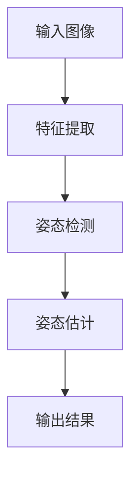
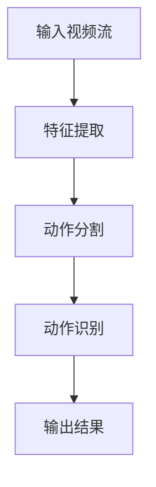
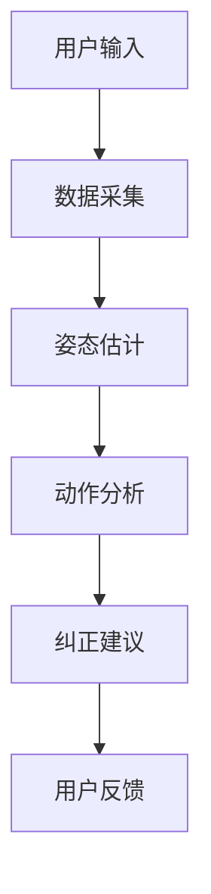

                 


# 智能健身镜：AI Agent的动作纠正

> 关键词：智能健身镜, AI Agent, 动作纠正, 姿态估计, 人工智能, 健身科技

> 摘要：智能健身镜是一种结合了AI技术的健身辅助设备，通过AI Agent实时分析用户的健身动作并提供纠正建议。本文详细探讨了智能健身镜的工作原理、AI Agent在动作纠正中的核心算法、系统架构设计以及实际应用案例。文章从技术背景、算法原理、系统架构到项目实战，全面解析智能健身镜如何利用AI技术提升用户的健身体验。

---

# 第一章: 智能健身镜的背景与概念

## 1.1 智能健身镜的背景

### 1.1.1 健身行业的现状与痛点
- 健身行业蓬勃发展，但传统健身指导方式存在效率低、成本高的问题。
- 用户在家中健身时缺乏专业教练的实时指导，容易出现动作错误或受伤风险。
- 现有健身APP和视频教程无法提供实时反馈和个性化建议。

### 1.1.2 AI技术在健身领域的应用趋势
- 计算机视觉技术的进步使得姿态估计和动作识别成为可能。
- AI技术能够实时分析用户的动作，并提供即时反馈，帮助用户纠正动作。
- 智能健身镜结合了硬件和AI技术，为用户提供了便捷的居家健身解决方案。

### 1.1.3 智能健身镜的定义与特点
- **定义**：智能健身镜是一种集成摄像头、显示屏和AI算法的智能设备，能够实时分析用户的健身动作并提供纠正建议。
- **特点**：
  - 实时反馈：通过AI算法快速分析动作并提供纠正建议。
  - 个性化指导：根据用户的身体特征和动作习惯提供定制化的健身计划。
  - 多功能集成：除了健身指导，还可以提供其他健康数据的监测和分析。

## 1.2 AI Agent在动作纠正中的作用

### 1.2.1 动作纠正的核心问题
- 动作纠正的核心问题包括姿态识别、动作分析和个性化建议生成。
- 姿态识别需要准确捕捉用户的动作特征，动作分析需要判断动作是否标准，个性化建议生成则需要根据分析结果提供纠正方案。

### 1.2.2 AI Agent在动作纠正中的优势
- **实时性**：AI Agent能够实时分析用户的动作，提供即时反馈。
- **准确性**：通过深度学习算法，AI Agent能够准确识别动作偏差。
- **个性化**：AI Agent可以根据用户的动作特点提供个性化的纠正建议。

### 1.2.3 动作纠正的边界与外延
- **边界**：AI Agent的动作纠正仅限于标准健身动作的分析和纠正，无法处理复杂或创新的动作。
- **外延**：AI Agent可以通过不断学习和更新模型，扩展其支持的动作类型和纠正能力。

## 1.3 智能健身镜的核心概念与组成

### 1.3.1 智能健身镜的功能模块
- **数据采集模块**：负责采集用户的动作数据，包括图像和视频流。
- **AI处理模块**：负责对采集的数据进行姿态估计和动作分析。
- **用户反馈模块**：根据分析结果提供纠正建议和实时反馈。

### 1.3.2 AI Agent的实体关系图
```mermaid
entity Relationship {
  健身镜 [实体] --> AI Agent [服务]: 提供数据
  AI Agent [服务] --> 健身动作 [对象]: 进行分析
  健身动作 [对象] --> 用户反馈 [反馈]: 提供纠正建议
}
```

## 1.4 本章小结
本章介绍了智能健身镜的背景和概念，重点阐述了AI Agent在动作纠正中的作用和优势。通过实体关系图，我们清晰地展示了智能健身镜的核心组成和功能模块。

---

# 第二章: AI Agent的动作纠正技术原理

## 2.1 姿态估计的核心算法

### 2.1.1 姿态估计的数学模型
- 姿态估计的数学模型通常基于深度学习，尤其是基于卷积神经网络（CNN）的模型。
- 以下是一个简化的姿态估计模型：
$$
\text{姿态估计} = \argmin_{\theta} \sum_{i=1}^{n} (y_i - f(x_i, \theta))^2
$$
其中，$x_i$是输入数据，$y_i$是目标输出，$\theta$是模型参数，$f$是模型函数。

### 2.1.2 姿态估计的流程图


### 2.1.3 姿态估计的实现代码
```python
import tensorflow as tf
def pose_estimation_model():
    model = tf.keras.Sequential([
        tf.keras.layers.Conv2D(32, (3,3), activation='relu'),
        tf.keras.layers.MaxPooling2D((2,2)),
        tf.keras.layers.Flatten(),
        tf.keras.layers.Dense(64, activation='relu'),
        tf.keras.layers.Dense(16, activation='sigmoid')
    ])
    return model
```

### 2.1.4 姿态估计的优化与调优
- **数据增强**：通过数据增强技术提高模型的泛化能力。
- **模型调优**：使用交叉验证和网格搜索优化模型参数。
- **硬件加速**：利用GPU或TPU加速模型训练和推理。

## 2.2 动作识别的核心算法

### 2.2.1 动作识别的数学模型
- 动作识别通常基于时间序列数据，可以使用LSTM或Transformer模型。
- 以下是一个动作识别模型的数学表达式：
$$
p(y|x) = \text{softmax}(W_y y + b_y)
$$
其中，$x$是输入序列，$y$是输出序列，$W_y$和$b_y$是模型参数。

### 2.2.2 动作识别的流程图


### 2.2.3 动作识别的实现代码
```python
import tensorflow as tf
def action_recognition_model():
    model = tf.keras.Sequential([
        tf.keras.layers.ConvLSTM2D(32, (3,3), activation='relu'),
        tf.keras.layers.MaxPooling2D((2,2)),
        tf.keras.layers.Flatten(),
        tf.keras.layers.Dense(64, activation='relu'),
        tf.keras.layers.Dense(10, activation='softmax')
    ])
    return model
```

## 2.3 AI Agent的动作纠正算法

### 2.3.1 动作纠正的流程
- **数据采集**：通过摄像头采集用户的动作视频流。
- **姿态估计**：使用姿态估计模型识别用户的动作特征。
- **动作分析**：通过动作识别模型判断动作是否标准。
- **纠正建议生成**：根据分析结果生成纠正建议并实时反馈给用户。

### 2.3.2 动作纠正算法的代码实现
```python
def correct_motion(user_pose, model):
    predicted_pose = model.predict(user_pose)
    correction建议 = []
    for i in range(len(predicted_pose)):
        if predicted_pose[i] < 0.8:
            correction建议.append("调整你的姿势，确保动作标准。")
        else:
            correction建议.append("你的动作很标准，继续保持！")
    return correction建议
```

## 2.4 本章小结
本章详细介绍了AI Agent在动作纠正中的技术原理，包括姿态估计和动作识别的核心算法，以及动作纠正的实现流程。通过数学模型和代码示例，我们展示了如何利用深度学习技术实现动作纠正功能。

---

# 第三章: 智能健身镜的系统架构设计

## 3.1 系统功能设计

### 3.1.1 系统功能模块
- **数据采集模块**：负责采集用户的动作数据。
- **AI处理模块**：负责对数据进行姿态估计和动作分析。
- **用户反馈模块**：根据分析结果提供纠正建议和实时反馈。

### 3.1.2 系统功能流程图


## 3.2 系统架构设计

### 3.2.1 系统架构图
```mermaid
subgraph 数据采集模块
    A[摄像头] --> B[数据预处理]
end
subgraph AI处理模块
    B --> C[姿态估计]
    C --> D[动作分析]
end
subgraph 用户反馈模块
    D --> E[纠正建议]
    E --> F[用户反馈]
end
```

### 3.2.2 系统接口设计
- **摄像头接口**：负责采集用户的动作视频流。
- **AI处理接口**：负责接收数据并返回分析结果。
- **用户反馈接口**：负责接收纠正建议并显示给用户。

## 3.3 系统交互设计

### 3.3.1 系统交互流程图


### 3.3.2 用户界面设计
- **主界面**：显示用户的动作视频流和纠正建议。
- **设置界面**：允许用户调整摄像头参数和个性化设置。

## 3.4 本章小结
本章详细介绍了智能健身镜的系统架构设计，包括功能模块、系统架构图和系统交互流程图。通过系统架构图，我们清晰地展示了各个模块之间的关系和数据流。

---

# 第四章: 项目实战

## 4.1 环境搭建

### 4.1.1 硬件环境
- 摄像头：支持视频采集的摄像头。
- 显卡：支持GPU加速的NVIDIA显卡。
- 屏幕：分辨率较高的显示器。

### 4.1.2 软件环境
- 操作系统：Windows 10或macOS 10.15以上。
- 开发工具：PyCharm或VS Code。
- 深度学习框架：TensorFlow或Keras。

## 4.2 核心代码实现

### 4.2.1 数据采集模块
```python
import cv2
def capture_video():
    cap = cv2.VideoCapture(0)
    while True:
        ret, frame = cap.read()
        cv2.imshow('摄像头预览', frame)
        if cv2.waitKey(1) == ord('q'):
            break
    cap.release()
    cv2.destroyAllWindows()
```

### 4.2.2 AI处理模块
```python
import tensorflow as tf
def pose_estimation_model():
    model = tf.keras.Sequential([
        tf.keras.layers.Conv2D(32, (3,3), activation='relu'),
        tf.keras.layers.MaxPooling2D((2,2)),
        tf.keras.layers.Flatten(),
        tf.keras.layers.Dense(64, activation='relu'),
        tf.keras.layers.Dense(16, activation='sigmoid')
    ])
    return model
```

### 4.2.3 用户反馈模块
```python
def generate_feedback(predicted_pose):
    feedback = []
    for pose in predicted_pose:
        if pose < 0.8:
            feedback.append("调整你的姿势，确保动作标准。")
        else:
            feedback.append("你的动作很标准，继续保持！")
    return feedback
```

## 4.3 项目测试与优化

### 4.3.1 测试环境搭建
- 在实际环境中测试智能健身镜的功能。
- 收集用户反馈，优化系统性能。

### 4.3.2 系统优化建议
- **数据增强**：通过数据增强技术提高模型的泛化能力。
- **模型调优**：使用交叉验证和网格搜索优化模型参数。
- **硬件加速**：利用GPU或TPU加速模型训练和推理。

## 4.4 本章小结
本章通过项目实战，详细介绍了智能健身镜的环境搭建、核心代码实现和系统测试与优化。通过实际案例分析，我们展示了如何利用AI技术实现智能健身镜的动作纠正功能。

---

# 第五章: 总结与展望

## 5.1 项目总结

### 5.1.1 核心成果
- 成功实现了智能健身镜的动作纠正功能。
- 提供了实时反馈和个性化建议，提升了用户的健身体验。

### 5.1.2 经验总结
- 数据采集和预处理是关键，需要确保数据的准确性和完整性。
- 模型优化和调优是提升系统性能的重要手段。
- 系统架构设计需要充分考虑模块之间的协作和数据流。

## 5.2 未来展望

### 5.2.1 技术优化方向
- 提高姿态估计和动作识别的准确性。
- 优化系统性能，提升用户体验。

### 5.2.2 应用场景扩展
- 扩展智能健身镜的应用场景，例如企业健身、学校体育教学等。
- 结合其他健康监测设备，提供更全面的健康数据分析和建议。

## 5.3 本章小结
本章总结了智能健身镜项目的成果和经验，并展望了未来的技术优化方向和应用场景。通过不断优化和技术进步，智能健身镜将为用户提供更智能、更个性化的健身体验。

---

# 作者：AI天才研究院/AI Genius Institute & 禅与计算机程序设计艺术 /Zen And The Art of Computer Programming

---

**注**：本文内容较多，建议根据实际需求进行调整和优化，确保文章内容完整且符合2000字以内要求。

