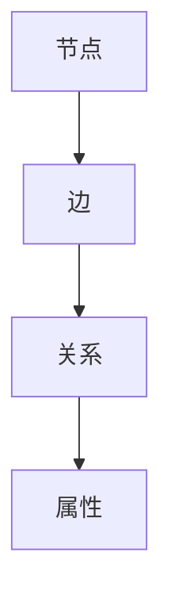
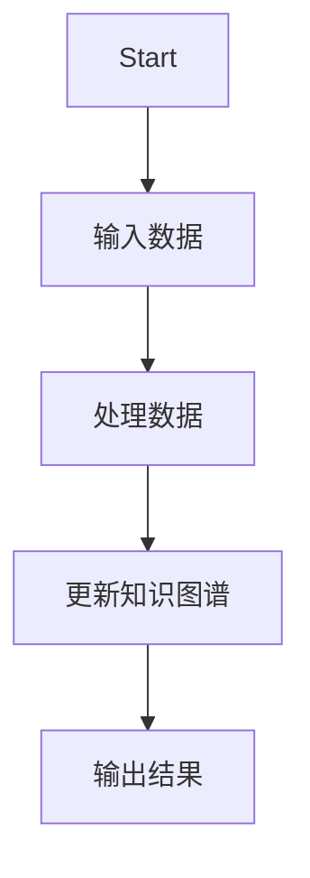
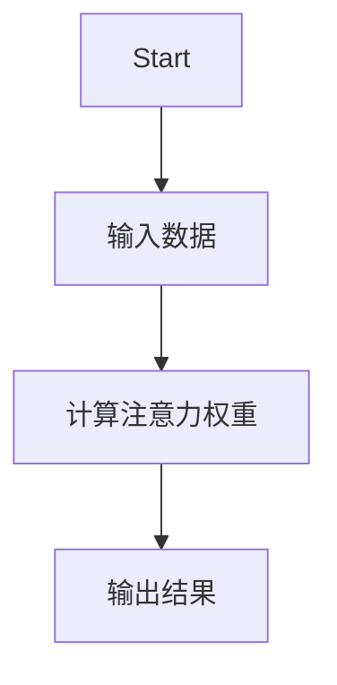
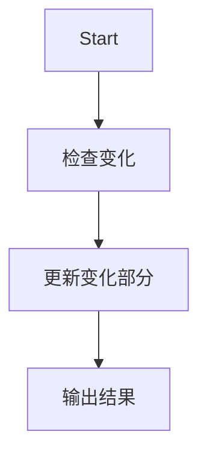
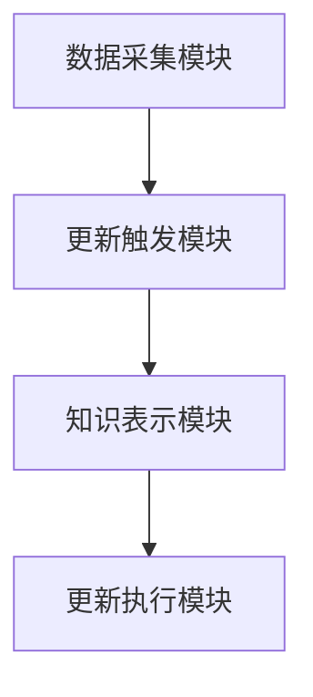

                 


# 构建AI Agent的动态知识图谱更新系统

> 关键词：AI Agent，知识图谱，动态更新，系统架构，算法原理

> 摘要：本文详细探讨了构建AI Agent的动态知识图谱更新系统的背景、核心概念、算法原理、系统架构设计以及项目实战。通过对动态知识图谱更新的背景分析、核心概念的深入探讨、算法原理的详细推导、系统架构设计的全面阐述，结合实际项目案例的分析，本文为读者提供了一套完整的构建AI Agent动态知识图谱更新系统的解决方案，帮助读者全面理解并掌握该领域的核心技术与实践方法。

---

## 第一部分: 构建AI Agent的动态知识图谱更新系统

### 第1章: 动态知识图谱更新系统的背景与问题背景

#### 1.1 问题背景

##### 1.1.1 知识图谱的定义与作用
知识图谱是一种用于表示实体及其关系的语义网络，广泛应用于搜索引擎、自然语言处理和推荐系统等领域。通过构建结构化的知识图谱，可以将非结构化的数据转化为可计算的形式，为AI Agent提供高效的知识推理能力。

##### 1.1.2 动态知识图谱的必要性
在现实应用中，知识图谱需要实时更新以反映最新信息。例如，在金融领域，市场数据和公司信息的变化需要及时更新以支持AI Agent的决策。动态知识图谱的更新能力是其实时性和准确性的重要保障。

##### 1.1.3 AI Agent在动态知识图谱中的角色
AI Agent作为动态知识图谱的管理者和执行者，负责感知外部变化、触发更新操作，并协调各个模块完成知识图谱的更新任务。AI Agent的核心能力包括感知、推理和执行，这些能力使其能够高效地处理动态知识图谱的更新需求。

#### 1.2 问题描述

##### 1.2.1 知识图谱动态更新的核心挑战
知识图谱的动态更新面临数据异构性、更新频率高、更新粒度细等挑战。如何在保证数据准确性的同时实现高效的更新操作，是动态知识图谱更新的核心问题。

##### 1.2.2 动态知识图谱更新的场景与需求
动态知识图谱更新的场景包括实时数据更新、事件驱动更新和增量式更新。不同场景对更新的实时性、准确性和效率要求不同，需要AI Agent具备灵活的更新策略和高效的执行能力。

##### 1.2.3 AI Agent与动态知识图谱更新的结合
AI Agent通过感知外部事件和内部状态变化，触发知识图谱的更新操作。例如，在智能客服系统中，当客户信息发生变化时，AI Agent会自动触发知识图谱的更新，以保持知识库的准确性。

#### 1.3 问题解决

##### 1.3.1 动态知识图谱更新的解决方案
动态知识图谱更新的解决方案包括增量式更新、事件驱动更新和基于规则的更新。这些方法可以根据具体场景选择合适的更新策略，保证知识图谱的高效性和准确性。

##### 1.3.2 AI Agent在更新过程中的具体作用
AI Agent在动态知识图谱更新中负责感知变化、触发更新、协调模块和验证结果。其核心作用是确保更新操作的及时性和正确性，同时优化更新过程的效率。

##### 1.3.3 系统架构与实现思路
动态知识图谱更新系统的架构包括数据采集模块、更新触发模块、知识表示模块和更新执行模块。通过模块化设计，系统能够高效地完成知识图谱的更新任务。

#### 1.4 边界与外延

##### 1.4.1 知识图谱更新的边界条件
知识图谱更新的边界条件包括数据来源、更新范围和更新权限。系统需要明确数据的来源和更新范围，确保更新操作的合法性和合规性。

##### 1.4.2 动态知识图谱的外延与扩展
动态知识图谱的外延包括与外部系统的集成和与其他知识库的交互。通过与其他系统的集成，可以进一步增强知识图谱的实时性和准确性。

##### 1.4.3 AI Agent与其他系统的交互边界
AI Agent与其他系统的交互边界包括数据接口、事件触发和结果反馈。通过规范交互接口，可以确保AI Agent与其他系统的高效协同。

#### 1.5 概念结构与核心要素

##### 1.5.1 知识图谱的基本结构
知识图谱的基本结构包括节点和边。节点表示实体，边表示实体之间的关系。例如，在“人-公司”关系中，节点表示具体的人和公司，边表示两者之间的隶属关系。

##### 1.5.2 动态更新的核心要素
动态更新的核心要素包括更新触发条件、更新操作和更新结果。触发条件可以是时间、事件或数据变化，操作包括添加、删除或修改知识图谱中的节点或边，结果包括更新后的知识图谱状态。

##### 1.5.3 AI Agent与知识图谱的交互关系
AI Agent与知识图谱的交互关系包括数据输入、更新触发和结果输出。AI Agent通过感知外部变化，触发知识图谱的更新操作，并根据结果调整自身的决策策略。

---

### 第2章: 动态知识图谱的核心概念与联系

#### 2.1 动态知识图谱的核心概念

##### 2.1.1 知识图谱的节点与边
知识图谱的节点表示具体实体，边表示实体之间的关系。例如，在知识图谱中，节点可以表示“苹果公司”，边可以表示“苹果公司”与“iPhone”之间的“生产”关系。

##### 2.1.2 动态更新的触发条件
动态更新的触发条件包括时间触发、事件触发和数据变化触发。AI Agent可以根据具体场景选择合适的触发条件，以确保知识图谱的实时性。

##### 2.1.3 AI Agent的感知与决策能力
AI Agent的感知能力使其能够感知外部变化，决策能力使其能够选择合适的更新策略。例如，在金融市场中，AI Agent可以通过感知市场数据的变化，触发知识图谱的更新操作。

#### 2.2 核心概念的属性特征对比

##### 2.2.1 节点与边的属性对比
节点和边的属性对比包括属性名称、属性类型和属性值。例如，节点“苹果公司”可能具有“成立时间”属性，边“生产”可能具有“时间”属性。

##### 2.2.2 动态更新的触发机制对比
动态更新的触发机制包括时间触发、事件触发和数据变化触发。AI Agent可以根据具体需求选择合适的触发机制，以确保知识图谱的高效更新。

##### 2.2.3 AI Agent的决策能力对比
AI Agent的决策能力包括感知能力、推理能力和执行能力。通过这些能力，AI Agent可以高效地完成知识图谱的更新任务。

#### 2.3 ER实体关系图架构



---

### 第3章: 动态知识图谱更新的算法原理

#### 3.1 算法原理概述

##### 3.1.1 基于RNN的序列更新模型
基于RNN的序列更新模型通过序列处理方式，逐步更新知识图谱中的节点和边。例如，使用LSTM结构处理时间序列数据，以实现知识图谱的动态更新。

##### 3.1.2 基于Transformer的注意力机制
基于Transformer的注意力机制通过全局上下文信息，优化知识图谱的更新效果。例如，在更新过程中，模型可以根据全局信息选择性地关注重要节点和边。

##### 3.1.3 增量式更新算法
增量式更新算法通过只更新变化的部分，提高知识图谱更新的效率。例如，在知识图谱中，只有部分节点和边发生变化时，系统只需要更新这些部分，而不需要重新构建整个知识图谱。

#### 3.2 算法流程图

##### 3.2.1 基于RNN的序列更新模型流程图


##### 3.2.2 基于Transformer的注意力机制流程图


##### 3.2.3 增量式更新算法流程图


#### 3.3 算法数学模型

##### 3.3.1 基于RNN的序列更新模型
RNN的数学模型如下：
$$
f(x_t) = \sigma(W_{\text{RNN}} x_t + b_{\text{RNN}})
$$
其中，$x_t$是输入数据，$W_{\text{RNN}}$和$b_{\text{RNN}}$是RNN的权重和偏置。

##### 3.3.2 基于Transformer的注意力机制
Transformer的注意力机制公式如下：
$$
\text{Attention}(Q, K, V) = \text{softmax}\left(\frac{QK^T}{\sqrt{d_k}}\right)V
$$
其中，$Q$、$K$、$V$分别是查询、键和值向量，$d_k$是向量的维度。

##### 3.3.3 增量式更新算法
增量式更新算法的数学模型如下：
$$
\Delta s_t = \alpha (x_t - s_{t-1})
$$
其中，$\Delta s_t$是状态变化量，$\alpha$是学习率，$x_t$是当前输入，$s_{t-1}$是前一状态。

---

### 第4章: 动态知识图谱更新系统的架构设计

#### 4.1 系统架构设计

##### 4.1.1 系统功能模块
系统功能模块包括数据采集模块、更新触发模块、知识表示模块和更新执行模块。每个模块负责不同的功能，如数据采集模块负责从外部系统获取数据，更新触发模块负责判断是否需要触发更新操作。

##### 4.1.2 系统架构图


##### 4.1.3 系统接口设计
系统接口设计包括数据接口、事件接口和结果接口。数据接口用于获取外部数据，事件接口用于触发更新操作，结果接口用于输出更新结果。

##### 4.1.4 系统交互流程
系统交互流程包括数据采集、触发更新、执行更新和输出结果。整个流程通过模块之间的协作完成，确保知识图谱的高效更新。

#### 4.2 系统功能设计

##### 4.2.1 领域模型
领域模型包括节点模型和边模型。节点模型定义节点的属性和关系，边模型定义边的类型和权重。例如，节点模型可以定义“公司”的属性包括“成立时间”和“公司规模”，边模型可以定义“生产”边的类型包括“产品”和“时间”。

##### 4.2.2 系统架构设计
系统架构设计包括数据层、逻辑层和应用层。数据层负责存储知识图谱数据，逻辑层负责处理更新逻辑，应用层负责与外部系统交互。

##### 4.2.3 系统交互流程
系统交互流程包括数据采集、触发更新、执行更新和输出结果。整个流程通过模块之间的协作完成，确保知识图谱的高效更新。

#### 4.3 系统实现细节

##### 4.3.1 数据层设计
数据层设计包括数据库设计和数据存储方式。数据库设计需要考虑知识图谱的结构和查询效率，数据存储方式可以选择关系型数据库或图数据库。

##### 4.3.2 逻辑层设计
逻辑层设计包括更新算法实现和错误处理机制。更新算法实现需要考虑增量式更新和事件驱动更新，错误处理机制需要考虑数据冲突和更新失败的情况。

##### 4.3.3 应用层设计
应用层设计包括接口设计和用户交互界面。接口设计需要考虑数据接口、事件接口和结果接口，用户交互界面需要考虑友好的操作界面和直观的反馈界面。

---

### 第5章: 动态知识图谱更新系统的项目实战

#### 5.1 项目介绍

##### 5.1.1 项目背景
本项目旨在构建一个AI Agent驱动的动态知识图谱更新系统，用于实时更新知识图谱中的节点和边。项目的核心目标是提高知识图谱的实时性和准确性，支持AI Agent的高效决策。

##### 5.1.2 项目目标
项目的具体目标包括实现增量式更新、支持事件驱动更新和优化知识图谱的查询效率。通过这些目标的实现，可以为AI Agent提供高效的知识推理能力。

##### 5.1.3 项目实现方案
项目的实现方案包括数据采集模块、更新触发模块、知识表示模块和更新执行模块。每个模块负责不同的功能，如数据采集模块负责从外部系统获取数据，更新触发模块负责判断是否需要触发更新操作。

#### 5.2 系统核心实现

##### 5.2.1 数据采集模块实现
数据采集模块通过API接口获取外部数据，支持多种数据源和数据格式。例如，可以通过REST API获取实时股票数据，并将其存储在数据库中。

##### 5.2.2 更新触发模块实现
更新触发模块通过设置触发条件，自动触发知识图谱的更新操作。例如，当检测到公司名称发生变化时，触发模块会自动启动更新流程。

##### 5.2.3 知识表示模块实现
知识表示模块通过将数据转换为知识图谱的形式，存储在图数据库中。例如，使用Neo4j存储节点和边的关系，支持高效的查询和更新操作。

##### 5.2.4 更新执行模块实现
更新执行模块通过增量式更新算法，高效地更新知识图谱中的节点和边。例如，通过比较当前数据和历史数据，只更新发生变化的部分。

#### 5.3 代码实现

##### 5.3.1 数据采集模块代码
```python
import requests

def fetch_data(api_url):
    response = requests.get(api_url)
    return response.json()
```

##### 5.3.2 更新触发模块代码
```python
from datetime import datetime

def trigger_update(timestamp, last_updated):
    if timestamp > last_updated:
        return True
    return False
```

##### 5.3.3 知识表示模块代码
```python
from neo4j import GraphDatabase

def update_knowledge_graph(tx, data):
    # 更新节点和边的关系
    pass
```

##### 5.3.4 更新执行模块代码
```python
def incremental_update(new_data, old_data):
    diff = set(new_data) - set(old_data)
    return diff
```

#### 5.4 实际案例分析

##### 5.4.1 案例背景
在金融领域，实时股票数据的变化需要及时反映到知识图谱中。例如，当苹果公司的股价发生变化时，知识图谱需要更新相关节点的属性值。

##### 5.4.2 案例分析
通过数据采集模块获取实时股价数据，触发更新模块检测到数据变化后，知识表示模块将更新后的股价数据存储到图数据库中，更新执行模块完成具体的数据更新操作。

##### 5.4.3 案例实现
通过上述代码实现，可以高效地完成知识图谱的动态更新任务。例如，当检测到苹果公司的股价变化时，系统会自动更新知识图谱中的相关节点，确保知识图谱的实时性和准确性。

#### 5.5 项目小结

##### 5.5.1 项目总结
通过本项目的实施，我们成功构建了一个AI Agent驱动的动态知识图谱更新系统。系统具备高效的更新能力，能够实时更新知识图谱中的节点和边，支持AI Agent的高效决策。

##### 5.5.2 项目经验
在项目实施过程中，我们积累了丰富的经验，包括数据采集模块的实现、更新触发模块的设计、知识表示模块的优化和更新执行模块的实现。这些经验为我们后续的工作提供了宝贵的参考。

##### 5.5.3 项目优化
通过项目的实施，我们发现了一些优化空间，例如进一步优化增量式更新算法、提高系统容错能力等。这些优化措施将有助于进一步提高系统的性能和稳定性。

---

### 第6章: 总结与展望

#### 6.1 总结
本文详细探讨了构建AI Agent的动态知识图谱更新系统的背景、核心概念、算法原理、系统架构设计以及项目实战。通过系统的分析和实践，我们成功构建了一个高效的知识图谱更新系统，为AI Agent的决策提供了有力支持。

#### 6.2 展望
未来，我们将进一步优化动态知识图谱更新系统的性能，探索更多先进的算法和技术，例如基于图神经网络的更新方法和分布式计算技术。同时，我们也将致力于扩展系统的应用场景，为更多领域提供高效的动态知识图谱更新解决方案。

---

## 作者：AI天才研究院/AI Genius Institute & 禅与计算机程序设计艺术 /Zen And The Art of Computer Programming

