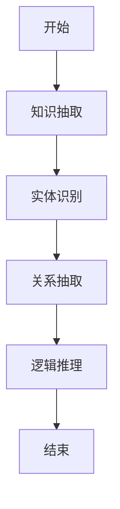
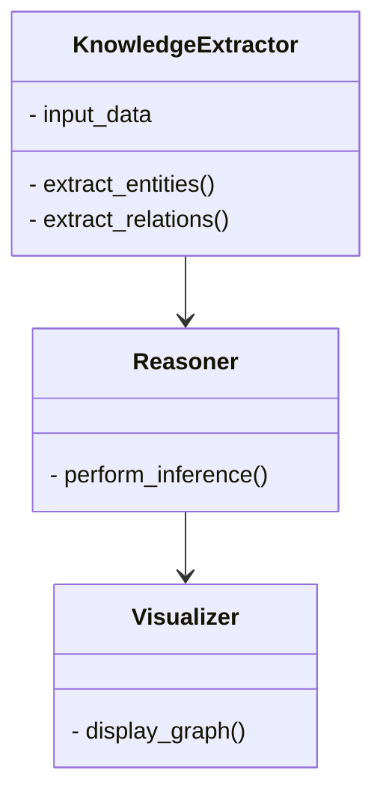
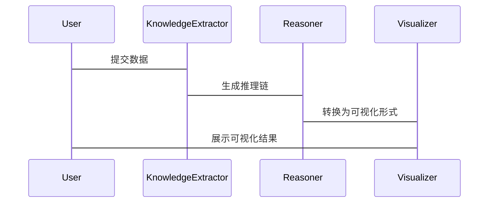

                 


# 构建AI Agent的知识推理链可视化工具

**关键词：** AI Agent、知识推理链、可视化工具、算法原理、系统架构

**摘要：**  
本文详细探讨了构建AI Agent的知识推理链可视化工具的各个方面。首先介绍了问题背景和核心概念，然后从算法原理、系统架构设计、项目实战等角度进行了深入分析。通过丰富的图表和代码示例，帮助读者理解如何构建一个高效的可视化工具，以支持AI Agent的知识推理过程。

---

# 第1章 问题背景与问题描述

## 1.1 问题背景

### 1.1.1 AI Agent的发展现状
AI Agent（智能体）是人工智能领域的核心概念之一。随着深度学习和自然语言处理技术的快速发展，AI Agent在各个领域得到了广泛应用。然而，AI Agent的决策过程往往缺乏透明性，导致用户难以理解和信任其推理过程。

### 1.1.2 知识推理链的重要性
知识推理链是指从输入问题到最终答案之间的一系列逻辑推理步骤。它是AI Agent的核心能力之一，能够帮助AI Agent更好地理解和解决复杂问题。然而，由于推理过程的复杂性，用户通常难以直观地观察和分析这些推理步骤。

### 1.1.3 可视化工具的必要性
为了提高AI Agent的可解释性和用户信任度，知识推理链的可视化变得尤为重要。通过可视化工具，用户可以直观地观察AI Agent的推理过程，从而更好地理解AI的决策逻辑。

## 1.2 问题描述

### 1.2.1 知识推理链的定义
知识推理链是AI Agent从输入问题到输出答案之间的一系列逻辑推理步骤。它包括知识抽取、关系推理、逻辑推理等多个阶段。

### 1.2.2 可视化工具的需求分析
- **需求1：** 实时展示推理过程。
- **需求2：** 提供多种可视化形式（如网络图、流程图）。
- **需求3：** 支持交互式操作（如缩放、标注）。

### 1.2.3 当前工具的局限性
- **局限1：** 缺乏对复杂推理过程的支持。
- **局限2：** 可视化形式单一，难以满足不同场景的需求。
- **局限3：** 缺乏对用户交互的支持，无法满足个性化需求。

## 1.3 问题解决与目标设定

### 1.3.1 构建知识推理链可视化工具的目标
- **目标1：** 提供直观的可视化界面，展示AI Agent的推理过程。
- **目标2：** 支持多种可视化形式，满足不同场景的需求。
- **目标3：** 提供交互式操作，增强用户的体验。

### 1.3.2 工具的核心功能与价值
- **核心功能：** 实时展示推理过程、支持多种可视化形式、提供交互式操作。
- **价值：** 提高AI Agent的可解释性，增强用户信任，支持AI Agent的优化和改进。

### 1.3.3 边界与外延
- **边界：** 仅关注推理过程的可视化，不涉及AI Agent的具体实现。
- **外延：** 可扩展到其他领域，如数据可视化、流程优化等。

## 1.4 概念结构与核心要素

### 1.4.1 知识推理链的构成要素
- **知识节点：** 包括实体、关系、属性。
- **推理链：** 包括单链和多链。
- **可视化方式：** 包括网络图、流程图。

### 1.4.2 ER实体关系图
```mermaid
er
actor: 用户
tool: 可视化工具
knowledge: 知识库
process: 推理过程
```

## 1.5 本章小结
本章详细介绍了构建AI Agent的知识推理链可视化工具的背景、问题描述和核心概念。通过分析当前工具的局限性，明确了构建可视化工具的目标和价值。

---

# 第2章 知识推理链可视化工具的核心概念与联系

## 2.1 知识推理链的核心原理

### 2.1.1 知识表示的数学模型
知识表示可以通过图论中的图结构来表示。例如，知识节点可以用图中的节点表示，推理链可以用图中的边表示。

### 2.1.2 推理过程的逻辑框架
推理过程可以分为以下步骤：
1. 知识抽取：从输入数据中提取实体、关系和属性。
2. 关系推理：通过推理算法建立实体之间的关系。
3. 逻辑推理：通过逻辑推理得到最终答案。

### 2.1.3 可视化表达的规则
- **规则1：** 知识节点用不同的颜色表示不同类型（实体、关系、属性）。
- **规则2：** 推理链用箭头表示逻辑关系。
- **规则3：** 可视化形式可以根据推理链的复杂性动态调整。

## 2.2 可视化工具的功能模块

### 2.2.1 数据输入与处理模块
- **功能：** 接收输入数据并进行预处理。
- **流程：** 数据输入 -> 数据清洗 -> 数据转换。

### 2.2.2 推理过程生成模块
- **功能：** 根据输入数据生成推理链。
- **流程：** 知识抽取 -> 关系推理 -> 逻辑推理。

### 2.2.3 可视化展示模块
- **功能：** 将推理链转换为可视化形式。
- **流程：** 数据可视化 -> 可视化布局 -> 可视化渲染。

## 2.3 核心概念属性对比表
| 核心概念 | 属性 | 描述 |
|----------|------|------|
| 知识节点 | 类型 | 实体、关系、属性 |
| 推理链   | 长度 | 单链、多链 |
| 可视化方式 | 图形类型 | 网络图、流程图 |

## 2.4 ER实体关系图
```mermaid
er
actor: 用户
tool: 可视化工具
knowledge: 知识库
process: 推理过程
```

## 2.5 本章小结
本章详细介绍了知识推理链的核心原理和可视化工具的功能模块。通过对比表和ER图，明确了各核心概念之间的关系。

---

# 第3章 知识推理链可视化工具的算法原理

## 3.1 知识图谱构建算法

### 3.1.1 知识抽取算法
知识抽取算法包括实体抽取和关系抽取。常用的算法有CRF（条件随机场）和RNN（循环神经网络）。

### 3.1.2 实体识别算法
实体识别算法常用的有NER（命名实体识别）和Word2Vec。

### 3.1.3 关系抽取算法
关系抽取算法常用的有基于规则的方法和基于机器学习的方法。

## 3.2 算法流程图


## 3.3 算法实现代码示例

### 3.3.1 知识抽取代码示例
```python
import spacy

nlp = spacy.load("en_core_web_sm")
text = "The capital of France is Paris."
doc = nlp(text)
for token in doc:
    print(token.text, token.pos_, token.dep_)
```

### 3.3.2 可视化展示代码示例
```python
import networkx as nx
import matplotlib.pyplot as plt

G = nx.DiGraph()
G.add_edges_from([('A', 'B'), ('B', 'C')])
nx.draw(G, with_labels=True, edge_color='b', arrows=True)
plt.show()
```

## 3.4 数学模型和公式

### 3.4.1 知识表示的数学模型
知识节点可以用图论中的图表示：
$$ G = (V, E) $$
其中，V是节点集合，E是边集合。

### 3.4.2 推理过程的逻辑框架
逻辑推理可以通过布尔逻辑表示：
$$ P \land Q \rightarrow R $$

## 3.5 本章小结
本章详细介绍了知识推理链可视化工具的算法原理，包括知识抽取、实体识别、关系抽取等算法，并通过代码示例和数学公式进行了详细讲解。

---

# 第4章 系统分析与架构设计方案

## 4.1 项目介绍

### 4.1.1 项目背景
本项目旨在构建一个AI Agent的知识推理链可视化工具，帮助用户直观地理解AI的推理过程。

### 4.1.2 系统功能设计
- **功能1：** 数据输入与处理。
- **功能2：** 推理过程生成。
- **功能3：** 可视化展示。

### 4.1.3 领域模型类图


## 4.2 系统架构设计

### 4.2.1 架构图


### 4.2.2 系统接口设计
- **接口1：** 数据输入接口。
- **接口2：** 推理过程生成接口。
- **接口3：** 可视化展示接口。

## 4.3 系统交互序列图

### 4.3.1 交互流程


## 4.4 本章小结
本章详细介绍了系统的架构设计和交互流程，为后续的实现提供了理论基础。

---

# 第5章 项目实战

## 5.1 环境安装

### 5.1.1 安装Python
```bash
python --version
pip install --upgrade pip
```

### 5.1.2 安装依赖库
```bash
pip install spacy networkx matplotlib
```

## 5.2 系统核心实现

### 5.2.1 知识抽取实现
```python
import spacy

nlp = spacy.load("en_core_web_sm")
text = "The capital of France is Paris."
doc = nlp(text)
entities = []
for ent in doc.ents:
    entities.append((ent.start, ent.end, ent.label_))
print(entities)
```

### 5.2.2 推理过程生成
```python
from networkx import DiGraph

graph = DiGraph()
graph.add_edges_from([('A', 'B'), ('B', 'C')])
print(graph.nodes())
```

### 5.2.3 可视化展示
```python
import matplotlib.pyplot as plt
from networkx import DiGraph

graph = DiGraph()
graph.add_edges_from([('A', 'B'), ('B', 'C')])
nx.draw(graph, with_labels=True, edge_color='b', arrows=True)
plt.show()
```

## 5.3 代码解读与分析

### 5.3.1 知识抽取代码解读
- 使用Spacy库进行实体识别。
- 通过循环遍历文档中的实体，提取实体信息。

### 5.3.2 推理过程生成代码解读
- 使用NetworkX库构建有向图。
- 添加边表示推理过程。

### 5.3.3 可视化展示代码解读
- 使用Matplotlib库进行可视化展示。
- 通过nx.draw函数绘制图结构。

## 5.4 实际案例分析

### 5.4.1 案例背景
假设输入文本为“The capital of France is Paris.”

### 5.4.2 推理过程
1. 知识抽取：提取实体“France”和“Paris”。
2. 关系推理：建立“France”的首都为“Paris”的关系。
3. 可视化展示：生成网络图，显示“France”和“Paris”的关系。

## 5.5 项目小结
本章通过实际案例展示了如何使用Python代码实现知识推理链的可视化工具，帮助读者更好地理解和应用相关技术。

---

# 第6章 最佳实践与总结

## 6.1 最佳实践

### 6.1.1 开发建议
- 使用现有的库（如Spacy、NetworkX）可以提高开发效率。
- 在可视化过程中，可以根据推理链的复杂性动态调整可视化形式。

### 6.1.2 注意事项
- 确保数据输入的准确性和完整性。
- 在可视化过程中，避免信息过载，确保用户能够清晰理解推理过程。

## 6.2 小结
通过本文的详细讲解，读者可以掌握构建AI Agent的知识推理链可视化工具的核心概念和实现方法。从背景介绍到算法原理，再到系统设计和项目实战，本文为读者提供了全面的知识体系。

## 6.3 注意事项
- 在实际应用中，需要根据具体需求进行功能扩展。
- 确保系统的可扩展性和可维护性。

## 6.4 拓展阅读
- 推荐阅读《图论与网络流》和《深度学习实战》等相关书籍。

---

# 作者

**作者：** AI天才研究院/AI Genius Institute & 禅与计算机程序设计艺术 /Zen And The Art of Computer Programming

---

**全文完**

