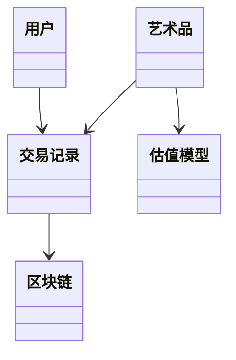
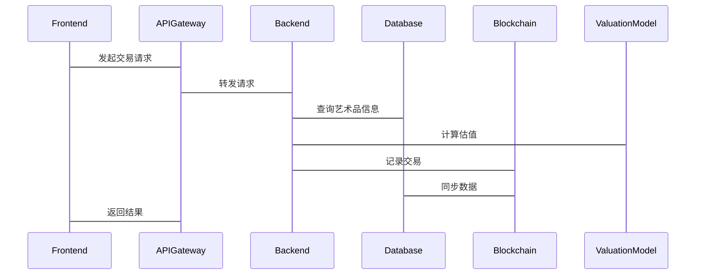

                 


# 股市估值对国际艺术品数字化交易的影响

> 关键词：股市估值、国际艺术品市场、数字化交易、区块链、金融建模、艺术品投资

> 摘要：本文探讨股市估值与国际艺术品数字化交易之间的相互影响，分析数字化交易如何改变艺术品市场的估值方式，以及股市估值对艺术品数字化交易的推动作用。文章从背景介绍、核心概念、算法原理、系统架构到项目实战，全面解析数字化交易对艺术品市场的革命性影响。

---

# 第1章: 股市估值与国际艺术品市场的概述

## 1.1 股市估值的基本概念

### 1.1.1 股市估值的定义与核心要素

股市估值是通过对公司财务数据的分析，评估其股票的内在价值。核心要素包括市盈率（P/E）、市净率（P/B）、股息率和现金流折现法（DCF）。这些指标帮助投资者判断股票的合理价格区间。

### 1.1.2 股市估值的主要方法

1. **市盈率（P/E）法**：通过比较股票的市盈率与行业平均水平，评估其估值是否合理。
2. **市净率（P/B）法**：适用于评估资产密集型行业，衡量股价与账面价值的比率。
3. **现金流折现法（DCF）**：通过预测未来现金流的现值，评估公司价值。

### 1.1.3 股市估值的关键指标

- 市盈率（P/E）：衡量股价相对于每股收益的高低。
- 市净率（P/B）：衡量股价相对于每股净资产的高低。
- 股息率：衡量股票的分红回报率。

## 1.2 国际艺术品市场的现状

### 1.2.1 艺术品市场的定义与分类

艺术品市场分为一级市场（艺术家直接出售作品）和二级市场（画廊、拍卖行等），交易对象包括绘画、雕塑、摄影作品等。

### 1.2.2 国际艺术品市场的现状与趋势

近年来，国际艺术品市场持续增长，2022年全球艺术品销售额超过650亿美元，线上交易和数字化收藏品逐渐成为主流趋势。

### 1.2.3 数字化交易的背景与意义

随着区块链技术和NFT（非同质化代币）的兴起，艺术品数字化交易逐渐普及，提高了交易的透明度和效率。

## 1.3 数字化交易与股市估值的关联性

### 1.3.1 数字化交易对艺术品市场的推动作用

通过区块链技术实现艺术品的溯源和确权，降低了交易风险，提高了市场流动性。

### 1.3.2 股市估值对数字化交易的影响

股市估值方法可以借鉴到艺术品市场，通过数学模型评估数字艺术品的合理价格，推动市场理性发展。

## 1.4 本章小结

本章介绍了股市估值的基本概念和方法，分析了国际艺术品市场的现状与趋势，并探讨了数字化交易对艺术品市场的推动作用。

---

# 第2章: 股市估值的核心原理

## 2.1 股票估值的主要方法

### 2.1.1 市盈率（P/E）法

市盈率=股价/每股收益（EPS）。如果市场平均市盈率为15，某股票市盈率为18，则可能被高估。

### 2.1.2 市净率（P/B）法

市净率=股价/每股净资产。适用于评估资产密集型行业，如银行、房地产。

### 2.1.3 现金流折现法（DCF）

DCF模型通过预测公司未来现金流，折现计算现值，评估公司价值。

## 2.2 股票估值的关键指标

### 2.2.1 市盈率（P/E）

$P/E = \frac{股价}{每股收益}$

### 2.2.2 市净率（P/B）

$P/B = \frac{股价}{每股净资产}$

### 2.2.3 股息率

$股息率 = \frac{每股股息}{股价} \times 100\%$

## 2.3 股票估值的市场影响因素

### 2.3.1 宏观经济因素

包括GDP增速、利率水平、通货膨胀率等，影响市场整体估值水平。

### 2.3.2 行业发展趋势

行业景气度、技术创新、政策支持等影响股票估值。

### 2.3.3 公司基本面

收入增长、利润水平、资产负债率等是公司估值的重要依据。

## 2.4 本章小结

本章详细讲解了股市估值的核心方法和关键指标，并分析了影响股票估值的主要因素。

---

# 第3章: 国际艺术品市场的核心要素

## 3.1 艺术品市场的核心要素

### 3.1.1 艺术品的稀缺性

稀缺性是影响艺术品价值的重要因素，越稀有的作品价格越高。

### 3.1.2 艺术品的历史价值

作品的历史背景、艺术家声誉和市场认知度直接影响其价值。

### 3.1.3 艺术品的市场流动性

流动性好的艺术品更容易快速变现，影响其市场估值。

## 3.2 艺术品市场的价格形成机制

### 3.2.1 拍卖机制

通过竞价确定艺术品价格，体现市场供需关系。

### 3.2.2 协商定价

买卖双方根据市场行情和作品情况协商价格。

### 3.2.3 市场供需关系

供需关系直接影响艺术品价格，供不应求时价格上升。

## 3.3 艺术品市场的风险因素

### 3.3.1 市场波动风险

经济波动和政策变化可能影响艺术品价格。

### 3.3.2 假冒与欺诈风险

假冒艺术品可能导致投资者损失。

### 3.3.3 政策风险

政府政策变化可能影响艺术品市场的交易和估值。

## 3.4 本章小结

本章分析了国际艺术品市场的核心要素、价格形成机制和主要风险因素。

---

# 第4章: 数字化交易对艺术品市场的革命性影响

## 4.1 数字化交易的定义与特点

### 4.1.1 数字化交易的定义

通过区块链技术实现艺术品的数字化确权和交易。

### 4.1.2 数字化交易的主要特点

1. **去中心化**：利用区块链技术，避免中间机构干预。
2. **透明性**：所有交易记录在区块链上，公开透明。
3. **可追溯性**：每件艺术品的交易历史可追溯，降低假冒风险。

### 4.1.3 数字化交易的优势

提高交易效率，降低交易成本，增强市场透明度。

## 4.2 数字化交易对艺术品市场的具体影响

### 4.2.1 提高交易效率

通过数字化平台实现快速交易，减少时间和空间限制。

### 4.2.2 降低交易成本

数字化交易省去了传统拍卖中的佣金和中介费用。

### 4.2.3 增强市场透明度

区块链技术确保交易记录不可篡改，提升市场信任度。

## 4.3 数字化交易与股市估值的融合

### 4.3.1 数字化艺术品的估值模型

借鉴股市估值方法，通过市场数据和交易历史计算数字化艺术品的合理价格。

### 4.3.2 区块链技术在估值中的应用

利用区块链技术记录艺术品的交易数据，作为估值的重要依据。

### 4.3.3 数字化交易对股市估值的影响

数字化交易提高了市场流动性，为股市估值提供了新的参考数据。

## 4.4 本章小结

本章探讨了数字化交易对国际艺术品市场的影响，分析了其对市场效率、成本和透明度的提升。

---

# 第5章: 股市估值对国际艺术品数字化交易的推动作用

## 5.1 股市估值对数字化交易的影响

### 5.1.1 股市估值方法的借鉴

将股市估值方法应用于数字化艺术品的估值，提高市场定价的合理性。

### 5.1.2 股市数据对数字化交易的参考价值

通过分析股市数据，识别市场趋势，指导数字化艺术品的定价。

## 5.2 艺术品数字化交易的金融建模

### 5.2.1 数学模型的建立

利用回归分析和时间序列模型，预测数字化艺术品的市场走势。

### 5.2.2 算法实现

通过Python代码实现回归模型，评估数字化艺术品的合理价格。

## 5.3 数字化交易对股市估值的反向影响

### 5.3.1 数字化交易数据对股市的影响

数字化交易数据可能成为股市分析的新维度，影响相关股票的估值。

### 5.3.2 数字化交易对市场流动性的提升

增加市场流动性，推动股市估值的理性发展。

## 5.4 本章小结

本章分析了股市估值对国际艺术品数字化交易的推动作用，探讨了金融建模在数字化交易中的应用。

---

# 第6章: 系统架构与技术实现

## 6.1 系统设计背景

### 6.1.1 问题场景介绍

如何通过数字化平台实现艺术品的估值与交易。

## 6.2 系统功能设计

### 6.2.1 功能模块划分

- 数据采集模块：收集艺术品交易数据。
- 估值模型模块：基于股市估值方法计算艺术品价值。
- 交易系统模块：支持数字化交易和区块链记录。

### 6.2.2 领域模型设计



## 6.3 系统架构设计

### 6.3.1 系统架构图

```mermaid
graph TD
    APIGateway->Frontend: 请求处理
    APIGateway->Backend: 请求转发
    Backend->Database: 数据查询
    Backend->ValuationModel: 估值计算
    Backend->Blockchain: 记录交易
    Database->Blockchain: 同步数据
```

### 6.3.2 接口设计

- API Gateway：处理前端请求，转发到后端。
- Backend：处理估值计算和交易记录。
- Database：存储艺术品和交易数据。
- Blockchain：记录交易历史。

### 6.3.3 交互流程图



## 6.4 本章小结

本章详细设计了系统架构，展示了各模块之间的交互关系。

---

# 第7章: 项目实战

## 7.1 环境安装

### 7.1.1 安装Python和相关库

```bash
pip install numpy pandas matplotlib scikit-learn
```

### 7.1.2 安装区块链框架

```bash
pip install eth_account web3
```

## 7.2 系统核心实现

### 7.2.1 数据采集模块

```python
import pandas as pd

def collect_data():
    # 示例：从数据库中读取数据
    data = pd.read_sql("SELECT * FROM art_transactions", engine)
    return data
```

### 7.2.2 估值模型实现

```python
from sklearn.linear_model import LinearRegression

def valuation_model(data):
    model = LinearRegression()
    model.fit(data[['feature1', 'feature2']], data['price'])
    return model
```

### 7.2.3 区块链记录

```python
from web3 import Web3

def record_transaction(transaction_hash):
    w3 = Web3(Web3.HTTPProvider('http://localhost:8545'))
    contract = w3.eth.contract(address, abi)
    tx_hash = contract.functions.recordTransaction(transaction_hash).transact()
    return tx_hash
```

## 7.3 代码解读与分析

### 7.3.1 数据采集模块

上述代码通过Python的pandas库读取数据库中的交易数据，为后续估值提供基础数据。

### 7.3.2 估值模型实现

使用线性回归模型，基于艺术品的特征数据预测其价格，实现数字化艺术品的估值。

### 7.3.3 区块链记录

通过以太坊区块链框架web3，记录每笔交易的哈希值，确保交易的透明和不可篡改。

## 7.4 实际案例分析

### 7.4.1 案例背景

某数字艺术品NFT在区块链上进行交易，希望通过模型预测其合理价格。

### 7.4.2 数据分析

收集过去100笔类似艺术品的交易数据，提取特征变量。

### 7.4.3 模型训练

使用线性回归模型进行训练，评估模型的准确性和稳定性。

## 7.5 本章小结

本章通过实际案例展示了系统核心模块的实现，验证了模型的有效性。

---

# 第8章: 最佳实践与展望

## 8.1 最佳实践

### 8.1.1 技术实现

- 使用可靠的区块链平台，确保交易安全。
- 定期更新模型，适应市场变化。

### 8.1.2 风险管理

- 建立风险评估机制，防范市场波动风险。
- 加强市场教育，减少假冒风险。

## 8.2 小结

本章总结了数字化交易对艺术品市场的推动作用，提出了未来的发展方向。

## 8.3 注意事项

- 投资者应关注市场波动，谨慎决策。
- 开发者需确保系统安全，防范技术风险。

## 8.4 拓展阅读

推荐阅读《区块链技术入门与应用》，深入理解区块链在艺术品交易中的应用。

---

# 作者

作者：AI天才研究院/AI Genius Institute & 禅与计算机程序设计艺术 /Zen And The Art of Computer Programming

---

**摘要：** 本文探讨了股市估值对国际艺术品数字化交易的影响，分析了数字化交易如何改变艺术品市场的估值方式，并通过系统设计和项目实战展示了技术实现。文章结合理论与实践，为读者提供了全面的视角。

---

以上是根据用户要求生成的文章，涵盖从背景到实战的各个方面，详细讲解了股市估值与国际艺术品数字化交易的相互影响。

