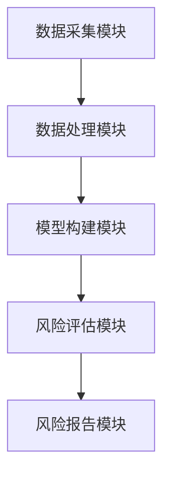
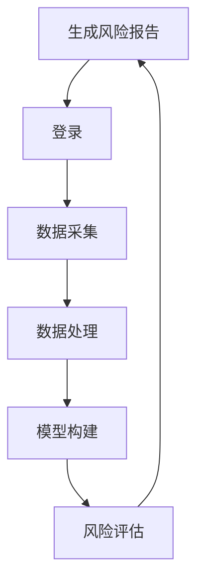

                 


# 《金融衍生品交易对手风险评估模型》

> 关键词：金融衍生品、交易对手风险、信用风险、市场风险、风险评估模型、机器学习、系统架构设计

> 摘要：本文系统地探讨了金融衍生品交易中的交易对手风险评估模型。首先，我们介绍了金融衍生品的基本概念和交易对手风险的核心定义。接着，我们详细分析了交易对手风险的评估方法，包括信用风险和市场风险的量化与管理。随后，我们深入讲解了风险评估模型的构建过程，从数据预处理到特征工程，再到模型训练与优化。我们还探讨了基于机器学习和图论的多种风险评估算法，以及如何将这些模型应用于实际的金融交易系统中。最后，我们通过一个完整的项目案例，展示了如何从数据准备到模型实现，再到系统部署的整个过程。本文旨在为金融机构的风险管理部门提供理论支持和实践指导，帮助他们在复杂多变的金融市场上更好地管理和规避交易对手风险。

---

## 第一部分: 金融衍生品交易对手风险概述

### 第1章: 金融衍生品与交易对手风险

#### 1.1 金融衍生品的基本概念

##### 1.1.1 金融衍生品的定义
金融衍生品（Financial Derivatives）是指一种其价值依赖于其他基础资产或指数的金融工具。它们通常包括期货、期权、掉期和远期合约等类型。金融衍生品的本质是通过约定在未来某一特定时间以预定价格买卖某种资产，从而转移或对冲相关风险。

##### 1.1.2 金融衍生品的分类
金融衍生品可以根据其基础资产的类型、交易场所、结算方式等多种维度进行分类。常见的分类方式包括：
- **基础资产类型**：包括股票、债券、外汇、商品（如原油、黄金）等。
- **交易场所**：场内交易和场外交易。
- **结算方式**：实物交割和现金交割。

##### 1.1.3 金融衍生品的市场现状
近年来，金融衍生品市场迅速发展，成为全球金融市场的重要组成部分。根据国际清算银行（BIS）的数据，全球衍生品市场的规模已超过100万亿美元。然而，金融衍生品的复杂性和杠杆效应也带来了巨大的系统性风险，尤其是在2008年金融危机之后，各国监管机构开始更加关注金融衍生品的风险管理。

#### 1.2 交易对手风险的定义与特征

##### 1.2.1 交易对手风险的定义
交易对手风险（Counterparty Risk）是指在金融交易中，交易对手方无法履行合同义务而给交易主体带来的风险。简单来说，就是交易对手违约的可能性。

##### 1.2.2 交易对手风险的类型
交易对手风险可以分为以下几种类型：
- **信用风险**：交易对手因财务状况恶化而无法履行合同义务的风险。
- **市场风险**：因市场价格波动导致交易对手的资产价值下降，进而影响其履行合同义务的能力。
- **操作风险**：因交易对手内部操作失误或欺诈行为导致的风险。
- **流动性风险**：交易对手因缺乏流动性而无法履行交易义务的风险。

##### 1.2.3 交易对手风险的影响因素
交易对手风险的影响因素包括：
- **交易对手的信用状况**：包括财务状况、评级、历史违约记录等。
- **市场价格波动**：金融衍生品的价格波动会直接影响交易对手的风险敞口。
- **法律和监管环境**：包括合同的法律效力、监管政策的严格程度等。
- **交易对手的交易行为**：包括交易策略、头寸规模、交易频率等。

#### 1.3 交易对手风险评估的重要性

##### 1.3.1 风险评估在金融衍生品交易中的作用
在金融衍生品交易中，交易对手风险评估是确保交易安全的核心环节。通过科学的评估方法，交易主体可以识别和量化交易对手的风险敞口，制定相应的风险管理策略。

##### 1.3.2 交易对手风险评估的必要性
金融衍生品的杠杆效应和复杂性使得交易对手风险评估尤为重要。如果不进行有效的风险评估，交易主体可能面临巨大的损失，甚至引发系统性金融风险。

##### 1.3.3 风险评估对金融机构的影响
对于金融机构而言，交易对手风险评估是其风险管理的核心内容之一。通过有效的风险评估，金融机构可以优化资产配置、降低资本成本、提高交易效率。

#### 1.4 本章小结
本章通过介绍金融衍生品的基本概念和交易对手风险的核心定义，阐述了交易对手风险的类型及其影响因素。我们还强调了交易对手风险评估在金融衍生品交易中的重要性，为后续章节的模型构建奠定了基础。

---

## 第二部分: 交易对手风险评估方法

### 第2章: 交易对手风险评估的核心概念

#### 2.1 信用风险与市场风险

##### 2.1.1 信用风险的定义与评估
信用风险是指交易对手因自身信用状况恶化而无法履行合同义务的风险。信用风险的评估通常包括对交易对手的信用评级、历史违约记录、财务状况等进行分析。

##### 2.1.2 市场风险的定义与评估
市场风险是指市场价格波动导致交易对手资产价值下降，进而影响其履行合同义务能力的风险。市场风险的评估需要考虑金融衍生品的波动性、相关资产的价格走势等因素。

##### 2.1.3 信用风险与市场风险的关系
信用风险和市场风险是相互关联的。市场风险的变化会影响交易对手的信用状况，而信用状况的变化也会反过来影响市场风险。因此，在进行交易对手风险评估时，需要同时考虑信用风险和市场风险。

#### 2.2 交易对手的信用评级

##### 2.2.1 信用评级的定义
信用评级是通过对交易对手的信用状况进行综合评估，确定其信用等级的过程。信用评级通常由专业的评级机构（如穆迪、标普、惠誉等）进行。

##### 2.2.2 信用评级的方法
信用评级的方法主要包括：
- **定量分析**：通过财务指标（如杠杆率、利润率、流动比率等）进行评估。
- **定性分析**：通过交易对手的行业地位、管理团队、市场环境等因素进行评估。

##### 2.2.3 信用评级的影响因素
信用评级的影响因素包括：
- **财务状况**：包括收入、利润、负债等。
- **行业风险**：包括行业周期性、竞争状况等。
- **管理团队**：包括管理层的稳定性、决策能力等。
- **法律和监管环境**：包括政策稳定性、法律环境等。

#### 2.3 交易对手的风险敞口分析

##### 2.3.1 风险敞口的定义
风险敞口是指交易对手在某一特定金融产品或市场中所承担的风险程度。风险敞口的大小取决于交易对手的头寸规模、市场参与程度等因素。

##### 2.3.2 风险敞口的计算方法
风险敞口的计算方法通常包括：
- **VaR（Value at Risk）方法**：计算在一定置信水平下，资产组合可能遭受的最大损失。
- **CVaR（Conditional Value at Risk）方法**：计算在VaR基础上，考虑极端情况下的损失。

##### 2.3.3 风险敞口的管理策略
风险敞口的管理策略包括：
- **分散投资**：通过投资多种不同的资产或市场来降低风险敞口。
- **对冲交易**：通过衍生品对冲头寸，降低风险敞口。
- **风险限额**：设定风险敞口的上限，防止过度风险暴露。

#### 2.4 本章小结
本章通过分析信用风险与市场风险的关系，介绍了交易对手信用评级的方法和影响因素，并详细讲解了风险敞口的计算方法和管理策略。这些内容为后续的风险评估模型构建奠定了理论基础。

---

## 第三部分: 风险评估模型的构建与实现

### 第3章: 风险评估模型的构建基础

#### 3.1 数据收集与处理

##### 3.1.1 数据来源与类型
交易对手风险评估模型所需的数据来源包括：
- **内部数据**：包括交易记录、财务报表、内部评级等。
- **外部数据**：包括市场数据（如股票价格、汇率）、信用评级数据、宏观经济数据等。

##### 3.1.2 数据清洗与预处理
数据清洗与预处理是构建模型的基础步骤，主要包括：
- **数据清洗**：删除重复数据、处理缺失值、纠正错误数据。
- **数据标准化**：对不同量纲的数据进行标准化处理，确保模型的输入具有可比性。
- **数据特征提取**：从原始数据中提取有助于模型构建的关键特征。

##### 3.1.3 数据特征工程
特征工程是数据预处理的重要环节，主要包括：
- **特征选择**：通过统计分析、相关性分析等方法，选择对风险评估具有重要意义的特征。
- **特征变换**：对原始特征进行线性或非线性变换，提高模型的性能。
- **特征组合**：通过组合多个特征，生成新的特征，提高模型的表达能力。

#### 3.2 模型选择与训练

##### 3.2.1 模型选择
模型选择是构建风险评估模型的关键步骤，需要根据数据特征、业务需求和模型性能进行综合考虑。常用的模型包括：
- **线性回归**：适用于线性关系的预测。
- **逻辑回归**：适用于二分类问题，常用于信用风险评估。
- **支持向量机（SVM）**：适用于小样本、高维数据的分类和回归问题。
- **随机森林**：适用于非线性关系的预测，具有较强的抗过拟合能力。
- **神经网络**：适用于复杂非线性关系的预测，但需要较多的数据和计算资源。

##### 3.2.2 模型训练
模型训练是通过优化算法，调整模型参数，使模型在训练数据上具有最佳的拟合能力。常用的优化算法包括：
- **梯度下降**：适用于线性回归、神经网络等模型的优化。
- **Adam优化器**：适用于深度学习模型的优化，具有自适应学习率的优点。

##### 3.2.3 模型验证与调优
模型验证是通过测试数据评估模型的性能，常用指标包括准确率、召回率、F1值等。模型调优是通过调整模型参数，优化模型的性能，常用方法包括网格搜索、随机搜索等。

#### 3.3 模型优化与部署

##### 3.3.1 模型优化
模型优化是通过改进模型结构、优化算法参数等方法，进一步提高模型的性能。常用的优化方法包括：
- **正则化**：通过添加正则化项，防止模型过拟合。
- **集成学习**：通过集成多个模型的结果，提高模型的稳定性和准确性。
- **超参数调优**：通过网格搜索、随机搜索等方法，找到最佳的超参数组合。

##### 3.3.2 模型部署
模型部署是将构建好的风险评估模型应用于实际业务场景的过程。通常包括：
- **API接口设计**：通过设计API接口，方便其他系统调用模型服务。
- **模型监控**：通过实时监控模型的性能，及时发现和处理模型退化问题。
- **模型更新**：根据市场环境的变化，定期更新模型，保持模型的性能。

#### 3.4 本章小结
本章详细讲解了风险评估模型的构建基础，包括数据收集与处理、模型选择与训练、模型优化与部署等内容。通过这些步骤，我们可以构建一个高效、稳定的交易对手风险评估模型。

---

## 第四部分: 基于机器学习的交易对手风险评估模型

### 第4章: 机器学习算法在风险评估中的应用

#### 4.1 逻辑回归模型

##### 4.1.1 逻辑回归的原理
逻辑回归是一种常用的二分类算法，适用于信用风险评估。其原理是通过构建一个线性回归模型，将输入特征映射到一个概率空间，然后通过sigmoid函数将概率转化为类别标签。

##### 4.1.2 逻辑回归的实现
逻辑回归的实现步骤包括：
1. 数据预处理：包括数据清洗、特征选择、数据标准化等。
2. 模型训练：通过最大似然估计法，优化模型参数。
3. 模型评估：通过测试数据评估模型的性能，计算准确率、召回率等指标。
4. 模型部署：通过API接口或其他方式，将模型应用于实际业务场景。

##### 4.1.3 逻辑回归的应用案例
我们通过一个简单的案例，展示了如何使用逻辑回归模型进行交易对手信用风险评估。案例包括数据准备、模型训练、模型评估和模型部署四个阶段。

#### 4.2 随机森林模型

##### 4.2.1 随机森林的原理
随机森林是一种基于树的集成学习算法，适用于分类和回归问题。其原理是通过随机采样特征和样本，构建多棵决策树，并通过投票或平均的方式进行预测。

##### 4.2.2 随机森林的实现
随机森林的实现步骤包括：
1. 数据预处理：包括数据清洗、特征选择、数据标准化等。
2. 模型训练：通过随机采样特征和样本，构建多棵决策树。
3. 模型评估：通过测试数据评估模型的性能，计算准确率、召回率等指标。
4. 模型部署：通过API接口或其他方式，将模型应用于实际业务场景。

##### 4.2.3 随机森林的应用案例
我们通过一个案例，展示了如何使用随机森林模型进行交易对手信用风险评估。案例包括数据准备、模型训练、模型评估和模型部署四个阶段。

#### 4.3 支持向量机模型

##### 4.3.1 支持向量机的原理
支持向量机是一种常用的分类算法，适用于小样本、高维数据的分类问题。其原理是通过构建一个超平面，将数据点映射到高维空间，然后通过支持向量进行分类。

##### 4.3.2 支持向量机的实现
支持向量机的实现步骤包括：
1. 数据预处理：包括数据清洗、特征选择、数据标准化等。
2. 模型训练：通过优化算法，找到最佳的超平面。
3. 模型评估：通过测试数据评估模型的性能，计算准确率、召回率等指标。
4. 模型部署：通过API接口或其他方式，将模型应用于实际业务场景。

##### 4.3.3 支持向量机的应用案例
我们通过一个案例，展示了如何使用支持向量机模型进行交易对手信用风险评估。案例包括数据准备、模型训练、模型评估和模型部署四个阶段。

#### 4.4 本章小结
本章详细讲解了机器学习算法在交易对手风险评估中的应用，包括逻辑回归、随机森林和支持向量机等算法的原理、实现和应用案例。

---

## 第五部分: 系统分析与架构设计

### 第5章: 系统架构设计

#### 5.1 交易对手风险评估系统的需求分析

##### 5.1.1 项目背景与目标
交易对手风险评估系统的开发背景是金融衍生品市场的快速发展和交易对手风险的日益复杂。系统的开发目标是通过构建一个高效的交易对手风险评估模型，帮助金融机构识别和量化交易对手风险，制定有效的风险管理策略。

##### 5.1.2 功能需求
交易对手风险评估系统的主要功能包括：
- **数据采集**：从多种数据源采集交易对手的相关数据。
- **数据处理**：对采集到的数据进行清洗、预处理和特征工程。
- **模型构建**：基于机器学习算法，构建交易对手风险评估模型。
- **风险评估**：根据模型预测交易对手的风险等级。
- **风险报告**：生成风险评估报告，提供风险管理和决策支持。

##### 5.1.3 系统边界与接口
系统边界是指系统与外部环境的交互界面。交易对手风险评估系统的接口包括：
- **数据接口**：与数据源（如数据库、API接口）进行数据交互。
- **用户接口**：与用户（如风险管理部门）进行交互，提供风险评估结果和报告。

#### 5.2 系统架构设计

##### 5.2.1 系统架构设计的总体思路
系统架构设计的总体思路是基于模块化设计，将系统划分为多个功能模块，每个模块负责特定的功能。通过模块化设计，可以提高系统的可维护性和扩展性。

##### 5.2.2 功能模块设计
交易对手风险评估系统的功能模块包括：
- **数据采集模块**：负责从多种数据源采集交易对手的相关数据。
- **数据处理模块**：负责对采集到的数据进行清洗、预处理和特征工程。
- **模型构建模块**：负责基于机器学习算法，构建交易对手风险评估模型。
- **风险评估模块**：负责根据模型预测交易对手的风险等级。
- **风险报告模块**：负责生成风险评估报告，提供风险管理和决策支持。

##### 5.2.3 模块之间的交互关系
模块之间的交互关系可以通过Mermaid图来描述。例如：



#### 5.3 系统架构实现

##### 5.3.1 技术选型
系统架构实现的技术选型包括：
- **编程语言**：Python
- **机器学习框架**：Scikit-learn、XGBoost
- **数据存储**：MySQL、MongoDB
- **前端框架**：React
- **后端框架**：Django

##### 5.3.2 系统架构图
系统架构图可以通过Mermaid图来描述。例如：


#### 5.4 本章小结
本章详细讲解了交易对手风险评估系统的系统架构设计，包括需求分析、功能模块设计和系统架构实现等内容。通过模块化设计，我们可以构建一个高效、稳定的交易对手风险评估系统。

---

## 第六部分: 项目实战

### 第6章: 交易对手风险评估系统开发实战

#### 6.1 项目环境搭建

##### 6.1.1 安装开发环境
开发环境的搭建包括安装Python、Jupyter Notebook、虚拟环境等。例如，使用Anaconda安装Python和虚拟环境。

##### 6.1.2 数据源准备
数据源包括交易对手的历史交易数据、财务报表、信用评级数据等。数据源可以通过API接口或其他方式获取。

##### 6.1.3 安装所需库
安装所需的Python库，例如：
```bash
pip install numpy
pip install pandas
pip install scikit-learn
pip install xgboost
pip install sqlalchemy
pip install flask
```

#### 6.2 系统核心实现

##### 6.2.1 数据采集模块实现
数据采集模块的实现包括：
- **数据清洗**：删除重复数据、处理缺失值。
- **数据预处理**：对数据进行标准化、归一化处理。
- **特征工程**：从数据中提取关键特征，进行特征选择和特征变换。

##### 6.2.2 模型构建模块实现
模型构建模块的实现包括：
- **数据分割**：将数据划分为训练集和测试集。
- **模型训练**：使用机器学习算法（如逻辑回归、随机森林、XGBoost）进行模型训练。
- **模型评估**：通过测试数据评估模型的性能，计算准确率、召回率等指标。
- **模型优化**：通过超参数调优、正则化等方法优化模型性能。

##### 6.2.3 风险评估模块实现
风险评估模块的实现包括：
- **风险预测**：根据模型预测交易对手的风险等级。
- **风险报告生成**：生成风险评估报告，包括风险等级、风险敞口、风险管理建议等内容。

##### 6.2.4 系统接口设计
系统接口设计包括：
- **API接口设计**：通过Flask框架设计API接口，方便其他系统调用模型服务。
- **数据接口设计**：通过SQLAlchemy与数据库进行交互，存储和检索数据。

##### 6.2.5 系统交互设计
系统交互设计包括：
- **用户界面设计**：通过React框架设计用户界面，提供直观的操作界面。
- **系统交互流程**：通过Mermaid图描述系统交互流程，例如：



#### 6.3 项目实战小结
本章通过一个完整的项目案例，展示了如何从数据准备到模型实现，再到系统部署的整个过程。通过实际操作，读者可以掌握交易对手风险评估系统的开发流程和技术要点。

---

## 第七部分: 最佳实践与小结

### 第7章: 最佳实践与小结

#### 7.1 最佳实践

##### 7.1.1 数据处理
- 数据清洗：删除重复数据、处理缺失值。
- 数据预处理：对数据进行标准化、归一化处理。
- 特征工程：从数据中提取关键特征，进行特征选择和特征变换。

##### 7.1.2 模型选择
- 根据数据特征和业务需求选择合适的模型。
- 通过网格搜索、随机搜索等方法进行超参数调优。
- 使用集成学习方法提高模型的性能。

##### 7.1.3 系统架构设计
- 模块化设计：将系统划分为多个功能模块，提高系统的可维护性和扩展性。
- 技术选型：选择合适的编程语言、机器学习框架和数据库。
- 系统交互设计：通过API接口和其他系统进行交互，确保系统的灵活性和可扩展性。

##### 7.1.4 项目管理
- 项目计划：制定详细的项目计划，包括时间安排、资源分配等。
- 项目监控：通过实时监控模型的性能，及时发现和处理问题。
- 项目文档：编写详细的项目文档，包括需求分析、系统设计、实现方案等。

#### 7.2 小结

##### 7.2.1 交易对手风险评估模型的理论基础
交易对手风险评估模型的理论基础包括金融衍生品的基本概念、交易对手风险的核心定义、信用风险与市场风险的关系等内容。

##### 7.2.2 交易对手风险评估模型的实现方法
交易对手风险评估模型的实现方法包括数据处理、模型选择、模型训练、模型优化和模型部署等内容。

##### 7.2.3 交易对手风险评估模型的系统架构设计
交易对手风险评估模型的系统架构设计包括功能模块设计、系统架构图、技术选型和系统交互设计等内容。

##### 7.2.4 交易对手风险评估模型的项目实战
交易对手风险评估模型的项目实战包括项目环境搭建、系统核心实现、系统接口设计和系统交互设计等内容。

#### 7.3 注意事项

##### 7.3.1 数据隐私与安全
在数据处理和模型部署过程中，需要特别注意数据隐私和安全问题，避免数据泄露和滥用。

##### 7.3.2 模型的可解释性
在模型部署过程中，需要考虑模型的可解释性，以便用户理解和信任模型的预测结果。

##### 7.3.3 系统的可扩展性
在系统架构设计过程中，需要考虑系统的可扩展性，以便未来业务需求的变化。

#### 7.4 拓展阅读

##### 7.4.1 推荐书籍
- 《机器学习实战》
- 《金融风险管理》
- 《系统架构设计》

##### 7.4.2 推荐博客和资源
- [机器学习博客](https://www.blog.com)
- [金融风险管理博客](https://www.risk.com)
- [系统架构设计资源](https://www架构设计.com)

---

## 作者信息

作者：AI天才研究院/AI Genius Institute & 禅与计算机程序设计艺术 /Zen And The Art of Computer Programming

