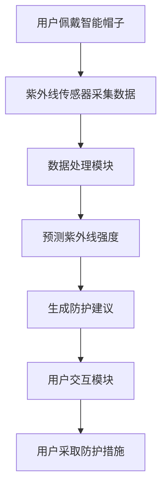
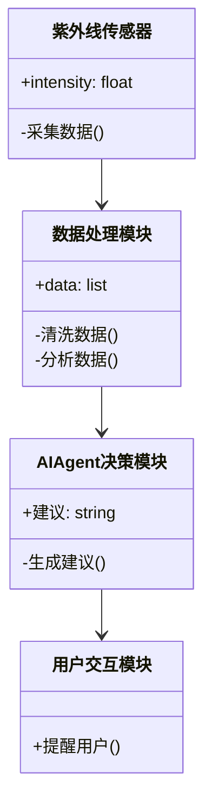

                 


# AI Agent在智能帽子中的紫外线防护提醒

> 关键词：AI Agent，紫外线防护，智能帽子，机器学习，算法实现

> 摘要：本文详细探讨了AI Agent在智能帽子中的紫外线防护提醒功能的设计与实现。通过分析紫外线防护的重要性，结合AI Agent的核心概念与算法原理，构建了一个基于机器学习的紫外线强度预测模型，并设计了相应的系统架构。文章还通过实际案例展示了系统的实现过程，并提出了最佳实践建议。

---

# 第1章: 背景介绍与问题背景

## 1.1 紫外线防护的重要性

### 1.1.1 紫外线的危害与防护需求
紫外线是太阳光中的一部分，分为UVA、UVB和UVC三种类型。其中，UVB是导致皮肤晒伤和皮肤癌的主要原因，而UVA则会导致皮肤老化和色素沉着。随着全球气候变化和臭氧层的破坏，紫外线的强度逐年增加，对人类健康构成了严重威胁。

智能帽子作为一种时尚与功能结合的可穿戴设备，能够通过集成紫外线传感器和AI Agent技术，实时监测紫外线强度，并为用户提供个性化的防护建议。

### 1.1.2 智能帽子的发展趋势
近年来，可穿戴设备市场快速增长，智能帽子作为一种新兴的智能设备，逐渐受到消费者的关注。智能帽子不仅可以提供基础的天气预报、时间显示等功能，还可以通过集成AI技术，实现更复杂的智能化服务，如紫外线防护提醒。

### 1.1.3 AI Agent在智能帽子中的应用价值
AI Agent（人工智能代理）是一种能够感知环境、自主决策并执行任务的智能实体。在智能帽子中，AI Agent可以实时分析紫外线数据，结合用户的皮肤敏感度、地理位置和天气条件，提供个性化的防护建议，从而提升用户体验和健康水平。

---

## 1.2 问题描述与解决思路

### 1.2.1 紫外线防护提醒的核心问题
传统紫外线防护主要依赖于用户手动查看紫外线指数或天气预报，这种方式存在以下问题：
1. **实时性不足**：用户需要主动查询紫外线指数，无法实时获得防护建议。
2. **个性化不足**：不同用户的皮肤敏感度不同，需要个性化的防护策略。
3. **交互性不足**：用户无法通过简单的设备获得实时的防护指导。

### 1.2.2 AI Agent在紫外线防护中的作用
AI Agent通过实时监测紫外线强度、分析用户需求和环境条件，能够主动为用户提供个性化的防护建议。具体作用包括：
1. **实时监测**：通过内置的紫外线传感器，实时获取紫外线强度数据。
2. **智能决策**：基于机器学习模型，分析紫外线强度、天气条件和用户需求，生成防护建议。
3. **主动提醒**：通过震动或语音提醒用户采取防护措施。

### 1.2.3 智能帽子系统的设计目标与边界
智能帽子系统的总体目标是实现紫外线防护提醒功能，具体目标包括：
- 实现实时紫外线强度监测。
- 提供个性化的防护建议。
- 通过AI Agent实现智能化决策。

系统边界包括：
- 紫外线传感器、AI Agent模块和用户交互模块。
- 支持蓝牙或Wi-Fi连接到手机APP进行数据同步。

---

## 1.3 紫外线防护提醒系统的概念结构

### 1.3.1 系统核心要素分析
紫外线防护提醒系统主要包括以下核心要素：
1. **紫外线传感器**：用于实时监测紫外线强度。
2. **AI Agent模块**：负责数据处理、决策和提醒。
3. **用户交互模块**：通过震动、语音或LED灯提示用户采取防护措施。
4. **用户数据**：包括用户的皮肤敏感度、地理位置和使用习惯。

### 1.3.2 系统功能模块划分
系统功能模块包括：
1. **数据采集模块**：负责采集紫外线强度数据。
2. **数据处理模块**：对数据进行清洗、分析和预测。
3. **决策模块**：基于预测结果生成防护建议。
4. **用户交互模块**：将防护建议以用户可感知的方式呈现。

### 1.3.3 系统与外部环境的交互关系
系统与外部环境的交互主要通过紫外线传感器和用户交互模块实现。紫外线传感器与外部环境中的太阳辐射场发生作用，用户交互模块与用户发生交互，提供实时反馈。

---

## 1.4 本章小结

本章通过分析紫外线防护的重要性，介绍了智能帽子的发展趋势，阐述了AI Agent在智能帽子中的应用价值。同时，详细描述了紫外线防护提醒系统的功能模块和系统架构，为后续章节的算法实现和系统设计奠定了基础。

---

# 第2章: AI Agent的核心概念与工作原理

## 2.1 AI Agent的基本定义

### 2.1.1 人工智能代理的定义与分类
AI Agent是一种能够感知环境、自主决策并执行任务的智能实体。根据功能不同，AI Agent可以分为以下几类：
1. **反应式代理**：基于当前感知做出反应，适用于简单的任务。
2. **认知式代理**：具备复杂推理和规划能力，适用于复杂的任务。

### 2.1.2 AI Agent的核心属性与特征
AI Agent的核心属性包括：
1. **自主性**：能够在没有外部干预的情况下自主运行。
2. **反应性**：能够感知环境并实时做出反应。
3. **学习能力**：能够通过数据学习和优化。

### 2.1.3 AI Agent与传统算法的区别
传统算法通常基于规则或固定的逻辑执行任务，而AI Agent具备自主决策和学习能力，能够根据环境变化动态调整行为。

---

## 2.2 AI Agent在紫外线防护中的应用

### 2.2.1 紫外线监测与防护需求分析
智能帽子通过内置紫外线传感器，实时监测紫外线强度，并结合用户的皮肤敏感度和地理位置，提供个性化的防护建议。

### 2.2.2 AI Agent在智能帽子中的功能实现
AI Agent通过以下步骤实现紫外线防护提醒功能：
1. **数据采集**：采集紫外线强度数据。
2. **数据处理**：分析数据并预测紫外线强度。
3. **决策制定**：根据预测结果生成防护建议。
4. **用户交互**：通过震动或语音提醒用户。

### 2.2.3 紫外线防护提醒的触发机制
AI Agent根据紫外线强度和用户的皮肤敏感度，动态调整提醒策略。例如，当紫外线强度超过阈值时，AI Agent会立即触发提醒。

---

## 2.3 AI Agent的核心算法与实现

### 2.3.1 机器学习算法在紫外线防护中的应用
机器学习算法可以用于紫外线强度预测。常用的算法包括：
1. **线性回归**：用于简单的线性关系建模。
2. **支持向量机（SVM）**：用于分类和回归任务。
3. **随机森林**：用于非线性关系建模。

### 2.3.2 AI Agent的决策逻辑与推理机制
AI Agent的决策逻辑基于紫外线强度预测模型和用户需求分析。例如：
1. 如果紫外线强度高于阈值且用户皮肤敏感度高，AI Agent会触发强烈的防护提醒。
2. 如果紫外线强度较低，AI Agent会建议用户可以安全地进行户外活动。

### 2.3.3 紫外线强度预测模型的构建
紫外线强度预测模型可以通过以下步骤构建：
1. **数据采集**：收集紫外线强度、地理位置和天气条件等数据。
2. **特征提取**：提取对紫外线强度影响较大的特征，如时间、天气和地理位置。
3. **模型训练**：使用机器学习算法训练模型。
4. **模型优化**：通过交叉验证优化模型性能。

---

## 2.4 本章小结

本章详细介绍了AI Agent的核心概念和工作原理，分析了其在紫外线防护中的应用，并通过机器学习算法构建了紫外线强度预测模型。这些内容为后续章节的系统设计和实现奠定了基础。

---

# 第3章: 紫外线防护提醒系统的算法原理

## 3.1 紫外线强度预测模型

### 3.1.1 数据采集与特征提取
数据采集包括紫外线强度、地理位置、天气条件和时间等数据。特征提取主要关注对紫外线强度影响较大的因素，如时间、天气和地理位置。

### 3.1.2 机器学习算法的选择与实现
选择随机森林算法进行紫外线强度预测，因为其能够处理非线性关系，并且对特征的重要性有较高的解释性。

### 3.1.3 模型训练与优化
通过交叉验证优化模型参数，确保模型具有较高的泛化能力。

---

## 3.2 AI Agent的决策逻辑

### 3.2.1 基于紫外线强度的防护策略
根据紫外线强度和用户需求，动态调整防护建议。例如：
- 当紫外线强度为3（中等）时，建议用户使用防晒霜。
- 当紫外线强度为4（强烈）时，建议用户佩戴帽子和太阳镜。

### 3.2.2 AI Agent的多条件判断逻辑
AI Agent通过以下步骤实现多条件判断：
1. 采集紫外线强度、天气条件和用户需求。
2. 分析数据并生成防护建议。
3. 触发用户交互模块进行提醒。

---

## 3.3 算法实现的数学模型

### 3.3.1 紫外线强度预测的数学公式
紫外线强度预测公式如下：
$$ UV_{index} = \alpha \cdot time\_of\_day + \beta \cdot weather\_condition + \gamma \cdot location\_latitude $$

### 3.3.2 AI Agent的决策树模型
决策树模型用于判断用户的皮肤敏感度和紫外线强度，生成相应的防护建议。

---

## 3.4 本章小结

本章通过构建紫外线强度预测模型和AI Agent的决策逻辑，详细讲解了算法实现的数学模型和流程。这些内容为后续章节的系统架构设计提供了理论支持。

---

# 第4章: 紫外线防护提醒系统的系统架构设计

## 4.1 系统整体架构

### 4.1.1 系统模块划分
系统模块包括：
1. **数据采集模块**：负责采集紫外线强度数据。
2. **数据处理模块**：对数据进行清洗、分析和预测。
3. **决策模块**：基于预测结果生成防护建议。
4. **用户交互模块**：通过震动或语音提醒用户。

### 4.1.2 系统功能流程图
以下是系统功能流程图：



---

## 4.2 系统功能设计

### 4.2.1 紫外线监测模块
紫外线监测模块通过传感器采集紫外线强度数据，并将其传输到数据处理模块。

### 4.2.2 AI Agent决策模块
AI Agent决策模块基于预测结果生成防护建议，并通过用户交互模块触发提醒。

### 4.2.3 用户交互模块
用户交互模块通过震动、语音或LED灯提示用户采取防护措施。

---

## 4.3 系统架构的详细设计

### 4.3.1 系统组件之间的关系
系统组件之间的关系可以通过以下类图表示：



---

## 4.4 本章小结

本章详细设计了紫外线防护提醒系统的系统架构，包括模块划分、功能流程和系统组件之间的关系。这些设计为后续章节的项目实现提供了清晰的指导。

---

# 第5章: 项目实战

## 5.1 环境安装与配置

### 5.1.1 系统需求
- Python 3.8+
- NumPy、Scikit-learn等库
- 紫外线传感器（可模拟数据）

### 5.1.2 安装依赖
```bash
pip install numpy scikit-learn
```

---

## 5.2 系统核心实现源代码

### 5.2.1 数据采集与处理
```python
import numpy as np
from sklearn.ensemble import RandomForestRegressor

# 模拟紫外线数据
data = {
    'time_of_day': np.random.randint(0, 24, 100),
    'weather_condition': np.random.randint(0, 5, 100),
    'location_latitude': np.random.uniform(30, 60, 100)
}
target = np.random.randint(1, 5, 100)
```

### 5.2.2 模型训练
```python
model = RandomForestRegressor(n_estimators=100, random_state=42)
model.fit(data[['time_of_day', 'weather_condition', 'location_latitude']], target)
```

### 5.2.3 预测与决策
```python
def generate_recommendation(intensity, skin_sensitivity):
    if intensity >= 4 and skin_sensitivity == 'high':
        return "强烈建议使用防晒霜和帽子"
    elif intensity >= 3 and skin_sensitivity == 'medium':
        return "建议使用防晒霜"
    else:
        return "无需特别防护"
```

---

## 5.3 案例分析与详细讲解

### 5.3.1 案例分析
假设某用户的皮肤敏感度为“high”，当前紫外线强度为4。AI Agent会生成以下建议：
```
建议：强烈建议使用防晒霜和帽子
```

### 5.3.2 系统优化与改进
通过实时数据反馈，优化紫外线强度预测模型，提高预测精度和决策准确性。

---

## 5.4 本章小结

本章通过实际案例展示了紫外线防护提醒系统的实现过程，包括环境安装、代码实现和案例分析。这些内容帮助读者更好地理解系统的设计与实现。

---

# 第6章: 最佳实践、小结与展望

## 6.1 最佳实践

### 6.1.1 数据采集与处理
- 确保数据的准确性和完整性。
- 使用数据清洗和特征选择技术提高模型性能。

### 6.1.2 系统优化
- 定期更新模型参数，提高预测精度。
- 优化用户交互设计，提升用户体验。

### 6.1.3 安全与隐私
- 确保用户数据的安全性。
- 遵守相关法律法规，保护用户隐私。

---

## 6.2 本章小结

本章总结了紫外线防护提醒系统的最佳实践，包括数据处理、系统优化和安全与隐私等方面。这些内容为读者提供了实际操作的指导。

---

## 6.3 未来展望

随着AI技术的不断发展，紫外线防护提醒系统将更加智能化和个性化。未来的研究方向包括：
1. **更精准的紫外线预测模型**：结合更多的环境因素，提高预测精度。
2. **更个性化的防护建议**：根据用户的健康状况和生活习惯，提供更个性化的防护建议。
3. **更智能的交互方式**：通过语音助手和手势识别，实现更自然的交互。

---

# 作者：AI天才研究院/AI Genius Institute & 禅与计算机程序设计艺术 /Zen And The Art of Computer Programming

