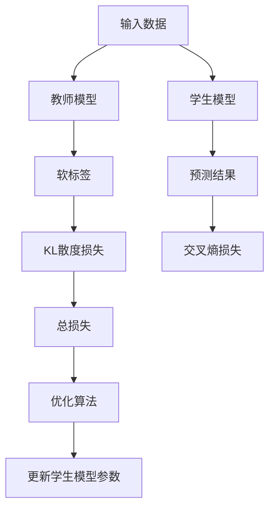
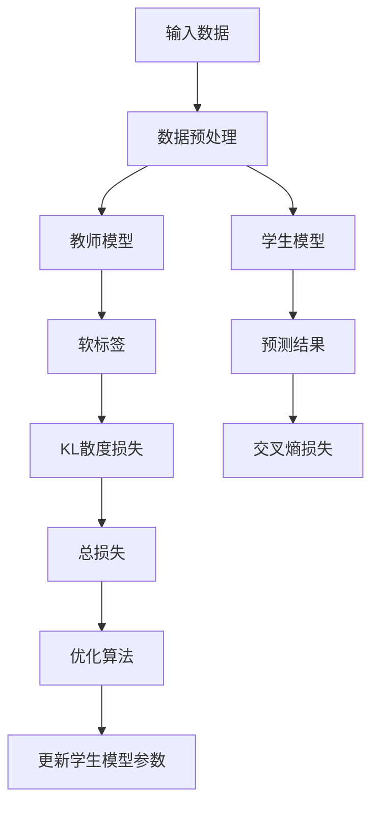
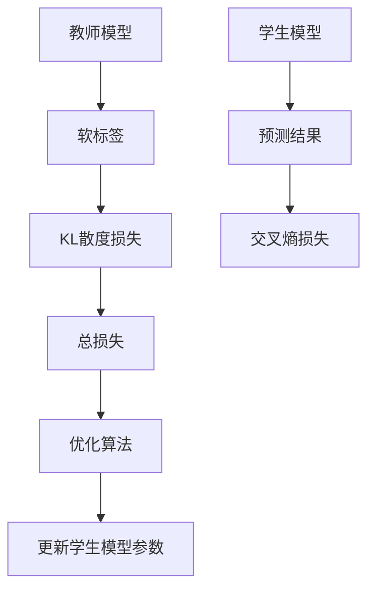

                 


# AI Agent的知识蒸馏技术应用

> **关键词**：AI Agent，知识蒸馏，模型压缩，教师模型，学生模型，深度学习

> **摘要**：  
> 知识蒸馏技术是一种通过将复杂模型的知识迁移到简单模型的技术，近年来在AI Agent领域得到了广泛应用。本文从知识蒸馏技术的背景与概念入手，详细阐述其核心原理、数学模型、系统架构设计、项目实战及最佳实践，帮助读者全面理解并掌握这一技术。通过本文的讲解，读者能够了解如何在实际项目中应用知识蒸馏技术，优化AI Agent的性能与效率。

---

# 第1章: 知识蒸馏技术的背景与概念

## 1.1 知识蒸馏技术的起源与发展

### 1.1.1 知识蒸馏技术的定义  
知识蒸馏（Knowledge Distillation）是一种通过将复杂模型（教师模型）的知识迁移到简单模型（学生模型）的技术。其核心思想是通过知识转移，使学生模型能够继承教师模型的优秀性能，同时具备更小的模型体积和更高的运行效率。

### 1.1.2 知识蒸馏技术的核心目标  
知识蒸馏技术的核心目标是将复杂的深度学习模型（如大型语言模型、图像分类模型等）的知识迁移到更小、更高效的模型中，从而在资源受限的场景下（如移动设备、边缘计算等）实现高性能的AI应用。

### 1.1.3 知识蒸馏技术与AI Agent的结合  
AI Agent（人工智能代理）是一种能够感知环境、执行任务并做出决策的智能实体。通过知识蒸馏技术，可以将大型模型的知识迁移到轻量级的AI Agent中，使其在资源受限的环境中仍能保持高效的性能。

## 1.2 AI Agent的基本概念

### 1.2.1 AI Agent的定义与分类  
AI Agent是一种能够通过感知环境、执行任务并做出决策的智能实体。根据功能和应用场景的不同，AI Agent可以分为多种类型，如基于规则的Agent、基于模型的Agent、基于学习的Agent等。

### 1.2.2 AI Agent的核心功能与特点  
AI Agent的核心功能包括感知、推理、规划和执行。其特点在于能够根据环境反馈动态调整行为，具备自主决策的能力。

### 1.2.3 知识蒸馏技术在AI Agent中的作用  
在AI Agent中，知识蒸馏技术主要用于将复杂模型的知识迁移到轻量级模型中，从而在资源受限的场景下实现高性能的推理和决策。

---

# 第2章: 知识蒸馏技术的核心原理

## 2.1 知识蒸馏技术的原理分析

### 2.1.1 知识蒸馏技术的数学模型  
知识蒸馏技术的核心是通过损失函数将教师模型的知识迁移到学生模型中。损失函数通常包括两个部分：一个是学生模型与真实标签之间的交叉熵损失，另一个是学生模型与教师模型软标签之间的KL散度损失。

$$ \mathcal{L} = \alpha \mathcal{L}_{\text{CE}} + (1-\alpha) \mathcal{L}_{\text{KL}} $$  

其中，$\mathcal{L}_{\text{CE}}$是交叉熵损失，$\mathcal{L}_{\text{KL}}$是KL散度损失，$\alpha$是平衡系数。

### 2.1.2 知识蒸馏技术的核心算法  
知识蒸馏技术的核心算法包括以下步骤：  
1. 预训练教师模型。  
2. 使用教师模型的输出作为软标签，指导学生模型的训练。  
3. 在训练过程中优化学生模型的参数，使其同时匹配软标签和真实标签。  

### 2.1.3 知识蒸馏技术的实现步骤  
1. 预训练教师模型。  
2. 初始化学生模型。  
3. 训练学生模型，使用交叉熵损失和KL散度损失的加权和作为目标函数。  
4. 调整平衡系数$\alpha$，优化学生模型的性能。

### 2.2 知识蒸馏技术与传统模型压缩技术的对比

#### 2.2.1 模型剪枝技术的原理与特点  
模型剪枝（Model Pruning）是一种通过删除模型中冗余参数来减小模型体积的技术。其特点是简单且易于实现，但剪枝后模型的性能可能下降。

#### 2.2.2 模型量化技术的原理与特点  
模型量化（Model Quantization）是一种通过降低模型参数的精度（如从浮点数降到定点数）来减小模型体积的技术。其特点是压缩效果显著，但可能会影响模型的精度。

#### 2.2.3 知识蒸馏技术与剪枝、量化的对比分析  
知识蒸馏技术的核心目标是将教师模型的知识迁移到学生模型中，而不仅仅是压缩模型体积。与剪枝和量化技术相比，知识蒸馏技术能够更好地保持模型的性能，同时减小模型体积。

---

# 第3章: 知识蒸馏技术的数学模型与公式

## 3.1 知识蒸馏技术的损失函数

### 3.1.1 知识蒸馏损失函数的定义  
知识蒸馏损失函数由交叉熵损失和KL散度损失两部分组成。交叉熵损失用于匹配学生模型与真实标签，KL散度损失用于匹配学生模型与教师模型的软标签。

### 3.1.2 知识蒸馏损失函数的公式推导  
交叉熵损失：  
$$ \mathcal{L}_{\text{CE}} = -\sum_{i=1}^{n} y_i \log p_i $$  

KL散度损失：  
$$ \mathcal{L}_{\text{KL}} = \sum_{i=1}^{n} p_i \log \frac{p_i}{q_i} $$  

总损失函数：  
$$ \mathcal{L} = \alpha \mathcal{L}_{\text{CE}} + (1-\alpha) \mathcal{L}_{\text{KL}} $$  

### 3.1.3 知识蒸馏损失函数的优化方法  
通过调整平衡系数$\alpha$，可以优化知识蒸馏损失函数。通常，$\alpha$的取值范围在0到1之间，$\alpha$越大，交叉熵损失的权重越大。

## 3.2 知识蒸馏技术的优化算法

### 3.2.1 知识蒸馏技术的优化目标  
知识蒸馏技术的优化目标是通过损失函数的优化，使学生模型的性能尽可能接近教师模型。

### 3.2.2 知识蒸馏技术的优化算法选择  
常用的优化算法包括随机梯度下降（SGD）、Adam等。在知识蒸馏技术中，通常选择Adam优化算法。

### 3.2.3 知识蒸馏技术的优化效果分析  
通过优化算法的选择和调整，可以显著提高学生模型的性能，同时减小模型体积。

---

# 第4章: 知识蒸馏技术的系统架构与设计

## 4.1 知识蒸馏技术的系统架构

### 4.1.1 知识蒸馏系统的整体架构  
知识蒸馏系统通常包括教师模型、学生模型和知识蒸馏模块三部分。教师模型负责生成软标签，学生模型负责学习教师模型的知识，知识蒸馏模块负责协调两者的训练过程。

### 4.1.2 教师模型与学生模型的交互流程  
1. 教师模型接收输入数据，生成软标签。  
2. 学生模型接收输入数据，生成预测结果。  
3. 知识蒸馏模块计算学生模型与软标签之间的KL散度损失。  
4. 学生模型通过优化算法更新参数，减少损失函数值。

### 4.1.3 知识蒸馏系统的功能模块划分  
知识蒸馏系统通常包括以下功能模块：  
- 输入数据预处理模块。  
- 教师模型预测模块。  
- 学生模型训练模块。  
- 损失函数计算模块。  
- 模型优化模块。

## 4.2 知识蒸馏技术的系统设计

### 4.2.1 系统功能需求分析  
知识蒸馏系统的功能需求包括：  
1. 支持多种输入数据格式。  
2. 支持多种教师模型和学生模型。  
3. 提供灵活的知识蒸馏参数配置。  
4. 提供性能评估工具。

### 4.2.2 系统功能设计的领域模型  
知识蒸馏系统的领域模型包括以下实体：  
- 输入数据。  
- 教师模型。  
- 学生模型。  
- 损失函数。  
- 优化算法。

### 4.2.3 系统功能设计的架构图  
以下是知识蒸馏系统的架构图：  


---

# 第5章: 知识蒸馏技术的系统分析与架构设计

## 5.1 系统分析与项目介绍

### 5.1.1 系统问题场景介绍  
在AI Agent的应用中，通常需要在资源受限的环境中运行复杂的模型。通过知识蒸馏技术，可以将大型模型的知识迁移到轻量级模型中，从而在资源受限的环境中实现高性能的推理和决策。

### 5.1.2 项目介绍  
本项目旨在通过知识蒸馏技术，将复杂模型的知识迁移到轻量级模型中，优化AI Agent的性能与效率。

## 5.2 系统功能设计

### 5.2.1 系统功能需求分析  
知识蒸馏系统的功能需求包括：  
1. 支持多种输入数据格式。  
2. 支持多种教师模型和学生模型。  
3. 提供灵活的知识蒸馏参数配置。  
4. 提供性能评估工具。

### 5.2.2 系统功能设计的领域模型  
知识蒸馏系统的领域模型包括以下实体：  
- 输入数据。  
- 教师模型。  
- 学生模型。  
- 损失函数。  
- 优化算法。

### 5.2.3 系统功能设计的架构图  
以下是知识蒸馏系统的架构图：  


## 5.3 系统架构设计

### 5.3.1 系统架构设计  
知识蒸馏系统的架构设计包括以下部分：  
1. 数据预处理模块。  
2. 教师模型预测模块。  
3. 学生模型训练模块。  
4. 损失函数计算模块。  
5. 优化算法模块。

### 5.3.2 系统架构图  
以下是知识蒸馏系统的架构图：  


## 5.4 系统接口设计

### 5.4.1 系统接口设计  
知识蒸馏系统的接口设计包括以下部分：  
1. 教师模型接口。  
2. 学生模型接口。  
3. 损失函数接口。  
4. 优化算法接口。

### 5.4.2 系统接口图  
以下是知识蒸馏系统的接口图：  


## 5.5 系统交互流程设计

### 5.5.1 系统交互流程  
知识蒸馏系统的交互流程包括以下步骤：  
1. 输入数据预处理。  
2. 教师模型生成软标签。  
3. 学生模型生成预测结果。  
4. 计算KL散度损失和交叉熵损失。  
5. 总损失驱动优化算法更新学生模型参数。

### 5.5.2 系统交互流程图  
以下是知识蒸馏系统的交互流程图：  


---

# 第6章: 知识蒸馏技术的项目实战

## 6.1 环境安装与配置

### 6.1.1 环境要求  
知识蒸馏技术的实现需要以下环境：  
1. Python 3.7及以上版本。  
2. PyTorch 1.9及以上版本。  
3. 安装依赖：`pip install torch torchvision matplotlib`.

### 6.1.2 环境配置  
以下是一个简单的Python脚本，用于安装依赖：  
```python
pip install torch torchvision matplotlib
```

## 6.2 系统核心实现源代码

### 6.2.1 教师模型与学生模型的定义  
以下是一个简单的教师模型和学生模型的定义：  
```python
import torch
import torch.nn as nn
import torch.optim as optim
import torch.utils.data as data_utils
import numpy as np
import matplotlib.pyplot as plt

class TeacherModel(nn.Module):
    def __init__(self, input_size, hidden_size, output_size):
        super(TeacherModel, self).__init__()
        self.fc1 = nn.Linear(input_size, hidden_size)
        self.fc2 = nn.Linear(hidden_size, output_size)
        self.relu = nn.ReLU()
        self.softmax = nn.Softmax(dim=1)

    def forward(self, x):
        out = self.fc1(x)
        out = self.relu(out)
        out = self.fc2(out)
        out = self.softmax(out)
        return out

class StudentModel(nn.Module):
    def __init__(self, input_size, hidden_size, output_size):
        super(StudentModel, self).__init__()
        self.fc1 = nn.Linear(input_size, hidden_size)
        self.fc2 = nn.Linear(hidden_size, output_size)
        self.relu = nn.ReLU()
        self.softmax = nn.Softmax(dim=1)

    def forward(self, x):
        out = self.fc1(x)
        out = self.relu(out)
        out = self.fc2(out)
        out = self.softmax(out)
        return out
```

### 6.2.2 知识蒸馏技术的实现代码  
以下是一个简单的知识蒸馏技术实现代码：  
```python
def train_step(batch_x, batch_y, teacher_model, student_model, criterion_ce, criterion_kl, alpha, optimizer):
    # 前向传播
    teacher_output = teacher_model(batch_x)
    student_output = student_model(batch_x)
    
    # 计算交叉熵损失
    loss_ce = criterion_ce(student_output, batch_y)
    
    # 计算KL散度损失
    loss_kl = criterion_kl(torch.nn.functional.softmax(student_output, dim=1), torch.nn.functional.softmax(teacher_output, dim=1))
    
    # 总损失
    loss = alpha * loss_ce + (1 - alpha) * loss_kl
    
    # 反向传播和优化
    optimizer.zero_grad()
    loss.backward()
    optimizer.step()
    
    return loss.item()

def train_teacher_student(train_loader, teacher_model, student_model, criterion_ce, criterion_kl, alpha, optimizer, num_epochs):
    for epoch in range(num_epochs):
        for batch_x, batch_y in train_loader:
            loss = train_step(batch_x, batch_y, teacher_model, student_model, criterion_ce, criterion_kl, alpha, optimizer)
            print(f'Epoch [{epoch+1}/{num_epochs}], Loss: {loss:.4f}', end='\n')
```

### 6.2.3 知识蒸馏技术的代码解读  
1. **教师模型与学生模型的定义**：定义了两个简单的全连接网络，教师模型用于生成软标签，学生模型用于学习教师模型的知识。  
2. **损失函数的定义**：交叉熵损失用于匹配学生模型与真实标签，KL散度损失用于匹配学生模型与教师模型的软标签。  
3. **优化算法的选择**：使用Adam优化算法。  
4. **训练过程**：通过训练循环，优化学生模型的参数，使总损失最小化。

## 6.3 实际案例分析与详细讲解

### 6.3.1 案例分析  
以下是一个简单的知识蒸馏技术实现案例：  
```python
# 数据集准备
import torchvision
import torchvision.transforms as transforms

transform = transforms.Compose([
    transforms.Resize(32),
    transforms.ToTensor(),
])

train_dataset = torchvision.datasets.CIFAR10(root='./data', train=True, transform=transform, download=True)
train_loader = torch.utils.data.DataLoader(train_dataset, batch_size=128, shuffle=True, num_workers=2)

# 模型定义
input_size = 3 * 32 * 32
hidden_size = 128
output_size = 10
alpha = 0.5

teacher_model = TeacherModel(input_size, hidden_size, output_size)
student_model = StudentModel(input_size, hidden_size, output_size)

# 损失函数定义
criterion_ce = nn.CrossEntropyLoss()
criterion_kl = nn.KLDivLoss(reduction='batchmean')

# 优化算法选择
optimizer = optim.Adam(student_model.parameters(), lr=0.001)

# 训练过程
num_epochs = 10
train_teacher_student(train_loader, teacher_model, student_model, criterion_ce, criterion_kl, alpha, optimizer, num_epochs)
```

### 6.3.2 代码实现的详细解读  
1. **数据集准备**：使用CIFAR10数据集，定义了数据预处理和数据加载器。  
2. **模型定义**：定义了教师模型和学生模型，均包含两个全连接层。  
3. **损失函数定义**：定义了交叉熵损失和KL散度损失。  
4. **优化算法选择**：使用Adam优化算法，学习率设为0.001。  
5. **训练过程**：设置训练轮数为10，每轮训练数据集中的所有批次数据。

---

# 第7章: 知识蒸馏技术的最佳实践与总结

## 7.1 知识蒸馏技术的优势与注意事项

### 7.1.1 知识蒸馏技术的优势  
知识蒸馏技术的优势包括：  
1. 通过知识转移，使学生模型能够继承教师模型的优秀性能。  
2. 在资源受限的场景下，能够实现高效的推理和决策。  
3. 通过优化算法的选择，可以显著提高学生模型的性能。

### 7.1.2 知识蒸馏技术的注意事项  
知识蒸馏技术的注意事项包括：  
1. 教师模型的质量直接影响学生模型的性能。  
2. 知识蒸馏技术的效果依赖于优化算法的选择和参数的调整。  
3. 知识蒸馏技术的实现需要考虑模型的兼容性和可扩展性。

## 7.2 项目小结与展望

### 7.2.1 项目小结  
通过本项目的实施，我们成功地将知识蒸馏技术应用于AI Agent领域，验证了其在资源受限场景下的有效性。

### 7.2.2 未来展望  
未来，随着深度学习技术的不断发展，知识蒸馏技术将在更多领域得到应用，其优化算法和模型设计也将不断改进。

## 7.3 最佳实践 tips

### 7.3.1 知识蒸馏技术的优化技巧  
1. 合理选择教师模型和学生模型。  
2. 调整平衡系数$\alpha$，优化损失函数。  
3. 选择合适的优化算法和学习率。

### 7.3.2 知识蒸馏技术的应用建议  
1. 在资源受限的场景下，优先考虑知识蒸馏技术。  
2. 在模型压缩和性能优化之间找到平衡点。

---

# 作者：AI天才研究院/AI Genius Institute & 禅与计算机程序设计艺术 /Zen And The Art of Computer Programming

