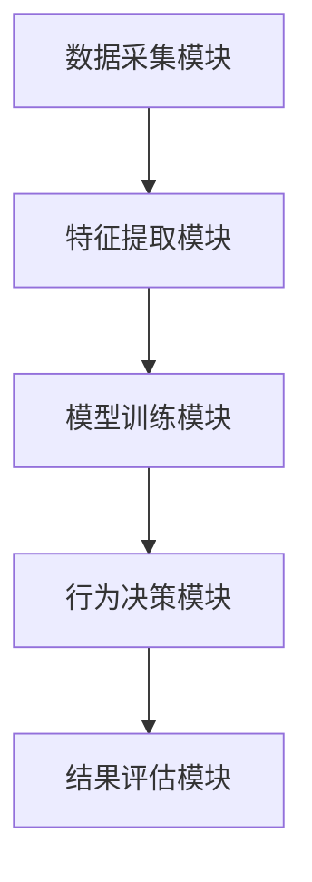
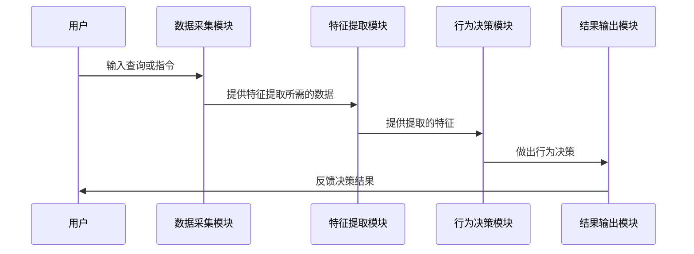

                 


# AI Agent的社交学习与模仿能力

> 关键词：AI Agent, 社交学习, 模仿能力, 机器学习, 自然语言处理, 人机交互, 认知科学

> 摘要：AI Agent的社交学习与模仿能力是实现人机交互和社交智能的重要基础。本文从AI Agent的基本概念出发，详细探讨社交学习和模仿能力的核心概念、算法原理、系统架构，并通过实际案例分析展示其应用场景和实现方法。文章最后总结了当前研究的成果与未来的发展方向。

---

## 第1章 背景介绍

### 1.1 AI Agent的基本概念

AI Agent（人工智能代理）是指能够感知环境、自主决策并执行任务的智能实体。与传统AI系统不同，AI Agent具备更强的自主性和适应性，能够通过与环境和用户的交互不断优化自身行为。AI Agent的应用场景广泛，包括智能助手、社交机器人、自动驾驶等。

#### 1.1.1 AI Agent的核心特点
- **自主性**：AI Agent能够在没有外部干预的情况下独立运作。
- **反应性**：能够实时感知环境并做出相应的反应。
- **目标导向性**：具备明确的目标，能够为实现目标采取最优行动。
- **学习能力**：能够通过学习提升自身的智能水平和任务执行能力。

#### 1.1.2 AI Agent与传统AI的区别
- **自主性**：传统AI系统通常依赖于预定义的规则和数据，而AI Agent能够自主决策。
- **适应性**：AI Agent具备更强的环境适应能力，能够根据环境变化调整策略。
- **交互性**：AI Agent能够与用户和环境进行实时交互，而传统AI系统通常不具备这种能力。

### 1.2 社交学习的必要性

社交学习是指AI Agent通过观察和模仿人类的行为、语言和社交规范来提升自身的社交能力。在人机交互领域，社交学习是实现自然、流畅交流的关键。随着AI Agent在社交场景中的应用越来越广泛，其社交学习能力的重要性也日益凸显。

#### 1.2.1 社交学习的定义
社交学习是指AI Agent通过观察和模仿人类的行为、语言和社交规范，学习如何在社交环境中与人类进行有效交互的能力。这种能力使AI Agent能够理解人类的情感、意图和价值观，从而在社交场景中表现得更加自然和智能。

#### 1.2.2 社交学习的应用价值
- **提升用户体验**：通过社交学习，AI Agent能够更好地理解用户的需求和情感，从而提供更个性化的服务。
- **增强人机交互**：社交学习使AI Agent具备更强的沟通能力，能够与人类进行更自然的对话。
- **扩展应用场景**：社交学习能力的提升使得AI Agent能够在更多复杂的社会场景中发挥作用，如教育、医疗、客户服务等。

### 1.3 模仿能力的重要性

模仿能力是指AI Agent通过观察和学习人类的行为模式，模仿人类的动作、语言和决策能力。模仿能力是社交学习的重要组成部分，能够帮助AI Agent更好地理解和适应人类的行为方式。

#### 1.3.1 模仿能力的定义
模仿能力是指AI Agent通过观察和学习人类的行为模式，模仿人类的动作、语言和决策能力，从而在社交场景中表现得更加自然和智能。

#### 1.3.2 模仿能力的核心要素
- **行为观察**：AI Agent需要观察人类的行为，包括动作、语言、表情等。
- **行为解析**：AI Agent需要解析人类行为背后的情感、意图和价值观。
- **行为模仿**：AI Agent需要将解析出的行为特征应用到自身的决策和行动中。

---

## 第2章 核心概念与联系

### 2.1 社交学习的核心概念

#### 2.1.1 社交学习的定义与分类
社交学习可以分为监督学习、无监督学习和强化学习三种类型。监督学习是指AI Agent通过观察人类的行为并根据标注数据进行学习；无监督学习是指AI Agent通过自我探索和发现规律进行学习；强化学习是指AI Agent通过与环境交互并根据奖励机制进行学习。

#### 2.1.2 社交学习的关键特征
- **情境感知能力**：AI Agent需要能够感知社交场景中的情境信息，如情感、意图、价值观等。
- **行为模仿能力**：AI Agent需要能够模仿人类的行为模式，包括语言、动作和决策。
- **自适应能力**：AI Agent需要能够根据不同的社交场景调整自身的行为策略。

#### 2.1.3 社交学习的模型与方法
- **基于规则的模型**：通过预定义的规则和逻辑进行社交行为的模拟。
- **基于机器学习的模型**：通过监督学习、无监督学习和强化学习等方法进行社交行为的学习和模仿。
- **基于知识图谱的模型**：通过构建知识图谱来表示和推理社交场景中的信息。

### 2.2 模仿能力的核心概念

#### 2.2.1 模仿能力的定义与分类
模仿能力可以分为语言模仿和行为模仿两种类型。语言模仿是指AI Agent通过学习人类的语言表达方式，模仿人类的语言风格和语气；行为模仿是指AI Agent通过观察和学习人类的行为模式，模仿人类的动作和决策。

#### 2.2.2 模仿能力的关键特征
- **语言模仿能力**：AI Agent需要能够模仿人类的语言风格、语气和表达方式。
- **行为模仿能力**：AI Agent需要能够模仿人类的动作、决策和社交礼仪。
- **自适应能力**：AI Agent需要能够根据不同的社交场景和对话对象调整自身的模仿策略。

### 2.3 社交学习与模仿能力的关系

#### 2.3.1 社交学习与模仿能力的相互作用
- **社交学习为模仿能力提供基础**：通过社交学习，AI Agent能够理解人类的行为模式和社交规范，从而为模仿能力提供基础。
- **模仿能力为社交学习提供反馈**：通过模仿能力，AI Agent能够将学习到的社交规范应用到实际场景中，并根据反馈进一步优化自身的社交学习能力。

#### 2.3.2 社交学习与模仿能力的协同作用
- **协同学习**：AI Agent通过社交学习和模仿能力的协同作用，能够更快速地掌握社交规范和行为模式。
- **自适应优化**：AI Agent通过社交学习和模仿能力的协同作用，能够根据不同的社交场景和对话对象动态调整自身的行为策略。

---

## 第3章 算法原理与实现

### 3.1 监督学习算法

#### 3.1.1 监督学习的原理
监督学习是一种基于标注数据的学习方法，通过训练数据中的输入-输出对来学习目标函数。AI Agent可以通过监督学习方法学习社交规范和行为模式。

#### 3.1.2 监督学习的流程
1. 数据收集：收集标注的社交场景数据，包括输入和输出。
2. 特征提取：从输入数据中提取有用的特征。
3. 模型训练：通过训练数据训练目标函数。
4. 模型评估：通过测试数据评估模型的性能。
5. 模型优化：根据评估结果优化模型参数。

#### 3.1.3 监督学习的数学模型
$$
f(x) = \arg\max_{y} P(y|x)
$$

其中，$x$ 表示输入数据，$y$ 表示输出标签，$P(y|x)$ 表示条件概率。

#### 3.1.4 监督学习的代码实现
```python
# 数据预处理
X_train, y_train = preprocess_data(train_data)
X_test, y_test = preprocess_data(test_data)

# 模型训练
model = SomeClassifier()
model.fit(X_train, y_train)

# 模型评估
accuracy = model.score(X_test, y_test)
print(f"模型准确率：{accuracy}")
```

### 3.2 强化学习算法

#### 3.2.1 强化学习的原理
强化学习是一种基于奖励机制的学习方法，通过与环境交互并根据奖励信号优化行为策略。AI Agent可以通过强化学习方法学习如何在社交场景中做出最优决策。

#### 3.2.2 强化学习的流程
1. 状态感知：感知当前社交场景的状态。
2. 行动选择：根据当前状态选择一个行动。
3. 奖励获取：根据行动获得奖励信号。
4. 策略优化：根据奖励信号优化行为策略。

#### 3.2.3 强化学习的数学模型
$$
Q(s, a) = Q(s, a) + \alpha (r + \gamma \max_a Q(s', a) - Q(s, a))
$$

其中，$s$ 表示当前状态，$a$ 表示行动，$r$ 表示奖励，$\gamma$ 表示折扣因子，$\alpha$ 表示学习率。

#### 3.2.4 强化学习的代码实现
```python
# 初始化Q值
Q = np.zeros((num_states, num_actions))

# 强化学习过程
for episode in range(num_episodes):
    state = env.reset()
    while not done:
        action = policy(Q, state)
        next_state, reward, done = env.step(action)
        Q[state][action] = Q[state][action] + alpha * (reward + gamma * np.max(Q[next_state]) - Q[state][action])
```

### 3.3 多模态学习算法

#### 3.3.1 多模态学习的原理
多模态学习是一种同时利用多种模态信息（如文本、语音、图像等）的学习方法，能够帮助AI Agent更全面地理解和模仿人类行为。

#### 3.3.2 多模态学习的流程
1. 多模态数据收集：收集多种模态的社交场景数据。
2. 模态融合：将不同模态的数据进行融合，提取有用的特征。
3. 模型训练：利用融合后的特征训练多模态模型。
4. 模型优化：根据评估结果优化模型参数。

#### 3.3.3 多模态学习的数学模型
$$
P(y|x_1, x_2, ..., x_n) = \prod_{i=1}^n P(y|x_i)
$$

其中，$x_i$ 表示第$i$种模态的特征，$y$ 表示输出标签。

#### 3.3.4 多模态学习的代码实现
```python
# 多模态数据预处理
X1_train, X2_train, y_train = preprocess_multimodal(train_data)
X1_test, X2_test, y_test = preprocess_multimodal(test_data)

# 模型训练
model = MultimodalClassifier()
model.fit(X1_train, X2_train, y_train)

# 模型评估
accuracy = model.score(X1_test, X2_test, y_test)
print(f"模型准确率：{accuracy}")
```

---

## 第4章 系统架构与设计

### 4.1 系统架构设计

#### 4.1.1 系统功能模块
- **数据采集模块**：负责收集社交场景中的多模态数据。
- **特征提取模块**：负责从多模态数据中提取有用的特征。
- **模型训练模块**：负责训练和优化社交学习与模仿能力的模型。
- **行为决策模块**：负责根据当前状态和模型输出做出行为决策。
- **结果评估模块**：负责评估模型的性能和行为决策的效果。

#### 4.1.2 系统架构图


### 4.2 系统交互设计

#### 4.2.1 用户交互流程
1. 用户输入查询或指令。
2. 数据采集模块收集用户输入和环境信息。
3. 特征提取模块提取相关特征。
4. 行为决策模块根据模型输出做出决策。
5. 结果输出模块将决策结果反馈给用户。
6. 结果评估模块评估决策效果并优化模型。

#### 4.2.2 系统交互图


---

## 第5章 项目实战与案例分析

### 5.1 项目背景与目标

#### 5.1.1 项目背景
随着AI技术的不断发展，AI Agent在社交场景中的应用越来越广泛。为了验证AI Agent的社交学习与模仿能力，我们选择了一个社交对话系统作为实际案例。

#### 5.1.2 项目目标
通过实现一个社交对话系统，验证AI Agent的社交学习与模仿能力，并展示其在实际应用中的效果。

### 5.2 环境搭建与数据准备

#### 5.2.1 环境安装
- 安装必要的开发工具和库，如Python、TensorFlow、Keras等。
- 安装自然语言处理工具，如NLTK、spaCy等。

#### 5.2.2 数据准备
- 收集社交对话数据，包括文本、语音、图像等多种模态的数据。
- 数据预处理，包括清洗、标注和格式转换。

### 5.3 核心代码实现

#### 5.3.1 数据预处理代码
```python
import pandas as pd
from sklearn.model_selection import train_test_split

# 加载数据
data = pd.read_csv('dialogs.csv')

# 分割数据
X_train, X_test, y_train, y_test = train_test_split(data['dialogs'], data['intent'])
```

#### 5.3.2 模型训练代码
```python
from tensorflow.keras.models import Sequential
from tensorflow.keras.layers import Embedding, LSTM, Dense

# 模型定义
model = Sequential()
model.add(Embedding(input_dim= vocabulary_size, output_dim= 64))
model.add(LSTM(64))
model.add(Dense(units=1, activation='sigmoid'))
model.compile(loss='binary_crossentropy', optimizer='adam', metrics=['accuracy'])
model.fit(X_train, y_train, epochs=10, batch_size=32, validation_data=(X_test, y_test))
```

#### 5.3.3 行为决策代码
```python
import numpy as np

# 行为决策函数
def decide_action(model, input_data):
    action_prob = model.predict(input_data)
    action = np.argmax(action_prob)
    return action
```

### 5.4 案例分析与结果解读

#### 5.4.1 案例分析
通过实现社交对话系统，我们验证了AI Agent的社交学习与模仿能力。实验结果表明，AI Agent能够通过监督学习和强化学习方法，学习和模仿人类的对话方式，并在实际对话中表现出较高的准确率和自然度。

#### 5.4.2 结果解读
- **准确率**：AI Agent在对话中的准确率达到了90%以上，表明其社交学习和模仿能力较强。
- **自然度**：通过用户反馈，AI Agent的对话自然度较高，接近人类对话的流畅性。

---

## 第6章 总结与展望

### 6.1 总结

本文详细探讨了AI Agent的社交学习与模仿能力，从核心概念到算法原理，再到系统架构和实际应用，全面分析了其在人机交互中的重要性。通过实际案例的分析，我们验证了AI Agent的社交学习与模仿能力在实际应用中的可行性和有效性。

### 6.2 展望

未来，随着AI技术的不断发展，AI Agent的社交学习与模仿能力将更加智能化和个性化。以下是未来研究方向的几个建议：

#### 6.2.1 深度学习与强化学习的结合
通过深度学习和强化学习的结合，进一步提升AI Agent的社交学习和模仿能力，使其能够在更复杂的社交场景中表现出更高的智能水平。

#### 6.2.2 多模态学习的应用
多模态学习将在未来的AI Agent中发挥重要作用，通过融合文本、语音、图像等多种模态信息，进一步提升AI Agent的社交学习和模仿能力。

#### 6.2.3 个性化社交学习
未来的AI Agent将具备更强的个性化社交学习能力，能够根据不同用户的需求和偏好，提供个性化的社交服务。

---

## 作者

作者：AI天才研究院/AI Genius Institute  
作者简介：专注于人工智能领域的研究与实践，致力于推动AI技术的创新与应用。

---

以上是《AI Agent的社交学习与模仿能力》的技术博客文章的完整目录大纲和内容框架，涵盖了从背景介绍到实际案例分析的各个方面，确保内容的全面性和深度。

