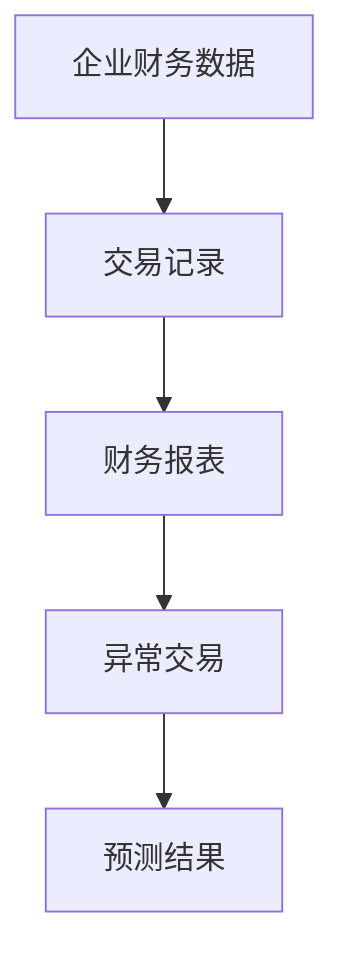
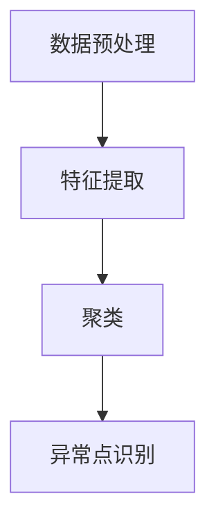
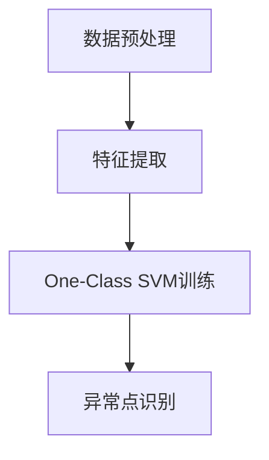
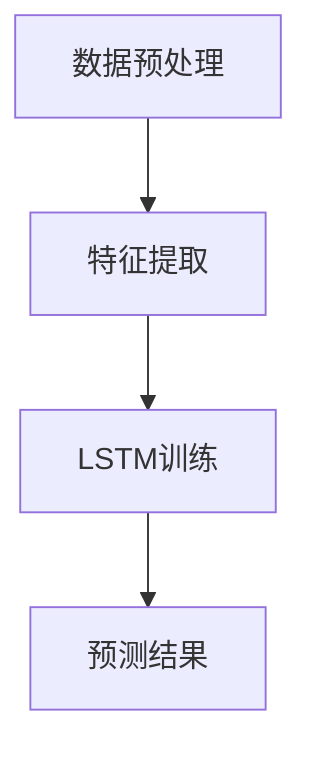
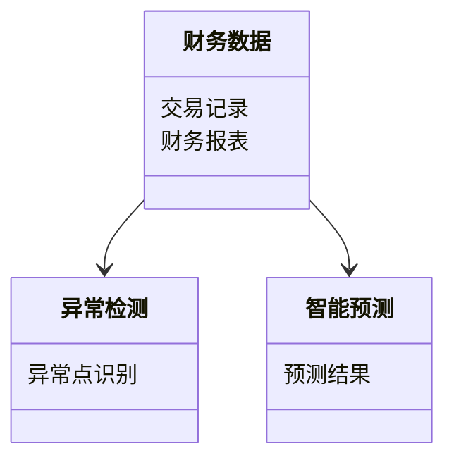
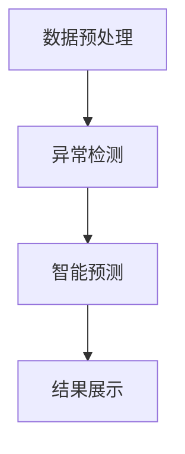
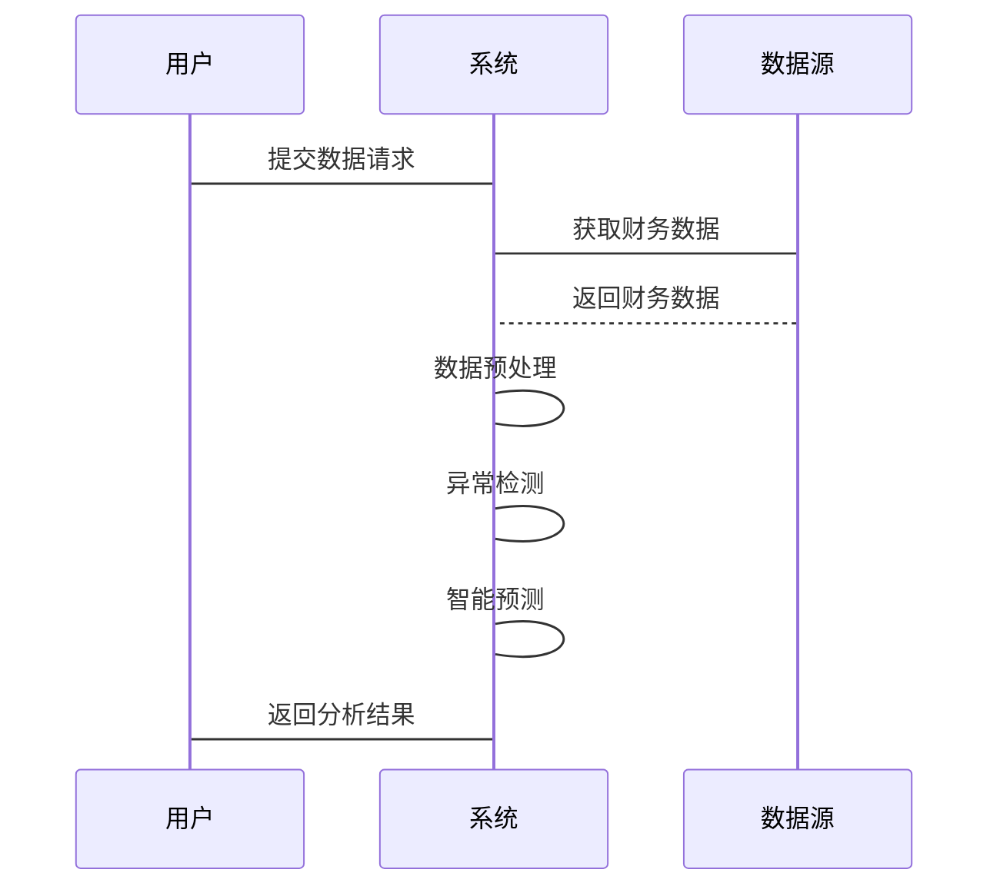

                 


# AI辅助企业财务分析：异常检测与智能财务预测

**关键词：** 企业财务分析，异常检测，智能预测，AI技术，数据挖掘

**摘要：**  
随着企业数据的快速增长和复杂性增加，传统的财务分析方法逐渐暴露出效率低下、准确性不足等问题。引入人工智能技术，特别是异常检测与智能预测，能够显著提升财务分析的效率和准确性。本文将详细探讨AI在企业财务分析中的应用，包括异常检测的核心原理、智能预测的算法实现，以及系统架构设计与项目实战。通过这些分析，读者将能够深入了解如何利用AI技术优化企业财务分析流程。

---

## 第一章: 背景介绍

### 1.1 问题背景

#### 1.1.1 传统企业财务分析的痛点  
传统企业财务分析依赖人工操作，存在以下主要问题：  
1. 数据量大：企业每天生成大量财务数据，人工分析效率低。  
2. 易错性高：人工分析容易受到主观因素影响，准确性不足。  
3. 响应延迟：传统方法难以实时处理数据，导致决策滞后。  

#### 1.1.2 异常检测与预测的必要性  
异常检测能够识别财务数据中的异常交易，防止欺诈行为；智能预测则有助于企业提前规划财务策略，降低风险。  

#### 1.1.3 AI技术的优势  
AI技术能够快速处理海量数据，自动识别模式，显著提升分析效率和准确性。  

### 1.2 问题描述

#### 1.2.1 财务数据分析的复杂性  
财务数据通常涉及多个维度，如时间序列、交易金额、交易频率等，增加了分析的复杂性。  

#### 1.2.2 异常交易识别的挑战  
异常交易可能隐藏在看似正常的交易中，传统方法难以发现。  

#### 1.2.3 智能预测的需求  
企业需要基于历史数据预测未来的财务状况，如收入、支出和利润趋势。  

### 1.3 问题解决

#### 1.3.1 引入AI技术的必要性  
AI技术能够高效处理复杂数据，提供精准的分析结果。  

#### 1.3.2 异常检测与智能预测的核心目标  
- 异常检测：识别异常交易，防止欺诈。  
- 智能预测：基于历史数据预测未来趋势，辅助决策。  

#### 1.3.3 解决方案的实现路径  
1. 数据预处理：清洗和标准化数据。  
2. 异常检测算法选择：如聚类、One-Class SVM等。  
3. 智能预测模型构建：如时间序列分析、神经网络等。  

### 1.4 边界与外延

#### 1.4.1 异常检测的边界条件  
- 数据范围：仅限于财务数据。  
- 时间范围：通常为过去一定时间段内的数据。  

#### 1.4.2 智能预测的应用范围  
- 预测未来收入、支出、利润等财务指标。  

#### 1.4.3 与其他财务分析方法的区分  
AI辅助分析与传统方法的主要区别在于效率和准确性，AI能够处理更大规模的数据，并提供实时分析结果。  

### 1.5 核心概念组成

#### 1.5.1 数据来源与特征  
- 数据来源：企业财务报表、交易记录等。  
- 数据特征：时间戳、金额、交易频率等。  

#### 1.5.2 异常检测的分类  
1. 基于统计的方法：如Z-score、IQR。  
2. 基于机器学习的方法：如聚类、SVM。  
3. 基于深度学习的方法：如Autoencoder、GAN。  

#### 1.5.3 智能预测的模型类型  
1. 时间序列模型：如ARIMA、LSTM。  
2. 机器学习模型：如随机森林、XGBoost。  
3. 深度学习模型：如神经网络。  

---

## 第二章: 核心概念与联系

### 2.1 异常检测与智能预测的核心原理

#### 2.1.1 异常检测的基本原理  
异常检测旨在识别与正常数据模式不符的点或子集。例如，使用聚类算法将数据分为正常和异常簇。  

#### 2.1.2 智能预测的算法基础  
智能预测基于历史数据，利用模型预测未来趋势。例如，使用LSTM模型预测股票价格。  

### 2.2 核心概念对比分析

#### 2.2.1 异常检测与智能预测的特征对比  
| 特性             | 异常检测                     | 智能预测                     |
|------------------|-----------------------------|-----------------------------|
| 目标             | 识别异常点                   | 预测未来趋势                 |
| 输入             | 财务数据                     | 历史财务数据                 |
| 输出             | 异常标签                     | 预测值                       |

#### 2.2.2 不同算法的优劣势对比  
| 算法             | 优势                         | 劣势                         |
|------------------|------------------------------|------------------------------|
| 聚类             | 简单易实现                   | 效率低                       |
| One-Class SVM    | 高准确性                     | 需要参数调整                 |

### 2.3 实体关系图



---

## 第三章: 算法原理讲解

### 3.1 异常检测算法

#### 3.1.1 聚类算法



**Python代码示例：**

```python
from sklearn.cluster import KMeans
import numpy as np

# 示例数据
data = np.random.randn(100, 2)
# 聚类
kmeans = KMeans(n_clusters=2).fit(data)
# 异常点识别
# 假设簇0为正常，簇1为异常
outliers = data[kmeans.labels_ == 1]
```

**数学公式：**  
聚类中心计算公式为：  
$$ \mu_i = \frac{1}{k} \sum_{j=1}^{k} x_j $$  

其中，$\mu_i$ 是第 $i$ 个簇的中心，$x_j$ 是簇中的数据点，$k$ 是簇的数量。  

---

**3.1.2 One-Class SVM**



**Python代码示例：**

```python
from sklearn.svm import OneClassSVM

# 示例数据
data = np.random.randn(100, 2)
# 训练模型
svm = OneClassSVM().fit(data)
# 异常点识别
outliers = data[svm.predict(data) == -1]
```

**数学公式：**  
One-Class SVM的目标函数为：  
$$ \min_{\theta, \rho, \nu} \frac{1}{2} \rho^2 + C \sum_{i=1}^{n} \xi_i $$  

其中，$\rho$ 是缩放因子，$\xi_i$ 是松弛变量，$C$ 是惩罚参数。  

---

### 3.2 智能预测算法

#### 3.2.1 LSTM网络



**Python代码示例：**

```python
import keras
from keras.layers import LSTM, Dense

# 示例数据
X_train = np.random.randn(10, 10, 2)
y_train = np.random.randn(10, 1)
# 模型定义
model = keras.Sequential()
model.add(LSTM(64, input_shape=(10, 2)))
model.add(Dense(1))
model.compile(optimizer='adam', loss='mse')
# 训练
model.fit(X_train, y_train, epochs=10)
```

**数学公式：**  
LSTM的遗忘门公式为：  
$$ f_t = \sigma(W_f x_t + U_f h_{t-1} + b_f) $$  

其中，$f_t$ 是遗忘门输出，$\sigma$ 是sigmoid函数，$W_f$ 和 $U_f$ 是权重矩阵，$b_f$ 是偏置项。  

---

## 第四章: 系统架构设计

### 4.1 问题场景介绍

#### 4.1.1 系统目标  
构建一个AI辅助企业财务分析系统，实现异常检测与智能预测功能。  

#### 4.1.2 项目介绍  
本系统将整合企业财务数据，利用AI技术进行分析，提供实时监控和预测报告。  

### 4.2 系统功能设计

#### 4.2.1 领域模型



---

### 4.3 系统架构设计

#### 4.3.1 系统架构图



---

### 4.4 系统接口设计

#### 4.4.1 API接口  
1. 数据接口：用于数据输入和输出。  
2. 模型接口：用于调用异常检测和智能预测模型。  

#### 4.4.2 数据流  
1. 数据预处理：清洗和标准化数据。  
2. 模型调用：将预处理后的数据输入模型，获取结果。  
3. 结果展示：将结果以可视化方式呈现给用户。  

---

### 4.5 系统交互流程



---

## 第五章: 项目实战

### 5.1 环境安装

#### 5.1.1 安装Python  
确保安装Python 3.8以上版本。  

#### 5.1.2 安装依赖库  
```bash
pip install numpy scikit-learn keras matplotlib
```

---

### 5.2 核心代码实现

#### 5.2.1 数据预处理

```python
import numpy as np
import pandas as pd

# 读取数据
data = pd.read_csv('financial_data.csv')
# 数据清洗
data = data.dropna()
# 标准化
from sklearn.preprocessing import StandardScaler
scaler = StandardScaler()
data_scaled = scaler.fit_transform(data)
```

---

#### 5.2.2 异常检测

```python
from sklearn.svm import OneClassSVM

# 训练模型
svm = OneClassSVM().fit(data_scaled)
# 预测异常点
outliers = svm.predict(data_scaled)
outliers = outliers.reshape(-1, 1)
outliers[outliers == -1] = 1
outliers[outliers == 1] = 0
```

---

#### 5.2.3 智能预测

```python
from keras.models import Sequential
from keras.layers import LSTM, Dense

# 模型定义
model = Sequential()
model.add(LSTM(64, input_shape=(10, 2)))
model.add(Dense(1))
model.compile(optimizer='adam', loss='mse')

# 训练模型
model.fit(X_train, y_train, epochs=10)
```

---

### 5.3 案例分析

#### 5.3.1 数据来源  
使用某企业的过去三年财务数据，包括收入、支出、利润等指标。  

#### 5.3.2 数据分析  
通过异常检测识别出几笔异常交易，并预测未来三个月的收入趋势。  

#### 5.3.3 结果展示  
将异常交易标记出来，并生成未来收入预测报告。  

---

### 5.4 项目小结

#### 5.4.1 实践收获  
通过项目实战，掌握了AI技术在财务分析中的具体应用。  

#### 5.4.2 经验总结  
数据预处理和模型选择是项目成功的关键。  

---

## 第六章: 最佳实践与总结

### 6.1 总结

#### 6.1.1 核心内容回顾  
本文详细介绍了AI技术在企业财务分析中的应用，包括异常检测与智能预测的核心原理、算法实现以及系统架构设计。  

#### 6.1.2 实践意义  
通过AI技术优化财务分析流程，提高企业决策效率和准确性。  

---

### 6.2 小结

#### 6.2.1 核心概念总结  
- 异常检测：识别异常交易，防止欺诈。  
- 智能预测：基于历史数据预测未来趋势。  

#### 6.2.2 算法总结  
- 异常检测算法：聚类、One-Class SVM。  
- 智能预测算法：LSTM、XGBoost。  

---

### 6.3 注意事项

#### 6.3.1 数据质量  
确保数据准确性和完整性，避免影响分析结果。  

#### 6.3.2 模型选择  
根据具体需求选择合适的算法，避免过度复杂化。  

---

### 6.4 拓展阅读

#### 6.4.1 推荐书籍  
1. 《深入理解机器学习》  
2. 《时间序列分析与应用》  

#### 6.4.2 推荐博客  
1. [Towards Data Science](https://towardsdatascience.com/)  
2. [Medium - Analytics Vidhya](https://medium.com/analytics-vidhya)  

---

**作者：AI天才研究院/AI Genius Institute & 禅与计算机程序设计艺术 /Zen And The Art of Computer Programming**

