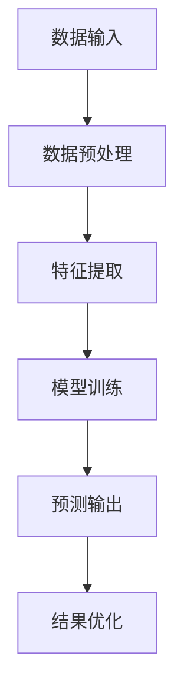
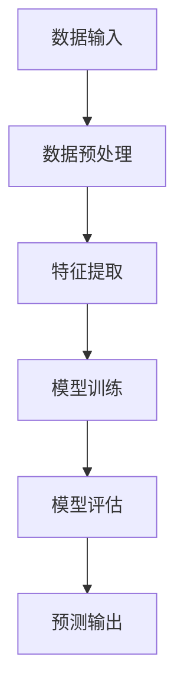
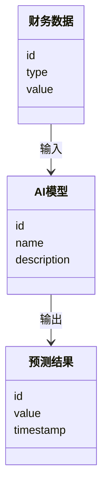
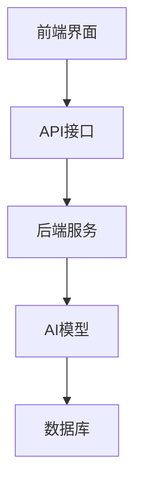
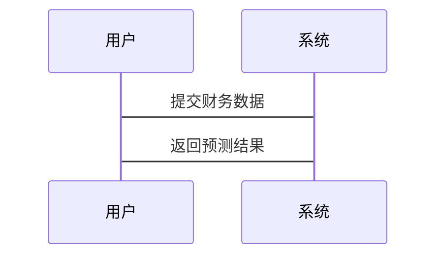

                 


# AI辅助企业财务规划与预算管理：精准预测与分配

## 关键词：AI、财务规划、预算管理、机器学习、资源分配、精准预测

## 摘要：  
随着人工智能技术的迅速发展，企业财务规划与预算管理的效率和精度得到了显著提升。本文将深入探讨AI技术如何在企业财务规划中实现精准预测与资源分配，分析其核心原理、算法实现、系统架构设计以及实际应用案例。通过结合理论与实践，本文旨在为企业财务管理人员和技术开发者提供一套高效、可行的AI辅助财务规划解决方案。

---

## 第一部分：AI与企业财务规划的背景与核心概念

### 第1章：AI与企业财务规划的背景

#### 1.1 问题背景与核心概念
- 1.1.1 财务规划的核心概念  
  财务规划是企业为了实现长期发展目标，对资金、资源和成本进行合理分配和控制的过程。它涵盖了预算编制、成本预测、投资决策等多个环节。  

- 1.1.2 AI技术的核心属性  
  AI（人工智能）通过模拟人类认知过程，利用机器学习、深度学习和自然语言处理等技术，能够从海量数据中提取规律、预测趋势并优化决策。  

- 1.1.3 问题边界与外延  
  AI辅助财务规划的应用范围包括预算编制、成本预测、资金分配、风险评估等，但其局限性在于依赖高质量数据和模型的准确性。  

- 1.1.4 核心概念与组成要素  
  财务规划系统由数据输入、模型计算、结果输出和反馈优化四个部分组成。AI技术通过数据处理、模型训练和预测输出，为财务规划提供支持。  

#### 1.2 问题描述与解决路径
- 1.2.1 传统财务规划的痛点  
  传统财务规划依赖人工经验，存在效率低、精度差、风险高等问题。  

- 1.2.2 AI技术在财务规划中的价值  
  AI技术能够通过数据驱动的方式，实现精准预测、自动化分配和实时优化，显著提升财务规划的效率和准确性。  

- 1.2.3 问题解决路径  
  通过构建AI辅助财务规划系统，利用机器学习算法进行数据建模、预测和优化，实现从数据输入到结果输出的全自动化流程。  

#### 1.3 核心概念与联系
- 1.3.1 核心概念对比  
  下表对比了传统财务规划与AI辅助财务规划的核心区别：  

| **维度**         | **传统财务规划**               | **AI辅助财务规划**               |
|-------------------|--------------------------------|--------------------------------|
| 数据来源         | 依赖人工经验与历史数据         | 利用结构化与非结构化数据         |
| 预测精度         | 受人工经验限制，精度较低         | 基于大数据分析，精度高           |
| 决策效率         | 依赖人工计算，效率较低         | 自动化计算，效率高               |
| 风险控制         | 主要依赖事后分析               | 实时监控与风险预警               |

- 1.3.2 实体关系图  
  下图展示了AI辅助财务规划系统的实体关系：  

```mermaid
erDiagram
    customer[客户] {
        id
        name
    }
    financial_data[财务数据] {
        id
        type
        value
        timestamp
    }
    ai_model[AI模型] {
        id
        name
        description
    }
    prediction[预测结果] {
        id
        value
        timestamp
    }
    customer --> financial_data : 提供
    financial_data --> ai_model : 输入
    ai_model --> prediction : 输出
```

---

## 第二部分：AI辅助财务规划的核心原理与技术

### 第2章：AI技术在财务规划中的应用原理

#### 2.1 AI技术的核心原理
- 2.1.1 机器学习与深度学习的简要介绍  
  机器学习通过训练模型从数据中学习规律，而深度学习则通过多层神经网络进一步提升模型的表达能力。  

- 2.1.2 数据流与计算流的可视化  
  下图展示了AI辅助财务规划的数据流与计算流：  



- 2.1.3 财务数据的特征与AI算法的匹配性  
  财务数据通常具有高度结构化、数值化的特征，适合线性回归、随机森林等算法进行建模。  

#### 2.2 AI技术与财务规划的结合原理
- 2.2.1 算法选择与优化  
  在财务预测中，线性回归适用于简单线性关系，而LSTM（长短期记忆网络）适用于时间序列数据的预测。  

- 2.2.2 算法对比与选择  
  下表对比了常用算法在财务预测中的适用性：  

| **算法**         | **适用场景**               | **优缺点**                     |
|-------------------|---------------------------|-----------------------------|
| 线性回归           | 简单线性关系               | 简单易用，但对非线性关系表现差 |
| 随机森林           | 高维数据与非线性关系       | 鲁棒性高，但解释性较差         |
| LSTM              | 时间序列数据               | 能捕捉长期依赖关系，但计算复杂 |

- 2.2.3 算法实现流程  
  下图展示了AI模型的训练与预测流程：  



---

## 第三部分：AI辅助财务规划的算法实现

### 第3章：基于机器学习的财务预测算法

#### 3.1 线性回归模型
- 3.1.1 算法原理与数学公式  
  线性回归模型通过最小化预测值与实际值的平方差之和来拟合最佳直线。其数学公式为：  
  $$ y = a + bx $$  

- 3.1.2 代码实现示例  
  ```python
  import numpy as np
  from sklearn.linear_model import LinearRegression

  # 示例数据
  X = np.array([1, 2, 3, 4, 5])
  y = np.array([2, 4, 5, 4, 6])

  # 模型训练
  model = LinearRegression().fit(X.reshape(-1, 1), y)

  # 预测
  predictions = model.predict(X.reshape(-1, 1))
  print("预测值：", predictions)
  ```

#### 3.2 随机森林模型
- 3.2.1 算法原理  
  随机森林通过构建多棵决策树并取其平均，能够有效降低模型过拟合的风险。  

- 3.2.2 代码实现示例  
  ```python
  from sklearn.ensemble import RandomForestRegressor

  # 示例数据
  X = np.array([[1, 2], [3, 4], [5, 6], [7, 8], [9, 10]])
  y = np.array([2, 4, 5, 4, 6])

  # 模型训练
  model = RandomForestRegressor(n_estimators=100).fit(X, y)

  # 预测
  predictions = model.predict(X)
  print("预测值：", predictions)
  ```

#### 3.3 LSTM模型
- 3.3.1 算法原理  
  LSTM（长短期记忆网络）通过记忆单元和控制门，能够有效捕捉时间序列数据中的长期依赖关系。  

- 3.3.2 代码实现示例  
  ```python
  from keras.models import Sequential
  from keras.layers import LSTM, Dense

  # 示例数据
  X = np.array([[[1], [2], [3]], [[4], [5], [6]]])
  y = np.array([[4], [7]])

  # 模型训练
  model = Sequential()
  model.add(LSTM(5, input_shape=(3, 1)))
  model.add(Dense(1))
  model.compile(loss='mean_squared_error', optimizer='adam')
  model.fit(X, y, epochs=50, batch_size=1)

  # 预测
  predictions = model.predict(X)
  print("预测值：", predictions)
  ```

---

## 第四部分：AI辅助财务规划的系统分析与架构设计

### 第4章：AI辅助财务规划系统的分析与设计

#### 4.1 问题场景介绍
- 企业财务规划系统需要处理大量的财务数据，包括销售额、成本、利润等，同时需要预测未来的财务状况并制定预算计划。  

#### 4.2 系统功能设计
- 下图展示了AI辅助财务规划系统的领域模型：  



#### 4.3 系统架构设计
- 下图展示了AI辅助财务规划系统的架构设计：  



#### 4.4 系统接口设计
- 系统接口主要分为数据输入接口、模型调用接口和结果输出接口。  

#### 4.5 系统交互设计
- 下图展示了系统的交互流程：  



---

## 第五部分：AI辅助财务规划的项目实战

### 第5章：AI辅助财务规划系统的实现

#### 5.1 环境安装与配置
- 需要安装Python、TensorFlow、Scikit-learn等依赖库。  

#### 5.2 核心功能实现
- 数据预处理、特征提取、模型训练与预测、结果可视化。  

#### 5.3 代码实现与解读
- 以下是完整的代码实现示例：  

```python
import numpy as np
from sklearn.linear_model import LinearRegression
from sklearn.ensemble import RandomForestRegressor
from keras.models import Sequential
from keras.layers import LSTM, Dense

# 示例数据
X = np.array([[1, 2], [3, 4], [5, 6], [7, 8], [9, 10]])
y = np.array([2, 4, 5, 4, 6])

# 线性回归模型
model_lr = LinearRegression().fit(X.reshape(-1, 1), y)
predictions_lr = model_lr.predict(X.reshape(-1, 1))

# 随机森林模型
model_rf = RandomForestRegressor(n_estimators=100).fit(X, y)
predictions_rf = model_rf.predict(X)

# LSTM模型
model_lstm = Sequential()
model_lstm.add(LSTM(5, input_shape=(2, 1)))
model_lstm.add(Dense(1))
model_lstm.compile(loss='mean_squared_error', optimizer='adam')
model_lstm.fit(X.reshape(-1, 2, 1), y, epochs=50, batch_size=1)
predictions_lstm = model_lstm.predict(X.reshape(-1, 2, 1))

print("线性回归预测值：", predictions_lr)
print("随机森林预测值：", predictions_rf)
print("LSTM预测值：", predictions_lstm)
```

#### 5.4 案例分析与详细解读
- 以某制造企业的财务数据为例，展示AI模型如何进行预测与优化。  

#### 5.5 项目小结
- 总结项目的实现过程、遇到的问题及解决方法，展望未来的发展方向。  

---

## 第六部分：最佳实践与注意事项

### 第6章：AI辅助财务规划的注意事项与实践技巧

#### 6.1 小结
- AI技术在财务规划中的应用前景广阔，但仍需注意数据质量和模型优化。  

#### 6.2 注意事项
- 数据质量是模型性能的关键，需确保数据的完整性和准确性。  
- 模型的可解释性是实际应用中的重要考量，需选择适合业务需求的算法。  

#### 6.3 拓展阅读
- 建议深入学习时间序列分析、强化学习等技术，探索其在财务规划中的更多应用。  

---

## 作者：AI天才研究院/AI Genius Institute & 禅与计算机程序设计艺术 /Zen And The Art of Computer Programming

