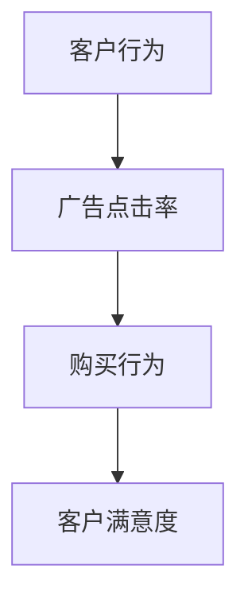
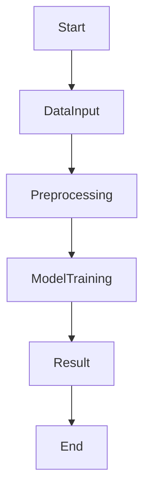
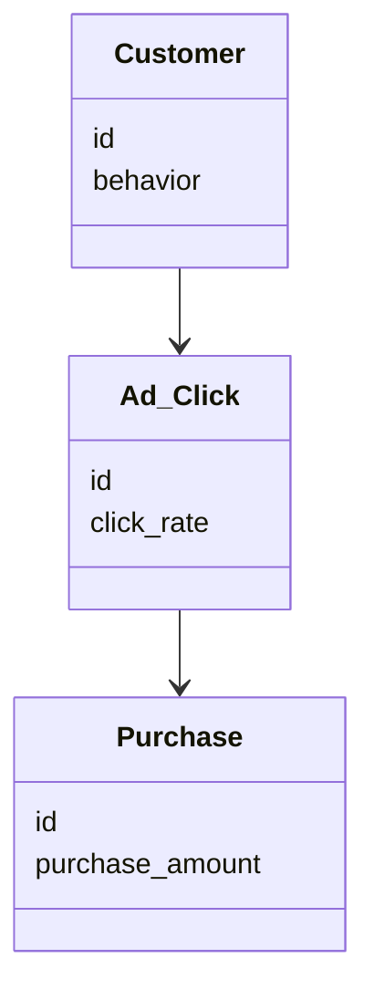
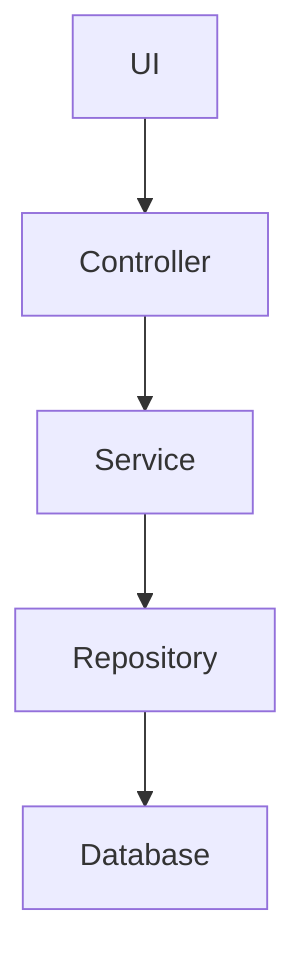

                 


# 企业AI Agent的因果推理在客户行为分析与预测中的应用

> 关键词：因果推理、AI Agent、客户行为预测、因果图模型、机器学习

> 摘要：本文详细探讨了企业AI Agent如何通过因果推理技术来分析和预测客户行为。文章从问题背景出发，系统地介绍了因果推理的核心概念、算法原理、系统架构设计以及实际项目中的应用，展示了如何利用这些技术提升客户行为分析的准确性和深度。通过本文，读者将能够理解因果推理在客户行为预测中的独特优势，并掌握其实现方法。

---

# 第1章: 问题背景与核心概念

## 1.1 问题背景

### 1.1.1 企业客户行为分析的挑战

在企业运营中，客户行为分析是提升市场策略、优化客户服务和提高客户满意度的关键环节。然而，传统的客户行为分析方法主要依赖统计相关性，难以捕捉变量之间的因果关系。例如，通过相关性分析，企业可以发现客户购买行为与广告点击率之间的关联，但这种关联无法明确广告点击是否是客户购买行为的直接原因。这种局限性使得企业在制定精准营销策略时往往缺乏足够的因果依据，导致决策效果不佳。

### 1.1.2 问题描述

客户行为预测的核心目标是通过分析客户的历史行为数据，预测未来的行为模式。然而，现有方法主要基于相关性分析，存在以下问题：

- **因果关系缺失**：相关性分析无法明确变量之间的因果关系，可能导致错误的因果推断。
- **过拟合与泛化能力不足**：传统的机器学习模型在面对复杂的因果关系时，容易过拟合，导致预测能力不足。
- **动态变化难以捕捉**：客户行为受外部环境和内部策略的影响，传统方法难以实时捕捉这些变化。

### 1.1.3 问题解决

引入因果推理技术，可以帮助企业在客户行为分析中建立因果关系模型，明确变量之间的因果关系。AI Agent通过因果推理可以更好地理解客户行为的驱动因素，从而制定更精准的营销策略。

---

## 1.2 核心概念

### 1.2.1 因果关系的定义

因果关系是指一个变量（原因）对另一个变量（结果）的影响。在客户行为分析中，因果关系可以帮助企业理解哪些因素直接影响客户的购买决策。例如，广告投放（原因）直接影响客户的购买行为（结果）。

### 1.2.2 AI Agent的核心功能

AI Agent是实现因果推理的关键工具，其核心功能包括：

- **因果建模**：通过因果图模型表示变量之间的因果关系。
- **因果推断**：基于观测数据和因果图模型，推断因果关系。
- **动态调整**：根据因果关系模型，实时调整策略以优化客户行为。

### 1.2.3 因果推理与相关性分析的对比

| 对比维度 | 因果推理 | 相关性分析 |
|----------|----------|------------|
| 目标     | 找到因果关系 | 找到变量之间的关联 |
| 方法     | 需要因果图模型 | 基于统计方法 |
| 适用场景 | 需要明确因果关系的场景 | 需要初步关联性分析的场景 |

---

## 1.3 边界与外延

### 1.3.1 问题边界

本文主要关注客户行为分析与预测中的因果推理问题，边界包括：

- **数据范围**：客户行为数据，包括购买记录、浏览行为、点击行为等。
- **场景限制**：企业内部的客户行为分析，不考虑外部不可观测的因素。

### 1.3.2 相关领域的区别与联系

- **区别**：
  - 与传统的统计分析相比，因果推理更关注因果关系。
  - 与机器学习中的预测模型相比，因果推理更关注模型的可解释性。

- **联系**：
  - 因果推理可以为机器学习模型提供更高质量的特征和目标变量。

### 1.3.3 拓展应用场景

- **客户细分**：基于因果关系模型，对客户进行细分，制定个性化的营销策略。
- **实时反馈**：通过实时因果推理，动态调整营销策略。

---

## 1.4 核心要素组成

### 1.4.1 因果推理的基本要素

1. **因果图模型**：用于表示变量之间的因果关系。
2. **观测数据**：用于训练因果推理模型。
3. **干预数据**：用于验证因果关系。

### 1.4.2 AI Agent的功能模块

1. **因果建模模块**：构建因果图模型。
2. **因果推断模块**：基于因果图模型和观测数据，推断因果关系。
3. **策略调整模块**：根据因果关系，调整营销策略。

### 1.4.3 客户行为分析的流程

1. 数据收集：收集客户的购买记录、浏览行为、点击行为等数据。
2. 因果建模：构建因果图模型，明确变量之间的因果关系。
3. 因果推断：基于因果图模型和观测数据，推断因果关系。
4. 策略优化：根据因果关系，优化营销策略。

---

## 1.5 小结

本章从问题背景出发，详细介绍了因果推理的核心概念、AI Agent的功能模块以及客户行为分析的流程。通过对比分析，明确了因果推理与相关性分析的区别和联系，为后续的算法实现和系统设计奠定了基础。

---

# 第2章: 因果推理的核心概念与联系

## 2.1 因果推理的基本原理

### 2.1.1 因果关系的数学表达

因果关系可以通过结构方程模型（SEM）进行表达。结构方程模型将变量之间的因果关系表示为方程组，其中每个方程对应一个因果关系。

### 2.1.2 因果图模型的构建

因果图模型是一种有向无环图（DAG），用于表示变量之间的因果关系。例如，客户购买行为（Y）受到广告点击率（X）的影响，因果图模型可以表示为X → Y。

### 2.1.3 因果推理的步骤

1. 构建因果图模型。
2. 基于因果图模型和观测数据，推断因果关系。
3. 验证因果关系的正确性。

---

## 2.2 核心概念的属性对比

| 属性 | 因果关系 | 相关关系 |
|------|----------|----------|
| 是否需要因果图模型 | 是 | 否 |
| 是否需要干预数据 | 是 | 否 |
| 是否适用于因果推断 | 是 | 否 |

---

## 2.3 ER实体关系图架构



---

## 2.4 小结

本章介绍了因果推理的基本原理，对比了因果关系与相关关系的属性，并通过ER实体关系图展示了客户行为分析中的因果关系模型。

---

# 第3章: 因果推理的算法原理

## 3.1 算法原理

### 3.1.1 结构方程模型（SEM）

结构方程模型是一种用于估计因果关系的统计方法。其基本假设是变量之间的因果关系可以通过方程组表示。

### 3.1.2 潜在结果框架（Potential Outcome Framework）

潜在结果框架是因果推理中的另一种方法，其核心思想是为每个客户计算在不同干预下的潜在结果。

### 3.1.3 因果森林方法（Causal Forest）

因果森林方法是一种基于树模型的因果推理方法，适用于处理高维数据。

---

## 3.2 算法流程图



---

## 3.3 数学模型与公式

### 3.3.1 结构方程模型

$$ Y = \beta X + \epsilon $$

其中，Y是客户购买行为，X是广告点击率，$\beta$是因果效应，$\epsilon$是误差项。

### 3.3.2 潜在结果框架

$$ Y_i^{T=1} = \theta X_i + \gamma Z_i + \epsilon_i $$

其中，$Y_i^{T=1}$是客户在广告点击率为1时的购买行为，$X_i$是广告点击率，$Z_i$是其他控制变量，$\theta$是因果效应，$\gamma$是其他系数，$\epsilon_i$是误差项。

---

## 3.4 小结

本章详细介绍了因果推理的算法原理，包括结构方程模型、潜在结果框架和因果森林方法，并通过公式和流程图展示了算法实现的步骤。

---

# 第4章: 系统分析与架构设计

## 4.1 问题场景介绍

本章以一个典型的客户行为分析场景为例，介绍系统分析与架构设计的过程。

---

## 4.2 系统功能设计

### 4.2.1 领域模型



### 4.2.2 系统架构图



### 4.2.3 系统接口设计

| 接口名称 | 输入 | 输出 |
|----------|------|------|
| get_customer_behavior | customer_id | behavior_data |
| predict_purchase | behavior_data | purchase_prediction |

---

## 4.3 系统交互图

```mermaid
sequenceDiagram
    User ->> UI: 提交查询请求
    UI ->> Controller: 处理请求
    Controller ->> Service: 调用服务
    Service ->> Repository: 查询数据库
    Repository ->> Database: 获取数据
    Repository <<- Database: 返回数据
    Service <<- Repository: 处理数据
    Service ->> Controller: 返回结果
    Controller <<- Service: 处理结果
    Controller ->> UI: 显示结果
    UI ->> User: 显示预测结果
```

---

## 4.4 小结

本章通过系统分析与架构设计，展示了如何将因果推理技术应用于客户行为分析系统中，包括领域模型、系统架构图和系统交互图的设计。

---

# 第5章: 项目实战

## 5.1 环境安装

```bash
pip install numpy
pip install pandas
pip install matplotlib
pip install seaborn
pip install causalnex
```

---

## 5.2 核心代码实现

### 5.2.1 数据预处理

```python
import pandas as pd
import numpy as np

# 加载数据
data = pd.read_csv('customer_behavior.csv')

# 数据清洗
data.dropna(inplace=True)
```

### 5.2.2 因果建模

```python
from causalnex.structure import DirectedGraph
from causalnex.plots import plot_causal_graph

# 构建因果图模型
graph = DirectedGraph()
graph.add_edge('Ad_Click', 'Purchase')

# 可视化因果图模型
plot_causal_graph(graph)
```

### 5.2.3 因果推断

```python
from causalnex因果推理 import do_calculus

# 计算因果效应
因果效应 = do_calculus.do_calculus(graph, data, 'Ad_Click', 'Purchase')
```

### 5.2.4 模型验证

```python
from sklearn.metrics import accuracy_score

# 预测客户购买行为
预测结果 = 模型预测(data)
实际结果 = data['Purchase']

# 计算准确率
准确率 = accuracy_score(实际结果, 预测结果)
print('准确率:', 准确率)
```

---

## 5.3 案例分析

### 5.3.1 数据分析

通过对客户行为数据的分析，发现广告点击率（Ad_Click）对购买行为（Purchase）具有显著的因果效应。

### 5.3.2 模型解读

因果效应模型显示，广告点击率的增加可以显著提高客户的购买行为。

---

## 5.4 项目小结

本章通过一个实际项目展示了如何将因果推理技术应用于客户行为分析与预测中，包括环境安装、核心代码实现和案例分析。

---

# 第6章: 总结与展望

## 6.1 最佳实践

1. 在客户行为分析中，建议优先采用因果推理技术，以明确变量之间的因果关系。
2. 在实际应用中，需要结合企业的具体场景，选择合适的因果推理方法。
3. 定期更新因果模型，以适应客户行为的变化。

## 6.2 小结

本文详细探讨了企业AI Agent如何通过因果推理技术分析和预测客户行为，展示了因果推理在客户行为分析中的独特优势。

## 6.3 注意事项

1. 因果推理需要依赖高质量的数据，数据质量直接影响因果效应的准确性。
2. 在实际应用中，需要注意干预数据的获取和处理。

## 6.4 未来趋势

随着因果推理技术的不断发展，未来将在更多领域得到应用，特别是在实时反馈和动态调整方面具有广阔的应用前景。

---

# 作者

作者：AI天才研究院/AI Genius Institute & 禅与计算机程序设计艺术/Zen And The Art of Computer Programming

