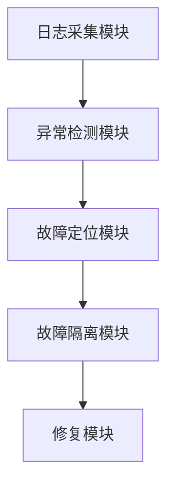

                 


# 企业AI Agent的故障恢复机制

> 关键词：企业AI Agent，故障恢复机制，日志分析，异常检测，系统架构，故障定位，故障隔离

> 摘要：本文详细探讨了企业AI Agent的故障恢复机制，从故障检测到修复的整个流程，分析了其中的关键技术和实现方法，包括日志分析、异常检测、系统架构设计等，并通过实际案例展示了故障恢复机制的应用。

---

## 第一部分: 企业AI Agent的背景与挑战

### 第1章: 企业AI Agent的背景与挑战

#### 1.1 AI Agent的基本概念

##### 1.1.1 AI Agent的定义与特点

- **定义**: AI Agent（人工智能代理）是一种能够感知环境、执行任务并做出决策的智能实体。
- **特点**:
  - 智能性：能够理解并执行复杂的任务。
  - 自适应性：能够根据环境变化调整行为。
  - 可扩展性：能够处理多种任务和场景。

##### 1.1.2 企业AI Agent的应用场景

- **客户支持**: 自动处理客户查询和问题。
- **流程自动化**: 自动化企业内部流程，如订单处理、库存管理。
- **数据分析**: 分析大量数据并提供决策支持。

##### 1.1.3 AI Agent的核心功能与价值

- **核心功能**:
  - 数据收集与分析。
  - 自动化决策与执行。
  - 与用户或其他系统的交互。
- **价值**:
  - 提高效率。
  - 降低成本。
  - 提升用户体验。

#### 1.2 故障恢复机制的重要性

##### 1.2.1 故障恢复机制的定义

- **定义**: 故障恢复机制是指在AI Agent发生故障时，系统能够自动检测、隔离故障，并修复或恢复到正常状态的能力。

##### 1.2.2 企业AI Agent故障的常见类型

- **软件故障**: 代码错误、逻辑错误。
- **硬件故障**: 设备故障、连接中断。
- **网络故障**: 网络中断、延迟过高。
- **数据故障**: 数据损坏、数据丢失。

##### 1.2.3 故障恢复机制对企业的影响

- **减少停机时间**: 快速恢复服务，减少业务损失。
- **提升系统可靠性**: 确保系统在各种故障情况下的稳定运行。
- **降低维护成本**: 自动化故障处理减少人工干预。

#### 1.3 企业AI Agent故障恢复的背景与挑战

##### 1.3.1 当前企业AI Agent的应用现状

- **广泛应用**: AI Agent在企业中的应用日益广泛。
- **复杂性增加**: 企业AI Agent的规模和复杂性不断增加。
- **故障频发**: 随着复杂性的增加，故障发生的频率也在增加。

##### 1.3.2 故障恢复机制的必要性

- **业务连续性**: 企业需要确保业务的连续性，不能因为故障中断服务。
- **客户满意度**: 故障恢复能力直接影响客户体验和满意度。
- **合规性要求**: 在某些行业，故障恢复能力是合规性要求的一部分。

##### 1.3.3 实现故障恢复机制的技术挑战

- **复杂性**: 企业AI Agent的架构复杂，故障恢复机制需要覆盖多个层面。
- **实时性**: 故障恢复需要在极短时间内完成，否则会影响业务。
- **成本**: 实现高效的故障恢复机制需要投入大量的资源。

## 第二部分: 故障恢复机制的核心概念与原理

### 第2章: 故障恢复机制的核心概念

#### 2.1 故障检测与定位

##### 2.1.1 故障检测的方法

- **日志分析**: 通过分析系统日志发现异常。
- **性能监控**: 监控系统性能指标，如CPU、内存使用情况。
- **用户反馈**: 通过用户反馈发现故障。

##### 2.1.2 故障定位的原理

- **日志分析**: 通过日志中的错误信息定位故障。
- **性能监控**: 通过性能数据找到问题根源。
- **用户行为分析**: 分析用户行为，发现异常操作。

##### 2.1.3 故障检测与定位的对比分析

| 对比维度 | 故障检测 | 故障定位 |
|----------|----------|----------|
| 方法     | 日志分析、性能监控、用户反馈 | 日志分析、性能监控、用户行为分析 |
| 目标     | 发现故障 | 找到故障源 |
| 优缺点   | 易操作，但可能误报 | 准确性高，但需要大量数据 |

#### 2.2 故障隔离与修复

##### 2.2.1 故障隔离的策略

- **逐步隔离**: 逐步关闭或暂停部分功能，观察系统反应。
- **模块隔离**: 根据模块划分，隔离故障模块。
- **备份恢复**: 使用备份数据恢复系统。

##### 2.2.2 故障修复的实现方式

- **自动修复**: 系统自动修复故障。
- **手动修复**: 人工干预修复故障。
- **混合修复**: 综合使用自动和手动修复。

##### 2.2.3 故障隔离与修复的优缺点对比

| 对比维度 | 故障隔离 | 故障修复 |
|----------|----------|----------|
| 方法     | 暂停或关闭部分功能 | 修复故障模块 |
| 优缺点   | 快速隔离故障，但可能影响部分功能 | 高效修复，但可能需要时间 |

#### 2.3 故障恢复机制的实现流程

##### 2.3.1 故障检测阶段

- **日志分析**: 通过日志分析发现异常。
- **性能监控**: 监控系统性能指标，如CPU、内存使用情况。
- **用户反馈**: 通过用户反馈发现故障。

##### 2.3.2 故障定位阶段

- **日志分析**: 通过日志中的错误信息定位故障。
- **性能监控**: 通过性能数据找到问题根源。
- **用户行为分析**: 分析用户行为，发现异常操作。

##### 2.3.3 故障隔离与修复阶段

- **逐步隔离**: 逐步关闭或暂停部分功能，观察系统反应。
- **模块隔离**: 根据模块划分，隔离故障模块。
- **备份恢复**: 使用备份数据恢复系统。

##### 2.3.4 故障恢复后的验证阶段

- **系统验证**: 恢复后进行系统测试，确保正常运行。
- **用户反馈收集**: 收集用户反馈，确保问题解决。

#### 2.4 本章小结

- 介绍了故障恢复机制的核心概念，包括故障检测、定位、隔离和修复。
- 分析了各种方法的优缺点，帮助企业在实际应用中选择合适的策略。

## 第三部分: 故障恢复机制的算法原理

### 第3章: 基于日志分析的故障检测算法

#### 3.1 日志分析的基本原理

##### 3.1.1 日志数据的特征分析

- **日志数据的特征**:
  - 时间戳：记录日志的时间。
  - 操作类型：记录操作的类型。
  - 用户ID：记录操作的用户。
  - 操作结果：记录操作的成败。

##### 3.1.2 日志分析的常用方法

- **统计分析**: 统计日志中的错误次数，找出高频错误。
- **模式匹配**: 使用正则表达式匹配特定错误模式。
- **机器学习**: 使用机器学习算法分析日志，发现异常。

##### 3.1.3 日志分析与故障检测的关系

- **关系**: 日志分析是故障检测的重要手段，通过分析日志数据可以发现系统中的异常。

#### 3.2 基于异常检测的故障定位算法

##### 3.2.1 异常检测算法的分类

- **基于统计的方法**: 如均值-标准差法。
- **基于机器学习的方法**: 如Isolation Forest算法。
- **基于时间序列的方法**: 如ARIMA模型。

##### 3.2.2 基于机器学习的异常检测

- **算法选择**: 使用Isolation Forest算法进行异常检测。
- **实现步骤**:
  1. 数据预处理：清洗数据，处理缺失值。
  2. 数据训练：使用训练数据训练模型。
  3. 异常检测：使用训练好的模型检测异常。

##### 3.2.3 异常检测算法的优缺点对比

| 对比维度 | 基于统计的方法 | 基于机器学习的方法 |
|----------|----------------|-------------------|
| 优点     | 实现简单，计算效率高 | 能捕捉复杂的异常模式 |
| 缺点     | 对异常分布敏感 | 需要大量数据，计算复杂 |

#### 3.3 故障隔离与修复的算法实现

##### 3.3.1 故障隔离的策略选择

- **逐步隔离**: 逐步关闭或暂停部分功能，观察系统反应。
- **模块隔离**: 根据模块划分，隔离故障模块。

##### 3.3.2 基于算法的修复流程

- **自动修复**: 系统自动修复故障。
- **手动修复**: 人工干预修复故障。
- **混合修复**: 综合使用自动和手动修复。

##### 3.3.3 算法实现的数学模型

- **数学模型**: 使用概率论中的贝叶斯定理进行故障定位。

$$ P(A|B) = \frac{P(B|A)P(A)}{P(B)} $$

其中，$A$表示故障发生，$B$表示观察到的异常日志。

#### 3.4 本章小结

- 介绍了基于日志分析的故障检测算法，包括日志分析的基本原理和异常检测算法的实现。
- 通过数学模型展示了故障定位的过程。

## 第四部分: 故障恢复机制的系统架构与设计

### 第4章: 企业AI Agent故障恢复的系统架构

#### 4.1 系统架构设计

##### 4.1.1 系统架构的组成模块

- **日志采集模块**: 负责采集系统日志。
- **异常检测模块**: 负责分析日志，发现异常。
- **故障定位模块**: 负责定位故障源。
- **故障隔离模块**: 负责隔离故障模块。
- **修复模块**: 负责修复故障。

##### 4.1.2 各模块之间的关系

- **日志采集模块**将日志数据传输给**异常检测模块**。
- **异常检测模块**分析后，将异常信息传递给**故障定位模块**。
- **故障定位模块**定位到故障源后，通知**故障隔离模块**进行隔离。
- **故障隔离模块**隔离故障后，通知**修复模块**进行修复。

##### 4.1.3 系统架构的优缺点

| 优缺点 | 优点 | 缺点 |
|--------|------|------|
| 优点    | 结构清晰，模块化设计 | 实现复杂，需要协调多个模块 |
| 缺点    | 可扩展性强 | 需要大量资源投入 |

#### 4.2 系统架构的详细设计

##### 4.2.1 系统功能设计

- **日志采集**: 实时采集系统日志。
- **异常检测**: 使用机器学习算法分析日志，发现异常。
- **故障定位**: 基于异常日志，定位故障源。
- **故障隔离**: 隔离故障模块，防止故障扩散。
- **修复**: 自动修复故障，恢复系统正常运行。

##### 4.2.2 系统架构的ER实体关系图



#### 4.3 本章小结

- 详细设计了企业AI Agent故障恢复的系统架构，包括各个模块的功能和关系。
- 通过ER实体关系图展示了系统的整体架构。

## 第五部分: 项目实战

### 第5章: 企业AI Agent故障恢复机制的实现

#### 5.1 环境安装与配置

- **工具安装**: 安装Python、机器学习库（如scikit-learn）、日志分析工具（如ELK）。
- **系统配置**: 配置日志采集、存储和分析的环境。

#### 5.2 系统核心实现源代码

##### 5.2.1 日志采集模块

```python
import logging

def collect_logs(log_file):
    logging.basicConfig(filename=log_file, level=logging.ERROR)
    logging.error("System error occurred")
    return log_file
```

##### 5.2.2 异常检测模块

```python
from sklearn.ensemble import IsolationForest

def detect_anomalies(X_train):
    model = IsolationForest(n_estimators=100, random_state=42)
    model.fit(X_train)
    return model.predict(X_test)
```

##### 5.2.3 故障定位模块

```python
def locate_fault(log_file):
    with open(log_file, 'r') as f:
        logs = f.readlines()
    for log in logs:
        if 'error' in log.lower():
            return log
    return None
```

##### 5.2.4 故障隔离模块

```python
def isolate_fault(module):
    if module == 'database':
        return 'Database connection error'
    elif module == 'api':
        return 'API request failed'
    else:
        return 'Unknown error'
```

##### 5.2.5 修复模块

```python
def repair_fault(module):
    if module == 'database':
        return 'Database connection restored'
    elif module == 'api':
        return 'API request restored'
    else:
        return 'Unknown error'
```

#### 5.3 代码应用解读与分析

- **日志采集模块**: 使用Python的logging模块采集系统日志。
- **异常检测模块**: 使用scikit-learn中的Isolation Forest算法进行异常检测。
- **故障定位模块**: 遍历日志文件，定位到包含错误信息的日志。
- **故障隔离模块**: 根据模块类型，隔离故障。
- **修复模块**: 根据故障类型，进行修复。

#### 5.4 实际案例分析和详细讲解剖析

##### 5.4.1 案例背景

- **公司**: 某电商公司。
- **场景**: AI客服系统出现故障，导致客户无法联系客服。

##### 5.4.2 故障检测

- **日志分析**: 通过分析日志发现，系统日志中出现大量错误信息，提示数据库连接失败。
- **异常检测**: 异常检测模块检测到异常数量显著增加。

##### 5.4.3 故障定位

- **故障定位模块**: 定位到错误日志，发现数据库连接失败。
- **原因分析**: 数据库连接超时，导致客服系统无法正常运行。

##### 5.4.4 故障隔离与修复

- **故障隔离模块**: 隔离数据库连接模块，防止故障扩散。
- **修复模块**: 重新建立数据库连接，恢复系统正常运行。

##### 5.4.5 恢复后的验证

- **系统验证**: 恢复后进行系统测试，确保客服系统正常运行。
- **用户反馈收集**: 收集用户反馈，确保问题解决。

#### 5.5 本章小结

- 通过实际案例展示了故障恢复机制的实现过程，从故障检测到修复的整个流程。
- 强调了各个模块在故障恢复中的作用。

## 第六部分: 最佳实践与总结

### 第6章: 最佳实践与总结

#### 6.1 最佳实践 tips

##### 6.1.1 日志监控

- **日志监控**: 实时监控日志，及时发现异常。
- **日志归档**: 定期归档日志，防止数据丢失。

##### 6.1.2 系统架构设计

- **模块化设计**: 将系统划分为多个模块，便于故障隔离。
- **冗余设计**: 设计冗余模块，提高系统的容错能力。

##### 6.1.3 故障恢复策略

- **自动修复**: 尽可能实现自动修复，减少人工干预。
- **手动修复**: 在自动修复失败时，及时进行人工干预。

#### 6.2 小结

- 企业AI Agent的故障恢复机制是保障系统稳定运行的关键。
- 通过合理的系统架构设计和高效的算法实现，可以显著提升故障恢复能力。

#### 6.3 注意事项

- **数据安全**: 在处理日志和数据时，注意保护数据安全，防止数据泄露。
- **系统性能**: 确保故障恢复机制不会对系统性能造成过大影响。
- **团队协作**: 故障恢复机制的实现需要团队协作，确保各个模块协调工作。

#### 6.4 拓展阅读

- **推荐书籍**: 《企业级应用架构设计》、《系统可靠性工程》。
- **推荐技术博客**: 关注技术博客，获取最新的故障恢复技术动态。

## 作者

作者：AI天才研究院/AI Genius Institute & 禅与计算机程序设计艺术 /Zen And The Art of Computer Programming

---

**注**：以上是一个详细的目录大纲，实际文章撰写需要根据每一节的内容进行扩展，添加具体的技术细节、算法实现、代码示例和实际案例分析。

