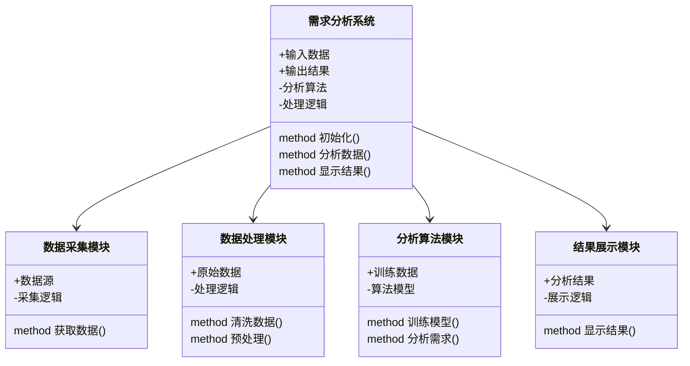

                 


# 企业AI需求分析：识别和评估AI Agent的应用机会

> 关键词：企业AI需求分析，AI Agent，需求识别，需求评估，人工智能，机器学习，自然语言处理

> 摘要：本文详细探讨了企业AI需求分析的核心概念、算法原理、系统架构设计以及实战应用。通过对比分析和案例解读，识别和评估AI Agent在企业中的应用机会，为企业技术决策者提供深度洞察和实践指导。

---

## 第一部分: 企业AI需求分析概述

### 第1章: AI Agent与企业需求分析背景

#### 1.1 AI Agent的基本概念

##### 1.1.1 AI Agent的定义与核心特征
AI Agent（人工智能代理）是指能够感知环境并采取行动以实现目标的智能实体。其核心特征包括：

1. **自主性**：能够在没有外部干预的情况下运行。
2. **反应性**：能够根据环境变化动态调整行为。
3. **目标导向性**：所有行动均以实现特定目标为导向。
4. **学习能力**：通过数据和经验不断优化自身性能。

AI Agent可以是软件程序、机器人或其他智能设备，广泛应用于企业决策支持、自动化操作、客户交互等领域。

##### 1.1.2 企业AI Agent的应用场景
在企业环境中，AI Agent的应用场景丰富多样，主要包括：

1. **客户关系管理**：通过自然语言处理（NLP）技术提供智能客服，提升客户满意度。
2. **供应链优化**：利用机器学习算法优化库存管理和物流调度。
3. **数据分析与决策支持**：通过AI Agent辅助企业进行数据挖掘和预测分析。
4. **自动化流程管理**：实现企业内部流程的自动化，提高效率。

##### 1.1.3 企业AI Agent的技术演进与发展趋势
AI Agent技术经历了从简单规则引擎到复杂深度学习模型的演进。当前，随着大语言模型（如GPT）的崛起，AI Agent的功能日益强大，未来将朝着以下几个方向发展：

1. **多模态交互**：支持文本、语音、图像等多种交互方式。
2. **实时响应**：提升处理速度和响应能力，满足企业对实时性的要求。
3. **自适应优化**：通过强化学习不断优化自身行为策略。

#### 1.2 企业需求分析的背景与挑战

##### 1.2.1 传统企业需求分析的局限性
传统的企业需求分析方法主要依赖于人工访谈和问卷调查，存在以下问题：

1. **主观性**：分析结果受分析师主观判断的影响较大。
2. **效率低下**：人工分析耗时长，难以应对快速变化的市场需求。
3. **深度不足**：难以深入挖掘隐性需求，尤其是复杂场景下的需求。

##### 1.2.2 AI技术对企业需求分析的推动作用
AI技术的引入为企业需求分析带来了革命性的变化：

1. **数据驱动**：通过大数据分析挖掘潜在需求。
2. **自动化**：AI Agent可以自动收集、整理和分析需求信息，显著提高效率。
3. **精准性**：利用机器学习算法，提高需求识别的准确性。

##### 1.2.3 当前企业AI Agent应用的痛点与难点
尽管AI Agent在企业中的应用前景广阔，但仍面临诸多挑战：

1. **数据质量**：需求分析依赖高质量数据，数据不足或不准确会影响分析结果。
2. **模型泛化能力**：AI Agent需要具备跨场景的通用性，这对模型的泛化能力提出了更高要求。
3. **伦理与安全**：AI Agent的使用可能引发数据隐私、算法偏见等问题。

### 第2章: 企业AI需求分析的核心概念与联系

#### 2.1 核心概念原理

##### 2.1.1 需求分析的三要素：用户、场景、目标
需求分析的三要素模型是理解AI Agent需求分析的基础：

1. **用户**：需求的提出者，可能是企业内部员工或外部客户。
2. **场景**：需求提出的具体情境，包括时间、地点、环境等因素。
3. **目标**：用户希望通过满足需求实现的具体目标。

##### 2.1.2 AI Agent的功能模块与交互机制
AI Agent的功能模块包括：

1. **感知模块**：通过传感器或数据接口获取环境信息。
2. **决策模块**：基于感知信息做出决策。
3. **执行模块**：根据决策结果执行具体操作。
4. **学习模块**：通过反馈优化自身行为。

AI Agent的交互机制通常包括以下步骤：

1. **信息获取**：通过API或用户输入获取需求信息。
2. **需求解析**：利用NLP技术解析需求的具体内容。
3. **决策制定**：基于解析结果制定行动方案。
4. **反馈优化**：根据执行结果优化后续行为。

##### 2.1.3 企业需求分析的数学模型与公式
需求分析的数学模型可以通过以下公式表示：

$$
D = f(x_1, x_2, \ldots, x_n)
$$

其中，$D$ 表示需求，$x_i$ 表示影响需求的因素，$f$ 表示需求分析函数。

#### 2.2 核心概念对比分析

##### 2.2.1 AI Agent与传统需求分析方法的对比
| 特性                | AI Agent                      | 传统需求分析方法                |
|---------------------|-------------------------------|---------------------------------|
| 主观性               | 较低                          | 较高                            |
| 效率                 | 高                           | 低                             |
| 深度                 | 深                           | 浅                             |
| 可扩展性             | 高                           | 低                             |

##### 2.2.2 不同AI Agent应用场景的特征对比
| 场景                | 客户关系管理                 | 供应链优化                     | 数据分析与决策支持             |
|---------------------|------------------------------|---------------------------------|---------------------------------|
| 核心功能             | 自然语言处理                 | 优化算法                       | 数据挖掘与预测                 |
| 依赖技术             | NLP                          | 机器学习                       | 大数据分析                   |

##### 2.2.3 企业需求分析的ER实体关系图
```mermaid
er
  actor
  agent
  interaction
  action
  goal
  constraint

  actor -|> interaction
  agent -|> action
  interaction --> action
  action --> goal
  goal --> constraint
```

### 第3章: 企业AI需求分析的算法原理

#### 3.1 算法原理概述

##### 3.1.1 基于自然语言处理的需求分析算法
自然语言处理（NLP）是AI Agent需求分析的核心技术之一。常用算法包括：

1. **词袋模型（Bag of Words）**：将文本转化为向量表示。
2. **TF-IDF（Term Frequency-Inverse Document Frequency）**：衡量关键词的重要性。
3. **深度学习模型（如BERT）**：通过预训练模型进行语义理解。

##### 3.1.2 基于机器学习的需求分析模型
机器学习算法在需求分析中的应用主要体现在分类和回归任务中。常用算法包括：

1. **支持向量机（SVM）**：用于分类任务。
2. **随机森林（Random Forest）**：用于特征选择和分类。
3. **神经网络（如RNN、LSTM）**：用于序列数据的处理。

##### 3.1.3 基于图神经网络的需求关联分析
图神经网络（Graph Neural Network, GNN）可以用于分析需求之间的关联关系。其核心思想是将需求数据建模为图结构，通过节点之间的关系进行推理。

#### 3.2 算法流程图
```mermaid
flow
    st=>start
    e=>end
    act1=>标淮化数据
    act2=>选择算法
    act3=>训练模型
    act4=>评估模型
    act5=>优化参数
    st->act1->act2->act3->act4->act5->e
```

### 第4章: 企业AI需求分析的系统架构设计

#### 4.1 系统分析与架构方案

##### 4.1.1 需求分析系统的功能模块设计
需求分析系统的主要功能模块包括：

1. **数据采集模块**：从多种数据源获取需求信息。
2. **数据处理模块**：对数据进行清洗和预处理。
3. **需求分析模块**：利用算法对需求进行分析和分类。
4. **结果展示模块**：将分析结果以可视化形式呈现。

##### 4.1.2 系统的领域模型mermaid类图


##### 4.1.3 系统架构的mermaid架构图
```mermaid
archi
    client
    server
    database
    external_systems
    client -[HTTP]- server
    server -[数据库连接]- database
    server -[API调用]- external_systems
```

#### 4.2 系统接口与交互设计

##### 4.2.1 系统核心接口设计
系统核心接口包括：

1. **数据采集接口**：用于从外部系统获取数据。
2. **数据处理接口**：用于对数据进行清洗和预处理。
3. **分析接口**：用于调用分析算法进行需求分析。
4. **结果展示接口**：用于将分析结果展示给用户。

##### 4.2.2 系统交互的mermaid序列图
```mermaid
sequenceDiagram
    actor 用户
    system 系统
    用户 -> 系统: 提交需求信息
    系统 -> 数据采集模块: 获取数据
    数据采集模块 -> 系统: 返回数据
    系统 -> 数据处理模块: 处理数据
    数据处理模块 -> 系统: 返回处理后的数据
    系统 -> 分析算法模块: 分析需求
    分析算法模块 -> 系统: 返回分析结果
    系统 -> 结果展示模块: 显示结果
    结果展示模块 -> 用户: 展示结果
```

---

## 第二部分: 企业AI需求分析的实战应用

### 第5章: 企业AI需求分析的项目实战

#### 5.1 项目环境与工具安装

##### 5.1.1 开发环境配置
建议使用以下开发环境：

1. **操作系统**：Linux或MacOS
2. **编程语言**：Python 3.8+
3. **开发工具**：PyCharm或VS Code

##### 5.1.2 依赖库安装与配置
安装以下依赖库：

1. **自然语言处理**：spaCy、NLTK
2. **机器学习**：Scikit-learn、XGBoost
3. **深度学习**：TensorFlow、Keras
4. **数据处理**：Pandas、NumPy

##### 5.1.3 数据集准备与预处理
需要准备以下数据集：

1. **文本数据**：客户反馈、产品评论等。
2. **标签数据**：需求分类标签。

数据预处理步骤包括：

1. **清洗数据**：去除噪声数据。
2. **分词处理**：将文本分割成词语或短语。
3. **特征提取**：提取文本特征。

#### 5.2 系统核心实现

##### 5.2.1 需求分析模块的代码实现
以下是一个基于机器学习的需求分析模块的代码示例：

```python
import numpy as np
from sklearn.feature_extraction.text import TfidfVectorizer
from sklearn.svm import SVC

# 数据预处理
def preprocess(text):
    return text.lower().strip()

# 特征提取
vectorizer = TfidfVectorizer()
X = vectorizer.fit_transform(texts)

# 模型训练
model = SVC()
model.fit(X, labels)

# 模型预测
new_text = ["客户希望优化订单处理流程"]
new_X = vectorizer.transform([new_text])
predicted_label = model.predict(new_X)
print(predicted_label)
```

##### 5.2.2 AI Agent交互模块的代码实现
以下是一个简单的AI Agent交互模块的代码示例：

```python
class Agent:
    def __init__(self, model):
        self.model = model

    def interact(self, input_text):
        response = self.model.generate_response(input_text)
        return response

agent = Agent(model)
response = agent.interact("请帮我优化订单处理流程")
print(response)
```

##### 5.2.3 系统功能测试与优化
测试步骤包括：

1. **单元测试**：测试各个功能模块的独立性。
2. **集成测试**：测试系统各模块之间的接口和交互。
3. **性能测试**：测试系统在高负载情况下的表现。

优化措施包括：

1. **参数调优**：通过网格搜索优化模型参数。
2. **模型融合**：结合多种模型提升性能。
3. **错误分析**：分析错误案例，改进模型。

### 第6章: 企业AI需求分析的案例分析

#### 6.1 案例分析与详细解读

##### 6.1.1 某行业企业的AI Agent应用案例
以某电商平台为例，AI Agent在需求分析中的应用包括：

1. **客户行为分析**：通过NLP技术分析客户评论，识别潜在需求。
2. **需求分类**：利用机器学习算法对需求进行分类，提高需求识别的准确性。
3. **需求预测**：基于历史数据预测未来需求，优化资源配置。

##### 6.1.2 案例中的需求分析过程与结果
需求分析过程包括：

1. **数据采集**：收集客户评论和订单数据。
2. **数据预处理**：清洗和分词处理数据。
3. **特征提取**：提取文本特征，构建特征向量。
4. **模型训练**：训练需求分类模型。
5. **模型评估**：评估模型性能，调整参数。
6. **结果展示**：将分析结果以可视化形式呈现。

分析结果示例：

1. **需求分类结果**：客户主要需求集中在物流配送和售后服务。
2. **需求预测结果**：预测下季度的需求增长率为15%。

##### 6.1.3 案例的启示与经验总结
通过案例分析可以得出以下结论：

1. **数据质量至关重要**：高质量的数据是需求分析的基础。
2. **模型选择需谨慎**：不同场景下应选择合适的模型。
3. **持续优化是关键**：通过反馈不断优化模型和系统。

### 第7章: 企业AI需求分析的最佳实践与注意事项

#### 7.1 最佳实践Tips

##### 7.1.1 需求分析的常见误区与解决方案
常见误区包括：

1. **忽视数据质量**：数据预处理是需求分析的关键步骤，忽视数据质量会导致分析结果不准确。
2. **模型选择盲目追求复杂性**：简单模型可能在某些场景下表现更优，需根据实际情况选择模型。
3. **忽视反馈机制**：持续优化是提升模型性能的重要手段，忽视反馈机制会导致模型性能下降。

##### 7.1.2 需求分析的性能优化技巧
性能优化技巧包括：

1. **特征选择**：通过特征重要性分析选择关键特征。
2. **模型压缩**：通过模型剪枝等技术减少模型复杂度。
3. **分布式计算**：利用分布式计算框架（如Spark）处理大规模数据。

##### 7.1.3 AI Agent的可解释性与透明度
可解释性是AI Agent应用的重要因素，尤其是在企业决策中。提升可解释性的方法包括：

1. **可视化解释**：通过可视化工具展示模型决策过程。
2. **规则提取**：将模型决策规则转化为易于理解的规则。
3. **案例分析**：通过具体案例分析模型决策的合理性。

#### 7.2 项目小结

##### 7.2.1 项目总结
通过本项目，我们深入探讨了企业AI需求分析的核心概念、算法原理和系统架构设计。通过实战案例，我们验证了AI Agent在企业需求分析中的应用价值。

##### 7.2.2 项目经验与不足
通过本项目，我们积累了丰富的实战经验，但也发现了以下不足：

1. **数据获取困难**：高质量数据的获取可能面临挑战。
2. **模型泛化能力不足**：模型在某些场景下表现不佳。
3. **系统集成复杂**：AI Agent的集成可能涉及多个系统和接口。

##### 7.2.3 项目未来改进方向
未来改进方向包括：

1. **优化数据获取机制**：建立数据共享机制，提高数据获取效率。
2. **提升模型泛化能力**：探索更先进的算法，如大语言模型。
3. **简化系统集成流程**：开发标准化接口，降低集成复杂度。

---

## 第三部分: 企业AI需求分析的展望与总结

### 第8章: 企业AI需求分析的未来展望

#### 8.1 AI Agent技术的未来发展趋势
随着技术的进步，AI Agent将朝着以下方向发展：

1. **多模态交互**：支持文本、语音、图像等多种交互方式。
2. **实时响应**：提升处理速度和响应能力。
3. **自适应优化**：通过强化学习不断优化自身行为策略。
4. **人机协作**：实现人机无缝协作，提升工作效率。

#### 8.2 企业AI需求分析的未来应用场景
未来，AI Agent将在以下领域发挥重要作用：

1. **智能客服**：提供更智能的客户支持服务。
2. **智能决策支持**：辅助企业做出更明智的决策。
3. **智能流程管理**：实现企业内部流程的智能化管理。

#### 8.3 企业AI需求分析的技术挑战与解决方案
尽管AI Agent的应用前景广阔，但仍面临诸多技术挑战：

1. **数据隐私**：如何在保护数据隐私的前提下进行需求分析。
2. **算法解释性**：如何提高AI Agent的可解释性，尤其是在涉及企业决策时。
3. **系统集成**：如何将AI Agent无缝集成到现有企业系统中。

解决方案包括：

1. **数据加密与匿名化**：通过数据加密和匿名化技术保护数据隐私。
2. **可解释性算法**：开发更透明的算法，提高AI Agent的可解释性。
3. **标准化接口**：制定标准化接口规范，简化系统集成过程。

---

## 结语

企业AI需求分析是AI技术在企业应用中的重要组成部分，AI Agent的引入为企业需求分析带来了新的可能性。通过本文的探讨，我们深入分析了AI Agent的核心概念、算法原理和系统架构设计，并通过实战案例展示了其在企业中的应用价值。未来，随着技术的进步，AI Agent将在企业需求分析中发挥更大的作用，为企业创造更多的价值。

---

## 作者

**作者：AI天才研究院/AI Genius Institute & 禅与计算机程序设计艺术 /Zen And The Art of Computer Programming**

---

**附录：**

- **参考文献**：列出您在写作中参考的主要文献和资料。
- **工具推荐**：推荐一些常用的AI开发工具和平台。
- **术语表**：解释文中出现的专业术语。
- **扩展阅读**：提供一些相关的进一步阅读资料。

