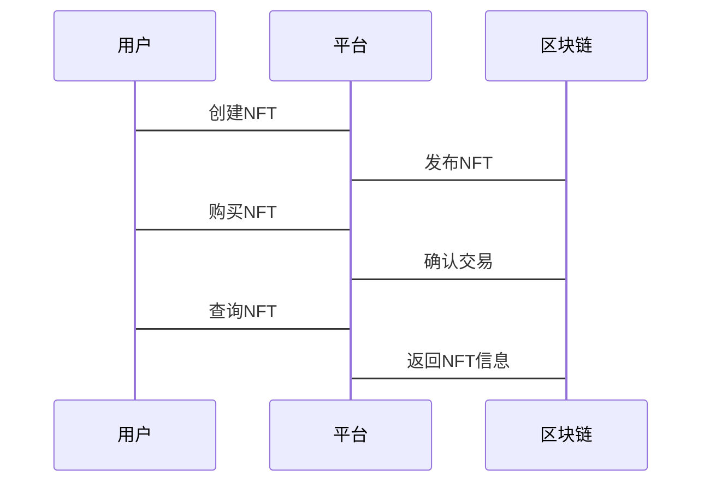
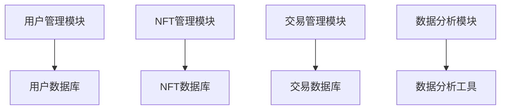

                 


# 企业估值中的区块链数字艺术平台评估

> 关键词：区块链，数字艺术，企业估值，NFT，平台评估

> 摘要：本文探讨了在企业估值过程中，如何评估区块链数字艺术平台的价值。首先介绍了区块链和数字艺术平台的基本概念，接着分析了数字艺术平台的评估方法，包括市场分析、技术评估和财务分析。然后详细讲解了评估模型的算法原理，包括数据采集、模型选择和优化。最后通过项目实战案例，展示了如何将这些方法应用到实际中，并提出了未来的研究方向。

---

# 第一部分: 引言

## 第1章: 企业估值与区块链数字艺术平台的结合

### 1.1 企业估值的基本概念

企业估值是评估企业价值的过程，通常用于投资决策、并购和融资等活动。传统的企业估值方法包括DCF模型、市盈率法和市净率法等。然而，随着区块链技术的兴起，数字艺术平台的出现对企业估值提出了新的挑战和机遇。

#### 1.1.1 企业估值的定义与方法

企业估值是通过分析企业的财务状况、市场地位、竞争优势等因素，确定其市场价值的过程。常用的方法包括：

- **DCF模型**：通过预测企业的未来现金流，折现到现值来评估企业价值。
- **市盈率法**：通过比较企业的市盈率与行业平均水平，评估企业价值。
- **市净率法**：通过比较企业的市净率与行业平均水平，评估企业价值。

#### 1.1.2 区块链技术对企业估值的影响

区块链技术的去中心化和不可篡改性为数字艺术平台提供了新的价值评估方式。通过区块链技术，可以确保数字艺术品的唯一性和所有权，从而提高其市场价值。

#### 1.1.3 数字艺术平台的兴起与特点

数字艺术平台利用区块链技术，将数字艺术品转化为NFT（非同质化代币），实现了艺术品的唯一性和可交易性。与传统艺术品市场相比，数字艺术平台具有以下特点：

- **去中心化**：通过区块链技术，数字艺术平台实现了去中心化的交易和所有权转移。
- **透明性**：区块链技术保证了交易的透明性和可追溯性。
- **可扩展性**：数字艺术平台可以支持大量的数字艺术品交易，具有较强的扩展性。

### 1.2 区块链数字艺术平台的背景与现状

区块链技术的快速发展推动了数字艺术平台的兴起。近年来，NFT市场的迅速崛起吸引了大量的投资者和企业。

#### 1.2.1 区块链技术在数字艺术领域的应用

区块链技术在数字艺术领域的应用主要体现在以下几个方面：

- **NFT的创建与发行**：通过智能合约，数字艺术家可以在区块链上创建和发行NFT，确保作品的唯一性和所有权。
- **艺术品的溯源与验证**：区块链技术可以记录艺术品的交易历史，确保其真实性。
- **艺术品的交易与流转**：通过区块链平台，数字艺术品可以在全球范围内进行交易和流转。

#### 1.2.2 数字艺术平台的市场现状与发展趋势

目前，数字艺术平台市场呈现快速发展的态势。根据市场研究机构的数据，2023年全球NFT市场规模已经超过100亿美元。未来，随着区块链技术的进一步发展，数字艺术平台将具有更大的市场潜力。

#### 1.2.3 区块链数字艺术平台的核心优势

区块链数字艺术平台的核心优势在于其去中心化和不可篡改性，这为数字艺术品的交易和流转提供了安全和透明的环境。此外，区块链技术还可以提高交易的效率和降低成本。

---

## 第2章: 区块链数字艺术平台的基本概念

### 2.1 区块链技术的核心原理

区块链技术是一种去中心化的分布式账本技术，通过加密算法和共识机制保证数据的安全性和不可篡改性。

#### 2.1.1 区块链的定义与基本特点

区块链是一种由多个区块组成的链式数据结构，每个区块包含一定的交易信息和时间戳。区块链具有以下特点：

- **去中心化**：区块链不依赖于中心化的机构，数据由网络中的多个节点共同维护。
- **不可篡改性**：区块链上的数据一旦写入，无法被修改或删除。
- **透明性**：区块链上的交易记录对所有节点公开，任何人都可以查看。

#### 2.1.2 区块链的共识机制与安全性

共识机制是区块链的核心机制之一，用于确保网络中的节点能够达成一致。常见的共识机制包括：

- **工作量证明（PoW）**：通过计算哈希值来验证交易，确保网络安全。
- **权益证明（PoS）**：通过持有一定数量的代币来验证交易，减少计算消耗。
- ** delegated Proof of Stake（DPoS）**：通过选举代表节点来验证交易，提高效率。

#### 2.1.3 区块链的去中心化特性

去中心化是区块链的核心特性之一，通过去中心化的网络结构，避免了单点故障和权力集中化的问题。

### 2.2 数字艺术平台的定义与分类

数字艺术平台是基于区块链技术的在线平台，用于数字艺术品的展示、交易和流转。

#### 2.2.1 数字艺术的定义与表现形式

数字艺术是指以数字形式存在的艺术作品，包括数字绘画、数字雕塑、数字音乐等。数字艺术作品可以通过区块链技术进行确权和交易。

#### 2.2.2 区块链数字艺术平台的分类

区块链数字艺术平台可以根据其功能和应用场景进行分类，主要包括：

- **NFT交易平台**：如OpenSea、Foundation等，主要用于NFT的交易和流转。
- **数字艺术创作平台**：如Mintable、Nifty Gateway等，支持数字艺术家创作和发布NFT。
- **数字艺术收藏平台**：如SuperRare、Async Art等，专注于收藏和展示数字艺术作品。

#### 2.2.3 数字艺术平台的典型应用场景

数字艺术平台的应用场景包括：

- **艺术创作与发布**：数字艺术家可以在平台上发布自己的作品，获得全球范围内的关注和销售。
- **艺术收藏与投资**：收藏家可以通过平台购买和收藏数字艺术品，进行长期投资。
- **艺术交易与流转**：NFT的交易和流转为数字艺术品提供了更多的市场机会。

### 2.3 NFT（非同质化代币）的核心概念

NFT是非同质化代币的缩写，是一种基于区块链技术的代币，用于表示数字艺术品的唯一性和所有权。

#### 2.3.1 NFT的定义与特点

NFT是一种不可替代的代币，具有以下特点：

- **唯一性**：每个NFT都是唯一的，不可复制。
- **可验证性**：通过区块链技术，可以验证NFT的真实性。
- **可转让性**：NFT可以在不同的平台上进行交易和流转。

#### 2.3.2 NFT在数字艺术中的应用

NFT在数字艺术中的应用主要体现在以下几个方面：

- **艺术品确权**：通过NFT，数字艺术家可以确权自己的作品，防止抄袭和侵权。
- **艺术品交易**：NFT为数字艺术品提供了新的交易方式，支持全球范围内的交易和流转。
- **艺术品收藏**：NFT使得数字艺术品的收藏更加便捷和安全。

#### 2.3.3 NFT与区块链的关系

NFT是区块链技术的一种应用形式，通过智能合约在区块链上记录NFT的所有权信息，确保其真实性和不可篡改性。

---

## 第3章: 区块链数字艺术平台的评估方法

### 3.1 评估方法的概述

企业估值中的区块链数字艺术平台评估需要综合考虑市场、技术和财务等多个因素。

#### 3.1.1 企业估值的基本方法

企业估值的基本方法包括DCF模型、市盈率法和市净率法等。这些方法在数字艺术平台的评估中需要进行适当的调整。

#### 3.1.2 区块链数字艺术平台的特殊性与挑战

数字艺术平台的特殊性在于其依赖于区块链技术和NFT市场，评估时需要考虑市场波动、技术风险等因素。

### 3.2 数字艺术平台的市场分析

市场分析是评估数字艺术平台的重要步骤，包括市场规模、用户行为和竞争格局等方面。

#### 3.2.1 市场规模与增长趋势

通过分析NFT市场的规模和增长趋势，可以评估数字艺术平台的市场潜力。根据市场研究机构的数据，2023年全球NFT市场规模已经超过100亿美元，未来几年预计将继续快速增长。

#### 3.2.2 用户行为与需求分析

用户行为和需求分析是评估数字艺术平台的重要因素。通过分析用户的购买行为、偏好和消费习惯，可以预测市场的未来发展趋势。

#### 3.2.3 竞争格局与市场占有率

竞争格局分析包括对主要竞争对手的市场占有率、竞争优势和市场策略的分析，以评估数字艺术平台的市场地位。

### 3.3 技术评估与平台稳定性

技术评估是数字艺术平台评估的重要组成部分，包括区块链技术的安全性和平台的稳定性。

#### 3.3.1 区块链技术的评估指标

区块链技术的评估指标包括去中心化程度、共识机制的安全性、网络性能等。通过评估这些指标，可以判断数字艺术平台的技术优劣。

#### 3.3.2 平台的安全性与稳定性

平台的安全性与稳定性是数字艺术平台成功运营的关键。通过分析平台的漏洞、攻击历史和系统稳定性，可以评估平台的技术风险。

#### 3.3.3 平台的可扩展性与性能

平台的可扩展性和性能决定了其未来的发展潜力。通过分析平台的处理能力、响应时间和吞吐量，可以评估其是否能够满足未来的需求。

### 3.4 财务评估与盈利能力

财务评估是数字艺术平台评估的重要组成部分，包括收入来源、成本结构和盈利能力等方面。

#### 3.4.1 收入来源

数字艺术平台的收入来源主要包括交易佣金、平台订阅费和广告收入等。通过分析这些收入来源的稳定性和增长潜力，可以评估平台的盈利能力。

#### 3.4.2 成本结构

数字艺术平台的成本结构包括技术开发成本、运营成本和市场推广成本等。通过分析这些成本的构成和变化趋势，可以预测平台的未来成本。

#### 3.4.3 盈利能力

盈利能力是评估数字艺术平台价值的重要指标。通过分析平台的净收入、利润率和投资回报率等指标，可以判断平台的盈利能力。

---

## 第4章: 区块链数字艺术平台的算法原理

### 4.1 评估模型的构建

评估模型的构建是数字艺术平台评估的核心部分，包括数据的采集与处理、模型的选择与训练、模型的验证与优化。

#### 4.1.1 数据采集与处理

数据的采集与处理是评估模型构建的第一步。需要收集相关的市场数据、技术数据和财务数据，并进行清洗和预处理。

#### 4.1.2 模型选择与训练

模型选择与训练是评估模型构建的关键步骤。需要选择合适的算法，进行参数调整和模型训练，以提高模型的准确性和稳定性。

#### 4.1.3 模型的验证与优化

模型的验证与优化是确保模型准确性的必要步骤。需要通过交叉验证和性能测试，不断优化模型的结构和参数。

### 4.2 数学模型与公式

数学模型是评估模型的核心，需要通过公式化的方式来描述数字艺术平台的评估过程。

#### 4.2.1 企业估值的基本公式

企业估值的基本公式可以表示为：

$$
\text{企业价值} = \text{未来现金流的现值}
$$

其中，未来现金流的现值可以通过DCF模型计算得出。

#### 4.2.2 区块链数字艺术平台的评估公式

数字艺术平台的评估公式可以表示为：

$$
\text{平台价值} = \text{市场规模} \times \text{市场占有率} \times \text{利润率}
$$

其中，市场规模是NFT市场的总体规模，市场占有率是平台在市场中的份额，利润率是平台的盈利能力。

#### 4.2.3 NFT价值的数学模型

NFT的价值可以通过以下公式进行评估：

$$
\text{NFT价值} = \text{艺术家声誉} \times \text{作品独特性} \times \text{市场热度}
$$

其中，艺术家声誉是艺术家的知名度和影响力，作品独特性是作品的创新性和独特性，市场热度是市场对NFT的需求和关注度。

### 4.3 算法实现与代码示例

算法实现是评估模型的重要部分，需要通过代码实现模型的训练和预测。

#### 4.3.1 算法流程图

以下是一个简单的算法流程图：

```mermaid
graph TD
    A[开始] -> B[数据采集]
    B -> C[数据处理]
    C -> D[模型选择]
    D -> E[模型训练]
    E -> F[模型验证]
    F -> G[模型优化]
    G -> H[结束]
```

#### 4.3.2 Python代码实现

以下是一个简单的Python代码示例，用于训练一个简单的回归模型：

```python
import pandas as pd
import numpy as np
from sklearn.model_selection import train_test_split
from sklearn.linear_model import LinearRegression
from sklearn.metrics import mean_squared_error

# 数据采集与处理
data = pd.read_csv('nft_market.csv')
X = data[['market_size', 'market_share', 'profitability']]
y = data['platform_value']

# 模型选择与训练
X_train, X_test, y_train, y_test = train_test_split(X, y, test_size=0.2, random_state=42)
model = LinearRegression()
model.fit(X_train, y_train)

# 模型验证与优化
y_pred = model.predict(X_test)
rmse = np.sqrt(mean_squared_error(y_test, y_pred))
print('均方根误差:', rmse)
print('模型系数:', model.coef_)
print('模型截距:', model.intercept_)
```

#### 4.3.3 代码的功能与应用场景

上述代码的功能是训练一个简单的回归模型，用于预测数字艺术平台的价值。代码包括数据的采集与处理、模型的选择与训练、模型的验证与优化等步骤。该代码可以应用于NFT市场的数据分析和平台价值评估。

---

## 第5章: 区块链数字艺术平台的系统架构

### 5.1 系统架构设计

系统架构设计是数字艺术平台评估的重要部分，包括模块划分、系统接口设计和系统交互流程。

#### 5.1.1 模块划分

数字艺术平台的系统架构可以划分为以下几个模块：

- **用户模块**：负责用户的身份验证和权限管理。
- **NFT模块**：负责NFT的创建、发布和交易。
- **交易模块**：负责NFT的交易和流转。
- **数据模块**：负责数据的存储和管理。

#### 5.1.2 系统接口设计

系统接口设计是系统架构设计的重要部分，包括API接口的设计和功能的实现。

- **NFT创建接口**：允许用户创建和发布NFT。
- **NFT交易接口**：允许用户购买和出售NFT。
- **NFT查询接口**：允许用户查询NFT的详细信息。

#### 5.1.3 系统交互流程图

以下是一个简单的系统交互流程图：



### 5.2 系统功能设计

系统功能设计是数字艺术平台评估的重要部分，包括功能的实现和系统的优化。

#### 5.2.1 功能模块划分

数字艺术平台的功能模块可以划分为以下几个部分：

- **用户管理模块**：负责用户的注册、登录和权限管理。
- **NFT管理模块**：负责NFT的创建、发布和管理。
- **交易管理模块**：负责NFT的交易和流转。
- **数据分析模块**：负责数据的采集、处理和分析。

#### 5.2.2 系统架构图

以下是一个简单的系统架构图：



#### 5.2.3 系统接口设计

系统接口设计是系统架构设计的重要部分，包括API接口的设计和功能的实现。

- **用户接口**：用于用户的身份验证和信息管理。
- **NFT接口**：用于NFT的创建、发布和查询。
- **交易接口**：用于NFT的交易和流转。

### 5.3 项目实战

项目实战是将理论应用于实践的重要部分，包括环境的安装、核心代码的实现和案例分析。

#### 5.3.1 环境安装

需要安装以下环境：

- Python 3.8+
- Jupyter Notebook
- Pandas
- Scikit-learn
- Mermaid

#### 5.3.2 核心代码实现

以下是一个简单的Python代码示例，用于训练一个回归模型：

```python
import pandas as pd
import numpy as np
from sklearn.model_selection import train_test_split
from sklearn.linear_model import LinearRegression
from sklearn.metrics import mean_squared_error

# 数据采集与处理
data = pd.read_csv('nft_market.csv')
X = data[['market_size', 'market_share', 'profitability']]
y = data['platform_value']

# 模型选择与训练
X_train, X_test, y_train, y_test = train_test_split(X, y, test_size=0.2, random_state=42)
model = LinearRegression()
model.fit(X_train, y_train)

# 模型验证与优化
y_pred = model.predict(X_test)
rmse = np.sqrt(mean_squared_error(y_test, y_pred))
print('均方根误差:', rmse)
print('模型系数:', model.coef_)
print('模型截距:', model.intercept_)
```

#### 5.3.3 案例分析与解读

通过上述代码，可以训练一个简单的回归模型，用于预测数字艺术平台的价值。模型的均方根误差（RMSE）越小，模型的准确性越高。模型的系数和截距可以帮助我们理解各因素对平台价值的影响。

---

## 第6章: 总结与展望

### 6.1 本章小结

本文详细探讨了企业估值中的区块链数字艺术平台评估，包括区块链和数字艺术平台的基本概念、评估方法、算法原理和系统架构设计。通过案例分析和代码实现，展示了如何将理论应用于实际。

### 6.2 注意事项与小结

在进行数字艺术平台评估时，需要注意以下几点：

- **数据的准确性和完整性**：数据的准确性和完整性是模型训练的基础。
- **模型的适用性和可解释性**：模型的适用性和可解释性是模型应用的关键。
- **市场的波动性和风险性**：市场的波动性和风险性是评估的重要因素。

### 6.3 未来研究方向

未来的研究方向包括：

- **模型的优化与改进**：进一步优化模型的结构和参数，提高模型的准确性和稳定性。
- **新技术的应用与探索**：探索区块链技术的其他应用形式，如智能合约的优化和多链技术的应用。
- **市场的深度研究与分析**：进一步研究NFT市场的深度，挖掘市场的潜在机会和挑战。

---

# 作者：AI天才研究院/AI Genius Institute & 禅与计算机程序设计艺术 /Zen And The Art of Computer Programming

---

以上是《企业估值中的区块链数字艺术平台评估》的技术博客文章的完整内容。

