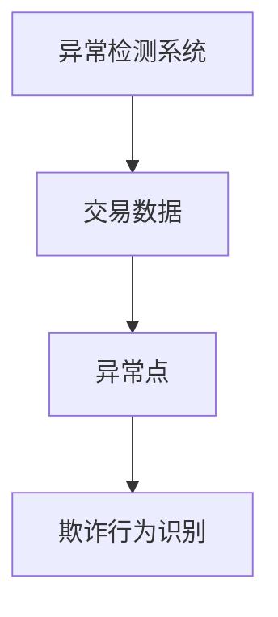
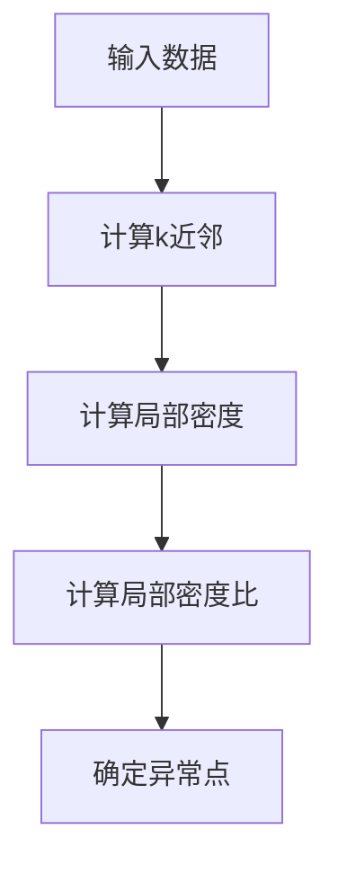
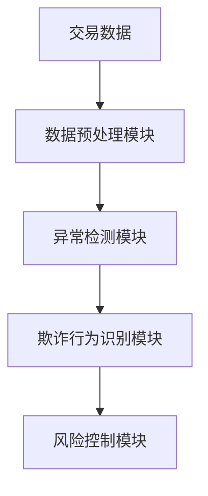
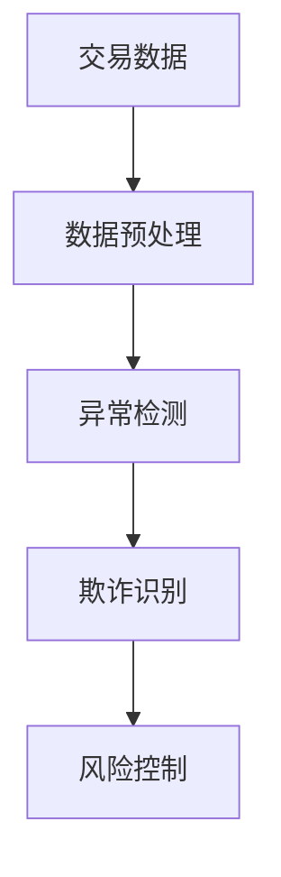

                 


# 异常检测算法在金融欺诈识别中的应用

> 关键词：异常检测，金融欺诈，机器学习，深度学习，算法实现，系统架构

> 摘要：异常检测算法在金融欺诈识别中扮演着至关重要的角色。随着金融交易的复杂化和网络化，金融欺诈手段也在不断进化，传统的基于规则的欺诈检测方法逐渐显现出局限性。异常检测算法，作为一种数据驱动的解决方案，能够通过分析交易数据中的异常模式，有效识别潜在的欺诈行为。本文将从异常检测的基本概念出发，详细探讨其在金融欺诈识别中的应用，包括常见异常检测算法的原理与实现、系统架构设计、项目实战案例分析以及最佳实践等内容。

---

# 第一部分：异常检测与金融欺诈识别的背景介绍

## 第1章：异常检测的基本概念与应用价值

### 1.1 异常检测的核心概念

#### 1.1.1 异常检测的定义与目标
异常检测（Outlier Detection）是指通过分析数据集，识别出与数据整体分布明显不同的数据点或模式。其核心目标是发现数据中的异常行为或异常事件，这些异常可能代表潜在的威胁或机会。

#### 1.1.2 异常检测的关键特征
- 数据点的独特性：异常点通常与正常数据点在统计分布上存在显著差异。
- 数据分布的多样性：异常检测需要考虑数据的多维分布特征。
- 场景的动态性：金融交易数据具有实时性，异常行为可能随时间变化而变化。

#### 1.1.3 异常检测在金融领域的应用价值
- 实时监控：通过实时分析交易数据，快速识别潜在的欺诈行为。
- 风险控制：帮助金融机构降低因欺诈行为带来的经济损失。
- 数据质量保障：通过异常检测，确保数据的完整性和可靠性。

### 1.2 金融欺诈识别的现状与挑战

#### 1.2.1 金融欺诈的主要形式
- 信用卡欺诈：通过虚假交易或盗用信用卡信息进行非法消费。
- 账户盗用：未经授权的第三方非法登录账户并进行交易。
- 内部欺诈：金融机构内部员工利用职务之便进行的欺诈行为。
- 洗钱：通过一系列复杂的交易将非法资金合法化。

#### 1.2.2 传统金融欺诈识别方法的局限性
- 基于规则的方法：依赖于预定义的规则，难以应对新型欺诈手段。
- 基于统计的方法：仅能识别简单的异常模式，难以应对复杂场景。
- 基于人工审查的方法：效率低下，且容易受到主观因素的影响。

#### 1.2.3 异常检测在金融欺诈识别中的优势
- 数据驱动：通过分析交易数据的特征，自动识别异常行为。
- 实时性：能够快速响应，减少欺诈行为的损失。
- 可扩展性：适用于大规模数据和复杂场景。

### 1.3 异常检测在金融欺诈识别中的问题背景

#### 1.3.1 金融交易数据的特点
- 高维性：交易数据通常包含时间、地点、金额、用户行为等多个维度。
- 大规模：金融机构每天处理的交易数据量巨大。
- 实时性：需要对交易数据进行实时分析，以快速响应异常行为。

#### 1.3.2 异常交易的特征分析
- 异常金额：交易金额远超正常范围。
- 异常时间：交易时间集中在非正常时段。
- 异常行为：交易行为与用户历史行为模式不符。

#### 1.3.3 异常检测在金融欺诈识别中的问题解决
- 通过分析交易数据的特征，识别潜在的欺诈行为。
- 基于数据分布的异常检测，能够发现新型欺诈手段。
- 通过实时监控，减少欺诈行为的损失。

### 1.4 本章小结
本章从异常检测的基本概念出发，介绍了金融欺诈识别的现状与挑战，并分析了异常检测在金融欺诈识别中的优势和问题背景。

---

## 第2章：异常检测的核心概念与联系

### 2.1 异常检测的核心原理

#### 2.1.1 异常检测的分类
- 基于统计的方法：如Z-score、概率密度估计。
- 基于机器学习的方法：如聚类、分类、深度学习。
- 基于距离的方法：如LOF、DBSCAN。

#### 2.1.2 异常检测的核心算法原理
- 统计方法：通过计算数据点的概率密度或距离，识别异常点。
- 机器学习方法：通过训练模型，识别异常数据点。
- 深度学习方法：通过生成对抗网络（GAN）等技术，学习正常数据的分布，识别异常点。

#### 2.1.3 异常检测与正常数据的关系
异常检测的核心目标是识别与正常数据分布不同的数据点。正常数据通常遵循一定的统计分布，而异常点则偏离这种分布。

### 2.2 异常检测算法的特征对比

#### 2.2.1 常见异常检测算法的优缺点对比
| 算法名称         | 优点                                   | 缺点                                   |
|------------------|--------------------------------------|--------------------------------------|
| LOF             | 能够处理高维数据，适合局部异常检测     | 对计算资源要求较高，不适合大规模数据 |
| Isolation Forest | 计算效率高，适合大规模数据             | 对异常点的分布敏感，可能漏检某些异常 |
| One-Class SVM    | 能够处理高维数据，适合全局异常检测     | 对数据分布的假设可能影响检测效果       |

#### 2.2.2 异常检测算法的适用场景
- LOF：适合处理局部异常，适用于数据分布不均匀的场景。
- Isolation Forest：适合处理全局异常，适用于大规模数据场景。
- One-Class SVM：适合处理全局异常，适用于数据分布较为均匀的场景。

#### 2.2.3 异常检测算法的ER实体关系图


### 2.3 本章小结
本章详细介绍了异常检测的核心原理，对比了常见异常检测算法的优缺点，并通过ER实体关系图展示了异常检测系统的整体架构。

---

## 第3章：异常检测算法的原理与实现

### 3.1 常见异常检测算法的实现细节

#### 3.1.1 LOF算法的实现步骤
1. 计算每个数据点的局部密度。
2. 计算每个数据点的局部密度比值。
3. 根据局部密度比值，确定异常点。

#### 3.1.2 LOF算法的Python实现代码
```python
import numpy as np
from sklearn.neighbors import NearestNeighbors

def compute_lof(X, n_neighbors=5):
    # 计算每个数据点的k近邻
   nbrs = NearestNeighbors(n_neighbors=n_neighbors, algorithm='ball_tree').fit(X)
    distances, _ = nbrs.kneighbors(X)
    # 计算局部密度
    local_density = np.mean(distances[:, 1:], axis=1)
    # 计算局部密度比
    lof = local_density / np.median(local_density)
    return lof
```

#### 3.1.3 LOF算法的数学模型
局部密度比公式：
$$\text{LOF}(x) = \frac{\text{local reachability distance}(x)}{\text{average local reachability distance}}$$

#### 3.1.4 LOF算法的流程图


#### 3.1.5 LOF算法的优缺点
- 优点：能够处理高维数据，适合局部异常检测。
- 缺点：计算复杂度较高，不适合大规模数据场景。

#### 3.1.6 LOF算法的适用场景
适用于数据分布不均匀的场景，能够识别局部异常点。

---

## 第4章：异常检测算法的数学模型与公式

### 4.1 LOF算法的数学模型
- LOF算法通过计算数据点的局部密度比，识别异常点。其数学模型如下：
$$\text{LOF}(x) = \frac{\text{local reachability distance}(x)}{\text{average local reachability distance}}$$
其中，local reachability distance表示数据点x的局部可达距离，average local reachability distance表示平均局部可达距离。

### 4.2 Isolation Forest算法的数学模型
- Isolation Forest算法通过构建随机森林，将数据点隔离为异常点。其数学模型如下：
$$\text{IForest}(x) = \text{路径长度}(x)$$
其中，路径长度表示数据点x在随机森林中的平均路径长度。

### 4.3 One-Class SVM算法的数学模型
- One-Class SVM算法通过构建一个超球，将正常数据点包围在超球内，异常点则位于超球外。其数学模型如下：
$$\text{One-Class SVM}(x) = \text{距离}(x, \text{中心})$$
其中，距离表示数据点x到超球中心的距离。

---

## 第5章：异常检测算法的系统架构设计

### 5.1 异常检测系统的功能模块设计

#### 5.1.1 数据预处理模块
- 数据清洗：去除无效数据，处理缺失值。
- 数据归一化：对数据进行标准化处理，确保不同维度的数据具有可比性。

#### 5.1.2 异常检测模块
- 数据输入：接收交易数据。
- 数据分析：通过异常检测算法，识别异常点。
- 结果输出：输出异常检测结果。

#### 5.1.3 欺诈行为识别模块
- 异常点分析：对异常点进行进一步分析，确定是否为欺诈行为。
- 风险评估：根据异常点的特征，评估风险等级。

### 5.2 系统架构设计

#### 5.2.1 系统架构图


#### 5.2.2 数据流图


### 5.3 系统接口设计

#### 5.3.1 数据预处理接口
- 输入：原始交易数据。
- 输出：预处理后的交易数据。

#### 5.3.2 异常检测接口
- 输入：预处理后的交易数据。
- 输出：异常点标签。

#### 5.3.3 欺诈行为识别接口
- 输入：异常点标签。
- 输出：欺诈行为类型。

### 5.4 本章小结
本章详细介绍了异常检测系统的功能模块设计和系统架构设计，并通过数据流图展示了系统的整体流程。

---

## 第6章：异常检测算法的项目实战

### 6.1 项目环境安装与配置

#### 6.1.1 环境要求
- Python 3.6及以上版本。
- 数据处理库：Pandas、NumPy。
- 可视化库：Matplotlib、Seaborn。
- 机器学习库：Scikit-learn、Isolation Forest。

#### 6.1.2 项目安装命令
```bash
pip install numpy pandas scikit-learn matplotlib seaborn
```

### 6.2 系统核心实现源代码

#### 6.2.1 数据预处理代码
```python
import pandas as pd
import numpy as np

# 读取数据
data = pd.read_csv('transactions.csv')
# 删除缺失值
data.dropna(inplace=True)
# 数据归一化
from sklearn.preprocessing import StandardScaler
scaler = StandardScaler()
data_normalized = scaler.fit_transform(data)
```

#### 6.2.2 异常检测代码
```python
from sklearn.ensemble import IsolationForest

# 初始化Isolation Forest模型
iforest = IsolationForest(n_estimators=100, contamination=0.05, random_state=42)
# 训练模型
iforest.fit(data_normalized)
# 预测异常点
outlier_labels = iforest.predict(data_normalized)
```

#### 6.2.3 欺诈行为识别代码
```python
from sklearn.metrics import classification_report

# 真实标签
true_labels = data['is_fraud'].values
# 预测标签
predicted_labels = outlier_labels
# 输出分类报告
print(classification_report(true_labels, predicted_labels))
```

### 6.3 案例分析与结果解读

#### 6.3.1 案例分析
- 数据集：信用卡交易数据，包含正常交易和欺诈交易。
- 数据预处理：去除缺失值，归一化处理。
- 模型训练：使用Isolation Forest算法进行异常检测。
- 结果分析：预测异常点，并与真实标签进行对比。

#### 6.3.2 结果解读
- 准确率：模型预测准确的欺诈行为的比例。
- 召回率：模型预测出的欺诈行为中，真实为欺诈的比例。
- F1分数：综合准确率和召回率的指标。

### 6.4 项目总结
- 通过异常检测算法，能够有效识别信用卡交易中的欺诈行为。
- Isolation Forest算法在本案例中表现较好，准确率和召回率均较高。
- 数据预处理和特征工程对模型性能有重要影响。

---

## 第7章：异常检测算法的最佳实践与注意事项

### 7.1 异常检测算法的最佳实践

#### 7.1.1 数据预处理
- 去除缺失值：确保数据完整性。
- 数据归一化：确保不同维度的数据具有可比性。

#### 7.1.2 模型选择
- 根据数据规模选择算法：大规模数据选择Isolation Forest，小规模数据选择LOF。
- 根据异常点分布选择算法：局部异常选择LOF，全局异常选择Isolation Forest。

#### 7.1.3 超参数调优
- 调整异常检测算法的超参数，如n_estimators、contamination等，以优化模型性能。

### 7.2 异常检测算法的注意事项

#### 7.2.1 数据分布的敏感性
- 异常检测算法对数据分布的假设可能影响检测效果。
- 数据分布变化时，需要重新训练模型。

#### 7.2.2 计算资源的限制
- LOF算法计算复杂度较高，不适合大规模数据场景。
- 需要根据数据规模选择合适的算法。

#### 7.2.3 模型的可解释性
- 异常检测模型通常缺乏可解释性，难以定位具体的异常原因。
- 需要结合业务知识，对异常点进行进一步分析。

### 7.3 本章小结
本章总结了异常检测算法的最佳实践，并提出了在实际应用中的注意事项。

---

## 第8章：异常检测算法的拓展阅读与参考资料

### 8.1 异常检测算法的学术研究
- 研究论文：深度学习在异常检测中的应用。
- 技术报告：基于时间序列的异常检测方法。

### 8.2 异常检测算法的工具与库
- Scikit-learn：机器学习库，包含多种异常检测算法。
- Anomalib：深度学习异常检测库。
- PyOD：Python异常检测库。

### 8.3 异常检测算法的未来趋势
- 深度学习的进一步应用：利用GAN等技术，提高异常检测的精度。
- 时间序列异常检测：针对金融交易的时间序列数据，开发专门的异常检测方法。
- 联合学习：结合不同算法的优势，提高异常检测的准确率。

---

## 作者信息

作者：AI天才研究院/AI Genius Institute  
联系邮箱：contact@aicourse.com  
 GitHub：[AI Genius Institute](https://github.com/aiguru-institute)  
 禅与计算机程序设计艺术 /Zen And The Art of Computer Programming

