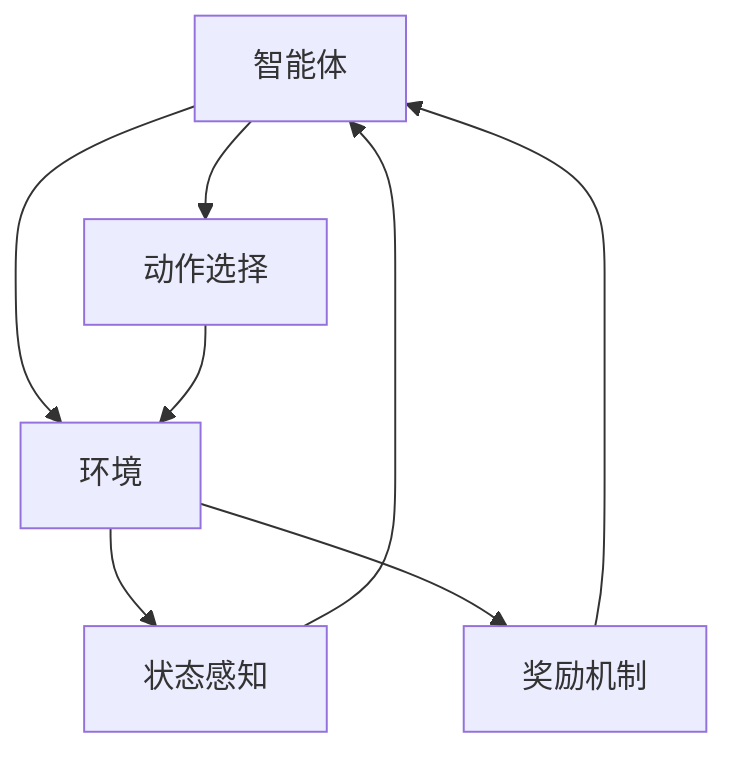

                 


# 强化学习：通过奖励机制改进AI Agent

> 关键词：强化学习，AI Agent，奖励机制，Q-learning，Deep Q-Network，Actor-Critic，策略梯度，强化学习算法，状态空间，动作空间

> 摘要：强化学习是一种通过智能体与环境交互来学习最优策略的机器学习方法。本文从强化学习的基本概念、核心算法、数学模型、系统架构到实际项目实现，全面解析强化学习的核心原理和应用实践。通过详细讲解Q-learning、DQN、Actor-Critic等主流算法，结合实际案例，帮助读者掌握如何通过奖励机制设计高效的AI Agent。

---

# 第一部分: 强化学习基础与核心概念

## 第1章: 强化学习概述

### 1.1 强化学习的定义与背景
#### 1.1.1 什么是强化学习
强化学习（Reinforcement Learning, RL）是一种机器学习范式，通过智能体（Agent）与环境（Environment）的交互，智能体通过试错（trial-and-error）的方式学习最优策略（Policy），以最大化累积奖励（Cumulative Reward）。与监督学习和无监督学习不同，强化学习强调实时反馈机制，通过奖励或惩罚来指导智能体的行为选择。

#### 1.1.2 强化学习与监督学习、无监督学习的区别
- **监督学习**：基于标记的训练数据，学习输入到输出的映射关系。
- **无监督学习**：在无标记数据中发现隐藏的结构。
- **强化学习**：通过与环境交互，学习在特定任务中的最优行为策略。

#### 1.1.3 强化学习的应用场景
强化学习广泛应用于游戏AI、机器人控制、自动驾驶、金融投资等领域。例如，AlphaGo通过强化学习在围棋领域取得了突破性进展。

### 1.2 强化学习的核心概念
#### 1.2.1 状态（State）
状态是环境在某一时刻的描述，智能体通过感知环境状态来决定下一步动作。例如，在迷宫中，状态可以是智能体当前所在的位置。

#### 1.2.2 动作（Action）
动作是智能体在给定状态下选择的行为。例如，在迷宫中，智能体可以选择“左转”、“右转”或“直行”。

#### 1.2.3 奖励机制（Reward）
奖励是智能体在执行动作后获得的反馈，用于指导智能体的行为选择。奖励可以是正数（奖励）或负数（惩罚）。例如，智能体在迷宫中找到出口时获得正数奖励，碰到墙壁时获得负数奖励。

#### 1.2.4 策略（Policy）
策略是智能体在给定状态下选择动作的概率分布。策略可以是确定性的（例如，选择一个固定动作）或概率性的（例如，选择动作的概率分布）。

#### 1.2.5 值函数（Value Function）
值函数用于衡量智能体在某一状态下采取某种动作后的期望累积奖励。例如，Q值函数衡量智能体在状态s下采取动作a后的期望累积奖励。

### 1.3 强化学习的数学模型
#### 1.3.1 状态空间与动作空间
- **状态空间（State Space）**：所有可能状态的集合。
- **动作空间（Action Space）**：所有可能动作的集合。

#### 1.3.2 策略函数的表示
策略函数可以表示为：
$$ \pi(a|s) = P(\text{选择动作 } a \mid \text{状态 } s) $$

#### 1.3.3 值函数的数学表达式
Q值函数的定义为：
$$ Q(s, a) = E[R_t \mid s_t = s, a_t = a] $$
其中，$R_t$是累积奖励。

### 1.4 强化学习的核心算法
#### 1.4.1 Q-learning算法
Q-learning是一种基于值函数的强化学习算法，通过迭代更新Q值函数来逼近最优策略。

#### 1.4.2 Deep Q-Network（DQN）
DQN是Q-learning的深度学习版本，通过神经网络近似Q值函数。

#### 1.4.3 Actor-Critic方法
Actor-Critic方法通过同时优化策略和值函数来实现强化学习。

### 1.5 本章小结
本章介绍了强化学习的基本概念、核心术语和主要算法，为后续章节的学习奠定了基础。

---

## 第2章: 强化学习的核心原理

### 2.1 状态转移与奖励机制
#### 2.1.1 状态转移矩阵
状态转移矩阵描述了从一个状态转移到另一个状态的概率。

#### 2.1.2 奖励函数的设计原则
奖励函数的设计需要考虑任务目标、行为的长期影响以及奖励的及时性。

### 2.2 动作选择与策略优化
#### 2.2.1 ε-greedy策略
ε-greedy策略平衡了探索（exploration）与利用（exploitation）：以概率ε选择随机动作，以概率1-ε选择当前最优动作。

#### 2.2.2 贪婪策略与探索策略的平衡
在强化学习中，探索与利用的平衡是实现最优策略的关键。

### 2.3 值函数与Q-learning算法
#### 2.3.1 Q值的更新公式
Q-learning的更新公式为：
$$ Q(s, a) = Q(s, a) + \alpha [r + \gamma \max_{a'} Q(s', a') - Q(s, a)] $$
其中，α是学习率，γ是折扣因子。

#### 2.3.2 Bellman方程的应用
Bellman方程描述了值函数的动态关系：
$$ V(s) = \max_a [r + \gamma V(s')] $$

### 2.4 策略梯度方法
#### 2.4.1 策略梯度的基本原理
策略梯度方法通过优化策略函数的参数，使得累积奖励最大化。

#### 2.4.2 Actor-Critic算法的工作流程
Actor-Critic算法通过同时学习策略（Actor）和值函数（Critic）来实现强化学习。

### 2.5 本章小结
本章详细讲解了强化学习的核心原理，包括状态转移、奖励机制、策略优化和值函数的数学模型。

---

## 第3章: 强化学习的数学模型与公式

### 3.1 状态空间与动作空间的数学表示
#### 3.1.1 离散状态空间与动作空间
离散状态空间和动作空间可以用集合表示：
$$ S = \{s_1, s_2, ..., s_n\} $$
$$ A = \{a_1, a_2, ..., a_m\} $$

#### 3.1.2 连续状态空间与动作空间
连续状态空间和动作空间可以用实数域表示：
$$ S \subseteq \mathbb{R}^n $$
$$ A \subseteq \mathbb{R}^m $$

### 3.2 值函数的数学表达
#### 3.2.1 Q值函数的数学公式
Q值函数的定义：
$$ Q: S \times A \rightarrow \mathbb{R} $$
$$ Q(s, a) = E[R_t \mid s_t = s, a_t = a] $$

#### 3.2.2 V值函数的数学公式
V值函数的定义：
$$ V: S \rightarrow \mathbb{R} $$
$$ V(s) = \max_a Q(s, a) $$

### 3.3 策略函数的数学表示
#### 3.3.1 策略梯度的数学推导
策略梯度的目标是最大化累积奖励：
$$ \nabla J(\theta) = \nabla \log \pi(a|s; \theta) \cdot Q(s, a) $$

#### 3.3.2 策略函数的参数化表示
策略函数可以用神经网络参数化表示：
$$ \pi(a|s; \theta) = \text{softmax}(Ws + b) $$

### 3.4 奖励机制的数学建模
#### 3.4.1 奖励函数的线性组合
线性奖励函数：
$$ r(s, a) = \sum_{i=1}^k w_i x_i $$

#### 3.4.2 奖励函数的非线性建模
非线性奖励函数：
$$ r(s, a) = \sigma(w^T x) $$
其中，σ是sigmoid函数。

### 3.5 本章小结
本章通过数学公式详细描述了强化学习的核心概念和算法，为后续的算法实现奠定了理论基础。

---

## 第4章: 强化学习的核心算法实现

### 4.1 Q-learning算法实现
#### 4.1.1 Q值更新的数学公式
Q-learning的更新公式：
$$ Q(s, a) = Q(s, a) + \alpha (r + \gamma \max_{a'} Q(s', a') - Q(s, a)) $$

#### 4.1.2 Q-learning算法的伪代码实现
```python
初始化Q表为全零矩阵
while True:
    状态s从环境获取
    动作a根据ε-greedy策略选择
    执行动作a，获得新状态s'和奖励r
    Q(s, a) = Q(s, a) + α (r + γ max Q(s', a') - Q(s, a))
更新策略
```

### 4.2 Deep Q-Network（DQN）算法实现
#### 4.2.1 DQN算法的数学模型
DQN通过神经网络近似Q值函数：
$$ Q(s, a; \theta) = \text{网络输出} $$

#### 4.2.2 DQN算法的实现步骤
```python
初始化神经网络Q和目标网络Q_target
while True:
    状态s从环境获取
    动作a根据ε-greedy策略选择
    执行动作a，获得新状态s'和奖励r
    计算目标值：target = r + γ max Q_target(s', a')
    训练Q网络：Q(s, a) ≈ target
    定期更新Q_target：Q_target = Q
更新策略
```

### 4.3 Actor-Critic算法实现
#### 4.3.1 Actor-Critic算法的数学模型
Actor-Critic算法同时优化策略和值函数：
- Actor网络负责生成策略：$\pi(a|s; \theta)$
- Critic网络负责评估值函数：$V(s; \phi)$

#### 4.3.2 Actor-Critic算法的实现步骤
```python
初始化Actor和Critic网络
while True:
    状态s从环境获取
    动作a通过Actor网络选择
    执行动作a，获得新状态s'和奖励r
    计算优势函数：A(s, a) = Q(s, a) - V(s)
    更新Critic网络：最小化$(r + γ V(s') - V(s))^2$
    更新Actor网络：最大化$\log \pi(a|s) \cdot A(s, a)$
更新策略
```

### 4.5 本章小结
本章详细讲解了Q-learning、DQN和Actor-Critic算法的实现步骤，为实际应用奠定了基础。

---

## 第5章: 强化学习的系统架构与项目实战

### 5.1 系统架构设计
#### 5.1.1 系统功能设计
- 状态感知模块：感知环境状态
- 动作选择模块：选择动作
- 奖励机制模块：计算奖励
- 策略优化模块：优化策略

#### 5.1.2 系统架构图


### 5.2 项目实战
#### 5.2.1 项目介绍
本项目实现一个强化学习算法，训练智能体在迷宫中找到出口。

#### 5.2.2 环境安装
```bash
pip install gym
pip install numpy
pip install matplotlib
```

#### 5.2.3 核心代码实现
```python
import gym
import numpy as np
import matplotlib.pyplot as plt

class Agent:
    def __init__(self, env):
        self.env = env
        self.Q = np.zeros((env.observation_space.n, env.action_space.n))
        self.alpha = 0.1
        self.gamma = 0.9
        self.epsilon = 0.1

    def choose_action(self, state):
        if np.random.random() < self.epsilon:
            return self.env.action_space.sample()
        else:
            return np.argmax(self.Q[state, :])

    def update_Q(self, state, action, reward, next_state):
        self.Q[state, action] += self.alpha * (reward + self.gamma * np.max(self.Q[next_state, :]) - self.Q[state, action])

    def train(self, episodes=1000):
        for episode in range(episodes):
            state = self.env.reset()
            done = False
            while not done:
                action = self.choose_action(state)
                next_state, reward, done, info = self.env.step(action)
                self.update_Q(state, action, reward, next_state)
                state = next_state
        self.env.close()

if __name__ == "__main__":
    env = gym.make('FrozenLake-v1')
    agent = Agent(env)
    agent.train()
    plt.plot(agent.Q)
    plt.show()
```

#### 5.2.4 代码解读与分析
- **Agent类**：实现强化学习算法的核心逻辑。
- **choose_action方法**：根据ε-greedy策略选择动作。
- **update_Q方法**：更新Q值函数。
- **train方法**：训练智能体。

#### 5.2.5 实际案例分析
在迷宫环境中，智能体通过Q-learning算法找到最优路径。

### 5.3 本章小结
本章通过实际项目展示了强化学习算法的实现过程，帮助读者理解理论与实践的结合。

---

## 第6章: 强化学习的总结与展望

### 6.1 强化学习的关键点总结
- 强化学习通过与环境交互，学习最优策略。
- 奖励机制是强化学习的核心。
- Q-learning、DQN和Actor-Critic是主流算法。

### 6.2 强化学习的未来展望
- 结合生成式AI：强化学习与生成式模型的结合可能带来新的突破。
- 多智能体协作：研究多智能体协作的强化学习算法。
- 线性时间复杂度优化：探索更高效的强化学习算法。

### 6.3 最佳实践Tips
- 设计合理的奖励机制。
- 平衡探索与利用。
- 选择合适的算法和框架。

### 6.4 本章小结
本章总结了强化学习的核心要点，并展望了未来的发展方向。

---

# 作者：AI天才研究院/AI Genius Institute & 禅与计算机程序设计艺术 /Zen And The Art of Computer Programming

---

**注**：以上内容仅为框架和部分章节内容，实际文章需要根据上述结构填充完整，确保每章每节内容详实、逻辑清晰。

