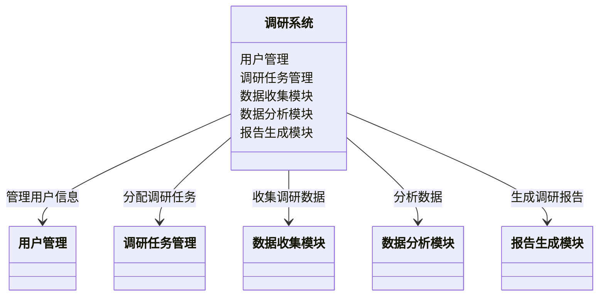
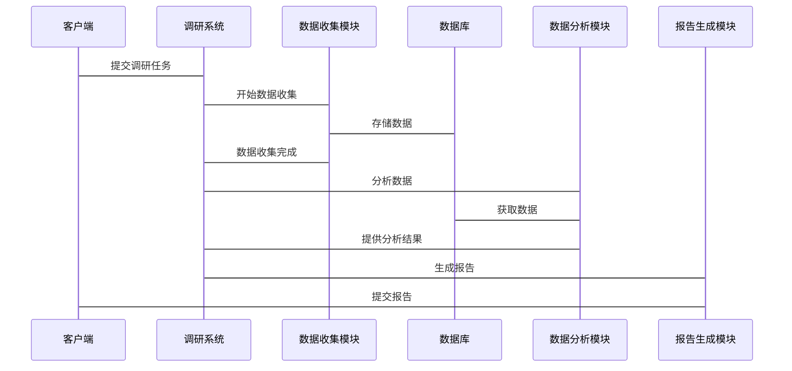

                 


---

# 彼得林奇的"实地调研"注意事项

## 关键词：彼得林奇、实地调研、投资分析、风险管理、数据收集、投资决策、投资策略

## 摘要：本文深入探讨了彼得林奇的投资理念，特别是实地调研在投资决策中的重要性。文章从实地调研的核心要素、注意事项、实施流程与方法、案例分析、系统设计等多个角度进行了详细分析，提供了实用的建议和最佳实践，帮助投资者更好地进行实地调研，提升投资决策的质量。

---

## 第1章 彼得林奇投资理念与实地调研的重要性

### 1.1 彼得林奇投资理念概述

#### 1.1.1 彼得林奇的个人背景与投资风格
彼得·林奇（Peter Lynch）是美国著名投资经理人，被誉为“最伟大的股票基金经理”之一。他管理的麦哲伦基金在1977年至1990年间取得了年均29%的收益率，远超市场平均水平。林奇的投资理念强调对企业的深入了解，尤其是通过实地调研来评估企业的基本面，寻找具有竞争优势的企业进行投资。

#### 1.1.2 实地调研在投资决策中的核心地位
林奇认为，投资决策的关键在于对企业的深入了解。实地调研能够帮助投资者全面了解企业的经营状况、管理团队、市场地位、竞争优势等关键因素，从而做出更准确的投资判断。实地调研不仅仅是对财务数据的分析，更是对企业整体运营环境的深入考察。

#### 1.1.3 投资者如何通过实地调研提升决策质量
通过实地调研，投资者可以验证企业公开数据的真实性，发现潜在的风险和机会，评估管理团队的能力和诚信度，从而提升投资决策的质量。林奇强调，实地调研是区分优秀投资者和普通投资者的重要手段。

### 1.2 实地调研的核心概念与定义

#### 1.2.1 实地调研的定义与范围
实地调研是指通过亲临企业现场，与企业管理层、员工、客户以及其他相关方进行交流，收集一手信息，全面了解企业的运营状况和市场环境。实地调研的范围包括企业生产现场、销售网络、管理团队、供应商和客户等。

#### 1.2.2 实地调研与其它调研方法的对比分析
与案头调研相比，实地调研的优势在于能够获取更真实、更详细的信息，但成本较高且耗时较长。通过对比分析，我们可以更好地理解不同调研方法的特点和适用场景。

#### 1.2.3 实地调研的关键要素与实施条件
实地调研的关键要素包括明确的调研目标、系统的调研计划、专业的调研团队、充分的资源保障等。实施条件包括时间、资金、人员和技术支持等。

### 1.3 本章小结

#### 1.3.1 彼得林奇投资理念的总结
彼得林奇的投资理念强调对企业的深入了解，而实地调研是实现这一目标的核心方法。

#### 1.3.2 实地调研在投资中的重要性
实地调研能够帮助投资者获取一手信息，提升投资决策的准确性和可靠性。

#### 1.3.3 本书的核心目标与内容框架
本书旨在通过分析彼得林奇的实地调研方法，提供实用的建议和最佳实践，帮助投资者提升实地调研的能力和效果。

---

## 第2章 实地调研的核心要素与注意事项

### 2.1 实地调研的核心要素

#### 2.1.1 调研目标的明确性
明确的调研目标是实地调研成功的关键。投资者需要提前确定调研的核心问题，例如企业的盈利能力、管理团队的能力等。

#### 2.1.2 数据收集的全面性
实地调研需要收集企业的财务数据、管理数据、市场数据等多方面信息，确保对企业的全面了解。

#### 2.1.3 调研方法的多样性
通过多种调研方法的结合，例如访谈、观察、问卷调查等，可以更全面地获取信息，降低调研结果的片面性。

#### 2.1.4 调研团队的专业性
专业的调研团队能够提高调研效率和质量，确保获取的信息准确可靠。

### 2.2 实地调研的注意事项

#### 2.2.1 避免主观偏见的产生
投资者在调研过程中可能会受到个人偏见的影响，需要保持客观中立的态度，尽量从多角度获取信息。

#### 2.2.2 保持数据的真实性和客观性
实地调研的核心在于数据的真实性和客观性，投资者需要通过多种渠道验证信息的准确性。

#### 2.2.3 注意调研时间和成本的控制
实地调研需要投入大量时间和资源，投资者需要合理规划调研计划，避免过度投入或投入不足。

#### 2.2.4 调研结果的可操作性与可验证性
调研结果需要具有实际操作性和可验证性，能够为投资决策提供明确的指导。

### 2.3 彼得林奇的实地调研方法论

#### 2.3.1 "三步走"调研法
彼得林奇提出的“三步走”调研法包括初步调研、深入调研和验证调研三个阶段，逐步深入，确保对企业的全面了解。

#### 2.3.2 "问题导向"调研法
问题导向的调研方法强调以问题为导向，围绕关键问题展开调研，确保调研内容的针对性和有效性。

#### 2.3.3 "数据交叉验证"法
通过多来源、多渠道的数据交叉验证，确保调研结果的准确性和可靠性。

### 2.4 本章小结

#### 2.4.1 实地调研核心要素的总结
实地调研的成功依赖于明确的目标、全面的数据收集、多样化的调研方法和专业的团队。

#### 2.4.2 注意事项与方法论的综合运用
通过避免主观偏见、保持数据真实性、控制调研成本和确保结果可操作性等注意事项，结合彼得林奇的三步走调研法、问题导向法和数据交叉验证法，投资者可以提升实地调研的效果。

---

## 第3章 实地调研的流程与方法

### 3.1 实地调研的基本流程

#### 3.1.1 调研目标的确定
明确调研的核心问题和目标，例如评估企业的盈利能力、管理团队的能力等。

#### 3.1.2 调研计划的制定
制定详细的调研计划，包括时间安排、人员分工、调研方法等。

#### 3.1.3 调研实施与数据收集
实地访问企业，与企业管理层、员工、客户等进行交流，收集一手信息。

#### 3.1.4 数据分析与结果总结
对收集到的数据进行整理和分析，形成调研报告，总结调研结果。

### 3.2 实地调研的主要方法

#### 3.2.1 文案调研法
通过查阅企业的财务报表、行业报告等资料，进行初步了解。

#### 3.2.2 访谈法
与企业管理层、员工、客户等进行深度访谈，获取详细信息。

#### 3.2.3 观察法
通过现场观察，了解企业的生产流程、管理方式等。

#### 3.2.4 实验法
在企业内部进行小范围的实验，测试某种假设或策略的效果。

### 3.3 调研工具与技术的选择

#### 3.3.1 调研工具的分类与适用场景
根据调研目标和方法选择合适的工具，例如使用问卷调查进行定量分析，使用访谈法进行定性分析。

#### 3.3.2 数据收集技术的选择
选择适合的工具和技术，例如使用录音笔记录访谈内容，使用表格记录观察数据。

#### 3.3.3 数据分析工具的推荐
推荐使用Excel、SPSS等工具进行数据分析，确保数据的准确性和可靠性。

### 3.4 调研结果的呈现与汇报

#### 3.4.1 数据可视化的方法
通过图表、图形等方式，直观展示调研结果，例如使用柱状图展示企业的销售收入变化。

#### 3.4.2 调研报告的撰写规范
撰写结构清晰、内容详实的调研报告，包括引言、方法、结果、分析和结论等部分。

#### 3.4.3 调研结果的验证与反馈
对调研结果进行验证，确保数据的准确性和可靠性，同时根据反馈不断优化调研方法。

---

## 第4章 案例分析：彼得林奇的经典调研案例

### 4.1 案例一：某制造企业的实地调研

#### 4.1.1 案例背景
某制造企业面临市场竞争加剧的问题，彼得林奇通过实地调研帮助企业分析市场地位和竞争优势。

#### 4.1.2 调研过程
与企业管理层、员工、客户进行访谈，观察生产流程，收集财务数据等。

#### 4.1.3 调研结果
发现企业在成本控制和技术创新方面具有竞争优势，但市场推广能力较弱。

#### 4.1.4 案例总结
通过实地调研，林奇帮助企业识别了核心竞争力和改进方向，最终提升了企业的市场地位。

### 4.2 案例二：某科技企业的调研与投资决策

#### 4.2.1 案例背景
某科技企业开发了一种创新技术，但市场前景不明朗，林奇通过实地调研评估其投资价值。

#### 4.2.2 调研过程
与企业管理层、技术团队、客户进行深入交流，分析技术的可行性和市场潜力。

#### 4.2.3 调研结果
确认技术具有广阔的市场前景，企业团队具有较强的执行力和创新能力。

#### 4.2.4 案例总结
林奇的投资决策基于实地调研的结果，最终取得了丰厚的回报。

### 4.3 案例分析总结

#### 4.3.1 成功案例的共同点
成功的调研案例都注重全面的信息收集和深入的分析，同时注重与企业管理层和员工的互动。

#### 4.3.2 失败案例的教训
失败的案例通常是因为调研不够深入或方法不当，导致对企业的了解不够全面。

#### 4.3.3 案例分析的启示
通过案例分析，我们可以更好地理解实地调研的重要性和实际应用，提升自身的调研能力。

---

## 第5章 系统分析与架构设计

### 5.1 调研系统的需求分析

#### 5.1.1 问题场景介绍
随着企业规模的扩大，传统的实地调研方式效率低下，难以满足投资者的需求。

#### 5.1.2 项目介绍
开发一个基于信息化的实地调研系统，帮助投资者高效完成调研任务。

### 5.2 系统功能设计

#### 5.2.1 领域模型mermaid类图


#### 5.2.2 系统架构设计
```mermaid
architecturalDiagram
    客户端 <---> 调研系统 <---> 数据库
    调研系统 --> 数据分析模块
    调研系统 --> 报告生成模块
```

#### 5.2.3 系统接口设计


---

## 第6章 项目实战：基于Python的调研系统实现

### 6.1 环境安装与配置

#### 6.1.1 安装Python
```bash
# 安装Python
sudo apt-get install python3
```

#### 6.1.2 安装依赖库
```bash
# 安装必要的库
pip install requests pandas numpy matplotlib
```

### 6.2 核心代码实现

#### 6.2.1 数据收集模块
```python
import requests
import pandas as pd

def collect_data(url):
    response = requests.get(url)
    data = response.json()
    df = pd.DataFrame(data)
    return df
```

#### 6.2.2 数据分析模块
```python
import numpy as np
import matplotlib.pyplot as plt

def analyze_data(df):
    # 数据分析逻辑
    pass
```

#### 6.2.3 报告生成模块
```python
from reportlab.pdfgen import canvas

def generate_report(df):
    # 生成报告
    pass
```

### 6.3 代码应用解读与分析

#### 6.3.1 数据收集模块的实现
数据收集模块通过requests库获取数据，并使用pandas进行数据清洗和整理，为后续分析提供基础。

#### 6.3.2 数据分析模块的实现
数据分析模块使用numpy进行数据计算，并通过matplotlib生成可视化图表，帮助投资者更好地理解数据。

#### 6.3.3 报告生成模块的实现
报告生成模块使用reportlab库生成PDF报告，将分析结果以直观的形式呈现给投资者。

### 6.4 实际案例分析

#### 6.4.1 案例背景
某科技企业的技术创新能力评估。

#### 6.4.2 代码实现
```python
import requests
import pandas as pd
import matplotlib.pyplot as plt

# 数据收集
url = "https://api.example.com/tech_innovation"
df = collect_data(url)

# 数据分析
analysis = analyze_data(df)

# 可视化
plt.figure(figsize=(10,6))
plt.plot(df['year'], df['innovation_score'], 'b-', marker='o')
plt.xlabel('Year')
plt.ylabel('Innovation Score')
plt.title('Tech Innovation Trend')
plt.show()
```

#### 6.4.3 案例总结
通过代码实现，投资者可以快速完成数据收集和分析，生成可视化报告，辅助投资决策。

### 6.5 本章小结

#### 6.5.1 系统实现的总结
通过Python代码实现的调研系统，能够高效完成数据收集、分析和报告生成，提升实地调研的效率和质量。

#### 6.5.2 代码实现的关键点
关键点包括数据收集的准确性和实时性、数据分析的深度和可视化效果、报告生成的规范性和可读性。

---

## 第7章 总结与注意事项

### 7.1 总结

#### 7.1.1 本章核心内容回顾
本文从彼得林奇的实地调研方法出发，详细探讨了实地调研的核心要素、注意事项、实施流程与方法，并通过案例分析和系统设计，帮助投资者提升实地调研的能力和效果。

#### 7.1.2 本章的总结与反思
实地调研是投资决策的重要环节，通过系统的方法和工具，投资者可以更高效地完成调研任务，提升投资收益。

### 7.2 注意事项

#### 7.2.1 调研前的准备工作
包括明确调研目标、制定调研计划、组建调研团队等。

#### 7.2.2 调研过程中的注意事项
包括保持客观中立、避免主观偏见、确保数据真实可靠等。

#### 7.2.3 调研后的总结与反馈
包括分析调研结果、总结经验教训、优化调研方法等。

### 7.3 最佳实践 tips

#### 7.3.1 调研前的规划
制定详细的调研计划，确保每一步都有明确的目标和时间安排。

#### 7.3.2 调研中的沟通
与企业管理层、员工、客户等进行深入交流，获取多方面的信息。

#### 7.3.3 调研后的分析
对收集到的数据进行深入分析，形成系统的调研报告，并根据结果制定相应的投资策略。

### 7.4 拓展阅读

#### 7.4.1 推荐书籍
《彼得林奇的投资之道》、《投资学基础》等。

#### 7.4.2 推荐工具
使用Python的pandas、numpy等库进行数据分析，使用matplotlib进行数据可视化。

#### 7.4.3 推荐资源
关注投资分析相关的博客、论坛和学术资源，不断提升自身的投资分析能力。

---

## 作者：AI天才研究院/AI Genius Institute & 禅与计算机程序设计艺术 /Zen And The Art of Computer Programming

