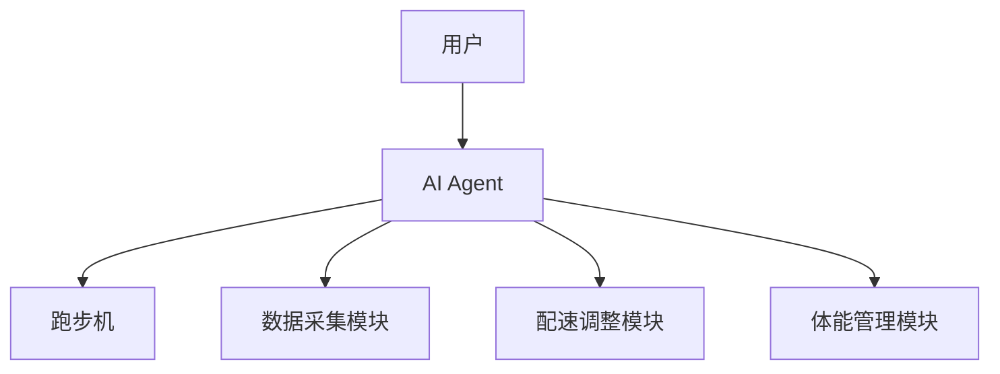
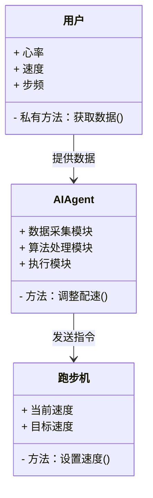
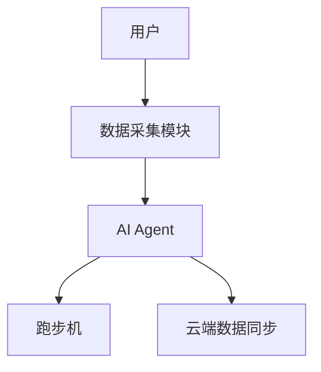
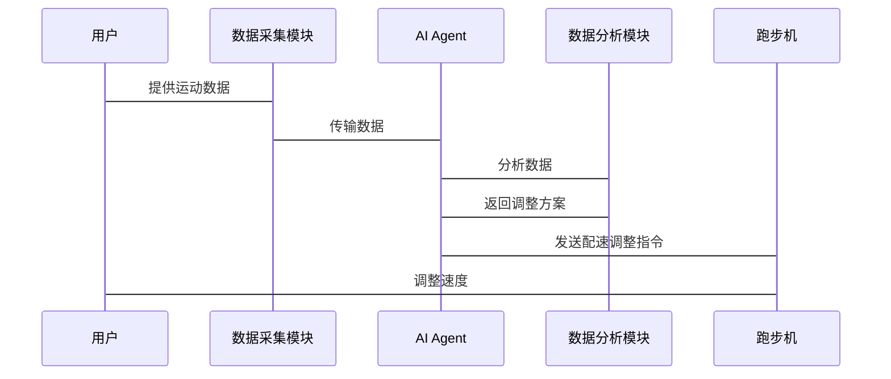

                 


# 智能跑步机：AI Agent的实时配速与体能管理

> 关键词：智能跑步机，AI Agent，实时配速，体能管理，动态规划，强化学习，健身科技

> 摘要：本文详细探讨了AI Agent在智能跑步机中的应用，重点分析了其实时配速调整和体能管理的核心算法与系统架构。通过动态规划和强化学习等算法，AI Agent能够根据用户实时数据和健身目标，动态调整跑步机的配速，并通过体能模型实现科学化、个性化的体能管理。本文还结合实际项目案例，详细讲解了AI Agent的系统架构设计和实现过程，为智能健身设备的开发提供了理论依据和实践参考。

---

# 第一部分: 背景介绍

## 第1章: 问题背景与描述

### 1.1 问题背景
#### 1.1.1 跑步运动的现状与挑战
随着健康意识的提升，跑步运动逐渐成为人们日常健身的重要方式。然而，传统跑步机的机械结构和控制方式较为单一，无法根据用户的实时状态和健身目标动态调整运动强度，导致用户体验不佳，甚至可能引发运动损伤。

#### 1.1.2 传统跑步机的局限性
传统跑步机只能提供固定的运动模式，例如恒定速度、预设心率区间等，缺乏灵活性和个性化。用户在使用过程中，很难根据自身状态实时调整运动强度，导致锻炼效果不佳或运动风险增加。

#### 1.1.3 AI技术在健身领域的应用潜力
人工智能技术的快速发展为健身设备的智能化提供了新的可能性。通过AI技术，跑步机可以实时感知用户的运动数据和生理指标，动态调整运动计划，从而实现个性化、科学化的健身指导。

### 1.2 问题描述
#### 1.2.1 实时配速管理的需求
用户在跑步过程中，需要根据自身状态（如心率、疲劳程度等）实时调整跑步速度，以达到最佳的锻炼效果。然而，传统跑步机无法满足这一需求。

#### 1.2.2 体能管理的复杂性
体能管理是一个复杂的过程，需要综合考虑用户的运动目标、身体状况、环境因素等多个变量。传统跑步机无法根据这些变量动态调整运动计划，导致体能管理的效果有限。

#### 1.2.3 用户个性化需求的多样性
每个用户的健身目标、身体条件和运动偏好都不同，传统跑步机的固定模式难以满足用户的个性化需求。

### 1.3 问题解决与边界
#### 1.3.1 AI Agent在跑步机中的作用
AI Agent（人工智能代理）是一种能够感知环境、做出决策并执行动作的智能体。在智能跑步机中，AI Agent可以实时感知用户的运动数据和生理指标，动态调整跑步机的配速和运动模式，从而实现个性化的健身指导。

#### 1.3.2 问题的边界与外延
AI Agent的功能边界包括实时数据采集、动态配速调整和个性化体能管理。其外延则包括与其他智能设备的联动（如智能手表、心率带等）和云端数据同步。

#### 1.3.3 概念结构与核心要素
AI Agent在智能跑步机中的核心要素包括数据采集模块、算法处理模块和执行模块。数据采集模块负责采集用户的运动数据和生理指标，算法处理模块负责根据这些数据动态调整配速和运动计划，执行模块则负责将调整后的配速指令传递给跑步机。

---

# 第二部分: 核心概念与联系

## 第3章: AI Agent的核心原理

### 3.1 AI Agent的基本原理
#### 3.1.1 AI Agent的定义与分类
AI Agent是一种能够感知环境、做出决策并执行动作的智能体。在智能跑步机中，AI Agent主要负责实时感知用户的运动数据和生理指标，动态调整跑步机的配速和运动模式。

#### 3.1.2 AI Agent在实时配速中的工作流程
1. 数据采集：AI Agent通过传感器采集用户的运动数据（如速度、步频、心率等）。
2. 数据分析：AI Agent根据采集的数据，结合用户的运动目标和身体状况，计算出最优的配速调整方案。
3. 决策与执行：AI Agent根据计算出的配速调整方案，向跑步机发送指令，实时调整跑步机的配速。

#### 3.1.3 AI Agent在体能管理中的算法机制
AI Agent通过强化学习算法，根据用户的运动数据和生理指标，动态优化用户的运动计划，以实现个性化的体能管理。

### 3.2 核心概念对比表
#### 3.2.1 AI Agent与传统控制算法的对比
| 对比维度 | AI Agent | 传统控制算法 |
|----------|-----------|---------------|
| 灵活性   | 高         | 低             |
| 学习能力 | 强         | 无             |
| 个性化   | 高         | 低             |

#### 3.2.2 不同AI模型在跑步机中的应用效果对比
| 对比维度 | 动态规划算法 | 强化学习算法 |
|----------|--------------|--------------|
| 实时性   | 较高         | 高            |
| 调整幅度 | 稳定         | 灵活           |
| 计算复杂度 | 较低         | 较高           |

### 3.3 ER实体关系图


---

# 第三部分: 算法原理讲解

## 第4章: 算法原理与实现

### 4.1 动态规划算法
#### 4.1.1 算法流程
1. 状态定义：定义用户的运动状态（如心率、速度等）。
2. 状态转移：根据当前状态和用户的目标，计算出下一个状态。
3. 策略选择：选择最优的配速调整策略。

#### 4.1.2 动态规划算法的数学模型
$$ V(s) = \max_{a} [ r(s, a) + V(next\_state(a)) ] $$
其中，$s$表示当前状态，$a$表示动作，$r(s, a)$表示奖励函数，$next\_state(a)$表示执行动作$a$后的下一个状态。

#### 4.1.3 代码实现
```python
def dynamic_programming():
    # 初始化状态值函数
    V = {state: 0 for state in states}
    # 迭代更新
    while True:
        new_V = {state: max(r(s, a) + V[next_state(a)] for a in actions) for s in states}
        if new_V == V:
            break
        V = new_V
    return V
```

### 4.2 强化学习算法
#### 4.2.1 算法流程
1. 状态定义：定义用户的运动状态（如心率、速度等）。
2. 动作选择：根据当前状态，选择最优的动作（如调整配速）。
3. 奖励函数：根据动作执行后的效果，计算奖励。

#### 4.2.2 强化学习算法的数学模型
$$ Q(s, a) = Q(s, a) + \alpha (r(s, a) + \gamma \max_{a'} Q(s', a') - Q(s, a)) $$
其中，$\alpha$表示学习率，$\gamma$表示折扣因子，$s'$表示执行动作$a$后的下一个状态。

#### 4.2.3 代码实现
```python
def reinforcement_learning():
    # 初始化Q表
    Q = { (s, a): 0 for s in states for a in actions }
    # 迭代更新
    for episode in range(episodes):
        state = initial_state()
        while not done:
            action = choose_action(Q, state)
            next_state, reward = step(state, action)
            Q[(state, action)] += alpha * (reward + gamma * max(Q[(next_state, a)] for a in actions) - Q[(state, action)])
            state = next_state
    return Q
```

### 4.3 算法优缺点对比
| 对比维度 | 动态规划算法 | 强化学习算法 |
|----------|--------------|--------------|
| 优点     | 计算简单，适用于离线规划 | 具有在线学习能力，适用于动态环境 |
| 缺点     | 需要完整的状态空间 | 计算复杂，需要大量样本数据 |

---

# 第四部分: 系统分析与架构设计方案

## 第5章: 系统架构设计

### 5.1 问题场景介绍
用户在使用智能跑步机时，需要实时调整配速和管理体能。系统需要采集用户的运动数据（如心率、速度等），并根据这些数据动态调整跑步机的配速和运动计划。

### 5.2 系统功能设计


### 5.3 系统架构设计


### 5.4 系统接口设计
- 数据采集模块：通过蓝牙或Wi-Fi与智能手表、心率带等设备连接，获取用户的实时数据。
- AI Agent：通过算法处理模块，根据用户的实时数据和运动目标，动态调整跑步机的配速。
- 跑步机：通过API接收AI Agent的配速调整指令，实时调整跑步机的速度。

### 5.5 系统交互流程


---

# 第五部分: 项目实战

## 第6章: 项目实战与代码实现

### 6.1 环境安装
1. 安装Python和必要的开发工具（如Jupyter Notebook）。
2. 安装TensorFlow和Keras库（用于机器学习模型的训练）。
3. 安装Mermaid CLI（用于生成图表）。

### 6.2 系统核心实现
```python
import numpy as np
import tensorflow as tf

# 定义动态规划模型
class DynamicProgrammingModel:
    def __init__(self, state_size, action_size):
        self.state_size = state_size
        self.action_size = action_size
        self.model = tf.keras.Sequential([
            tf.keras.layers.Dense(32, activation='relu', input_shape=(state_size,)),
            tf.keras.layers.Dense(action_size)
        ])
        self.model.compile(optimizer='adam', loss='mse')

    def call(self, state):
        return self.model(state)

# 定义强化学习模型
class ReinforcementLearningModel:
    def __init__(self, state_size, action_size):
        self.state_size = state_size
        self.action_size = action_size
        self.model = tf.keras.Sequential([
            tf.keras.layers.Dense(32, activation='relu', input_shape=(state_size,)),
            tf.keras.layers.Dense(action_size)
        ])
        self.model.compile(optimizer='adam', loss='mse')

    def call(self, state):
        return self.model(state)
```

### 6.3 代码实现与解读
1. 动态规划模型：通过神经网络实现状态价值函数的计算，根据当前状态和动作选择最优的配速调整方案。
2. 强化学习模型：通过强化学习算法训练AI Agent，使其在动态环境中选择最优的动作。

### 6.4 实际案例分析
假设用户的目标是提高心肺功能，AI Agent可以根据用户的心率和速度数据，动态调整跑步机的配速，使其保持在最佳的心率区间内。

### 6.5 项目小结
通过实际项目案例，我们可以看到AI Agent在智能跑步机中的应用潜力。动态规划和强化学习算法的结合，使得AI Agent能够实时调整配速，帮助用户实现个性化的体能管理。

---

# 第六部分: 总结与展望

## 第7章: 总结与展望

### 7.1 总结
本文详细探讨了AI Agent在智能跑步机中的应用，重点分析了其实时配速调整和体能管理的核心算法与系统架构。通过动态规划和强化学习算法，AI Agent能够根据用户的实时数据动态调整配速和运动计划，从而实现个性化的体能管理。

### 7.2 未来展望
未来，随着AI技术的不断发展，智能跑步机将更加智能化和个性化。AI Agent将能够与其他智能设备（如智能手表、心率带等）联动，实现更全面的体能管理。同时，基于大数据的分析，AI Agent将能够为用户提供更加精准的运动建议和健康指导。

---

# 第七部分: 最佳实践 Tips

## 第8章: 最佳实践 Tips

### 8.1 数据隐私保护
在设计智能跑步机时，必须重视用户的隐私保护，确保用户的运动数据不会被滥用或泄露。

### 8.2 算法优化建议
在实际应用中，可以结合动态规划和强化学习算法的优势，设计更加高效的AI Agent算法。

### 8.3 系统维护与更新
定期更新AI Agent的算法模型，确保其能够适应用户的最新需求和运动目标。

---

作者：AI天才研究院/AI Genius Institute & 禅与计算机程序设计艺术 /Zen And The Art of Computer Programming

