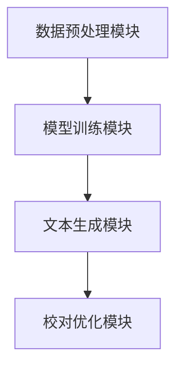

                 


# 自然语言生成技术在财务报告中的应用

> 关键词：自然语言生成技术、财务报告、NLP、深度学习、文本生成

> 摘要：自然语言生成技术（NLP）在财务报告中的应用正在改变传统的财务报告生成方式。本文将从自然语言生成技术的核心原理出发，结合财务报告的特点，详细探讨自然语言生成技术在财务报告中的应用场景、算法实现与优化、系统设计与实现等方面，为读者提供全面的理论与实践指导。

---

# 第1章 自然语言生成技术与财务报告的结合

## 1.1 自然语言生成技术的概述

### 1.1.1 自然语言生成技术的定义

自然语言生成（Natural Language Generation, NLP）是指通过计算机技术将结构化数据或信息转换为自然语言文本的过程。NLP技术涵盖了从数据处理、模型训练到文本生成的多个环节，旨在让计算机能够像人类一样理解和生成自然语言。

### 1.1.2 自然语言生成技术的核心原理

NLP的核心原理包括以下几点：
1. **数据处理**：将原始数据（如财务数据）进行清洗、结构化和预处理。
2. **模型训练**：使用深度学习模型（如RNN、LSTM、Transformer等）对数据进行训练，生成语言模型。
3. **文本生成**：基于训练好的模型，生成符合要求的自然语言文本。

### 1.1.3 自然语言生成技术在不同领域的应用

NLP技术在多个领域都有广泛应用，包括：
- **新闻生成**：自动生成新闻稿。
- **客服对话**：生成智能客服的回复。
- **医疗报告**：生成医疗诊断报告。
- **财务报告**：生成财务分析报告。

---

## 1.2 财务报告的特点与需求

### 1.2.1 财务报告的基本概念与结构

财务报告是企业对外展示财务状况、经营成果和现金流量的重要文件，主要包括：
1. **资产负债表**：反映企业的资产、负债和所有者权益。
2. **利润表**：反映企业的收入、成本和利润。
3. **现金流量表**：反映企业的现金流入和流出情况。

### 1.2.2 财务报告生成的痛点与挑战

传统财务报告生成过程中存在以下痛点：
1. **效率低下**：手工编写报告耗时耗力。
2. **一致性差**：不同人员生成的报告可能存在格式和内容不一致的问题。
3. **缺乏个性化**：难以满足不同用户的个性化需求。

### 1.2.3 自然语言生成技术在财务报告中的潜在价值

NLP技术可以帮助企业快速生成标准化、个性化的财务报告，提高效率和一致性，同时降低人工成本。

---

## 1.3 自然语言生成技术与财务报告的结合

### 1.3.1 自然语言生成技术在财务报告中的应用场景

1. **自动编写财务报告**：基于财务数据，自动生成财务报告的初稿。
2. **语言优化与校对**：对生成的报告进行语言优化，确保专业性和准确性。
3. **个性化定制**：根据用户需求，生成不同风格和内容的财务报告。

### 1.3.2 自然语言生成技术对财务报告的影响

1. **提高效率**：减少人工编写报告的时间。
2. **增强一致性**：确保报告格式和内容的统一性。
3. **提升质量**：通过优化算法，生成更专业、准确的报告。

### 1.3.3 自然语言生成技术在财务报告中的未来发展趋势

随着NLP技术的不断进步，未来财务报告的生成将更加智能化、个性化和动态化。

---

## 1.4 本章小结

本章介绍了自然语言生成技术的核心概念及其在财务报告中的应用场景。通过分析财务报告的特点和需求，探讨了NLP技术在财务报告生成中的潜在价值和未来发展趋势。

---

# 第2章 自然语言生成技术的核心概念与原理

## 2.1 自然语言生成技术的核心概念

### 2.1.1 自然语言生成技术的定义与分类

NLP技术可以根据生成方式分为以下几类：
1. **基于规则的生成**：通过预定义的规则生成文本。
2. **基于统计的生成**：通过统计语言模型生成文本。
3. **基于深度学习的生成**：使用神经网络模型（如RNN、LSTM、Transformer）生成文本。

### 2.1.2 自然语言生成技术的关键技术点

1. **文本表示**：将文本转化为向量表示。
2. **模型训练**：使用大量数据训练生成模型。
3. **文本生成**：根据输入生成目标文本。

### 2.1.3 自然语言生成技术的优缺点对比

| 优点 | 缺点 |
|------|------|
| 高效性 | 对数据依赖性强 |
| 精准性 | 需要大量计算资源 |
| 个性化 | 模型调优复杂 |

---

## 2.2 自然语言生成技术的主流算法

### 2.2.1 基于统计的自然语言生成算法

基于统计的生成算法主要依赖于语言模型，如n-gram模型，通过统计语言学的方法生成文本。

### 2.2.2 基于神经网络的自然语言生成算法

基于神经网络的生成算法包括：
1. **循环神经网络（RNN）**：适用于序列生成。
2. **长短期记忆网络（LSTM）**：可以处理长序列数据。
3. **Transformer模型**：基于自注意力机制，生成效果更优。

### 2.2.3 基于深度学习的自然语言生成算法

基于深度学习的生成算法通常使用预训练语言模型（如GPT、BERT）进行微调，生成高质量的文本。

---

## 2.3 自然语言生成技术的实现原理

### 2.3.1 自然语言生成的输入与输出

- **输入**：结构化数据或关键词。
- **输出**：自然语言文本。

### 2.3.2 自然语言生成的模型训练过程

1. **数据预处理**：清洗、标注数据。
2. **模型训练**：使用训练数据优化模型参数。
3. **模型评估**：通过测试数据评估生成效果。

### 2.3.3 自然语言生成的文本优化与校对

通过语言模型对生成的文本进行优化，确保语法和语义的准确性。

---

## 2.4 自然语言生成技术的数学模型与公式

### 2.4.1 自然语言生成的数学基础

文本生成可以看作是一个概率分布问题，目标是最大化生成文本的概率。

### 2.4.2 常见的自然语言生成算法公式

1. **语言模型的定义**：
   $$ P(w_1, w_2, ..., w_n) = \prod_{i=1}^{n} P(w_i | w_1, ..., w_{i-1}) $$

2. **最大似然估计**：
   $$ \theta = \arg\max \sum_{i=1}^{N} \log P(w_i | w_{i-1}, ..., w_{i-k}) $$

### 2.4.3 自然语言生成模型的损失函数与优化方法

1. **交叉熵损失函数**：
   $$ \text{Loss} = -\frac{1}{N} \sum_{i=1}^{N} \log P(y_i | x_i) $$

2. **优化方法**：
   使用梯度下降（如Adam优化器）优化模型参数。

---

## 2.5 本章小结

本章详细介绍了自然语言生成技术的核心概念、主流算法及其数学模型。通过对这些内容的学习，读者可以更好地理解NLP技术的实现原理和应用方式。

---

# 第3章 自然语言生成技术在财务报告中的具体应用

## 3.1 财务报告生成的流程与步骤

### 3.1.1 财务数据的采集与处理

1. **数据采集**：从企业系统中提取财务数据。
2. **数据清洗**：去除无效数据，确保数据的准确性。
3. **数据结构化**：将数据转化为模型可读的格式。

### 3.1.2 财务数据的分析与建模

1. **数据分析**：对财务数据进行统计分析和特征提取。
2. **模型训练**：基于历史数据训练生成模型。
3. **模型优化**：调整模型参数，提高生成效果。

### 3.1.3 自然语言生成技术在财务报告中的具体实现

1. **数据输入**：将结构化数据输入生成模型。
2. **文本生成**：模型生成自然语言文本。
3. **结果校对**：对生成的文本进行语法和语义校对。

---

## 3.2 自然语言生成技术在财务报告中的应用场景

### 3.2.1 财务报告的自动编写

1. **场景描述**：基于财务数据，自动生成财务报告的初稿。
2. **实现流程**：
   - 数据采集与预处理。
   - 模型训练与生成。
   - 文本优化与输出。

### 3.2.2 财务报告的语言优化与校对

1. **场景描述**：对生成的报告进行语言优化，确保专业性和准确性。
2. **实现流程**：
   - 使用语言模型对生成文本进行优化。
   - 通过语法检查工具确保文本的正确性。

### 3.2.3 财务报告的个性化定制

1. **场景描述**：根据用户需求，生成不同风格和内容的财务报告。
2. **实现流程**：
   - 用户需求分析。
   - 模型参数调整。
   - 生成并输出个性化报告。

---

## 3.3 自然语言生成技术在财务报告中的优势与挑战

### 3.3.1 自然语言生成技术在财务报告中的优势

1. **提高效率**：减少人工编写报告的时间。
2. **增强一致性**：确保报告格式和内容的统一性。
3. **提升质量**：通过优化算法，生成更专业、准确的报告。

### 3.3.2 自然语言生成技术在财务报告中的挑战

1. **数据隐私**：如何确保财务数据的安全性。
2. **模型调优**：如何训练出更精准的生成模型。
3. **语言准确性**：如何保证生成文本的准确性和专业性。

### 3.3.3 如何克服自然语言生成技术在财务报告中的挑战

1. **数据加密与隐私保护**：采用加密技术保护财务数据。
2. **模型优化与调优**：使用更先进的算法和更大的数据集进行训练。
3. **语言校对与人工审核**：结合人工审核确保生成文本的准确性。

---

## 3.4 本章小结

本章详细探讨了自然语言生成技术在财务报告中的具体应用场景、优势与挑战，并提出了相应的解决方案。

---

# 第4章 自然语言生成技术的算法实现与优化

## 4.1 自然语言生成技术的算法实现

### 4.1.1 基于神经网络的自然语言生成算法实现

1. **模型选择**：选择适合的神经网络模型（如Transformer）。
2. **模型训练**：使用财务数据训练生成模型。
3. **文本生成**：基于训练好的模型生成财务报告文本。

### 4.1.2 基于深度学习的自然语言生成算法实现

1. **预训练模型**：使用GPT等预训练模型进行微调。
2. **模型优化**：通过调整超参数优化生成效果。
3. **生成结果评估**：使用 BLEU、ROUGE 等指标评估生成质量。

---

## 4.2 自然语言生成技术的数学模型与公式

### 4.2.1 自然语言生成的数学模型

1. **序列到序列模型**：
   $$ P(y|x) = \sum_{y} P(y|x) $$

2. **损失函数**：
   $$ \text{Loss} = -\sum_{y} \log P(y|x) $$

---

## 4.3 自然语言生成技术的优化方法

### 4.3.1 数据增强

通过数据增强技术（如同义词替换、句式变换）提高模型的泛化能力。

### 4.3.2 模型优化

1. **超参数调优**：通过网格搜索优化模型参数。
2. **模型剪枝**：减少模型的复杂度，提高生成效率。

---

## 4.4 本章小结

本章详细介绍了自然语言生成技术的算法实现与优化方法，通过对数学模型和优化策略的探讨，为读者提供了理论与实践的双重指导。

---

# 第5章 自然语言生成技术的系统分析与架构设计

## 5.1 问题场景介绍

### 5.1.1 系统目标

开发一个基于NLP技术的财务报告生成系统，实现财务数据到自然语言报告的自动转换。

### 5.1.2 系统需求

1. **数据输入**：支持多种格式的财务数据输入。
2. **文本生成**：生成符合要求的财务报告。
3. **结果输出**：输出生成的报告，并提供校对功能。

---

## 5.2 系统功能设计

### 5.2.1 系统功能模块

1. **数据预处理模块**：负责数据的清洗和结构化。
2. **模型训练模块**：训练生成模型。
3. **文本生成模块**：基于模型生成财务报告。
4. **校对优化模块**：对生成的文本进行优化和校对。

### 5.2.2 功能模块的交互流程

1. **数据预处理模块**接收输入数据。
2. **模型训练模块**基于预处理后的数据训练模型。
3. **文本生成模块**使用训练好的模型生成报告。
4. **校对优化模块**对生成的文本进行优化。

---

## 5.3 系统架构设计

### 5.3.1 系统架构图



### 5.3.2 关键接口设计

1. **数据接口**：数据预处理模块与模型训练模块之间的接口。
2. **生成接口**：文本生成模块与校对优化模块之间的接口。

---

## 5.4 本章小结

本章通过系统分析与架构设计，为自然语言生成技术在财务报告中的应用提供了理论支持和技术指导。

---

# 第6章 自然语言生成技术的项目实战

## 6.1 项目环境配置

### 6.1.1 安装开发环境

1. **安装Python**：Python 3.8及以上版本。
2. **安装NLP库**：如TensorFlow、Keras、NLTK等。

### 6.1.2 安装其他依赖

1. **安装深度学习框架**：如TensorFlow、PyTorch。
2. **安装NLP预训练模型**：如Hugging Face的GPT模型。

---

## 6.2 系统核心实现源代码

### 6.2.1 数据预处理代码

```python
import pandas as pd
import numpy as np

# 数据加载
data = pd.read_csv('financial_data.csv')

# 数据清洗
data = data.dropna()
data = data.drop_duplicates()

# 数据结构化
financial_data = data[['revenue', 'profit', 'expenses']]
```

### 6.2.2 模型训练代码

```python
import tensorflow as tf
from tensorflow.keras import layers

# 模型定义
model = tf.keras.Sequential()
model.add(layers.Embedding(input_dim=10000, output_dim=16))
model.add(layers.LSTM(64, return_sequences=True))
model.add(layers.Dense(1, activation='sigmoid'))

# 模型编译
model.compile(loss='binary_crossentropy', optimizer='adam', metrics=['accuracy'])
```

### 6.2.3 文本生成代码

```python
import tensorflow as tf

# 生成文本
def generate_report(model, tokenizer, max_length=50):
    for _ in range(5):
        seed_text = "The company's revenue increased by "
        next_word = ""
        for _ in range(max_length - len(seed_text)):
            token_list = tokenizer.text_to_sequence(seed_text + next_word)
            prediction = model.predict(token_list)
            next_index = np.argmax(prediction)
            next_word = tokenizer.sequence_to_text([next_index])
            seed_text += next_word
        print(seed_text)

# 调用生成函数
generate_report(model, tokenizer)
```

---

## 6.3 代码应用解读与分析

1. **数据预处理**：加载数据、清洗数据、结构化数据。
2. **模型训练**：定义模型、编译模型、训练模型。
3. **文本生成**：定义生成函数、调用生成函数。

---

## 6.4 实际案例分析与详细讲解

### 6.4.1 案例背景

某公司希望基于财务数据自动生成财务报告。

### 6.4.2 案例分析

1. **数据输入**：公司提供的财务数据。
2. **模型训练**：训练生成模型。
3. **文本生成**：生成财务报告初稿。
4. **结果校对**：人工审核生成的报告。

---

## 6.5 项目小结

本章通过具体的项目实战，展示了自然语言生成技术在财务报告中的应用过程，包括环境配置、代码实现和案例分析。

---

# 第7章 总结与展望

## 7.1 总结

自然语言生成技术在财务报告中的应用具有重要意义，可以显著提高财务报告的生成效率和质量。

## 7.2 最佳实践 tips

1. **数据隐私保护**：采用加密技术保护财务数据。
2. **模型优化**：使用更大的数据集和更先进的算法提高生成效果。
3. **语言校对**：结合人工审核确保生成文本的准确性。

## 7.3 注意事项

1. **数据质量**：确保输入数据的准确性和完整性。
2. **模型调优**：定期优化模型以适应新的数据和需求。
3. **用户反馈**：根据用户反馈不断改进生成系统。

## 7.4 拓展阅读

1. 《深度学习入门：基于Python和TensorFlow的实践》
2. 《自然语言处理实战：基于Python的自然语言处理项目》
3. 《财务报表分析与投资决策》

---

# 作者：AI天才研究院/AI Genius Institute & 禅与计算机程序设计艺术 /Zen And The Art of Computer Programming

---

通过以上目录结构和详细内容，您可以根据需要进一步扩展每个部分的具体内容，撰写一篇完整的关于自然语言生成技术在财务报告中的应用的技术博客文章。

