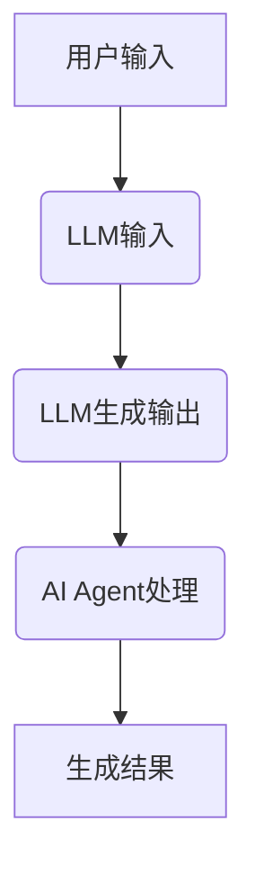
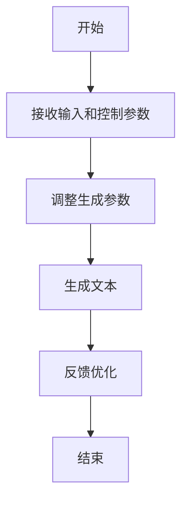
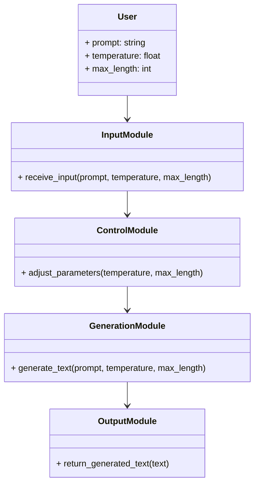

                 


# AI Agent的可控文本生成：精确调节LLM的输出特征

> 关键词：AI Agent，可控文本生成，大语言模型（LLM），文本生成，输出特征调节

> 摘要：本文深入探讨了AI Agent在可控文本生成中的应用，重点分析了如何精确调节大语言模型（LLM）的输出特征。文章从背景介绍、核心概念、算法原理、系统架构到项目实战，全面解析了可控文本生成的技术细节和实现方法，为读者提供了从理论到实践的完整指南。

---

# 第一部分: AI Agent与可控文本生成基础

## 第1章: AI Agent与可控文本生成概述

### 1.1 AI Agent的基本概念

#### 1.1.1 AI Agent的定义与特点
- **定义**：AI Agent（人工智能代理）是一种能够感知环境、自主决策并执行任务的智能实体。它可以是软件程序或物理设备，具备目标导向性和适应性。
- **特点**：
  - **自主性**：无需外部干预，自主完成任务。
  - **反应性**：能够实时感知环境并做出反应。
  - **目标导向性**：以实现特定目标为导向。
  - **学习能力**：通过数据和经验不断优化自身性能。

#### 1.1.2 AI Agent的核心功能与应用场景
- **核心功能**：
  - 数据采集与处理
  - 信息分析与决策
  - 自动执行与反馈
- **应用场景**：
  - 智能客服
  - 自动交易系统
  - 智能推荐系统
  - 自动驾驶

#### 1.1.3 可控文本生成的定义与目标
- **定义**：可控文本生成是指在生成文本的过程中，通过引入控制参数或机制，使生成的文本符合特定的格式、风格、语义或内容要求。
- **目标**：
  - 提高生成文本的准确性
  - 控制生成文本的风格和语气
  - 限制生成文本的主题和内容

---

### 1.2 大语言模型（LLM）的基本原理

#### 1.2.1 LLM的模型结构与工作原理
- **模型结构**：
  - 基于Transformer架构，包括编码器和解码器。
  - 注意力机制（Attention）是模型的核心，用于捕捉输入文本中词语之间的关系。
- **工作原理**：
  - 编码器将输入文本转换为上下文表示。
  - 解码器根据上下文生成输出文本，逐词生成，每一步都依赖于之前的生成结果。

#### 1.2.2 LLM的训练过程与优化方法
- **训练过程**：
  - 使用大规模语料库进行预训练，目标是最小化生成的损失函数。
  - 常见的训练目标包括：
    - 自然语言理解（NLU）
    - 自然语言生成（NLG）
    - 对抗训练（Adversarial Training）
- **优化方法**：
  - 使用梯度下降（如Adam优化器）优化模型参数。
  - 增加正则化项（如L2正则化）防止过拟合。

#### 1.2.3 LLM的输出特征分析
- **输出特征**：
  - 生成文本的长度
  - 生成文本的语气（正式、随意）
  - 生成文本的主题相关性
  - 生成文本的逻辑连贯性

---

### 1.3 可控文本生成的背景与挑战

#### 1.3.1 当前文本生成技术的局限性
- **局限性**：
  - 生成文本的质量不稳定，可能出现语法错误或语义不通的情况。
  - 缺乏对生成文本的控制能力，无法精确匹配特定需求。
  - 对生成文本的风格和语气难以进行细粒度调节。

#### 1.3.2 可控生成的需求与应用场景
- **需求**：
  - 在特定场景下，生成符合要求的文本（如法律文书、技术文档）。
  - 根据不同的用户需求，生成不同风格的文本（如正式邮件、社交媒体帖子）。
- **应用场景**：
  - 智能写作工具
  - 自动化内容生成
  - 个性化推荐系统

#### 1.3.3 可控生成的技术挑战与解决方案
- **挑战**：
  - 如何在生成文本的过程中，实时调整生成的风格和内容。
  - 如何确保生成的文本既符合控制参数的要求，又具备良好的生成质量。
- **解决方案**：
  - 引入控制参数，对生成过程进行干预。
  - 使用强化学习（Reinforcement Learning）优化生成策略。
  - 基于对抗训练（Adversarial Training）提升生成文本的多样性。

---

## 第2章: 可控文本生成的核心概念与联系

### 2.1 可控生成的理论基础

#### 2.1.1 可控生成的定义与分类
- **定义**：可控生成是指在生成文本的过程中，通过引入控制参数或机制，使生成的文本符合特定的格式、风格、语义或内容要求。
- **分类**：
  - **基于参数的控制**：通过调整模型的超参数或生成策略参数，控制生成结果。
  - **基于模板的控制**：使用预定义的模板或规则，约束生成文本的结构和内容。
  - **基于反馈的控制**：根据生成结果的反馈，动态调整生成策略。

#### 2.1.2 可控生成的关键属性与特征
- **关键属性**：
  - **可调节性**：生成过程可以被外部参数或机制所调节。
  - **多样性**：生成结果能够覆盖不同的风格和内容。
  - **准确性**：生成文本符合特定的格式和内容要求。
- **特征对比表**：

| 特征属性 | 可调节性 | 多样性 | 准确性 |
|----------|----------|--------|--------|
| 基于参数的控制 | 高       | 中     | 中     |
| 基于模板的控制 | 中       | 低     | 高     |
| 基于反馈的控制 | 高       | 高     | 中     |

#### 2.1.3 可控生成的数学模型与公式
- **数学模型**：
  - 输入：原始输入文本 $x$，控制参数 $c$。
  - 输出：生成文本 $y$。
  - 概率分布：$P(y|x,c)$。
- **公式示例**：
  - 基于条件概率的生成模型：
    $$ P(y|x,c) = \frac{P(y|x,c)}{P(x|c)} $$
  - 基于马尔可夫链的生成模型：
    $$ P(y|x,c) = \prod_{i=1}^n P(y_i|x_{<i},c) $$

---

### 2.2 LLM与AI Agent的协同工作原理

#### 2.2.1 LLM作为AI Agent的核心模块
- **LLM在AI Agent中的角色**：
  - 作为生成文本的核心模块，负责根据用户输入生成响应。
  - 提供自然语言理解（NLU）和自然语言生成（NLG）功能。

#### 2.2.2 AI Agent对LLM输出的控制机制
- **控制机制**：
  - **参数调节**：通过调整LLM的生成参数（如温度、重复率）控制生成结果。
  - **模板约束**：使用预定义的模板约束生成文本的结构和内容。
  - **反馈优化**：根据生成结果的反馈，动态调整生成策略。

#### 2.2.3 LLM与AI Agent的交互流程
- **流程图**：



---

### 2.3 可控生成的系统架构与实体关系

#### 2.3.1 系统架构的模块划分
- **模块划分**：
  - **输入模块**：接收用户的输入并解析。
  - **控制模块**：根据需求调整生成参数。
  - **生成模块**：基于LLM生成文本。
  - **输出模块**：将生成结果返回给用户。

#### 2.3.2 实体关系图的构建与分析
- **实体关系图**：

```mermaid
graph TD
    A(User) --> B(Input Module)
    B --> C(Control Module)
    C --> D(Generation Module)
    D --> E(Output Module)
    E --> F.Generated Text
```

---

## 第3章: 可控文本生成的算法原理与实现

### 3.1 可控生成的算法原理

#### 3.1.1 基于LLM的可控生成算法
- **算法步骤**：
  1. 接收用户输入和控制参数。
  2. 调整LLM的生成参数（如温度、重复率）。
  3. 使用LLM生成文本。
  4. 根据生成结果进行反馈优化。

#### 3.1.2 基于强化学习的可控生成
- **强化学习机制**：
  - 状态空间：生成过程中的上下文信息。
  - 动作空间：生成的下一个词或短语。
  - 奖励函数：衡量生成结果与目标的匹配程度。

#### 3.1.3 基于对抗训练的可控生成
- **对抗训练流程**：
  1. 判别器负责判断生成文本是否符合目标。
  2. 生成器根据判别器的反馈调整生成策略。
  3. 反复迭代优化生成器和判别器。

---

### 3.2 算法实现的详细步骤

#### 3.2.1 算法流程图的绘制
- **流程图**：



#### 3.2.2 算法实现的代码示例
- **Python代码示例**：

```python
def generate_text(prompt, temperature=1.0, max_length=100):
    response = openai.Completion.create(
        engine="text-davinci-003",
        prompt=prompt,
        temperature=temperature,
        max_tokens=max_length
    )
    return response.choices[0].text
```

---

### 3.3 算法实现的优化与改进

#### 3.3.1 算法优化的策略与方法
- **优化策略**：
  - 使用更复杂的奖励函数。
  - 引入多种控制参数（如主题关键词）。
  - 增加生成过程的反馈机制。

#### 3.3.2 算法实现的性能评估
- **评估指标**：
  - 生成文本的准确率。
  - 生成文本的相关性。
  - 生成文本的多样性。

#### 3.3.3 算法实现的实验结果与分析
- **实验结果**：
  - 不同温度值对生成结果的影响。
  - 不同控制参数对生成文本的多样性影响。
  - 不同优化策略对生成质量的影响。

---

## 第4章: 可控文本生成的系统分析与架构设计

### 4.1 系统分析与需求分析

#### 4.1.1 系统功能需求的确定
- **功能需求**：
  - 接收用户输入和控制参数。
  - 调整LLM的生成参数。
  - 生成并输出符合要求的文本。

#### 4.1.2 系统性能需求的分析
- **性能需求**：
  - 响应时间：生成文本的延迟。
  - 处理能力：同时处理多个请求的能力。

#### 4.1.3 系统边界与接口的设计
- **系统边界**：
  - 用户界面与生成模块的接口。
  - 生成模块与LLM的接口。

---

### 4.2 系统架构设计

#### 4.2.1 系统架构的模块划分
- **模块划分**：
  - **输入模块**：接收用户的输入和控制参数。
  - **控制模块**：调整生成参数。
  - **生成模块**：基于LLM生成文本。
  - **输出模块**：将生成结果返回给用户。

#### 4.2.2 系统架构的类图设计
- **类图**：



---

### 4.3 系统接口设计

#### 4.3.1 系统接口
- **接口定义**：
  - `receive_input(prompt, temperature, max_length)`
  - `adjust_parameters(temperature, max_length)`
  - `generate_text(prompt, temperature, max_length)`
  - `return_generated_text(text)`

---

## 第5章: 项目实战——可控文本生成系统实现

### 5.1 项目背景与目标
- **项目背景**：开发一个基于AI Agent的可控文本生成系统，能够根据用户需求生成不同风格和内容的文本。
- **项目目标**：
  - 实现对生成文本的精确控制。
  - 提供灵活的参数调节功能。
  - 支持多种生成模式（如正式、随意）。

---

### 5.2 项目实现

#### 5.2.1 环境安装
- **环境要求**：
  - Python 3.8+
  - OpenAI API Key
  - transformers库
  - scikit-learn库

#### 5.2.2 系统核心实现源代码
- **Python代码实现**：

```python
import openai

class TextGenerator:
    def __init__(self, api_key):
        self.client = openai.Client(api_key)
    
    def generate(self, prompt, temperature=1.0, max_length=100):
        response = self.client.chat.completions.create(
            model="gpt-3.5-turbo",
            messages=[{"role": "user", "content": prompt}],
            temperature=temperature,
            max_tokens=max_length
        )
        return response.choices[0].message.content

# 使用示例
generator = TextGenerator("your_api_key")
text = generator.generate("Write a poem about love.", temperature=0.7, max_length=200)
print(text)
```

---

### 5.3 代码应用解读与分析
- **代码解读**：
  - **TextGenerator类**：封装了OpenAI API的调用，实现了生成文本的功能。
  - **generate方法**：接收提示（prompt）、温度（temperature）和最大长度（max_length），调用OpenAI API生成文本。
- **分析**：
  - 温度参数控制生成文本的随机性，温度越高，生成内容越多样化。
  - 最大长度参数控制生成文本的长度。

---

## 第6章: 总结与展望

### 6.1 本章总结
- **总结**：
  - AI Agent在可控文本生成中的应用前景广阔。
  - 通过调整LLM的生成参数和引入控制机制，可以实现对生成文本的精确控制。
  - 结合强化学习和对抗训练等技术，可以进一步提升生成文本的质量和多样性。

### 6.2 未来展望
- **未来方向**：
  - 研究更复杂的控制机制，如多模态控制（结合图像、语音等）。
  - 开发更高效的生成算法，减少生成过程中的计算开销。
  - 探索生成文本的实时反馈优化方法。

---

## 作者信息

**作者**：AI天才研究院/AI Genius Institute & 禅与计算机程序设计艺术 /Zen And The Art of Computer Programming

---

以上是《AI Agent的可控文本生成：精确调节LLM的输出特征》的技术博客文章的完整大纲和内容。

