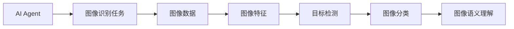
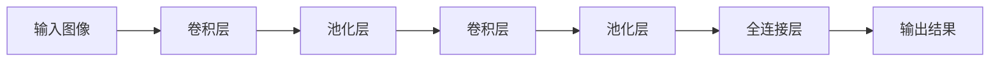
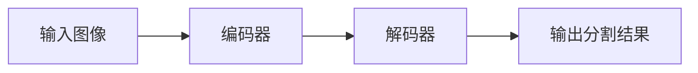
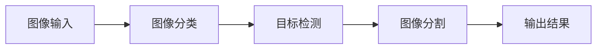
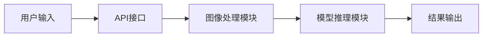
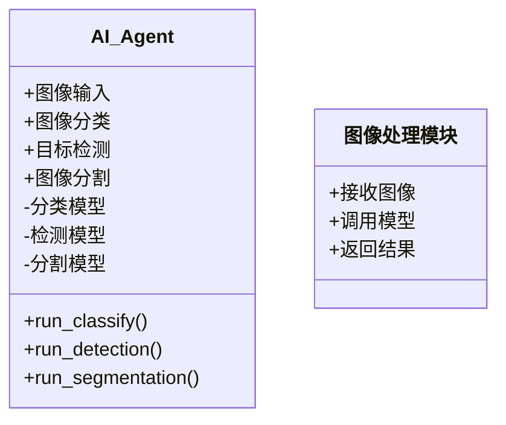
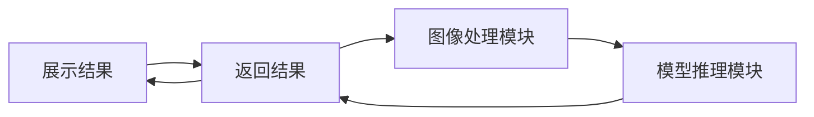

                 


# AI Agent的图像识别与处理技术

## 关键词：AI Agent，图像识别，深度学习，计算机视觉，图像处理

## 摘要：本文将详细探讨AI Agent在图像识别与处理技术中的应用，从基础概念到算法原理，再到系统架构和项目实战，深入分析AI Agent如何通过图像识别技术提升智能系统的感知能力。本文内容涵盖背景介绍、核心概念对比、算法实现、系统设计和项目实践，为读者提供全面的知识体系。

---

# 第1章: AI Agent与图像识别的背景与基础

## 1.1 AI Agent的基本概念

### 1.1.1 AI Agent的定义与特点
AI Agent（人工智能代理）是指在计算机系统中，能够感知环境、自主决策并执行任务的智能实体。其特点包括：
- **自主性**：能够在没有外部干预的情况下执行任务。
- **反应性**：能够实时感知环境并做出反应。
- **目标导向性**：基于目标驱动行为。
- **学习能力**：能够通过经验改进性能。

### 1.1.2 AI Agent的核心功能与分类
AI Agent的核心功能包括信息处理、决策制定和任务执行。根据应用场景，AI Agent可以分为：
- **简单反射型代理**：基于规则直接执行任务。
- **基于模型的反射型代理**：利用内部模型进行推理和规划。
- **目标驱动型代理**：根据目标优化行为。
- **实用驱动型代理**：基于效用函数优化决策。

### 1.1.3 AI Agent在图像识别中的应用前景
AI Agent通过图像识别技术可以实现对视觉信息的感知和理解，广泛应用于自动驾驶、智能安防、医疗影像分析等领域。图像识别技术为AI Agent提供了强大的视觉感知能力，使其能够更好地与环境交互。

## 1.2 图像识别技术的概述

### 1.2.1 图像识别的基本概念
图像识别是通过计算机对图像内容进行分析和理解的过程，主要任务包括图像分类、目标检测、图像分割和图像语义理解。

### 1.2.2 图像识别的主要技术与方法
图像识别的主要技术包括：
- **基于传统特征的图像识别**：如SIFT、HOG等。
- **基于深度学习的图像识别**：如卷积神经网络（CNN）。
- **图像分割技术**：如U-Net、Faster R-CNN等。

### 1.2.3 图像识别在AI Agent中的作用
图像识别技术为AI Agent提供了视觉感知能力，使其能够理解图像内容并做出相应的决策。例如，在自动驾驶中，AI Agent通过图像识别技术识别道路、车辆和行人，从而实现自主导航。

## 1.3 AI Agent与图像识别的结合

### 1.3.1 AI Agent驱动图像识别的必要性
AI Agent需要通过图像识别技术实现对环境的感知，从而做出更智能的决策。图像识别技术为AI Agent提供了强大的视觉感知能力。

### 1.3.2 图像识别技术如何增强AI Agent的能力
图像识别技术通过提供视觉信息，增强了AI Agent的感知能力，使其能够更好地理解和交互环境。例如，在智能安防中，AI Agent通过图像识别技术识别异常行为，从而提高安全性能。

### 1.3.3 AI Agent与图像识别结合的典型应用场景
- **自动驾驶**：AI Agent通过图像识别技术识别道路、车辆和行人，实现自主驾驶。
- **智能安防**：AI Agent通过图像识别技术识别异常行为，提高安全性。
- **医疗影像分析**：AI Agent通过图像识别技术分析医学影像，辅助医生诊断。

## 1.4 本章小结
本章介绍了AI Agent和图像识别的基本概念、核心功能以及它们的结合应用。AI Agent通过图像识别技术实现对环境的感知和理解，从而增强其智能性和决策能力。

---

# 第2章: AI Agent图像识别的核心概念

## 2.1 AI Agent图像识别的核心原理

### 2.1.1 图像特征提取的原理
图像特征提取是图像识别的基础，通过提取图像中的关键特征，如边缘、纹理和形状，为后续的图像分类和目标检测提供基础。

### 2.1.2 图像分类与目标检测的机制
图像分类是将图像分为不同的类别，如狗、猫等。目标检测是在图像中定位和识别目标物体的位置和类别。

### 2.1.3 图像语义理解的实现方式
图像语义理解是通过理解图像内容，生成图像的语义描述，如图像中包含的物体、场景和情感等。

## 2.2 AI Agent图像识别的关键技术

### 2.2.1 基于深度学习的图像识别技术
基于深度学习的图像识别技术通过训练深度神经网络模型，如卷积神经网络（CNN），实现对图像的分类和检测。

### 2.2.2 图像分割与图像重建技术
图像分割是将图像分割为多个区域，每个区域表示不同的物体或背景。图像重建是通过分割后的结果，重新生成图像。

### 2.2.3 图像增强与数据预处理技术
图像增强是通过技术手段改善图像质量，如去噪、调整亮度和对比度等。数据预处理是将图像数据转化为模型可以处理的形式，如归一化和标准化。

## 2.3 AI Agent图像识别的核心要素对比

### 2.3.1 图像特征与目标检测的对比分析
图像特征提取是目标检测的基础，目标检测在图像特征的基础上，进一步定位和识别目标物体。

### 2.3.2 图像分类与图像语义理解的对比
图像分类是对图像进行整体分类，图像语义理解是对图像内容进行更细粒度的理解和描述。

### 2.3.3 不同图像识别技术的优劣势分析
- **图像分类**：简单高效，但无法定位目标物体。
- **目标检测**：能够定位和识别目标物体，但计算复杂度较高。
- **图像分割**：能够分割图像区域，但计算复杂度更高。

## 2.4 AI Agent图像识别的实体关系图



## 2.5 本章小结
本章详细介绍了AI Agent图像识别的核心原理和技术，包括图像特征提取、目标检测和图像语义理解等。通过对比分析不同图像识别技术的优劣势，为后续的系统设计和项目实践提供了理论基础。

---

# 第3章: 图像识别算法的原理与流程

## 3.1 常见图像识别算法概述

### 3.1.1 基于CNN的图像分类算法
基于CNN的图像分类算法通过卷积层提取图像特征，通过全连接层进行分类。例如，AlexNet、VGGNet和ResNet等模型。

### 3.1.2 目标检测算法（如YOLO、Faster R-CNN）
目标检测算法YOLO通过单个神经网络直接预测目标的位置和类别，Faster R-CNN通过区域建议网络生成候选框，再进行目标检测。

### 3.1.3 图像分割算法（如U-Net）
图像分割算法U-Net通过编码器和解码器结构，实现对图像的分割和重建。

## 3.2 图像分类算法的数学模型

### 3.2.1 卷积神经网络的数学模型
卷积神经网络的数学模型包括卷积层、池化层和全连接层。卷积层通过卷积核提取图像特征，池化层通过下采样降低计算复杂度，全连接层通过非线性激活函数进行分类。

### 3.2.2 图像分类算法的流程图


## 3.3 图像分割算法的数学模型

### 3.3.1 U-Net的数学模型
U-Net通过编码器和解码器结构实现图像分割。编码器通过下采样提取图像特征，解码器通过上采样和跳跃连接重建图像。

### 3.3.2 图像分割算法的流程图


## 3.4 图像识别算法的实现代码

### 3.4.1 基于CNN的图像分类代码
```python
import tensorflow as tf
from tensorflow.keras import layers

model = tf.keras.Sequential([
    layers.Conv2D(32, (3,3), activation='relu', input_shape=(224, 224, 3)),
    layers.MaxPooling2D((2,2)),
    layers.Conv2D(64, (3,3), activation='relu'),
    layers.MaxPooling2D((2,2)),
    layers.Flatten(),
    layers.Dense(64, activation='relu'),
    layers.Dense(10, activation='softmax')
])

model.compile(optimizer='adam', loss='sparse_categorical_crossentropy', metrics=['accuracy'])
model.fit(x_train, y_train, epochs=10, batch_size=32)
```

### 3.4.2 基于YOLO的目标检测代码
```python
import tensorflow as tf
from tensorflow.keras import layers

model = tf.keras.Sequential([
    layers.Conv2D(32, (3,3), activation='relu', input_shape=(416, 416, 3)),
    layers.MaxPooling2D((2,2)),
    layers.Conv2D(64, (3,3), activation='relu'),
    layers.MaxPooling2D((2,2)),
    layers.Flatten(),
    layers.Dense(64, activation='relu'),
    layers.Dense(10, activation='softmax')
])

model.compile(optimizer='adam', loss='sparse_categorical_crossentropy', metrics=['accuracy'])
model.fit(x_train, y_train, epochs=10, batch_size=32)
```

## 3.5 本章小结
本章详细介绍了常见图像识别算法的原理和流程，包括基于CNN的图像分类、目标检测和图像分割等。通过数学模型和代码实现，帮助读者更好地理解图像识别算法的实现过程。

---

# 第4章: 系统分析与架构设计方案

## 4.1 项目背景介绍
本项目旨在开发一个基于AI Agent的图像识别系统，实现对图像的分类、检测和分割功能。

## 4.2 系统功能设计

### 4.2.1 领域模型设计


### 4.2.2 系统架构设计


## 4.3 系统架构设计

### 4.3.1 类图设计


### 4.3.2 架构图设计


### 4.3.3 接口设计
- **输入接口**：接收图像数据。
- **输出接口**：返回图像分类、检测和分割结果。

## 4.4 系统交互设计

### 4.4.1 序列图设计


## 4.5 本章小结
本章详细介绍了基于AI Agent的图像识别系统的架构设计，包括领域模型、类图、架构图和交互图等。系统设计为后续的项目实现提供了理论基础。

---

# 第5章: 项目实战与案例分析

## 5.1 项目环境安装

### 5.1.1 安装Python和TensorFlow
```bash
pip install python
pip install tensorflow
```

### 5.1.2 安装其他依赖
```bash
pip install numpy
pip install matplotlib
```

## 5.2 系统核心实现源代码

### 5.2.1 图像分类代码
```python
import tensorflow as tf
from tensorflow.keras import layers

model = tf.keras.Sequential([
    layers.Conv2D(32, (3,3), activation='relu', input_shape=(224, 224, 3)),
    layers.MaxPooling2D((2,2)),
    layers.Conv2D(64, (3,3), activation='relu'),
    layers.MaxPooling2D((2,2)),
    layers.Flatten(),
    layers.Dense(64, activation='relu'),
    layers.Dense(10, activation='softmax')
])

model.compile(optimizer='adam', loss='sparse_categorical_crossentropy', metrics=['accuracy'])
model.fit(x_train, y_train, epochs=10, batch_size=32)
```

### 5.2.2 目标检测代码
```python
import tensorflow as tf
from tensorflow.keras import layers

model = tf.keras.Sequential([
    layers.Conv2D(32, (3,3), activation='relu', input_shape=(416, 416, 3)),
    layers.MaxPooling2D((2,2)),
    layers.Conv2D(64, (3,3), activation='relu'),
    layers.MaxPooling2D((2,2)),
    layers.Flatten(),
    layers.Dense(64, activation='relu'),
    layers.Dense(10, activation='softmax')
])

model.compile(optimizer='adam', loss='sparse_categorical_crossentropy', metrics=['accuracy'])
model.fit(x_train, y_train, epochs=10, batch_size=32)
```

## 5.3 代码应用解读与分析
- **图像分类代码**：通过卷积神经网络实现图像分类，适用于物体分类任务。
- **目标检测代码**：通过YOLO算法实现目标检测，适用于物体定位任务。

## 5.4 案例分析与详细讲解
### 5.4.1 医疗影像分析
通过AI Agent图像识别技术，对医疗影像进行分类和检测，辅助医生进行诊断。

### 5.4.2 自然图像分类
通过对自然图像进行分类，实现对不同场景的识别和理解。

## 5.5 本章小结
本章通过项目实战，详细介绍了基于AI Agent的图像识别系统的实现过程，包括环境安装、代码实现和案例分析等。

---

# 第6章: 最佳实践与小结

## 6.1 最佳实践

### 6.1.1 数据预处理
- 数据增强：通过旋转、翻转和裁剪等技术，增加数据多样性。
- 数据归一化：通过标准化处理，降低模型训练难度。

### 6.1.2 模型优化
- 模型调参：通过调整学习率和批量大小，优化模型性能。
- 模型压缩：通过剪枝和量化技术，降低模型大小和计算复杂度。

### 6.1.3 系统优化
- 并行计算：通过多线程和分布式计算，提高系统性能。
- 模型部署：通过API接口和微服务架构，实现系统的高效运行。

## 6.2 小结

### 6.2.1 关键点回顾
- AI Agent通过图像识别技术实现对环境的感知和理解。
- 图像识别技术包括图像分类、目标检测和图像分割等。
- 系统设计包括领域模型、架构图和交互图等。

### 6.2.2 注意事项
- 数据质量和数量对模型性能有重要影响。
- 模型调参和优化是提高系统性能的关键。
- 系统设计需要考虑可扩展性和可维护性。

## 6.3 拓展阅读

### 6.3.1 深度学习与计算机视觉
推荐书籍：《Deep Learning》、《Computer Vision: Models, Learning, and Applications》。

### 6.3.2 AI Agent与图像识别
推荐论文：《Visual Recognition with AI Agents》、《Deep Learning for Visual Recognition in Autonomous Agents》。

## 6.4 本章小结
本章总结了AI Agent图像识别技术的关键点和最佳实践，为读者提供了系统的知识体系和实践指导。

---

# 作者：AI天才研究院/AI Genius Institute & 禅与计算机程序设计艺术 /Zen And The Art of Computer Programming

---

以上是《AI Agent的图像识别与处理技术》的详细目录和内容框架，涵盖了从基础概念到系统设计再到项目实战的各个方面，为读者提供了一个全面的指导和参考。

