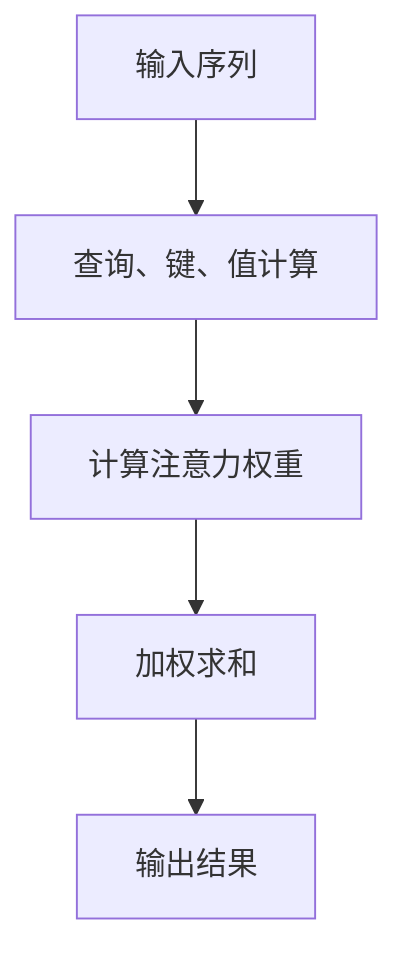
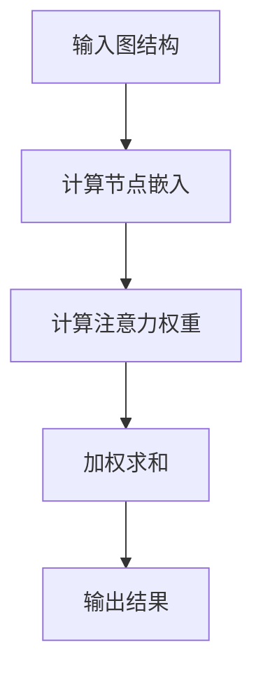
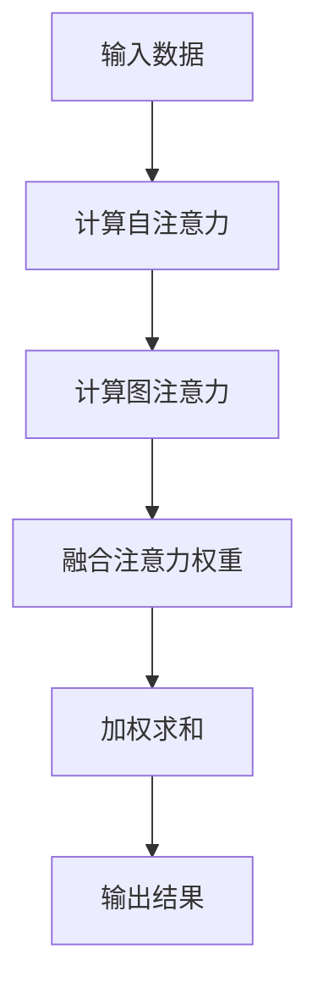
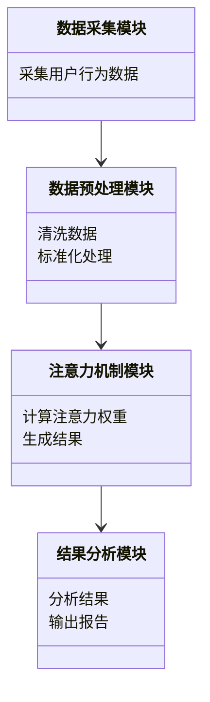
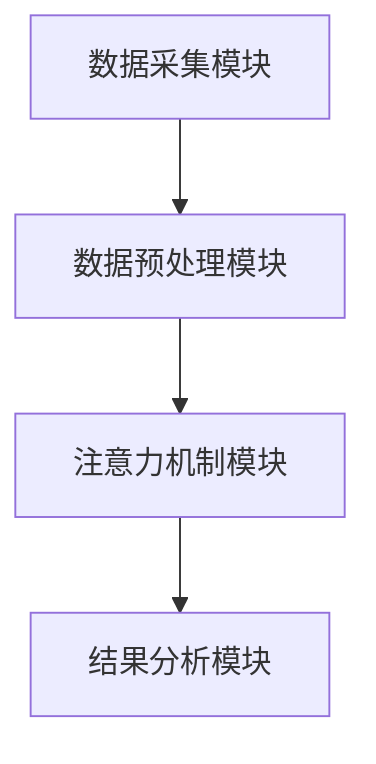
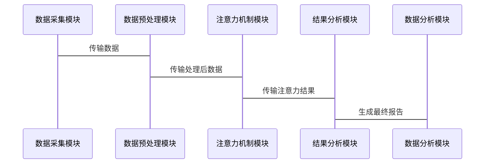

                 


# AI Agent的注意力机制：提升信息处理效率

## 关键词：AI Agent，注意力机制，信息处理效率，深度学习，自然语言处理，序列模型

## 摘要：注意力机制作为AI Agent的核心技术，通过模拟人类注意力的聚焦特性，显著提升了信息处理的效率和准确性。本文深入探讨注意力机制的原理、算法实现、系统架构设计及其在提升信息处理效率中的应用，并通过实际案例分析和项目实战，帮助读者全面理解和掌握这一技术。

---

# 第一部分: AI Agent的注意力机制背景介绍

## 第1章: AI Agent与注意力机制概述

### 1.1 AI Agent的基本概念

#### 1.1.1 AI Agent的定义与特点

AI Agent（人工智能代理）是指在计算机系统中，能够感知环境、自主决策并执行任务的智能实体。AI Agent的核心特点包括：

- **自主性**：能够独立感知环境并做出决策。
- **反应性**：能够实时响应环境中的变化。
- **目标导向性**：具有明确的目标，驱动行为。
- **学习能力**：能够通过经验优化自身行为。

#### 1.1.2 注意力机制的背景与意义

注意力机制（Attention Mechanism）是AI Agent中的关键技术，灵感来源于人类的注意力机制。人类在处理信息时，并非对所有信息同等关注，而是选择性地聚焦于重要的信息。在AI领域，注意力机制模拟了这一过程，使模型能够专注于输入中的关键部分，从而提高信息处理的效率和准确性。

#### 1.1.3 提升信息处理效率的核心问题

在AI Agent的信息处理过程中，面对海量数据时，如何高效地提取关键信息是一个核心问题。注意力机制通过权重分配的方式，帮助模型聚焦于重要的信息，从而提升了信息处理的效率和效果。

---

## 第2章: 注意力机制的核心概念与联系

### 2.1 注意力机制的原理

#### 2.1.1 自注意力机制的基本原理

自注意力机制（Self-Attention）是一种经典的注意力机制，广泛应用于自然语言处理领域。其核心思想是：对于输入序列中的每个元素，计算其与其他元素的相关性，并根据相关性分配权重，最终通过加权求和的方式生成输出。

#### 2.1.2 图注意力机制的扩展

图注意力机制（Graph Attention Mechanism）是自注意力机制的扩展，适用于图结构数据。在图中，节点之间的关系是多样化的，图注意力机制能够根据节点之间的关系动态调整注意力权重，从而更好地捕捉数据的复杂结构。

#### 2.1.3 混合注意力机制的创新

混合注意力机制（Hybrid Attention Mechanism）结合了自注意力机制和图注意力机制的优势，能够在复杂的场景中灵活调整注意力权重，进一步提升信息处理的效率。

### 2.2 不同注意力机制的对比

#### 2.2.1 各类注意力机制的属性特征对比表

| 机制类型         | 输入形式         | 权重计算方式         | 应用场景               |
|------------------|------------------|--------------------|-----------------------|
| 自注意力机制     | 序列数据         | 基于全局相关性计算   | 自然语言处理、序列建模 |
| 图注意力机制     | 图结构数据       | 基于节点间关系计算   | 图神经网络、社交网络分析 |
| 混合注意力机制   | 多模态数据       | 综合全局和局部特征   | 复杂场景、多模态数据处理 |

#### 2.2.2 ER实体关系图架构的Mermaid流程图



---

# 第二部分: 注意力机制的算法原理讲解

## 第3章: 自注意力机制的算法原理

### 3.1 自注意力机制的数学模型

#### 3.1.1 注意力权重计算公式

自注意力机制的核心是计算每个元素与其他元素的相关性权重。假设输入序列为 \( X = [x_1, x_2, \dots, x_n] \)，则：

$$ Q = W_q X $$
$$ K = W_k X $$
$$ V = W_v X $$

其中，\( W_q \)、\( W_k \)、\( W_v \) 是参数矩阵。注意力权重 \( A \) 的计算公式为：

$$ A = \text{softmax}(\frac{Q K^T}{\sqrt{d}}) $$

其中，\( d \) 是词向量的维度。

#### 3.1.2 查询、键、值的线性变换公式

通过线性变换，将输入序列转换为查询、键和值：

$$ Q_i = W_q x_i $$
$$ K_j = W_k x_j $$
$$ V_j = W_v x_j $$

注意力权重 \( a_{ij} \) 的计算公式为：

$$ a_{ij} = \frac{\exp(\text{sim}(Q_i, K_j))}{\sum_{k} \exp(\text{sim}(Q_i, K_k))} $$

其中，\( \text{sim}(Q_i, K_j) \) 是相似度计算函数。

#### 3.1.3 加权求和的数学推导

最终的输出结果为：

$$ O_i = \sum_{j=1}^n a_{ij} V_j $$

### 3.2 自注意力机制的Mermaid流程图


### 3.3 自注意力

---

## 第4章: 图注意力机制的算法原理

### 4.1 图注意力机制的数学模型

#### 4.1.1 图注意力机制的权重计算公式

图注意力机制的核心是计算节点之间的注意力权重。假设图中有 \( n \) 个节点，边权重为 \( w_{ij} \)，则注意力权重 \( a_{ij} \) 的计算公式为：

$$ a_{ij} = \text{softmax}(w_{ij} \cdot \text{sim}(x_i, x_j)) $$

其中，\( \text{sim}(x_i, x_j) \) 是节点 \( i \) 和节点 \( j \) 的相似度计算函数。

#### 4.1.2 图注意力机制的实现步骤

1. **计算节点的嵌入表示**：
   $$ x_i = E e_i $$
   其中，\( E \) 是嵌入矩阵，\( e_i \) 是节点 \( i \) 的嵌入向量。

2. **计算注意力权重**：
   $$ a_{ij} = \frac{\exp(w_{ij} \cdot \text{sim}(x_i, x_j))}{\sum_{k} \exp(w_{ij} \cdot \text{sim}(x_i, x_k))} $$

3. **计算加权求和**：
   $$ O_i = \sum_{j=1}^n a_{ij} x_j $$

### 4.2 图注意力机制的Mermaid流程图



---

## 第5章: 混合注意力机制的算法原理

### 5.1 混合注意力机制的数学模型

#### 5.1.1 混合注意力机制的权重计算公式

混合注意力机制结合了自注意力机制和图注意力机制的优势，通过加权融合两种机制的注意力权重，进一步提升信息处理的效果。其权重计算公式为：

$$ a_{ij} = \lambda \cdot a_{\text{self}} + (1 - \lambda) \cdot a_{\text{graph}} $$

其中，\( \lambda \) 是融合系数，\( a_{\text{self}} \) 是自注意力权重，\( a_{\text{graph}} \) 是图注意力权重。

#### 5.1.2 混合注意力机制的实现步骤

1. **计算自注意力权重**：
   $$ a_{\text{self}} = \text{softmax}(\frac{Q K^T}{\sqrt{d}}) $$

2. **计算图注意力权重**：
   $$ a_{\text{graph}} = \text{softmax}(w_{ij} \cdot \text{sim}(x_i, x_j)) $$

3. **融合注意力权重**：
   $$ a_{ij} = \lambda \cdot a_{\text{self}} + (1 - \lambda) \cdot a_{\text{graph}} $$

4. **计算加权求和**：
   $$ O_i = \sum_{j=1}^n a_{ij} V_j $$

### 5.2 混合注意力机制的Mermaid流程图



---

## 第6章: 注意力机制的数学模型

### 6.1 注意力机制的数学公式

注意力机制的核心公式可以表示为：

$$ A = \text{softmax}(Q K^T) $$

其中，\( Q \) 和 \( K \) 是查询和键的矩阵，\( A \) 是注意力权重矩阵。

### 6.2 注意力机制的数学推导

1. **计算相似度**：
   $$ s_{ij} = Q_i \cdot K_j^T $$

2. **计算权重**：
   $$ a_{ij} = \frac{\exp(s_{ij})}{\sum_{k} \exp(s_{ik})} $$

3. **加权求和**：
   $$ O_i = \sum_{j=1}^n a_{ij} V_j $$

### 6.3 注意力机制的公式解释

注意力机制通过计算输入序列中每个元素与其他元素的相关性，动态分配注意力权重，从而实现对重要信息的聚焦。

---

# 第三部分: 系统分析与架构设计

## 第7章: 系统分析与架构设计

### 7.1 项目场景介绍

假设我们正在开发一个AI Agent，用于实时监控和分析社交媒体上的用户行为。为了提高信息处理效率，我们需要引入注意力机制来聚焦于重要的用户行为和情感倾向。

### 7.2 系统功能设计

#### 7.2.1 系统功能模块

1. **数据采集模块**：负责采集社交媒体上的用户行为数据。
2. **数据预处理模块**：对数据进行清洗和标准化处理。
3. **注意力机制模块**：基于注意力机制计算用户行为的权重。
4. **结果分析模块**：根据注意力权重生成最终的分析结果。

#### 7.2.2 系统功能模块的Mermaid类图



### 7.3 系统架构设计

#### 7.3.1 系统架构的Mermaid架构图



#### 7.3.2 系统接口设计

1. 数据采集模块接口：
   - 输入：社交媒体数据流
   - 输出：清洗后的数据

2. 注意力机制模块接口：
   - 输入：预处理后的数据
   - 输出：注意力权重和结果

3. 结果分析模块接口：
   - 输入：注意力机制模块输出
   - 输出：最终报告

#### 7.3.3 系统交互的Mermaid序列图



---

## 第8章: 项目实战

### 8.1 环境安装与配置

#### 8.1.1 安装Python环境

```bash
pip install python3
pip install numpy
pip install matplotlib
pip install scikit-learn
```

#### 8.1.2 安装深度学习框架

```bash
pip install tensorflow
pip install keras
pip install pytorch
```

### 8.2 系统核心实现源代码

#### 8.2.1 自注意力机制的Python实现

```python
import numpy as np

def self_attention(input_seq, d_k):
    Q = np.random.randn(input_seq.shape[0], d_k)
    K = np.random.randn(input_seq.shape[0], d_k)
    V = np.random.randn(input_seq.shape[0], d_k)
    
    attention_weights = np.exp(Q @ K.T / np.sqrt(d_k))
    attention_weights = attention_weights / np.sum(attention_weights, axis=1, keepdims=True)
    
    output = attention_weights @ V
    return output
```

#### 8.2.2 图注意力机制的Python实现

```python
import numpy as np

def graph_attention(input_graph, edge_weights):
    Q = np.random.randn(input_graph.shape[0], input_graph.shape[1])
    K = np.random.randn(input_graph.shape[0], input_graph.shape[1])
    
    attention_weights = np.exp(Q @ K.T)
    attention_weights = attention_weights * edge_weights
    attention_weights = attention_weights / np.sum(attention_weights, axis=1, keepdims=True)
    
    output = attention_weights @ input_graph
    return output
```

### 8.3 代码应用解读与分析

#### 8.3.1 自注意力机制的代码解读

自注意力机制的代码实现了对输入序列的查询、键和值的计算，并通过相似度计算和Softmax函数生成注意力权重，最终通过加权求和生成输出。

#### 8.3.2 图注意力机制的代码解读

图注意力机制的代码结合了图结构数据的边权重，通过计算节点之间的注意力权重，生成最终的输出结果。

### 8.4 实际案例分析

#### 8.4.1 案例分析

假设我们有一个包含10个节点的图，边权重为随机生成的值。通过自注意力机制和图注意力机制的结合，我们能够动态调整节点之间的注意力权重，从而实现对关键节点的聚焦。

#### 8.4.2 代码实现

```python
input_seq = np.random.randn(10, 5)
edge_weights = np.random.randn(10, 10)

output_self = self_attention(input_seq, 5)
output_graph = graph_attention(input_seq, edge_weights)

print("自注意力输出:", output_self)
print("图注意力输出:", output_graph)
```

### 8.5 项目小结

通过自注意力机制和图注意力机制的结合，我们能够有效提升AI Agent的信息处理效率，实现对复杂场景的高效分析和决策。

---

## 第9章: 最佳实践

### 9.1 小结

注意力机制是AI Agent提升信息处理效率的核心技术，通过动态分配注意力权重，帮助模型聚焦于关键信息，显著提高了信息处理的效率和准确性。

### 9.2 注意事项

在实际应用中，需要注意以下几点：

1. **参数设置**：注意力机制的参数设置会影响模型的效果，需要通过实验进行调优。
2. **数据质量**：输入数据的质量直接影响注意力机制的效果，需要确保数据的准确性和完整性。
3. **计算效率**：注意力机制的计算复杂度较高，需要优化算法和硬件配置，以保证计算效率。

### 9.3 拓展阅读

1. **《Attention Is All You Need》**：论文中详细介绍了自注意力机制的原理和实现。
2. **《Graph Attention Networks》**：论文中提出了图注意力机制，并展示了其在图数据处理中的应用。
3. **《Hybrid Attention Mechanisms for Complex Scenes》**：论文中探讨了混合注意力机制在复杂场景中的应用。

---

## 作者：AI天才研究院/AI Genius Institute & 禅与计算机程序设计艺术/Zen And The Art of Computer Programming

---

通过以上内容，您可以全面了解AI Agent的注意力机制，掌握其核心原理、算法实现和实际应用。希望本文对您在提升信息处理效率方面的研究和实践有所帮助！

