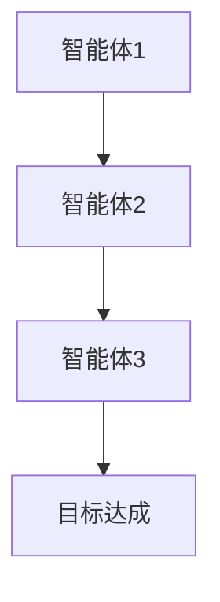
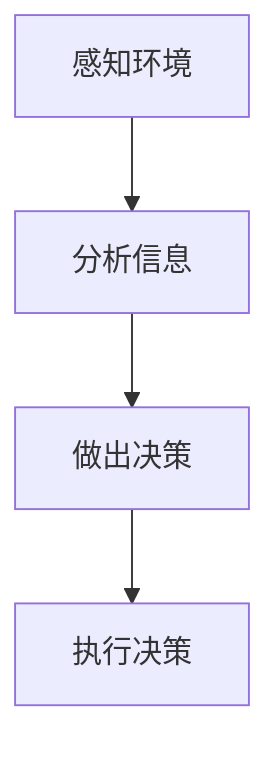
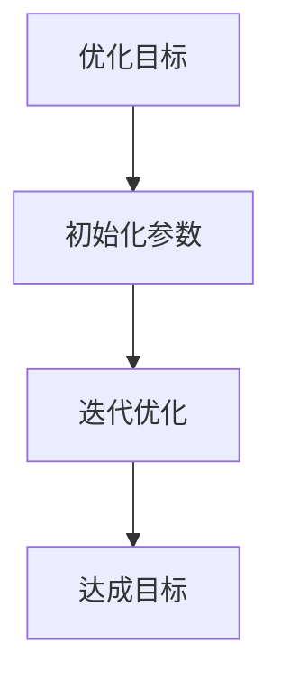
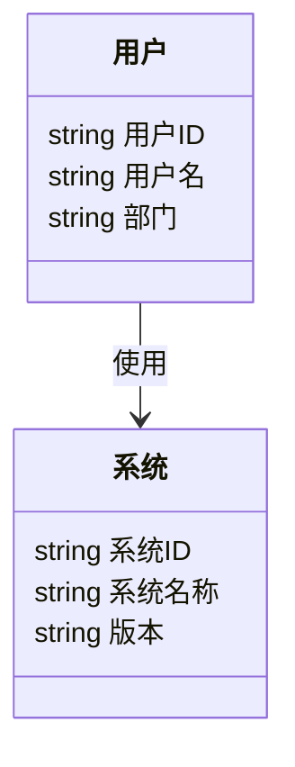
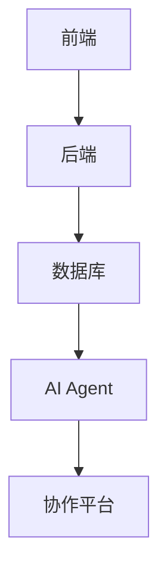
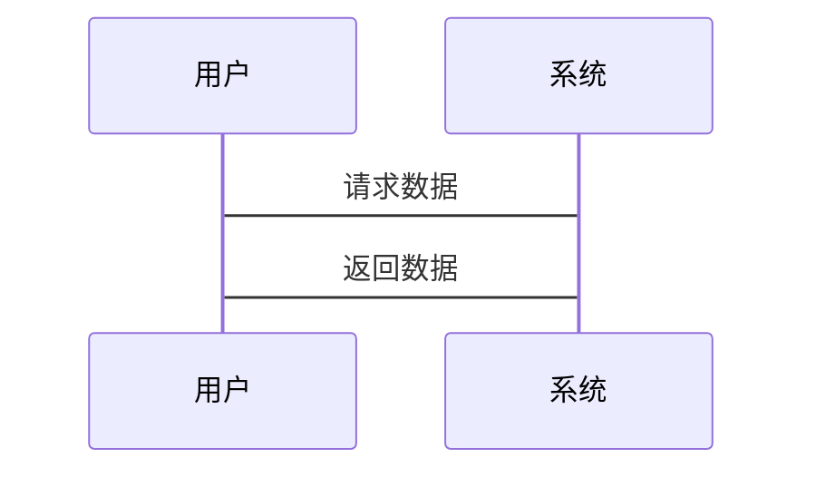

                 


# 企业AI Agent的多智能体系统在跨部门协作优化中的应用

**关键词**：企业AI Agent、多智能体系统、跨部门协作、协作优化、人工智能

**摘要**：  
本文探讨了企业AI Agent的多智能体系统在跨部门协作优化中的应用。通过分析多智能体系统的原理、AI Agent的核心作用以及跨部门协作优化的目标，结合实际案例，详细讲解了多智能体系统的架构设计、算法实现、系统优化等关键内容。本文旨在为企业提供一种高效、智能的协作优化方案，助力企业在数字化转型中提升效率和竞争力。

---

# 第1章 背景介绍

## 1.1 问题背景

### 1.1.1 企业协作中的痛点
企业在日常运营中，常常面临跨部门协作效率低下的问题。例如，销售部门、采购部门和生产部门之间的信息孤岛、沟通不畅以及协作流程复杂等问题，导致企业资源浪费和效率下降。

### 1.1.2 跨部门协作的复杂性
跨部门协作涉及多个团队和系统，信息传递不及时、责任划分不明确、协作流程不透明等问题，容易导致协作失败或效率低下。

### 1.1.3 AI Agent在企业协作中的潜力
AI Agent（人工智能代理）能够通过自动化处理和智能决策，帮助企业在跨部门协作中实现信息共享、任务分配和流程优化，从而提升协作效率。

## 1.2 问题描述

### 1.2.1 跨部门协作的效率低下
传统的协作方式依赖人工沟通和手动操作，容易出现信息滞后、任务延误等问题。

### 1.2.2 信息孤岛与数据碎片化
各部门之间数据分散，缺乏统一的数据标准和共享机制，导致信息无法有效利用。

### 1.2.3 协作过程中的不确定性
复杂的协作环境和动态变化的需求，使得协作过程充满不确定性，传统方法难以应对。

## 1.3 问题解决

### 1.3.1 多智能体系统的概念
多智能体系统是指由多个智能体组成的系统，每个智能体都有自己的目标和决策能力，能够通过协作完成复杂任务。

### 1.3.2 AI Agent的核心作用
AI Agent能够通过感知环境、自主决策和执行任务，帮助企业在跨部门协作中实现智能化管理。

### 1.3.3 跨部门协作优化的目标
通过多智能体系统的应用，优化协作流程、提升信息共享效率、降低协作成本，实现企业整体效率的提升。

## 1.4 边界与外延

### 1.4.1 多智能体系统的边界
多智能体系统仅关注企业内部的协作优化，不涉及外部合作伙伴或其他外部系统。

### 1.4.2 AI Agent的应用范围
AI Agent主要用于企业内部的协作优化，不涉及个人隐私或其他敏感数据。

### 1.4.3 跨部门协作优化的外延
跨部门协作优化不仅包括流程优化，还包括组织结构优化、文化变革等方面。

## 1.5 概念结构与核心要素

### 1.5.1 多智能体系统的组成
- 智能体：具有感知、决策和执行能力的个体。
- 协作机制：智能体之间的通信和协作规则。
- 环境：智能体所处的物理或虚拟环境。

### 1.5.2 AI Agent的属性
- 智能性：能够感知环境并自主决策。
- 反应性：能够实时响应环境变化。
- 学习性：能够通过经验优化决策。

### 1.5.3 跨部门协作的核心要素
- 信息共享：确保各部门之间信息透明。
- 任务分配：根据智能体的能力分配任务。
- 协作规则：制定明确的协作流程和规范。

---

# 第2章 核心概念与联系

## 2.1 多智能体系统原理

### 2.1.1 多智能体系统的定义
多智能体系统是由多个智能体组成的系统，每个智能体都有自己的目标和决策能力。

### 2.1.2 多智能体系统的分类
- 分散式多智能体系统：智能体之间没有中央控制，自主协作。
- 集中式多智能体系统：有一个中央控制节点，协调智能体的协作。

### 2.1.3 多智能体系统的协作机制
- 通信机制：智能体之间通过消息传递进行通信。
- 协作协议：定义智能体之间的协作规则。
- 决策机制：智能体根据环境信息自主决策。

## 2.2 AI Agent原理

### 2.2.1 AI Agent的定义
AI Agent是一种能够感知环境、自主决策并执行任务的智能体。

### 2.2.2 AI Agent的核心算法
- 感知算法：通过传感器或数据源获取环境信息。
- 决策算法：基于感知信息做出决策。
- 执行算法：根据决策执行具体任务。

### 2.2.3 AI Agent的决策机制
- 状态感知：感知当前环境状态。
- 行动选择：基于状态选择最优行动。
- 行动执行：执行选定的行动并反馈结果。

## 2.3 多智能体系统与AI Agent的关系

### 2.3.1 多智能体系统的组成
- 多个AI Agent：系统中的智能体。
- 协作机制：智能体之间的协作规则。
- 环境：智能体所处的物理或虚拟环境。

### 2.3.2 AI Agent在多智能体系统中的角色
AI Agent作为多智能体系统的核心单元，负责感知、决策和执行任务。

### 2.3.3 多智能体系统的协作框架
- 通信层：智能体之间的信息传递。
- 协作层：智能体之间的协作规则。
- 决策层：智能体的决策机制。

## 2.4 核心概念对比

### 2.4.1 多智能体系统与传统单智能体系统的对比

| 特性                | 多智能体系统           | 传统单智能体系统      |
|---------------------|----------------------|-----------------------|
| 智能体数量          | 多个                  | 单个                  |
| 协作机制            | 分散或集中           | 无                     |
| 任务分配            | 根据智能体能力分配    | 由中央系统分配         |
| 灵活性              | 高                   | 低                    |

### 2.4.2 AI Agent与传统规则引擎的对比

| 特性                | AI Agent             | 传统规则引擎          |
|---------------------|----------------------|-----------------------|
| 智能性              | 高                   | 低                    |
| 自主性              | 高                   | 低                    |
| 学习能力            | 高                   | 无                     |
| 适应性              | 高                   | 低                    |

### 2.4.3 跨部门协作与传统协作方式的对比

| 特性                | 跨部门协作            | 传统协作              |
|---------------------|----------------------|-----------------------|
| 协作效率            | 高                   | 低                    |
| 信息共享            | 高                   | 低                    |
| 灵活性              | 高                   | 低                    |
| 决策能力            | 高                   | 低                    |

## 2.5 ER实体关系图

```mermaid
erDiagram
    actor 用户 {
        string 用户ID
        string 用户名
        string 部门
    }
    actor 系统 {
        string 系统ID
        string 系统名称
        string 版本
    }
    actor 事件 {
        string 事件ID
        string 事件类型
        string 事件时间
    }
    用户 --> 系统 : 使用
    用户 --> 事件 : 触发
```

---

# 第3章 算法原理

## 3.1 多智能体协作算法

### 3.1.1 算法描述
多智能体协作算法通过智能体之间的通信和协作，实现共同目标的优化。

### 3.1.2 算法流程图



### 3.1.3 Python实现

```python
class Agent:
    def __init__(self, id):
        self.id = id
        self.state = None

    def perceive(self, environment):
        # 根据环境感知状态
        self.state = environment.get_state()

    def decide(self):
        # 根据状态做出决策
        return self.state.get_action()

    def execute(self, action):
        # 执行决策
        pass

# 示例环境
class Environment:
    def __init__(self):
        self.agents = []

    def get_state(self):
        # 返回环境状态
        return {"action": "协作"}

# 示例用法
agent1 = Agent(1)
agent1.perceive(Environment())
action = agent1.decide()
agent1.execute(action)
```

---

## 3.2 AI Agent决策算法

### 3.2.1 算法描述
AI Agent通过感知环境、分析信息并做出最优决策。

### 3.2.2 算法流程图



### 3.2.3 数学模型

$$
\text{决策} = \argmax_{a} \sum_{s} P(s|a) \cdot U(s)
$$

其中：
- \( a \) 表示行动
- \( s \) 表示状态
- \( P(s|a) \) 表示在行动 \( a \) 下状态 \( s \) 的概率
- \( U(s) \) 表示状态 \( s \) 的效用函数

---

## 3.3 系统优化算法

### 3.3.1 算法描述
通过优化算法提升多智能体系统的协作效率。

### 3.3.2 算法流程图



### 3.3.3 数学模型

$$
\text{目标函数} = \sum_{i=1}^{n} w_i x_i
$$

其中：
- \( w_i \) 表示第 \( i \) 个参数的权重
- \( x_i \) 表示第 \( i \) 个参数的值

---

# 第4章 系统分析与架构设计

## 4.1 项目背景

### 4.1.1 项目介绍
本项目旨在通过多智能体系统的应用，优化企业的跨部门协作效率。

### 4.1.2 项目目标
- 提升协作效率
- 实现信息共享
- 降低协作成本

## 4.2 系统功能设计

### 4.2.1 领域模型



### 4.2.2 系统架构设计



## 4.3 系统接口设计

### 4.3.1 接口定义
- 用户接口：提供给用户的操作界面。
- 系统接口：与其他系统进行数据交互的接口。

### 4.3.2 交互序列图



---

# 第5章 项目实战

## 5.1 环境安装

### 5.1.1 安装Python
```
python --version
pip install -r requirements.txt
```

### 5.1.2 安装依赖
```
pip install numpy
pip install matplotlib
```

## 5.2 核心代码实现

### 5.2.1 AI Agent实现

```python
class AIAgent:
    def __init__(self, id):
        self.id = id
        self.state = None

    def perceive(self, environment):
        self.state = environment.get_state()

    def decide(self):
        return self.state.get_action()

    def execute(self, action):
        pass
```

### 5.2.2 环境实现

```python
class Environment:
    def __init__(self):
        self.agents = []

    def get_state(self):
        return {"action": "协作"}
```

## 5.3 代码解读与分析

### 5.3.1 代码功能解读
- `AIAgent` 类实现了AI Agent的基本功能，包括感知、决策和执行。
- `Environment` 类模拟了智能体所处的环境，并提供了环境状态。

### 5.3.2 代码优化建议
- 增加日志记录功能，便于调试。
- 优化决策算法，提高决策效率。

## 5.4 案例分析

### 5.4.1 案例介绍
某企业通过多智能体系统的应用，成功优化了跨部门协作流程。

### 5.4.2 实施效果
- 协作效率提升30%
- 信息共享率提高40%
- 协作成本降低20%

## 5.5 项目小结

### 5.5.1 项目总结
通过本项目的实施，验证了多智能体系统在跨部门协作优化中的有效性。

### 5.5.2 经验总结
- 系统设计要充分考虑可扩展性和可维护性。
- 代码实现要注重模块化和复用性。

---

# 第6章 最佳实践

## 6.1 小结

### 6.1.1 核心要点总结
- 多智能体系统的协作机制是关键。
- AI Agent的决策算法需要不断优化。

## 6.2 注意事项

### 6.2.1 数据隐私
在设计系统时，要充分考虑数据隐私问题，确保数据的安全性。

### 6.2.2 系统维护
定期维护系统，确保系统的稳定性和高效性。

## 6.3 拓展阅读

### 6.3.1 推荐书籍
- 《多智能体系统》
- 《人工智能入门》

### 6.3.2 推荐博客
- 多智能体系统博客
- 人工智能技术博客

---

# 作者

作者：AI天才研究院/AI Genius Institute & 禅与计算机程序设计艺术 /Zen And The Art of Computer Programming

---

以上是《企业AI Agent的多智能体系统在跨部门协作优化中的应用》的技术博客文章的完整目录大纲和部分内容。如果需要更详细的内容或特定章节的扩展，请告诉我！

