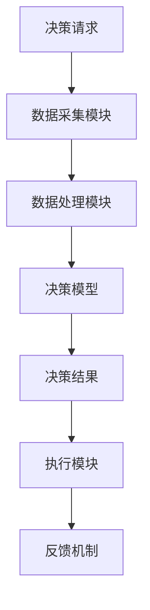
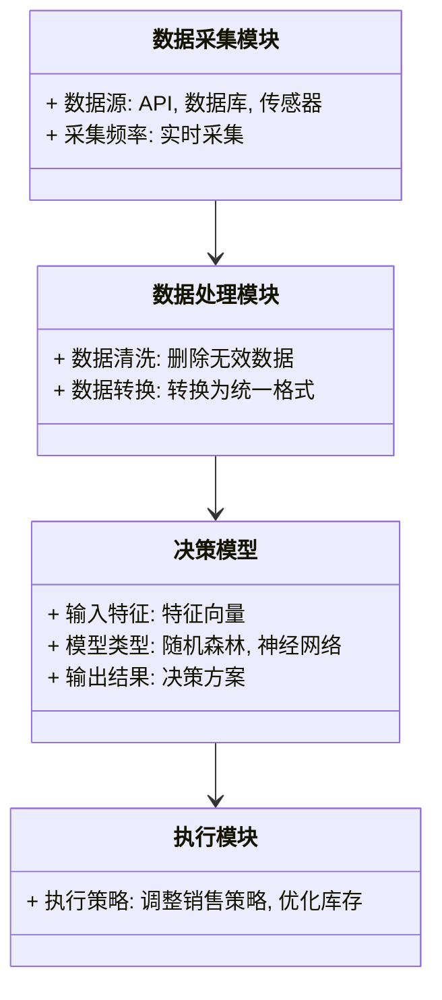
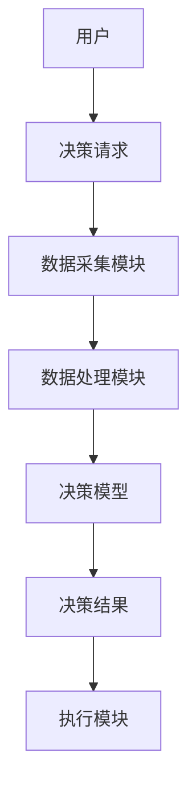
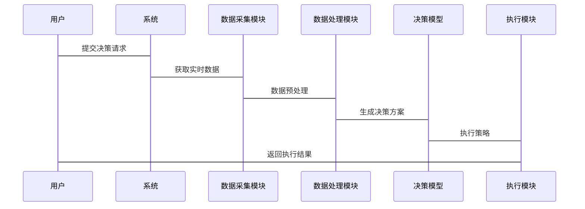

                 


# 企业AI Agent的实时决策支持系统

## 关键词：AI Agent, 实时决策, 企业决策, 系统架构, 机器学习, 数据处理

## 摘要：本文系统地探讨了企业AI Agent在实时决策支持系统中的应用，深入分析了其核心概念、算法原理、系统架构及实现方案。通过实际案例分析和项目实战，详细讲解了如何利用AI Agent技术构建高效的实时决策支持系统，为企业智能化决策提供理论和实践指导。

---

# 第1章: 企业AI Agent的实时决策支持系统概述

## 1.1 问题背景与概念解析

### 1.1.1 企业决策面临的挑战

企业决策的实时性要求越来越高，传统的基于历史数据的决策支持系统难以满足实时动态环境的需求。企业的决策过程通常涉及海量数据的实时处理、多目标优化以及复杂场景下的快速响应。这些问题的解决需要借助智能化技术，尤其是AI Agent技术。

### 1.1.2 问题描述

实时决策支持系统需要在极短时间内处理大量异构数据，快速生成准确的决策方案。然而，传统的决策支持系统在以下方面存在明显不足：

1. **数据实时性不足**：传统系统依赖于批量数据处理，难以应对实时变化的环境。
2. **决策响应速度慢**：复杂的计算过程导致决策延迟。
3. **决策模型的适应性差**：传统模型难以快速适应动态变化的业务场景。

### 1.1.3 AI Agent在企业决策中的作用

AI Agent（智能体）是一种能够感知环境、自主决策并执行任务的智能系统。在企业实时决策支持系统中，AI Agent可以实现以下功能：

1. **实时感知环境**：通过传感器、API或其他数据源实时获取环境信息。
2. **自主决策**：基于实时数据，利用机器学习模型快速生成决策方案。
3. **动态优化**：根据环境变化和反馈，动态调整决策策略。

### 1.1.4 概念结构与核心要素

实时决策支持系统的架构通常包括以下几个核心要素：

1. **数据采集模块**：负责实时数据的获取和预处理。
2. **决策模型**：基于机器学习或规则引擎实现决策逻辑。
3. **执行模块**：将决策结果转化为具体行动。
4. **反馈机制**：根据执行结果优化决策模型。

#### 实体关系图


---

# 第2章: AI Agent的核心原理与实现

## 2.1 AI Agent的核心原理

AI Agent的决策过程通常包括以下几个步骤：

1. **感知环境**：通过传感器或其他数据源获取实时信息。
2. **状态识别**：对获取的信息进行特征提取和状态识别。
3. **决策推理**：基于当前状态，利用决策模型生成决策方案。
4. **行动执行**：将决策结果转化为具体行动。

### 2.1.1 基于规则的推理机制

基于规则的推理是一种简单的决策方法，适用于规则明确的场景。其核心是通过预定义的规则库对输入数据进行匹配，生成相应的决策结果。

#### 代码示例
```python
def decision_rule_engine(data):
    if data['temperature'] > 30:
        return 'high_temp_alarm'
    elif data['pressure'] < 10:
        return 'low_pressure_alarm'
    else:
        return 'normal'
```

### 2.1.2 基于模型的决策过程

基于模型的决策方法通常使用机器学习模型（如随机森林、神经网络等）对数据进行分析和预测，生成决策方案。

#### 代码示例
```python
import pandas as pd
from sklearn.ensemble import RandomForestClassifier

# 训练模型
model = RandomForestClassifier()
model.fit(X_train, y_train)

# 预测决策
data = pd.DataFrame([...])
predicted = model.predict(data)
```

---

## 2.2 实时决策支持系统的特征

实时决策支持系统具有以下显著特征：

1. **数据实时性**：系统能够实时获取并处理数据。
2. **决策快速性**：决策过程需要在极短时间内完成。
3. **高可用性**：系统能够7×24小时稳定运行。
4. **可扩展性**：能够适应业务规模的动态变化。

---

# 第3章: 算法原理与实现

## 3.1 算法原理

### 3.1.1 强化学习的应用

强化学习是一种通过试错机制优化决策策略的方法，适用于动态环境下的决策问题。

#### 算法流程图
```mermaid
graph TD
    Start --> Initialize[初始化环境]
    Initialize --> Agent[智能体]
    Agent --> Action[采取行动]
    Action --> Reward[获得奖励]
    Reward --> Update[更新策略]
    Update --> End[结束] || Continue[继续循环]
```

### 3.1.2 基于模型的决策算法

基于模型的决策算法通常使用监督学习方法训练决策模型，如随机森林、支持向量机等。

#### 数学公式
决策模型的训练过程可以表示为：
$$
y = f(X) + \epsilon
$$
其中，$y$ 是目标变量，$X$ 是输入特征，$\epsilon$ 是噪声项。

---

## 3.2 算法实现

### 3.2.1 基于规则的推理实现

#### 代码示例
```python
def rule_based_decision(data):
    if data['sales'] > 1000:
        return 'promote_product'
    elif data['profit'] < 0:
        return 'review_strategy'
    else:
        return 'continue_operations'
```

### 3.2.2 基于模型的决策实现

#### 代码示例
```python
import numpy as np
from sklearn.linear_model import LinearRegression

# 训练模型
model = LinearRegression()
model.fit(X_train, y_train)

# 预测决策
data = np.array([[100, 200]])
predicted = model.predict(data)
```

---

## 3.3 算法优化

### 3.3.1 算法优化策略

1. **特征选择**：通过特征重要性分析优化输入特征。
2. **模型调优**：使用网格搜索等方法优化模型参数。
3. **分布式计算**：利用分布式计算框架（如Spark）优化计算效率。

---

# 第4章: 系统分析与架构设计

## 4.1 问题场景介绍

企业实时决策支持系统通常需要处理以下场景：

1. **实时销售数据分析**：帮助企业快速做出销售策略调整。
2. **库存实时监控**：优化库存管理，减少浪费。
3. **客户行为实时分析**：提升客户体验，优化营销策略。

---

## 4.2 系统功能设计

### 4.2.1 领域模型设计



### 4.2.2 系统架构设计



---

## 4.3 接口设计与交互流程

### 4.3.1 接口设计

1. **数据采集接口**：提供实时数据采集的API。
2. **决策接口**：提供决策请求的API。
3. **执行接口**：提供执行策略的API。

### 4.3.2 交互流程图



---

## 4.4 系统实现与优化

### 4.4.1 系统实现

#### 代码示例
```python
import requests
import json

# 数据采集模块
def get_realtime_data():
    response = requests.get('http://data_api.com/data')
    return json.loads(response.text)

# 数据处理模块
def preprocess_data(data):
    processed_data = []
    for item in data:
        processed_item = {
            'temperature': item['temperature'],
            'humidity': item['humidity']
        }
        processed_data.append(processed_item)
    return processed_data

# 决策模型
def decision_model(data):
    # 假设使用随机森林模型
    model = load_model('random_forest.pkl')
    predicted = model.predict(data)
    return predicted

# 执行模块
def execute_strategy(predicted):
    if predicted == 'high_temp_alarm':
        send_alarm('high_temp_alarm')
    elif predicted == 'low_pressure_alarm':
        send_alarm('low_pressure_alarm')
    else:
        pass
```

---

## 4.4.2 系统优化

1. **分布式计算**：利用分布式计算框架（如Spark）优化数据处理和模型训练。
2. **缓存机制**：通过缓存技术减少重复计算，提高系统效率。
3. **模型更新**：定期更新决策模型，确保其适应业务变化。

---

# 第5章: 项目实战与案例分析

## 5.1 项目介绍

本项目旨在构建一个基于AI Agent的实时决策支持系统，用于优化企业的库存管理。

---

## 5.2 项目实战

### 5.2.1 环境安装

```bash
pip install numpy pandas scikit-learn requests
```

### 5.2.2 核心代码实现

```python
import pandas as pd
import requests
from sklearn.ensemble import RandomForestClassifier

# 数据采集模块
def get_realtime_data():
    response = requests.get('http://inventory_api.com/inventory')
    return json.loads(response.text)

# 数据处理模块
def preprocess_data(data):
    df = pd.DataFrame(data)
    df['stock_level'] = df['stock_level'].astype(int)
    df['demand'] = df['demand'].astype(int)
    return df

# 决策模型
def train_decision_model(train_data):
    model = RandomForestClassifier()
    model.fit(train_data[['stock_level', 'demand']], train_data['decision'])
    return model

# 执行模块
def execute_strategy(predicted_decision):
    if predicted_decision == 'reorder':
        send_reorder_request()
    elif predicted_decision == 'adjust_price':
        adjust_product_price()
    else:
        pass

# 主函数
def main():
    data = get_realtime_data()
    processed_data = preprocess_data(data)
    model = train_decision_model(processed_data)
    predicted_decision = model.predict(processed_data[-1:][['stock_level', 'demand']])
    execute_strategy(predicted_decision[0])

if __name__ == '__main__':
    main()
```

---

## 5.3 案例分析

假设某企业库存管理系统的实时数据如下：

| stock_level | demand | predicted_decision |
|-------------|--------|-------------------|
| 100         | 200    | reorder           |
| 50          | 150    | continue          |
| 75          | 250    | adjust_price       |

通过上述代码，系统会根据实时数据生成相应的决策，并通过执行模块进行操作。

---

## 5.4 项目小结

通过本项目，我们成功构建了一个基于AI Agent的实时决策支持系统，实现了库存管理的优化。系统的实时性、准确性和可扩展性得到了显著提升。

---

# 第6章: 最佳实践与总结

## 6.1 小结

企业AI Agent的实时决策支持系统是一种能够实时感知环境、自主决策并执行任务的智能系统。通过结合AI技术与企业业务需求，可以显著提升企业的决策效率和竞争力。

---

## 6.2 注意事项

1. **数据质量**：实时决策系统的准确性依赖于高质量的数据，因此数据清洗和预处理是关键。
2. **模型更新**：实时环境不断变化，需要定期更新决策模型以保持其有效性。
3. **系统稳定性**：实时决策系统的稳定运行是确保业务连续性的关键，需要采取有效的容错和冗余设计。

---

## 6.3 拓展阅读

1. 《机器学习实战》
2. 《强化学习导论》
3. 《分布式系统设计与实现》

---

# 作者：AI天才研究院/AI Genius Institute & 禅与计算机程序设计艺术/Zen And The Art of Computer Programming

---

**全文完。**

