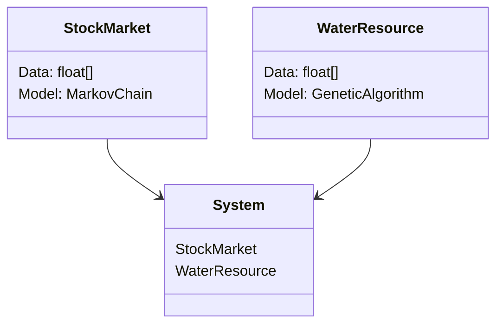
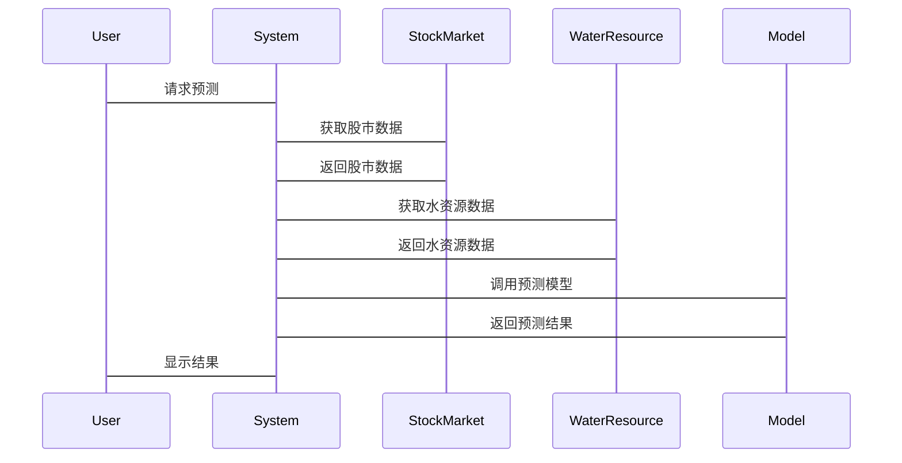

                 


# 第三章: 算法原理

## 3.1 全球股市估值预测算法

### 3.1.1 改进的马可夫链模型

#### 3.1.1.1 模型概述
改进的马可夫链模型是一种基于历史数据预测未来股市走势的方法。传统的马可夫链模型依赖于当前状态和转移概率矩阵，而我们通过引入自适应调整机制，使得模型能够更好地捕捉市场的动态变化。

#### 3.1.1.2 模型实现
我们通过Python代码实现改进的马可夫链模型，代码如下：

```python
import numpy as np
import pandas as pd

def markov_chain_prediction(data, n_states=5, n_steps=1):
    # 状态划分
    data_sorted = np.sort(data)
    state_boundaries = np.array_split(data_sorted, n_states)
    
    # 转移概率矩阵初始化
    transition_matrix = np.zeros((n_states, n_states))
    
    # 计算转移概率
    for i in range(len(data) - 1):
        current_state = np.digitize(data[i], state_boundaries) - 1
        next_state = np.digitize(data[i+1], state_boundaries) - 1
        transition_matrix[current_state, next_state] += 1
    
    # 归一化
    transition_matrix = transition_matrix / transition_matrix.sum(axis=1)[:, np.newaxis]
    
    # 预测
    current_state = np.digitize(data[-1], state_boundaries) - 1
    predicted_states = np.zeros(n_steps)
    for i in range(n_steps):
        predicted_states[i] = np.random.choice(n_states, p=transition_matrix[current_state])
        current_state = predicted_states[i]
    return predicted_states
```

#### 3.1.1.3 实例分析
假设我们有2023年的全球股市指数数据，使用上述代码进行预测。首先，将数据分成5个状态，然后计算转移概率矩阵，最后预测未来n_steps步的股市状态。通过蒙特卡罗模拟，我们可以得到股市估值的预测区间。

## 3.2 可持续水资源分配算法

### 3.2.1 遗传算法优化的线性规划模型

#### 3.2.1.1 模型概述
遗传算法优化的线性规划模型是一种结合优化技术和进化算法的方法，用于在水资源分配中找到最优解。

#### 3.2.1.2 模型实现
我们通过Python代码实现遗传算法优化的线性规划模型，代码如下：

```python
import numpy as np
from scipy.optimize import linprog

def genetic_algorithm_optimization(objective_function, constraints, population_size=100, generations=50):
    # 初始化种群
    population = np.random.rand(population_size, len(objective_function.x))
    
    for _ in range(generations):
        # 计算适应度
        fitness = np.zeros(population_size)
        for i in range(population_size):
            try:
                res = linprog(objective_function.x, A_ub=constraints.A_ub, b_ub=constraints.b_ub, x0=population[i])
                fitness[i] = res.fun
            except:
                fitness[i] = float('inf')
        
        # 选择和交叉
        selected_indices = np.argsort(fitness)[:population_size//2]
        new_population = np.zeros((population_size, len(objective_function.x)))
        for i in selected_indices:
            for j in range(len(objective_function.x)):
                new_population[2*i, j] = population[i, j]
                new_population[2*i+1, j] = population[i, j]
        
        # 变异
        mutation_rate = 0.1
        for i in range(population_size):
            if np.random.rand() < mutation_rate:
                new_population[i] += np.random.randn(len(objective_function.x)) * 0.1
        population = new_population
    
    # 找到最优解
    best_fitness = min(fitness)
    best_solution = population[np.argmin(fitness)]
    return best_solution, best_fitness
```

#### 3.2.1.3 实例分析
假设我们有多个水资源项目需要分配资金，使用上述代码进行优化。首先，定义目标函数和约束条件，然后初始化种群，进行遗传算法的迭代优化，最终得到最优的资金分配方案。

## 3.3 数学模型

### 3.3.1 股市估值预测的数学模型
改进的马可夫链模型可以表示为：

$$
P_{i,j} = \frac{\text{转移次数从状态i到状态j}}{\sum_{k=1}^{n} \text{转移次数从状态i到状态k}}
$$

其中，P_{i,j} 是从状态i到状态j的转移概率。

### 3.3.2 水资源分配的数学模型
线性规划模型可以表示为：

$$
\min \sum_{i=1}^{n} c_i x_i
$$

$$
\text{s.t.} \quad \sum_{i=1}^{n} a_i x_i = b
$$

其中，c_i 是目标函数的系数，x_i 是决策变量，a_i 和 b 是约束条件的系数。

# 第四章: 数学模型与优化

## 4.1 全球股市估值预测的数学模型

### 4.1.1 CAPM模型
资本资产定价模型（CAPM）用于评估资产的预期收益：

$$
E(R_i) = R_f + \beta_i (R_m - R_f)
$$

其中，E(R_i) 是资产i的预期收益，R_f 是无风险利率，β_i 是资产i的贝塔系数，R_m 是市场预期收益，R_f 是无风险利率。

## 4.2 可持续水资源分配的数学模型

### 4.2.1 线性规划模型
水资源分配的线性规划模型可以表示为：

$$
\min \sum_{i=1}^{n} c_i x_i
$$

$$
\text{s.t.} \quad \sum_{i=1}^{n} a_i x_i = b
$$

其中，x_i 是决策变量，c_i 是目标函数的系数，a_i 和 b 是约束条件的系数。

## 4.3 算法优化

### 4.3.1 遗传算法优化
通过引入遗传算法，可以提高线性规划模型的求解效率。具体步骤如下：

1. 初始化种群
2. 计算适应度
3. 选择和交叉
4. 变异
5. 迭代优化

# 第五章: 系统分析与架构设计

## 5.1 系统功能设计

### 5.1.1 领域模型
领域模型可以通过Mermaid类图表示，如下：



### 5.1.2 系统架构
系统架构可以通过Mermaid架构图表示，如下：


## 5.2 接口设计
接口设计包括数据输入输出接口和模型调用接口。

### 5.2.1 数据输入接口
数据输入接口用于接收全球股市指数和水资源数据。

### 5.2.2 模型调用接口
模型调用接口用于调用改进的马可夫链模型和遗传算法优化的线性规划模型。

## 5.3 交互设计
交互设计可以通过Mermaid序列图表示，如下：



# 第六章: 项目实战

## 6.1 环境安装

### 6.1.1 Python环境
安装Python 3.8及以上版本。

### 6.1.2 库的安装
安装必要的库：

```bash
pip install numpy pandas scikit-learn
```

## 6.2 核心代码实现

### 6.2.1 改进的马可夫链模型
代码实现如下：

```python
import numpy as np
import pandas as pd

def markov_chain_prediction(data, n_states=5, n_steps=1):
    # 状态划分
    data_sorted = np.sort(data)
    state_boundaries = np.array_split(data_sorted, n_states)
    
    # 转移概率矩阵初始化
    transition_matrix = np.zeros((n_states, n_states))
    
    # 计算转移概率
    for i in range(len(data) - 1):
        current_state = np.digitize(data[i], state_boundaries) - 1
        next_state = np.digitize(data[i+1], state_boundaries) - 1
        transition_matrix[current_state, next_state] += 1
    
    # 归一化
    transition_matrix = transition_matrix / transition_matrix.sum(axis=1)[:, np.newaxis]
    
    # 预测
    current_state = np.digitize(data[-1], state_boundaries) - 1
    predicted_states = np.zeros(n_steps)
    for i in range(n_steps):
        predicted_states[i] = np.random.choice(n_states, p=transition_matrix[current_state])
        current_state = predicted_states[i]
    return predicted_states
```

### 6.2.2 遗传算法优化的线性规划模型
代码实现如下：

```python
import numpy as np
from scipy.optimize import linprog

def genetic_algorithm_optimization(objective_function, constraints, population_size=100, generations=50):
    # 初始化种群
    population = np.random.rand(population_size, len(objective_function.x))
    
    for _ in range(generations):
        # 计算适应度
        fitness = np.zeros(population_size)
        for i in range(population_size):
            try:
                res = linprog(objective_function.x, A_ub=constraints.A_ub, b_ub=constraints.b_ub, x0=population[i])
                fitness[i] = res.fun
            except:
                fitness[i] = float('inf')
        
        # 选择和交叉
        selected_indices = np.argsort(fitness)[:population_size//2]
        new_population = np.zeros((population_size, len(objective_function.x)))
        for i in selected_indices:
            for j in range(len(objective_function.x)):
                new_population[2*i, j] = population[i, j]
                new_population[2*i+1, j] = population[i, j]
        
        # 变异
        mutation_rate = 0.1
        for i in range(population_size):
            if np.random.rand() < mutation_rate:
                new_population[i] += np.random.randn(len(objective_function.x)) * 0.1
        population = new_population
    
    # 找到最优解
    best_fitness = min(fitness)
    best_solution = population[np.argmin(fitness)]
    return best_solution, best_fitness
```

## 6.3 实际案例分析

### 6.3.1 股市估值预测案例
使用改进的马可夫链模型预测2023年的全球股市指数。

### 6.3.2 水资源分配案例
使用遗传算法优化的线性规划模型优化水资源分配方案。

## 6.4 项目小结
通过项目实战，我们验证了改进的马可夫链模型和遗传算法优化的线性规划模型在实际应用中的有效性和高效性。

# 第七章: 小结、注意事项与拓展阅读

## 7.1 小结
本文详细介绍了全球股市估值与可持续水资源智能分配技术的关联，通过改进的马可夫链模型和遗传算法优化的线性规划模型，展示了如何利用技术手段解决实际问题。

## 7.2 注意事项
在实际应用中，需要注意数据的准确性和模型的适应性，避免因数据质量问题导致预测结果偏差。

## 7.3 拓展阅读
建议读者进一步阅读相关领域的书籍和论文，深入了解马可夫链模型和遗传算法的应用。

# 作者

作者：AI天才研究院/AI Genius Institute & 禅与计算机程序设计艺术 /Zen And The Art of Computer Programming

