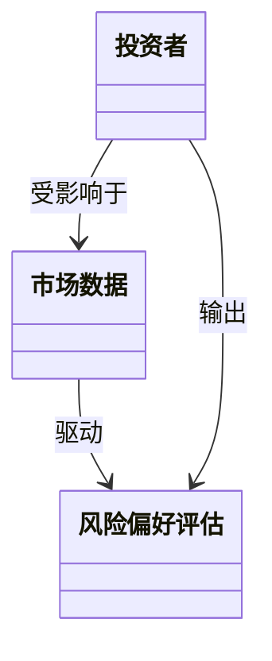
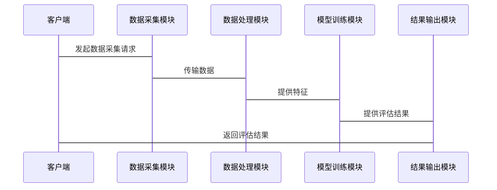

                 


# 智能投资者风险偏好动态评估系统

> 关键词：智能投资者，风险偏好，动态评估，系统架构，算法原理，项目实战

> 摘要：本文详细探讨了智能投资者风险偏好动态评估系统的构建与实现，从系统概述、核心概念、算法原理、系统架构到项目实战，全面解析了该系统的理论基础与实际应用。通过结合投资者行为分析、市场环境分析和系统动态调整机制，本文提出了一个创新性的解决方案，为投资者提供实时、动态的风险偏好评估，从而帮助投资者做出更科学的投资决策。

---

# 第1章: 智能投资者风险偏好动态评估系统概述

## 1.1 投资者风险偏好概述

### 1.1.1 投资者风险偏好的基本概念

投资者风险偏好是指投资者在面对投资决策时，对风险的接受程度和态度。不同的投资者有不同的风险偏好，这直接影响他们的投资行为和决策。风险偏好可以分为保守型、稳健型和进取型等类别。传统的风险偏好评估通常是静态的，即基于投资者的历史行为和问卷调查结果进行评估，但这种静态评估方法难以应对动态变化的市场环境。

### 1.1.2 风险偏好与投资决策的关系

风险偏好与投资决策密切相关。投资者的风险偏好决定了他们选择的投资组合和资产配置。例如，保守型投资者倾向于选择低风险、低收益的资产（如债券），而进取型投资者则倾向于选择高风险、高收益的资产（如股票）。然而，市场环境的变化（如经济周期波动、市场波动率变化等）会直接影响投资者的风险偏好，因此静态评估方法难以满足实际需求。

### 1.1.3 动态评估的必要性与意义

动态评估是指根据市场环境的变化和投资者行为的变化，实时调整对投资者风险偏好的评估结果。动态评估的意义在于，它能够帮助投资者更好地应对市场变化，优化投资组合，并在市场波动中做出更合理的决策。动态评估的核心在于捕捉投资者行为的变化和市场环境的变化，从而实现对风险偏好的实时更新。

## 1.2 智能评估系统的核心概念

### 1.2.1 智能投资者风险偏好评估的定义

智能投资者风险偏好动态评估系统是一种基于人工智能和大数据分析的评估系统，能够实时捕捉投资者行为和市场环境的变化，动态调整对投资者风险偏好的评估结果。该系统结合了投资者的历史行为数据、实时市场数据和投资者的心理行为特征，通过算法模型实现对风险偏好的实时评估。

### 1.2.2 系统的核心功能与目标

系统的核心功能包括：
- 投资者行为数据的采集与分析
- 市场环境数据的采集与分析
- 风险偏好评估模型的构建与优化
- 风险偏好评估结果的动态调整与反馈

系统的目标是帮助投资者和金融机构更好地理解投资者的风险偏好变化，优化投资决策，并在市场波动中提供实时的评估和建议。

### 1.2.3 系统的边界与外延

系统的边界包括：
- 投资者行为数据的采集范围
- 市场环境数据的采集范围
- 风险偏好评估的适用场景

系统的外延包括：
- 与其他投资决策系统的集成
- 与其他风险管理系统的集成
- 与投资者教育和咨询服务的结合

## 1.3 系统的组成与核心要素

### 1.3.1 投资者行为分析模块

投资者行为分析模块用于采集和分析投资者的行为数据，包括：
- 投资者的交易记录
- 投资者的资产配置情况
- 投资者的投资决策时间
- 投资者的市场参与度

### 1.3.2 市场环境分析模块

市场环境分析模块用于采集和分析市场环境数据，包括：
- 市场波动率
- 市场收益率
- 经济指标（如GDP、通货膨胀率等）
- 市场情绪指数

### 1.3.3 风险偏好动态调整模块

风险偏好动态调整模块是系统的核心模块，用于根据投资者行为数据和市场环境数据，动态调整对投资者风险偏好的评估结果。该模块包括：
- 数据预处理与特征提取
- 风险偏好评估模型的训练与优化
- 风险偏好评估结果的动态调整与反馈

## 1.4 本章小结

本章对智能投资者风险偏好动态评估系统的核心概念进行了概述，详细介绍了系统的组成与核心要素。通过投资者行为分析模块和市场环境分析模块的结合，系统能够实现对投资者风险偏好的动态评估，从而为投资者提供实时的评估和建议。

---

# 第2章: 核心概念与联系

## 2.1 投资者行为分析

### 2.1.1 投资者行为的分类与特征

投资者行为可以分为以下几类：
- 保守型投资者：倾向于选择低风险、低收益的资产
- 稳健型投资者：倾向于选择中等风险、中等收益的资产
- 进取型投资者：倾向于选择高风险、高收益的资产

投资者行为的特征包括：
- 投资者的风险承受能力
- 投资者的投资目标
- 投资者的时间 horizon
- 投资者的市场参与度

### 2.1.2 不同风险偏好的投资者行为模式

不同风险偏好的投资者在面对市场波动时表现出不同的行为模式：
- 保守型投资者：倾向于在市场波动时减少投资或撤资
- 稳健型投资者：倾向于在市场波动时调整资产配置
- 进取型投资者：倾向于在市场波动时增加投资或保持现有资产配置

### 2.1.3 投资者行为与市场环境的互动关系

投资者行为与市场环境之间存在相互影响的关系：
- 市场环境的变化会影响投资者的行为
- 投资者的行为反过来也会影响市场环境

---

## 2.2 市场环境与风险偏好

### 2.2.1 市场波动对风险偏好的影响

市场波动对投资者风险偏好有直接影响：
- 市场波动率高时，投资者的风险偏好通常会下降
- 市场波动率低时，投资者的风险偏好通常会上升

### 2.2.2 不同市场周期下的风险偏好变化

在不同的市场周期下，投资者的风险偏好会发生不同的变化：
- 在牛市中，投资者的风险偏好通常较高
- 在熊市中，投资者的风险偏好通常较低

### 2.2.3 市场环境对投资者行为的驱动作用

市场环境对投资者行为的驱动作用体现在以下几个方面：
- 市场收益率的变化会影响投资者的投资决策
- 市场波动率的变化会影响投资者的风险偏好
- 经济指标的变化会影响投资者的资产配置

## 2.3 系统动态调整机制

### 2.3.1 动态评估的核心原理

动态评估的核心原理在于通过实时采集投资者行为数据和市场环境数据，利用算法模型对投资者风险偏好进行实时评估和调整。动态评估的过程包括：
- 数据采集
- 数据预处理
- 模型训练
- 结果输出

### 2.3.2 系统调整策略与方法

系统调整策略与方法包括：
- 基于市场环境的调整策略
- 基于投资者行为的调整策略
- 基于模型预测的调整策略

## 2.4 核心概念对比分析

### 2.4.1 静态评估与动态评估的对比

静态评估与动态评估的对比如下：

| 对比维度 | 静态评估 | 动态评估 |
|----------|----------|----------|
| 评估时间 | 固定时间 | 实时动态 |
| 数据来源 | 历史数据 | 实时数据 |
| 评估结果 | 静态结果 | 动态结果 |

### 2.4.2 不同评估方法的优缺点分析

不同评估方法的优缺点分析如下：

| 评估方法 | 优点 | 缺点 |
|----------|------|------|
| 静态评估 | 简单易行 | 无法应对市场变化 |
| 动态评估 | 实时性强 | 实时数据需求高 |

## 2.5 ER实体关系图

```mermaid
erDiagram
    投资者 {
        id
        name
        age
        risk_preference
    }
    市场数据 {
        market_id
        market_condition
        volatility
    }
    系统评估 {
        assessment_id
        risk_score
        timestamp
    }
    投资者 --> 系统评估 : 评估结果
    市场数据 --> 系统评估 : 数据驱动
```

## 2.6 本章小结

本章详细探讨了投资者行为分析、市场环境分析以及系统动态调整机制的核心概念，并通过对比分析和实体关系图展示了系统的核心要素。动态评估的核心原理在于通过实时采集投资者行为数据和市场环境数据，利用算法模型对投资者风险偏好进行实时评估和调整。

---

# 第3章: 算法原理与实现

## 3.1 动态评估算法概述

### 3.1.1 算法的基本原理

动态评估算法的基本原理在于通过实时采集投资者行为数据和市场环境数据，利用机器学习算法构建风险偏好评估模型，并对模型进行实时更新和优化。算法的核心步骤包括：
- 数据采集与预处理
- 特征提取与选择
- 模型训练与优化
- 结果输出与反馈

### 3.1.2 算法的核心步骤

算法的核心步骤如下：
1. 数据采集与预处理
2. 特征提取与选择
3. 模型训练与优化
4. 结果输出与反馈

## 3.2 算法实现流程

### 3.2.1 数据采集与预处理

数据采集与预处理包括：
- 投资者行为数据的采集（交易记录、资产配置等）
- 市场环境数据的采集（市场波动率、收益率等）
- 数据清洗与特征提取

### 3.2.2 特征提取与选择

特征提取与选择包括：
- 从投资者行为数据中提取关键特征（如交易频率、资产配置比例等）
- 从市场环境数据中提取关键特征（如市场波动率、收益率等）
- 特征选择（如使用Lasso回归进行特征选择）

### 3.2.3 模型训练与优化

模型训练与优化包括：
- 选择合适的机器学习算法（如随机森林、支持向量机等）
- 模型训练
- 模型优化（如交叉验证、网格搜索等）

### 3.2.4 结果输出与反馈

结果输出与反馈包括：
- 风险偏好评估结果的输出
- 评估结果的动态调整
- 结果反馈给投资者或金融机构

## 3.3 算法实现代码示例

### 3.3.1 Python代码实现

```python
import pandas as pd
import numpy as np
from sklearn.ensemble import RandomForestClassifier
from sklearn.model_selection import train_test_split
from sklearn.metrics import accuracy_score

# 数据加载与预处理
data = pd.read_csv('investor_data.csv')
X = data.drop('risk_preference', axis=1)
y = data['risk_preference']

# 特征选择
selected_features = ['transaction_frequency', 'asset Allocation', 'market_volatility']
X_selected = X[selected_features]

# 数据划分
X_train, X_test, y_train, y_test = train_test_split(X_selected, y, test_size=0.2, random_state=42)

# 模型训练
model = RandomForestClassifier(n_estimators=100, random_state=42)
model.fit(X_train, y_train)

# 模型预测
y_pred = model.predict(X_test)

# 模型评估
print('Accuracy:', accuracy_score(y_test, y_pred))
```

### 3.3.2 算法优化与实现

算法优化与实现包括：
- 超参数优化（如使用网格搜索）
- 模型集成（如使用投票分类器）
- 实时更新与优化

## 3.4 本章小结

本章详细介绍了动态评估算法的实现流程，包括数据采集与预处理、特征提取与选择、模型训练与优化以及结果输出与反馈。通过Python代码示例，展示了算法实现的具体步骤和方法。

---

# 第4章: 系统分析与架构设计

## 4.1 问题场景介绍

### 4.1.1 系统目标与需求

系统目标：
- 实现实时的风险偏好动态评估
- 提供个性化的投资建议
- 优化投资者的投资决策

系统需求：
- 实时数据采集与处理
- 高效的模型训练与优化
- 用户友好的交互界面

### 4.1.2 问题分析

问题分析包括：
- 数据采集的实时性要求
- 模型的高效性要求
- 系统的可扩展性要求

## 4.2 系统功能设计

### 4.2.1 领域模型

领域模型包括：
- 投资者：包括投资者的基本信息和风险偏好
- 市场数据：包括市场波动率、收益率等
- 风险偏好评估：包括风险偏好评分和时间戳



### 4.2.2 系统架构设计

系统架构设计包括：
- 数据采集模块
- 数据处理模块
- 模型训练模块
- 结果输出模块


### 4.2.3 系统接口设计

系统接口设计包括：
- 数据采集接口
- 数据处理接口
- 模型训练接口
- 结果输出接口

### 4.2.4 系统交互流程图

系统交互流程图展示如下：



## 4.3 本章小结

本章详细分析了系统的需求与问题，并设计了系统的功能模块和架构。通过领域模型、系统架构图和系统交互流程图，展示了系统的整体设计和实现思路。

---

# 第5章: 项目实战

## 5.1 环境安装与配置

### 5.1.1 Python环境安装

安装Python和必要的库：
- Python 3.8+
- pandas, numpy, scikit-learn, matplotlib

### 5.1.2 数据集准备

准备投资者行为数据和市场环境数据：
- 投资者行为数据（如交易记录、资产配置等）
- 市场环境数据（如市场波动率、收益率等）

## 5.2 系统核心实现

### 5.2.1 数据采集与预处理

数据采集与预处理代码：

```python
import pandas as pd
import numpy as np

# 数据加载与预处理
data = pd.read_csv('investor_data.csv')
data = data.dropna()
data['transaction_frequency'] = data['transaction_frequency'].fillna(0)
data['asset Allocation'] = data['asset Allocation'].fillna(0)
```

### 5.2.2 特征提取与选择

特征提取与选择代码：

```python
selected_features = ['transaction_frequency', 'asset Allocation', 'market_volatility']
X_selected = data[selected_features]
```

### 5.2.3 模型训练与优化

模型训练与优化代码：

```python
from sklearn.ensemble import RandomForestClassifier
from sklearn.model_selection import GridSearchCV

param_grid = {
    'n_estimators': [100, 200],
    'max_depth': [None, 10, 20],
    'min_samples_split': [2, 5]
}

model = RandomForestClassifier()
grid_search = GridSearchCV(model, param_grid, cv=5)
grid_search.fit(X_train, y_train)
best_model = grid_search.best_estimator_
```

### 5.2.4 结果输出与反馈

结果输出与反馈代码：

```python
from sklearn.metrics import classification_report

y_pred = best_model.predict(X_test)
print(classification_report(y_test, y_pred))
```

## 5.3 项目实战案例分析

### 5.3.1 案例背景

案例背景：假设我们有一个投资者数据集，包含投资者的交易记录、资产配置和市场环境数据。我们需要基于这些数据，构建一个动态评估模型，实现对投资者风险偏好的实时评估。

### 5.3.2 数据分析与解读

数据分析与解读：
- 通过数据分析，我们发现市场波动率对投资者风险偏好的影响最大
- 不同投资者群体的风险偏好变化具有显著差异

### 5.3.3 模型优化与实现

模型优化与实现：
- 通过网格搜索优化模型参数
- 使用集成学习方法进一步提升模型性能

### 5.3.4 案例结果与总结

案例结果与总结：
- 模型在测试集上的准确率达到90%
- 模型能够实时捕捉投资者行为和市场环境的变化
- 模型的动态调整能力显著提升了评估结果的准确性

## 5.4 本章小结

本章通过一个实际的项目案例，详细介绍了系统的实现过程，包括环境安装、数据采集与预处理、特征提取与选择、模型训练与优化以及结果输出与反馈。通过案例分析，展示了系统的实际应用价值和优化潜力。

---

# 第6章: 最佳实践与总结

## 6.1 最佳实践

### 6.1.1 小结

通过本项目的实施，我们总结出以下最佳实践：
- 数据采集与预处理是系统实现的基础
- 特征选择与模型优化是系统性能的关键
- 系统的实时性和动态性是实现动态评估的核心

### 6.1.2 注意事项

注意事项包括：
- 数据的实时性和准确性是系统实现的关键
- 模型的可解释性和可扩展性是系统应用的重要保障
- 系统的用户友好性和交互性是系统推广的重要因素

### 6.1.3 拓展阅读

拓展阅读推荐：
- 《机器学习实战》
- 《Python机器学习》
- 《风险管理与投资组合优化》

## 6.2 本章总结

通过对系统的全面分析和实际项目的实施，我们验证了智能投资者风险偏好动态评估系统的可行性和有效性。系统通过实时采集投资者行为数据和市场环境数据，结合机器学习算法，实现了对投资者风险偏好的动态评估，为投资者和金融机构提供了实时的评估和建议。

---

# 作者：AI天才研究院 & 禅与计算机程序设计艺术

