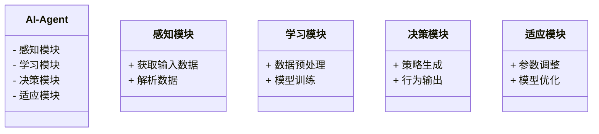
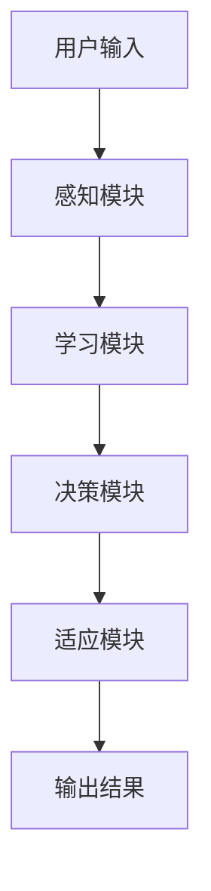
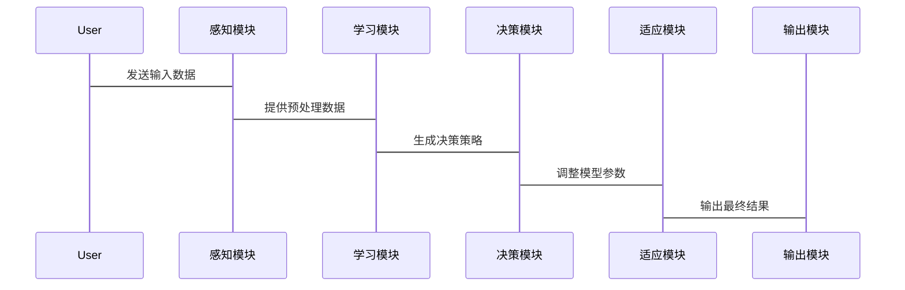

                 


# 构建AI Agent的实时学习与适应机制

---

## 关键词：
AI Agent、实时学习、自适应机制、在线学习算法、系统架构设计、动态调整

---

## 摘要：
本文详细探讨了构建AI Agent的实时学习与适应机制的核心概念、算法原理和系统架构设计。首先，我们介绍了AI Agent的基本概念及其在实时学习和自适应机制中的重要性。接着，我们深入分析了实时学习与自适应机制的算法原理，包括在线学习算法和自适应算法的设计与实现。然后，我们通过系统架构设计和项目实战案例，展示了如何将这些机制应用于实际场景中。最后，我们总结了构建高效AI Agent实时学习与适应机制的最佳实践和未来研究方向。

---

# 第一部分: AI Agent的实时学习与适应机制背景介绍

## 第1章: AI Agent概述

### 1.1 AI Agent的基本概念
#### 1.1.1 AI Agent的定义
AI Agent（人工智能代理）是指能够感知环境、自主决策并执行任务的智能实体。它可以是一个软件程序、机器人或其他智能系统，其核心目标是通过与环境交互来实现特定任务。

#### 1.1.2 AI Agent的核心属性
- **自主性**：能够在没有外部干预的情况下自主决策。
- **反应性**：能够实时感知环境变化并做出反应。
- **目标导向性**：具有明确的目标，并通过行动实现这些目标。
- **学习能力**：能够通过经验或数据改进自身的性能。

#### 1.1.3 AI Agent的分类与应用场景
AI Agent可以根据功能和应用场景分为以下几类：
- **简单反射型Agent**：基于当前输入做出固定反应。
- **基于模型的反射型Agent**：利用内部模型来规划和决策。
- **目标驱动型Agent**：通过目标驱动行为。
- **实用驱动型Agent**：通过效用函数优化决策。

应用场景包括自动驾驶、智能助手、推荐系统、机器人控制等。

### 1.2 实时学习与适应机制的背景
#### 1.2.1 当前AI Agent面临的挑战
- **动态环境适应**：在不断变化的环境中保持高性能。
- **实时决策需求**：需要在极短时间内做出准确决策。
- **数据稀疏性**：在某些场景中，数据可能非常稀疏，难以直接应用传统机器学习方法。

#### 1.2.2 实时学习与适应的重要性
- **提高决策效率**：通过实时学习，AI Agent可以在动态环境中快速调整策略。
- **增强适应能力**：自适应机制使AI Agent能够应对未知挑战。
- **提升用户体验**：实时调整行为以满足用户需求。

#### 1.2.3 问题背景与目标设定
本文将重点探讨如何构建AI Agent的实时学习与适应机制，解决动态环境中的实时决策问题。

### 1.3 本章小结
本章介绍了AI Agent的基本概念、核心属性及其分类，重点突出了实时学习与适应机制的重要性，并明确了本文的研究目标。

---

# 第二部分: AI Agent实时学习与适应的核心概念

## 第2章: 实时学习机制

### 2.1 实时学习的基本原理
#### 2.1.1 实时学习的核心流程
实时学习的核心流程包括以下步骤：
1. **感知环境**：通过传感器或数据接口获取实时信息。
2. **数据处理**：对获取的数据进行预处理和特征提取。
3. **模型更新**：基于新的数据更新模型参数。
4. **决策输出**：根据更新后的模型生成实时决策。

#### 2.1.2 数据流与模型更新的关系
实时学习依赖于数据流的实时传输和模型的动态更新。模型更新的频率和速度直接影响AI Agent的实时性能。

#### 2.1.3 实时学习的数学模型
实时学习的数学模型通常基于在线学习算法，例如随机梯度下降（SGD）。其基本形式如下：
$$
\theta_{t+1} = \theta_t - \eta \nabla J(\theta_t)
$$
其中，$\theta_t$ 是模型参数，$\eta$ 是学习率，$J$ 是损失函数。

### 2.2 实时学习的关键算法
#### 2.2.1 在线学习算法概述
在线学习算法是一种能够在数据流中实时更新模型的算法。常见的在线学习算法包括随机梯度下降（SGD）、AdaGrad和Adam。

#### 2.2.2 常见的实时学习算法对比
| 算法名称 | 核心特点 | 优缺点 |
|----------|----------|--------|
| SGD      | 简单高效，适用于大规模数据 | 收敛速度较慢，易陷入鞍点 |
| AdaGrad  | 自适应学习率，适合稀疏数据 | 对初始参数敏感 |
| Adam     | 综合梯度矩量，收敛速度快 | 参数设置复杂 |

#### 2.2.3 算法选择的依据与优化
算法选择应考虑数据特性、计算资源和任务目标。优化方法包括学习率调整、动量引入和自适应批量归一化。

### 2.3 本章小结
本章详细探讨了实时学习的基本原理和关键算法，分析了不同算法的优缺点及适用场景。

---

## 第3章: 自适应机制

### 3.1 自适应机制的定义与特点
#### 3.1.1 自适应机制的核心概念
自适应机制是指AI Agent能够根据环境反馈动态调整自身行为的能力。其核心在于通过反馈环路实现持续优化。

#### 3.1.2 自适应与实时学习的区别与联系
自适应机制依赖于实时学习提供的模型更新能力，而实时学习则通过自适应机制实现动态调整。

#### 3.1.3 自适应机制的实现方式
自适应机制可以通过以下方式实现：
1. **基于反馈的自适应**：根据用户反馈调整模型参数。
2. **基于预测的自适应**：根据预测结果调整行为策略。
3. **混合自适应**：结合反馈和预测的双重信息进行调整。

### 3.2 自适应算法的设计与实现
#### 3.2.1 基于反馈的自适应算法
基于反馈的自适应算法通过用户反馈信号调整模型参数。例如，在推荐系统中，用户点击行为可以作为反馈信号，用于优化推荐算法。

#### 3.2.2 基于预测的自适应算法
基于预测的自适应算法通过预测环境变化调整模型行为。例如，在自动驾驶中，预测交通流量变化以优化路径规划。

#### 3.2.3 自适应算法的评估指标
自适应算法的评估指标包括：
- **收敛速度**：算法达到稳定状态的速度。
- **适应能力**：算法在动态环境中的调整能力。
- **性能提升**：算法优化后的效果提升幅度。

### 3.3 本章小结
本章分析了自适应机制的定义、特点及实现方式，探讨了基于反馈和预测的自适应算法，并提出了评估指标。

---

# 第三部分: AI Agent实时学习与适应的算法原理

## 第4章: 实时学习算法的数学模型

### 4.1 实时学习的基本数学模型
实时学习的数学模型主要基于在线优化方法。例如，随机梯度下降（SGD）的数学表达式为：
$$
\theta_{t+1} = \theta_t - \eta \nabla J(\theta_t)
$$
其中，$\nabla J$ 是损失函数的梯度，$\eta$ 是学习率。

### 4.2 常见实时学习算法的数学公式
#### 4.2.1 SGD算法的数学表达
$$
\theta_{t+1} = \theta_t - \eta \nabla J(\theta_t)
$$

#### 4.2.2 AdaGrad算法的数学推导
AdaGrad通过自适应学习率调整参数更新：
$$
\theta_{t+1} = \theta_t - \eta \frac{g_t}{\sqrt{s_t + \epsilon}}
$$
其中，$g_t$ 是梯度，$s_t$ 是累积梯度平方和，$\epsilon$ 是防止除零的小量。

#### 4.2.3 Adam算法的数学公式
Adam结合了动量和自适应学习率：
$$
m_t = \beta_1 m_{t-1} + (1-\beta_1)g_t
$$
$$
s_t = \beta_2 s_{t-1} + (1-\beta_2)g_t^2
$$
$$
\theta_{t+1} = \theta_t - \eta \frac{m_t}{\sqrt{s_t + \epsilon}}
$$

### 4.3 本章小结
本章通过数学公式详细分析了常见实时学习算法的原理和实现方式。

---

## 第5章: 自适应机制的算法实现

### 5.1 自适应算法的数学模型
自适应机制的数学模型通常基于反馈信号和预测模型。例如，用户反馈可以表示为：
$$
f(t) = \text{sign}(w_t^T x_t + b)
$$
其中，$w_t$ 是模型参数，$x_t$ 是输入数据，$b$ 是偏置项。

### 5.2 自适应算法的代码实现
以下是一个基于反馈的自适应算法的Python实现示例：

```python
def adaptive_algorithm(data_stream, initial_params):
    theta = initial_params
    for x, y in data_stream:
        # 计算梯度
        gradient = compute_gradient(theta, x, y)
        # 更新参数
        theta = theta - eta * gradient
    return theta
```

### 5.3 本章小结
本章通过数学模型和代码示例，详细讲解了自适应机制的实现方式。

---

# 第四部分: 系统分析与架构设计

## 第6章: 系统分析与架构设计

### 6.1 问题场景介绍
我们考虑一个智能助手的应用场景，AI Agent需要实时响应用户的查询并根据反馈调整推荐策略。

### 6.2 系统功能设计
#### 6.2.1 领域模型设计（Mermaid类图）


#### 6.2.2 功能模块划分
- **感知模块**：负责数据的获取和解析。
- **学习模块**：负责数据预处理和模型训练。
- **决策模块**：负责策略生成和行为输出。
- **适应模块**：负责参数调整和模型优化。

#### 6.2.3 功能交互流程设计


### 6.3 系统架构设计
#### 6.3.1 系统架构图（Mermaid架构图）


#### 6.3.2 关键模块的实现方式
- **感知模块**：使用队列结构处理实时数据流。
- **学习模块**：采用分布式计算框架加速训练。
- **决策模块**：基于强化学习算法生成策略。
- **适应模块**：通过在线优化算法动态调整模型参数。

#### 6.3.3 系统的可扩展性设计
系统采用模块化设计，各模块之间通过接口通信，便于功能扩展和性能优化。

### 6.4 系统接口设计
#### 6.4.1 接口定义与规范
- **输入接口**：定义数据格式和传输协议。
- **输出接口**：定义结果格式和反馈机制。

#### 6.4.2 接口的交互流程


#### 6.4.3 接口的安全性设计
- **数据加密**：对敏感数据进行加密处理。
- **权限控制**：基于角色的访问控制机制。

### 6.5 本章小结
本章通过系统架构设计和功能模块划分，详细介绍了AI Agent的实时学习与适应机制的实现方案。

---

# 第五部分: 项目实战与案例分析

## 第7章: 项目实战与案例分析

### 7.1 项目实战
#### 7.1.1 环境安装与配置
安装必要的库和框架，例如TensorFlow、Keras等。

#### 7.1.2 核心算法的实现
以下是一个基于实时学习的AI Agent实现示例：

```python
import tensorflow as tf
import numpy as np

class AI-Agent:
    def __init__(self, input_dim):
        self.model = self.build_model(input_dim)
    
    def build_model(self, input_dim):
        model = tf.keras.Sequential([
            tf.keras.layers.Dense(64, activation='relu', input_dim=input_dim),
            tf.keras.layers.Dense(1, activation='sigmoid')
        ])
        return model
    
    def update_model(self, x, y):
        with tf.GradientTape() as tape:
            prediction = self.model(x)
            loss = tf.keras.losses.binary_crossentropy(y, prediction)
        gradients = tape.gradient(loss, self.model.trainable_weights)
        self.optimizer.apply_gradients(zip(gradients, self.model.trainable_weights))

    def get_prediction(self, x):
        return self.model(x).numpy()
```

#### 7.1.3 代码的功能解读与优化
- **模型构建**：使用Keras构建深度神经网络模型。
- **模型更新**：基于梯度下降更新模型参数。
- **预测输出**：生成实时决策输出。

### 7.2 案例分析
#### 7.2.1 案例背景
考虑一个智能助手的应用场景，AI Agent需要实时响应用户的查询并根据反馈调整推荐策略。

#### 7.2.2 数据收集与预处理
- **数据来源**：用户输入、环境传感器数据等。
- **数据清洗**：去除噪声数据，提取有效特征。

#### 7.2.3 模型训练与优化
- **训练数据**：使用实时数据流进行在线训练。
- **模型评估**：通过准确率、召回率等指标评估模型性能。

#### 7.2.4 系统测试与验证
- **单元测试**：测试各模块功能是否正常。
- **集成测试**：测试系统整体性能。
- **压力测试**：测试系统在高负载下的表现。

### 7.3 本章小结
本章通过项目实战和案例分析，展示了如何将AI Agent的实时学习与适应机制应用于实际场景。

---

## 第8章: 最佳实践与总结

### 8.1 最佳实践
- **选择合适的算法**：根据任务需求选择合适的在线学习和自适应算法。
- **优化系统架构**：设计高效的系统架构以支持实时学习和自适应。
- **监控与调优**：实时监控系统性能，根据反馈进行优化。

### 8.2 小结
本文系统地探讨了构建AI Agent的实时学习与适应机制的核心概念、算法原理和系统架构设计。通过理论分析和实践案例，我们展示了如何实现高效的AI Agent。

### 8.3 注意事项
- **数据质量**：实时数据的质量直接影响模型性能。
- **计算资源**：实时学习需要高性能计算资源支持。
- **安全问题**：确保数据传输和存储的安全性。

### 8.4 拓展阅读
- 推荐阅读《机器学习实战》、《深度学习》等书籍，深入理解在线学习和自适应算法。

---

# 作者：AI天才研究院/AI Genius Institute & 禅与计算机程序设计艺术 /Zen And The Art of Computer Programming

---

