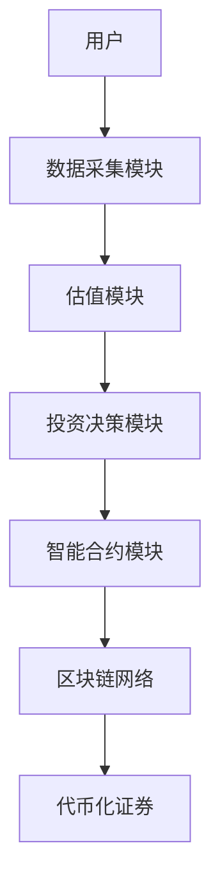

                 


# 格雷厄姆特价股票理论在代币化证券中的运用

> 关键词：格雷厄姆投资理论、代币化证券、区块链技术、价值投资、智能合约、安全边际

> 摘要：本文深入探讨格雷厄姆的价值投资理论在代币化证券中的应用，结合代币化证券的特点，分析如何利用格雷厄姆的“安全边际”和“内在价值”概念进行投资决策。文章从理论背景、代币化证券的基础知识、投资策略的结合、算法实现、系统架构设计到实际案例分析，全面阐述了格雷厄姆理论在代币化证券中的运用，为投资者提供了理论支持和实践指导。

---

## 第1章: 格雷厄姆特价股票理论的背景与核心概念

### 1.1 格雷厄姆特价股票理论的起源

#### 1.1.1 价值投资理念的提出

本杰明·格雷厄姆是价值投资的鼻祖，他在20世纪30年代提出了“安全边际”和“内在价值”等核心概念。他认为，市场波动性和投资者情绪会影响股票价格，但股票的真正价值应基于其基本面分析。格雷厄姆的价值投资理念强调以低于内在价值的价格买入股票，从而在市场波动中获得超额收益。

#### 1.1.2 格雷厄姆投资策略的核心思想

格雷厄姆的投资策略可以总结为以下几点：
1. **安全边际**：买入价格低于内在价值的股票，以确保投资的安全性。
2. **价值导向**：以企业的基本面分析为基础，寻找被市场低估的股票。
3. **长期持有**：避免频繁交易，长期持有优质股票以获得复利效应。

#### 1.1.3 特价股票的定义与特征

格雷厄姆提出的“特价股票”是指市场价格远低于内在价值的股票。这类股票通常具有以下特征：
- 低市盈率（P/E ratio）。
- 低市净率（P/B ratio）。
- 高股息率（Dividend Yield）。
- 公司基本面稳健，具有持续盈利能力。

### 1.2 格雷厄姆投资理论的核心概念

#### 1.2.1 市场先生与投资者的角色

格雷厄姆将市场比作“市场先生”，市场先生的情绪波动会导致股票价格的短期波动。投资者的任务是识别市场先生的错误定价，并利用这种错误进行投资。

#### 1.2.2 内在价值与市场价格的关系

内在价值是股票的真正价值，与市场先生的定价无关。格雷厄姆认为，投资者应关注企业的基本面，计算其内在价值，并在市场价格低于内在价值时进行投资。

#### 1.2.3 安全边际的概念与作用

安全边际是指内在价值与市场价格之间的差距。通过购买具有较大安全边际的股票，投资者可以降低投资风险，并在市场回归理性时获得收益。

### 1.3 格雷厄姆投资理论与现代金融学的联系

#### 1.3.1 传统金融学与价值投资的异同

传统金融学基于有效市场假说（EMH）认为，市场价格反映了所有可用信息，因此难以通过基本面分析获得超额收益。而格雷厄姆的价值投资理论则认为，市场并非总是有效，存在定价错误的机会。

#### 1.3.2 格雷厄姆理论在现代投资中的应用

现代投资者可以利用格雷厄姆的理论，结合量化分析工具，识别具有安全边际的股票。此外，价值投资理念也被广泛应用于指数基金和被动投资策略中。

#### 1.3.3 理论的局限性与改进方向

格雷厄姆理论的局限性在于其假设市场存在系统性错误，而实际上，市场可能已经较为有效。此外，格雷厄姆理论主要适用于传统股票投资，而对新兴的代币化证券领域缺乏直接指导。

---

## 第2章: 代币化证券的基本概念

### 2.1 代币化证券的定义与特点

#### 2.1.1 代币化证券的定义

代币化证券是指通过区块链技术将传统证券（如股票、债券等）转化为数字代币。每个代币代表一定的股权或债权，并可以在区块链网络上进行分割、转让和交易。

#### 2.1.2 代币化证券与传统证券的对比

| 特性                | 传统证券        | 代币化证券       |
|---------------------|-----------------|------------------|
| 交易效率            | 较低            | 高               |
| 成本                 | 较高            | 低               |
| 透明度              | 有限            | 高               |
| 分割性              | 不可分割        | 可分割           |
| 技术基础            | 传统金融系统    | 区块链技术       |

#### 2.1.3 代币化证券的优势与挑战

**优势**：
- **高效性**：区块链技术提高了交易效率，降低了交易成本。
- **透明性**：所有交易记录在区块链上，具有可追溯性。
- **可编程性**：通过智能合约实现自动化的分红、投票等功能。

**挑战**：
- **监管不确定性**：代币化证券的监管框架尚未完全明确。
- **技术风险**：区块链技术的安全性和稳定性仍需进一步验证。
- **市场接受度**：投资者对代币化证券的认知和接受度较低。

### 2.2 区块链技术在代币化证券中的应用

#### 2.2.1 区块链技术的基本原理

区块链是一种分布式账本技术，通过去中心化的方式记录交易数据。每个区块包含一定数量的交易记录，并通过哈希值链接形成链式结构，确保数据不可篡改。

#### 2.2.2 智能合约在代币化证券中的作用

智能合约是基于区块链的自动执行程序，用于管理代币化证券的发行、转让和分红等操作。通过智能合约，可以实现自动化的分红、投票和清算。

#### 2.2.3 代币化证券的发行与交易流程

1. **发行**：发行人通过智能合约发行代币化证券，记录在区块链上。
2. **交易**：投资者通过区块链钱包进行代币的买卖。
3. **结算**：交易完成后，区块链自动完成结算和交割。

### 2.3 代币化证券的市场现状与发展趋势

#### 2.3.1 全球代币化证券市场的现状

目前，全球代币化证券市场仍处于起步阶段，主要集中在加密货币领域。一些国家已经开始试点代币化证券的发行和交易，例如新加坡的STO（Security Token Offering）。

#### 2.3.2 代币化证券的主要应用场景

- **私募融资**：通过代币化证券进行私募股权融资。
- **证券发行**：将传统证券代币化，提高发行效率。
- **跨境投资**：利用区块链技术实现跨境证券的高效交易。

#### 2.3.3 未来发展趋势与潜在风险

**发展趋势**：
- **技术成熟**：区块链技术的进一步发展将推动代币化证券的普及。
- **监管完善**：各国监管机构将逐步完善代币化证券的法规框架。
- **市场扩大**：随着市场认知度的提高，代币化证券的市场规模将逐步扩大。

**潜在风险**：
- **技术风险**：区块链技术的安全性和稳定性仍需进一步验证。
- **市场波动**：代币化证券的价格可能受到市场情绪的影响而大幅波动。
- **监管风险**：政策变化可能对代币化证券市场产生重大影响。

---

## 第3章: 格雷厄姆特价股票理论在代币化证券中的核心分析

### 3.1 代币化证券的估值方法

#### 3.1.1 格雷厄姆估值法的核心步骤

格雷厄姆的估值法主要基于企业的基本面分析，包括以下几个步骤：
1. **计算内在价值**：通过现金流折现法（DCF）计算企业的内在价值。
2. **确定安全边际**：比较市场价格与内在价值，确保买入价格低于内在价值。
3. **长期持有**：持有股票直到市场价格回归内在价值或找到更好的投资机会。

#### 3.1.2 代币化证券的现金流折现法

**现金流折现法（DCF）**是一种常用的估值方法，通过预测企业未来现金流并将其折现为现值，以确定企业的内在价值。

**公式**：
$$
\text{内在价值} = \sum_{t=1}^{n} \frac{\text{现金流}_t}{(1 + r)^t} + \frac{\text{残值}}{(1 + r)^n}
$$
其中，$r$为折现率，$n$为预测期数。

### 3.2 代币化证券的现金流折现法

#### 3.2.1 代币化证券现金流的计算方法

代币化证券的现金流计算与传统股票类似，但需要考虑代币化证券的特殊性，例如代币的分割性和智能合约的执行情况。

#### 3.2.2 现金流折现法的优缺点

**优点**：
- **准确性**：DCF方法能够较为准确地反映企业的内在价值。
- **灵活性**：可以根据企业的具体情况调整预测参数。

**缺点**：
- **主观性**：预测未来现金流和折现率存在较大的主观性。
- **复杂性**：需要较高的计算能力和专业知识。

### 3.3 格雷厄姆投资策略在代币化证券中的应用

#### 3.3.1 格雷厄姆投资策略的适用性分析

格雷厄姆的投资策略主要适用于那些基本面稳定、具有安全边际的代币化证券。由于代币化证券市场的波动性较大，投资者需要更加谨慎地选择投资标的。

#### 3.3.2 代币化证券的安全边际计算

安全边际的计算公式为：
$$
\text{安全边际} = \text{内在价值} - \text{市场价格}
$$
投资者应选择安全边际较大的代币化证券进行投资。

#### 3.3.3 代币化证券的内在价值评估

内在价值的评估需要结合企业的基本面和代币化证券的特殊性。例如，需要考虑企业的盈利能力和代币的流动性。

### 3.4 代币化证券的投资策略

#### 3.4.1 价值投资策略

价值投资策略强调寻找被市场低估的代币化证券，通过长期持有获得超额收益。

#### 3.4.2 成长投资策略

成长投资策略关注具有高成长潜力的代币化证券，通过投资高增长企业实现资本增值。

#### 3.4.3 组合投资策略

组合投资策略通过分散投资降低风险，同时利用不同代币化证券的特性实现收益最大化。

---

## 第4章: 格雷厄姆理论在代币化证券中的算法实现

### 4.1 算法原理

#### 4.1.1 格雷厄姆估值算法

格雷厄姆估值算法的核心是通过现金流折现法计算企业的内在价值，并与市场价格进行比较，确定安全边际。

#### 4.1.2 内在价值计算的数学模型

$$
\text{内在价值} = \sum_{t=1}^{n} \frac{\text{现金流}_t}{(1 + r)^t} + \frac{\text{残值}}{(1 + r)^n}
$$

#### 4.1.3 算法实现的步骤

1. **数据收集**：收集目标企业的财务数据，包括现金流、营业收入、净利润等。
2. **参数设定**：确定折现率、预测期数和残值。
3. **内在价值计算**：根据公式计算企业的内在价值。
4. **安全边际计算**：比较内在价值与市场价格，计算安全边际。
5. **投资决策**：根据安全边际决定是否投资。

### 4.2 算法实现

#### 4.2.1 Python代码实现

```python
def calculate_intrinsic_value(cash_flows, discount_rate, residual_value):
    n = len(cash_flows)
    intrinsic_value = 0
    for t in range(n):
        cash_flow = cash_flows[t]
        present_value = cash_flow / (1 + discount_rate) ** t
        intrinsic_value += present_value
    present_value_residual = residual_value / (1 + discount_rate) ** n
    intrinsic_value += present_value_residual
    return intrinsic_value

# 示例数据
cash_flows = [100, 120, 150, 180]
discount_rate = 0.08
residual_value = 200

intrinsic_value = calculate_intrinsic_value(cash_flows, discount_rate, residual_value)
print("内在价值:", intrinsic_value)
```

#### 4.2.2 代码解读

上述代码实现了格雷厄姆估值法的核心步骤，包括现金流的折现计算和残值的折现计算。通过输入企业的现金流、折现率和残值，可以计算出企业的内在价值。

---

## 第5章: 格雷厄姆理论在代币化证券中的系统架构设计

### 5.1 系统功能设计

#### 5.1.1 系统功能模块

1. **数据采集模块**：收集企业的财务数据和市场数据。
2. **估值模块**：计算企业的内在价值和安全边际。
3. **投资决策模块**：根据安全边际和市场情况决定投资策略。
4. **智能合约模块**：实现代币化证券的发行、交易和结算。

#### 5.1.2 系统功能流程

1. **数据采集**：通过API获取企业的财务数据和市场数据。
2. **估值计算**：使用现金流折现法计算企业的内在价值。
3. **安全边际计算**：比较内在价值与市场价格，计算安全边际。
4. **投资决策**：根据安全边际和市场情况决定是否投资。
5. **智能合约执行**：通过智能合约实现代币化证券的发行和交易。

### 5.2 系统架构设计

#### 5.2.1 系统架构图



#### 5.2.2 接口设计

1. **数据采集模块接口**：
   - 输入：企业名称、财务数据。
   - 输出：企业财务数据。

2. **估值模块接口**：
   - 输入：现金流、折现率、残值。
   - 输出：内在价值、安全边际。

3. **智能合约模块接口**：
   - 输入：代币化证券参数。
   - 输出：代币化证券发行、交易结果。

---

## 第6章: 格雷厄姆理论在代币化证券中的项目实战

### 6.1 项目环境安装

#### 6.1.1 安装Python和相关库

```bash
pip install numpy pandas matplotlib
```

#### 6.1.2 安装区块链开发框架

```bash
pip install web3.py
```

### 6.2 核心代码实现

#### 6.2.1 现金流折现法实现

```python
import numpy as np

def calculate_intrinsic_value(cash_flows, discount_rate, residual_value):
    n = len(cash_flows)
    intrinsic_value = 0
    for t in range(n):
        cash_flow = cash_flows[t]
        present_value = cash_flow / (1 + discount_rate) ** t
        intrinsic_value += present_value
    present_value_residual = residual_value / (1 + discount_rate) ** n
    intrinsic_value += present_value_residual
    return intrinsic_value

# 示例数据
cash_flows = [100, 120, 150, 180]
discount_rate = 0.08
residual_value = 200

intrinsic_value = calculate_intrinsic_value(cash_flows, discount_rate, residual_value)
print("内在价值:", intrinsic_value)
```

#### 6.2.2 智能合约实现

```solidity
// SPDX-License-Identifier: MIT
pragma solidity ^0.8.0;

contract TokenizedSecurity {
    mapping(address => uint256) public balances;

    function mint(address to, uint256 amount) public {
        balances[to] += amount;
    }

    function transfer(address from, address to, uint256 amount) public {
        require(balances[from] >= amount, "Insufficient balance");
        balances[from] -= amount;
        balances[to] += amount;
    }
}
```

### 6.3 代码应用解读与分析

#### 6.3.1 现金流折现法的代码解读

上述Python代码实现了现金流折现法的核心计算，通过输入现金流和折现率，计算出企业的内在价值。该代码可以用于评估代币化证券的内在价值。

#### 6.3.2 智能合约的代码解读

上述Solidity代码定义了一个代币化证券的智能合约，包括代币的发行和转让功能。该合约可以用于实现代币化证券的发行和交易。

### 6.4 实际案例分析

#### 6.4.1 案例背景

假设我们有一个代币化证券项目，目标是发行一种代表某公司股权的代币。

#### 6.4.2 数据分析

1. **现金流**：假设未来四年的现金流分别为100、120、150、180万元。
2. **折现率**：8%。
3. **残值**：200万元。

#### 6.4.3 投资决策

根据现金流折现法计算出的内在价值为：
$$
\text{内在价值} = \frac{100}{1.08} + \frac{120}{1.08^2} + \frac{150}{1.08^3} + \frac{180}{1.08^4} + \frac{200}{1.08^4} \approx 342.86 \text{万元}
$$

假设市场价格为300万元，则安全边际为：
$$
\text{安全边际} = 342.86 - 300 = 42.86 \text{万元}
$$

由于安全边际为正，说明该代币化证券具有投资价值。

### 6.5 项目小结

通过上述案例分析，我们可以看到格雷厄姆理论在代币化证券中的应用是可行的。通过现金流折现法计算内在价值，并结合市场价格和安全边际进行投资决策，可以帮助投资者在代币化证券市场中获得超额收益。

---

## 第7章: 格雷厄姆理论在代币化证券中的最佳实践

### 7.1 最佳实践

#### 7.1.1 投资策略

- **分散投资**：避免将所有资金投入单一的代币化证券。
- **长期持有**：耐心等待市场回归理性。
- **持续学习**：关注市场动态和企业基本面变化。

#### 7.1.2 风险管理

- **设定止损**：在市场价格跌破内在价值一定比例时及时止损。
- **分散风险**：通过投资不同行业和地区的代币化证券降低风险。
- **监控市场**：定期监控市场价格和企业基本面变化。

### 7.2 小结

格雷厄姆理论在代币化证券中的应用为投资者提供了新的思路。通过结合区块链技术和智能合约，投资者可以更高效地实践格雷厄姆的价值投资理念。

### 7.3 注意事项

- **技术风险**：代币化证券的技术实现可能存在安全风险。
- **市场风险**：代币化证券的价格波动较大，需谨慎操作。
- **监管风险**：代币化证券的监管政策可能变化，需关注政策动态。

### 7.4 拓展阅读

- **《The Intelligent Investor》**：格雷厄姆的经典著作，深入阐述价值投资理念。
- **《Digital Money》**：介绍区块链技术及其在金融领域的应用。
- **《Security Token Offerings》**：探讨代币化证券的发行和交易。

---

## 作者信息

作者：AI天才研究院/AI Genius Institute & 禅与计算机程序设计艺术 /Zen And The Art of Computer Programming

---

# 结语

通过本文的分析，我们可以看到格雷厄姆的价值投资理论在代币化证券中的应用前景广阔。结合区块链技术和智能合约，投资者可以更高效地实践价值投资理念，实现超额收益。未来，随着代币化证券市场的不断发展，格雷厄姆理论的应用也将更加广泛和深入。

