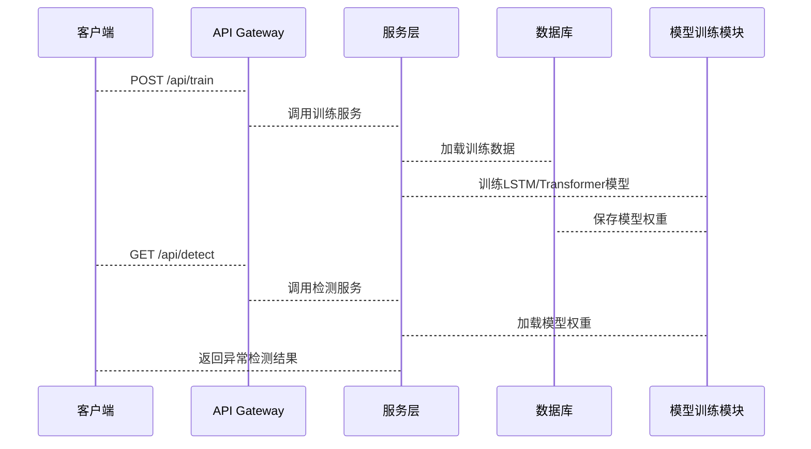

                 


# 深度学习在金融时间序列异常检测中的应用

> 关键词：深度学习，金融时间序列，异常检测，RNN，LSTM，Transformer

> 摘要：本文系统地探讨了深度学习在金融时间序列异常检测中的应用。首先介绍了金融时间序列数据的特点及其在异常检测中的重要性，然后详细讲解了深度学习模型如RNN、LSTM和Transformer在时间序列分析中的原理与优势，接着通过对比分析不同模型的优劣，提出了基于Transformer的异常检测框架。最后，通过实际案例展示了如何利用深度学习技术实现金融时间序列异常检测，并总结了该领域的未来研究方向。

---

## 第一部分：背景介绍

### 第1章：问题背景与描述

#### 1.1 问题背景

金融时间序列数据具有高度的复杂性和波动性，传统的统计方法在检测异常时往往力不从心。近年来，深度学习技术的兴起为金融领域的异常检测提供了新的可能性。

- **金融时间序列数据的特点**：
  - 高维性：包含多种金融指标。
  - 时间依赖性：数据点之间存在强相关性。
  - 异常的稀疏性：正常数据远多于异常数据。
  - 数据分布的动态变化：市场环境的变化会导致数据分布的改变。

- **异常检测在金融领域的意义**：
  - 早期发现潜在风险。
  - 提高交易系统的安全性。
  - 帮助投资者做出更明智的决策。

- **深度学习在金融领域的应用现状**：
  - 主流模型包括RNN、LSTM、Transformer等。
  - 应用场景涵盖股票价格预测、交易量分析、风险评估等。

#### 1.2 问题描述

- **时间序列异常检测的定义**：
  - 识别时间序列数据中偏离正常模式的点或子序列。
  - 异常可能代表潜在的市场波动或欺诈行为。

- **异常检测的分类与挑战**：
  - 分为单变量和多变量时间序列异常检测。
  - 挑战包括异常样本的稀疏性、模型的可解释性以及计算效率。

- **深度学习在时间序列异常检测中的优势**：
  - 能够捕捉复杂的非线性关系。
  - 适合处理高维数据。
  - 通过长短期记忆机制捕捉时间依赖性。

#### 1.3 问题解决思路

- **深度学习模型的优势**：
  - 强大的特征学习能力。
  - 能够处理复杂的时间依赖性。

- **时间序列数据的预处理方法**：
  - 数据清洗：处理缺失值、异常值。
  - 数据标准化：归一化处理。
  - 数据增强：通过滑动窗口生成更多样本。

- **异常检测的评价指标**：
  - 准确率、召回率、F1分数。
  - ROC-AUC曲线。

#### 1.4 边界与外延

- **异常检测的边界条件**：
  - 数据分布的变化可能导致模型失效。
  - 计算资源的限制影响模型的实时性。

- **相关领域与外延**：
  - 涉及金融工程、数据挖掘、机器学习等多个领域。
  - 异常检测在网络安全、医疗数据分析等领域也有广泛应用。

- **深度学习在金融领域的边界**：
  - 当前主要应用于价格预测和风险评估。
  - 对于小数据集的适用性仍需进一步研究。

#### 1.5 核心概念与组成

- **核心概念的定义与属性**：
  - 时间序列：按时间顺序排列的数据。
  - 异常检测：识别异常数据点的过程。
  - 深度学习：通过多层神经网络学习数据特征。

- **核心概念的对比表格**：
  | 概念       | 定义                                                                 | 特性                     |
  |------------|----------------------------------------------------------------------|--------------------------|
  | 时间序列   | 按时间顺序排列的数据                                             | 时间依赖性、连续性       |
  | 异常检测   | 识别偏离正常模式的数据点                                       | 稀疏性、多样性           |
  | 深度学习   | 通过多层神经网络学习数据特征                                   | 非线性、自适应性         |

- **实体关系图（Mermaid）**：
  ```mermaid
  graph TD
      A[时间序列] --> B[深度学习]
      B --> C[异常检测]
      C --> D[金融领域应用]
  ```

---

## 第二部分：核心概念与联系

### 第2章：核心概念原理

#### 2.1 深度学习与时间序列

- **深度学习的基本原理**：
  - 多层神经网络通过非线性变换提取数据特征。
  - 包括卷积神经网络（CNN）、循环神经网络（RNN）、Transformer等。

- **时间序列数据的特性**：
  - 时间依赖性：当前值与过去值相关。
  - 非线性：数据关系复杂，可能包含周期性、趋势性等。

- **深度学习在时间序列中的应用**：
  - 股票价格预测、外汇汇率波动分析、信用评分等。

#### 2.2 异常检测的核心原理

- **异常检测的定义与分类**：
  - 单变量异常检测：仅考虑单一时间序列。
  - 多变量异常检测：考虑多个时间序列之间的关系。

- **基于深度学习的异常检测方法**：
  - 基于重建的异常检测：通过模型重建输入数据，计算重建误差。
  - 基于生成对抗网络（GAN）的异常检测：生成器生成正常数据，判别器识别异常数据。

- **异常检测的评价指标**：
  - 准确率、召回率、F1分数。
  - AUC曲线：评估分类器的性能。

#### 2.3 核心概念对比与ER图

- **核心概念对比表格**：
  | 概念       | 优点                                                                 | 缺点                     |
  |------------|----------------------------------------------------------------------|--------------------------|
  | RNN        | 能处理序列数据，捕捉时间依赖性                                   | 长期依赖关系处理能力有限 |
  | LSTM       | 通过门控机制有效处理长期依赖关系                               | 结构复杂，训练时间较长   |
  | Transformer | 并行计算效率高，适合长序列                                       | 对位置依赖关系处理较弱   |

- **实体关系图（Mermaid）**：
  ```mermaid
  graph TD
      A[时间序列] --> B[深度学习模型]
      B --> C[RNN]
      B --> D[LSTM]
      B --> E[Transformer]
  ```

---

## 第三部分：算法原理讲解

### 第3章：常用深度学习模型

#### 3.1 RNN与LSTM

- **RNN的基本原理**：
  - 通过循环结构处理序列数据。
  - 递归公式：$h_t = \tanh(W_{hh}h_{t-1} + W_{hx}x_t + b_h)$。

- **LSTM的结构与优势**：
  - 通过门控机制（遗忘门、输入门、输出门）控制信息流动。
  - 遗忘门公式：$f_t = \sigma(W_{hf}h_{t-1} + W_{xf}x_t + b_f)$。
  - 输入门公式：$i_t = \sigma(W_{hi}h_{t-1} + W_{xi}x_t + b_i)$。
  - 输出门公式：$o_t = \sigma(W_{ho}h_{t-1} + W_{xo}x_t + b_o)$。
  - 单元状态公式：$s_t = f_t \cdot s_{t-1} + i_t \cdot \tanh(W_{hs}h_{t-1} + W_{xs}x_t + b_s)$。
  - 输出公式：$h_t = o_t \cdot s_t$。

- **LSTM的数学模型（Mermaid流程图）**：
  ```mermaid
  graph TD
      A[h_{t-1}, x_t] --> B[f_t, i_t, o_t]
      B --> C[s_t]
      C --> D[h_t]
  ```

#### 3.2 Transformer与注意力机制

- **Transformer的基本原理**：
  - 由编码器和解码器组成，采用自注意力机制捕捉全局依赖关系。
  - 注意力机制公式：$a_i = \frac{\exp(s_i)}{\sum_j \exp(s_j)}$，其中$s_i = q_i^T k_j$。

- **注意力机制的数学模型**：
  - 查询$q$、键$k$、值$v$：$q = W_q h_i$, $k = W_k h_j$, $v = W_v h_j$。
  - 注意力权重：$a_{ij} = \frac{\exp(q_i^T k_j)}{\sum_l \exp(q_i^T k_l)}$。
  - 加权和：$h_i' = \sum_j a_{ij} v_j$。

- **Transformer在时间序列中的应用**：
  - 通过自注意力机制捕捉时间序列中的长距离依赖关系。

- **Transformer的数学模型（Mermaid流程图）**：
  ```mermaid
  graph TD
      A[h_1, h_2, h_3] --> B[Self-Attention]
      B --> C[h'_1, h'_2, h'_3]
  ```

#### 3.3 模型对比与分析

- **模型对比表格**：
  | 模型       | 优点                                                                 | 缺点                     |
  |------------|----------------------------------------------------------------------|--------------------------|
  | RNN        | 结构简单，适合短序列                                               | 长期依赖关系处理能力有限 |
  | LSTM       | 通过门控机制有效处理长期依赖关系                               | 训练时间较长             |
  | Transformer | 并行计算效率高，适合长序列                                       | 对位置依赖关系处理较弱   |

- **模型对比流程图（Mermaid）**：
  ```mermaid
  graph TD
      A[RNN] --> B[LSTM]
      B --> C[Transformer]
  ```

---

## 第四部分：系统分析与架构设计

### 第4章：系统功能与架构设计

#### 4.1 项目介绍

- **项目目标**：
  - 构建一个基于深度学习的金融时间序列异常检测系统。

- **系统功能设计**：
  - 数据采集与预处理：从金融数据库中获取时间序列数据，进行清洗和标准化。
  - 模型训练：基于LSTM或Transformer模型训练异常检测模型。
  - 异常检测：实时监控金融数据，检测异常点。

- **领域模型（Mermaid类图）**：
  ```mermaid
  classDiagram
      class 数据采集模块 {
          输入数据源
          数据清洗
          数据标准化
      }
      class 模型训练模块 {
          LSTM/Transformer模型
          训练数据
          模型权重
      }
      class 异常检测模块 {
          实时数据输入
          异常判断
          异常报警
      }
      数据采集模块 --> 模型训练模块
      模型训练模块 --> 异常检测模块
  ```

#### 4.2 系统架构设计

- **系统架构图（Mermaid架构图）**：
  ```mermaid
  architecture
      Client
      API Gateway
      Service Layer {
          异常检测服务
          模型服务
      }
      Database {
          训练数据
          模型权重
      }
  ```

#### 4.3 系统接口设计

- **API接口**：
  - POST /api/train：上传训练数据，训练模型。
  - GET /api/detect：获取实时数据的异常检测结果。

#### 4.4 系统交互流程（Mermaid序列图）：



---

## 第五部分：项目实战

### 第5章：环境安装与核心代码实现

#### 5.1 环境安装

- **Python环境**：建议使用Python 3.6及以上版本。
- **深度学习框架**：推荐使用TensorFlow或Keras。
- **其他依赖**：Pandas、NumPy、Matplotlib。

#### 5.2 核心代码实现

- **数据预处理代码**：
  ```python
  import pandas as pd
  import numpy as np

  # 加载数据
  data = pd.read_csv('financial_data.csv')

  # 数据清洗
  data = data.dropna()
  data = (data - data.mean()) / data.std()  # 标准化

  # 划分训练集和测试集
  train_data = data.iloc[:700]
  test_data = data.iloc[700:]
  ```

- **LSTM模型代码**：
  ```python
  from tensorflow.keras.models import Sequential
  from tensorflow.keras.layers import LSTM, Dense, Dropout

  model = Sequential()
  model.add(LSTM(64, input_shape=(None, 1)))
  model.add(Dense(1))
  model.compile(loss='mean_squared_error', optimizer='adam')

  # 训练模型
  model.fit(train_data.values.reshape(-1, 1), train_data.values, epochs=10, batch_size=32)
  ```

- **异常检测代码**：
  ```python
  # 使用训练好的模型进行预测
  predicted_prices = model.predict(test_data.values.reshape(-1, 1))
  predicted_prices = predicted_prices.reshape(-1)

  # 计算异常分数
  error = abs(predicted_prices - test_data.values)
  threshold = np.quantile(error, 0.95)
  anomalies = error > threshold

  # 可视化异常点
  import matplotlib.pyplot as plt

  plt.figure(figsize=(12, 6))
  plt.plot(test_data.index, test_data.values, label='Actual')
  plt.plot(test_data.index, predicted_prices, label='Predicted')
  plt.scatter(test_data.index[anomalies], test_data.values[anomalies], color='red', label='Anomalies')
  plt.legend()
  plt.show()
  ```

#### 5.3 案例分析与解读

- **案例分析**：
  - 使用LSTM模型对某金融时间序列数据进行异常检测。
  - 训练模型并预测测试集的数据。
  - 计算预测误差，识别异常点。

- **代码解读**：
  - 数据预处理：清洗和标准化数据。
  - 模型训练：构建LSTM模型并进行训练。
  - 异常检测：计算预测误差，识别异常点并可视化。

#### 5.4 项目小结

- **项目总结**：
  - 成功实现了基于LSTM的金融时间序列异常检测系统。
  - 通过可视化展示了异常点，验证了模型的有效性。

---

## 第六部分：总结与展望

### 第6章：总结与展望

#### 6.1 总结

- **核心内容回顾**：
  - 介绍了深度学习在金融时间序列异常检测中的应用。
  - 详细讲解了RNN、LSTM和Transformer模型的原理与优势。
  - 提出了基于Transformer的异常检测框架，并通过案例展示了其实现过程。

#### 6.2 注意事项与最佳实践

- **注意事项**：
  - 数据预处理对模型性能影响重大，需谨慎处理。
  - 模型选择应结合实际应用场景和数据特性。
  - 异常检测的评价指标需根据业务需求选择。

- **最佳实践**：
  - 使用数据增强技术提高模型的泛化能力。
  - 定期更新模型，适应数据分布的变化。
  - 结合领域知识，优化模型的可解释性。

#### 6.3 未来研究方向

- **模型优化**：
  - 研究更高效的模型结构，如Hybrid Transformer。
  - 探索轻量级模型，提高计算效率。

- **算法改进**：
  - 结合图神经网络，建模金融网络中的异常传播。
  - 研究在线学习方法，实现实时异常检测。

- **应用扩展**：
  - 将异常检测应用于更广泛的金融场景，如信用评分、欺诈检测。
  - 探索多模态数据的异常检测，如结合文本信息进行市场情绪分析。

---

## 作者

作者：AI天才研究院/AI Genius Institute & 禅与计算机程序设计艺术 /Zen And The Art of Computer Programming

---

通过以上详细的内容，我们系统地探讨了深度学习在金融时间序列异常检测中的应用，从理论到实践，全面分析了相关模型的原理、优缺点及实际应用案例。希望本文能为相关领域的研究者和实践者提供有价值的参考和启发。

