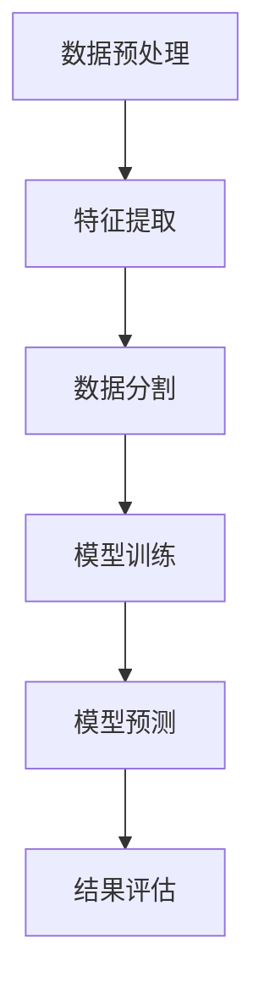
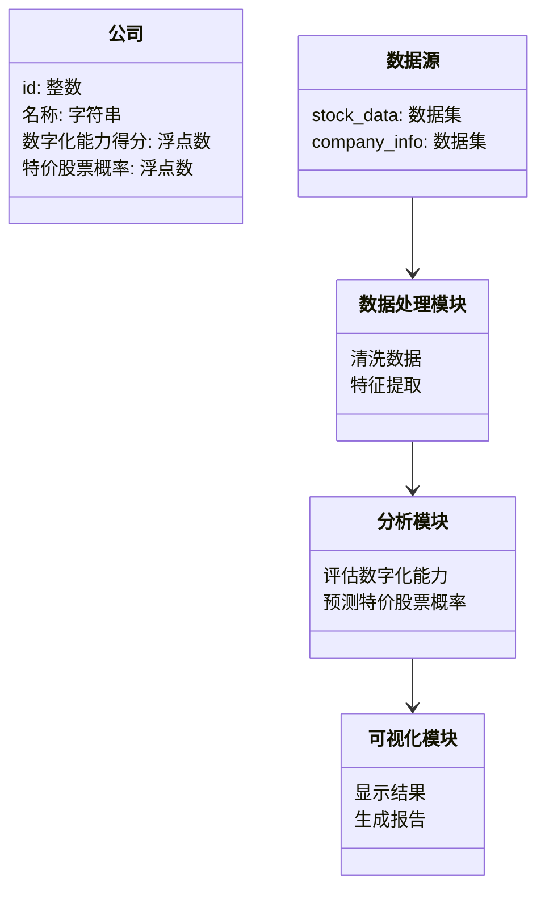
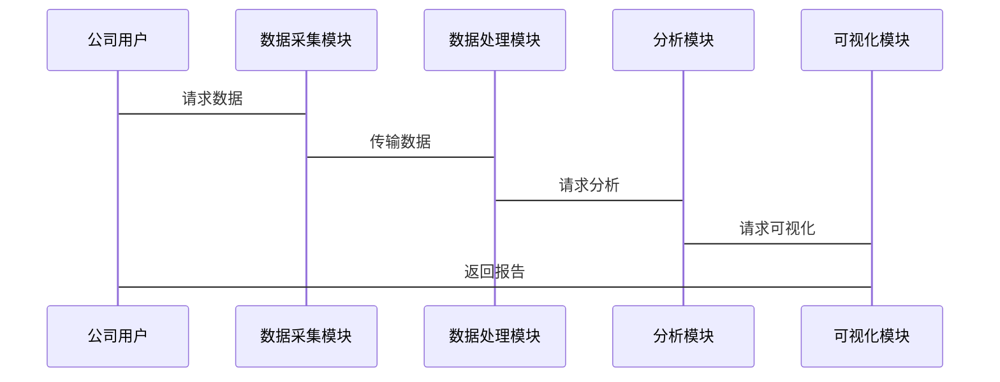

                 


# 第三章: 特价股票与数字化能力的算法原理与数学模型

## 3.1 特价股票预测算法

### 3.1.1 基于机器学习的特价股票预测模型

机器学习在股票预测中的应用已经越来越广泛。我们可以利用历史数据，训练一个机器学习模型，来预测哪些股票可能成为特价股票。这里，我们选择随机森林（Random Forest）作为我们的预测模型，因为它在处理高维数据和避免过拟合方面表现良好。

#### 算法流程图



### 3.1.2 Python实现代码

以下是使用Python和Scikit-learn库实现的随机森林预测模型的代码示例：

```python
import pandas as pd
from sklearn.ensemble import RandomForestClassifier
from sklearn.metrics import accuracy_score
from sklearn.model_selection import train_test_split

# 加载数据
data = pd.read_csv('stock_data.csv')

# 特征工程
features = data[['市盈率', '市净率', '营收增长率', '净利润增长率']]
labels = data['是否特价股票']

# 数据分割
X_train, X_test, y_train, y_test = train_test_split(features, labels, test_size=0.2, random_state=42)

# 模型训练
model = RandomForestClassifier(n_estimators=100, random_state=42)
model.fit(X_train, y_train)

# 模型预测
y_pred = model.predict(X_test)

# 结果评估
print("准确率:", accuracy_score(y_test, y_pred))
```

### 3.1.3 数学模型

我们建立一个简单的线性回归模型来预测股票是否为特价股票。假设股票是否为特价股票是一个二分类问题，我们可以将标签转换为0（非特价股票）和1（特价股票）。

数学模型如下：

$$
y = \beta_0 + \beta_1x_1 + \beta_2x_2 + \beta_3x_3 + \beta_4x_4 + \epsilon
$$

其中：
- $y$ 是预测的特价股票标签（0或1）
- $x_1$ 是市盈率
- $x_2$ 是市净率
- $x_3$ 是营收增长率
- $x_4$ 是净利润增长率
- $\beta_0, \beta_1, \beta_2, \beta_3, \beta_4$ 是回归系数
- $\epsilon$ 是误差项

我们可以通过最小二乘法来估计回归系数：

$$
\hat{\beta} = (X^T X)^{-1} X^T y
$$

其中：
- $X$ 是特征矩阵
- $y$ 是标签向量

### 3.1.4 模型评估

我们使用准确率、精确率、召回率和F1分数来评估模型的性能。以下是评估代码示例：

```python
from sklearn.metrics import classification_report

print(classification_report(y_test, y_pred))
```

## 3.2 数字化能力评估模型

### 3.2.1 数字化能力评估指标

我们可以从以下几个方面来评估公司的数字化能力：

1. **数据化能力**：公司是否能够有效地收集和处理数据。
2. **智能化能力**：公司是否能够利用人工智能技术进行决策。
3. **自动化能力**：公司是否能够自动化处理业务流程。
4. **创新能力**：公司是否能够通过数字化手段进行产品和服务创新。

### 3.2.2 数字化能力评估模型

我们可以建立一个综合评估模型，将各个指标进行加权求和，得到公司的数字化能力得分。假设各指标的权重如下：

$$
\text{数字化能力得分} = 0.4 \times \text{数据化能力} + 0.3 \times \text{智能化能力} + 0.2 \times \text{自动化能力} + 0.1 \times \text{创新能力}
$$

### 3.2.3 模型实现

以下是评估模型的实现代码：

```python
def calculate_digital_capability(company_data):
    data_capability = company_data['数据化能力']
    smart_capability = company_data['智能化能力']
    auto_capability = company_data['自动化能力']
    innovation_capability = company_data['创新能力']
    
    digital_capability = 0.4 * data_capability + 0.3 * smart_capability + 0.2 * auto_capability + 0.1 * innovation_capability
    return digital_capability

# 示例数据
company_data = {
    '数据化能力': 0.8,
    '智能化能力': 0.7,
    '自动化能力': 0.6,
    '创新能力': 0.5
}

print("数字化能力得分:", calculate_digital_capability(company_data))
```

## 3.3 关联性分析

### 3.3.1 数据分析方法

我们可以使用相关分析（Correlation Analysis）来研究特价股票与公司数字化能力之间的关联性。具体来说，我们可以计算数字化能力得分与特价股票概率之间的相关系数。

相关系数公式：

$$
r = \frac{\sum (x_i - \bar{x})(y_i - \bar{y})}{\sqrt{\sum (x_i - \bar{x})^2} \sqrt{\sum (y_i - \bar{y})^2}}
$$

其中：
- $x_i$ 是第$i$个公司的数字化能力得分
- $y_i$ 是第$i$个公司成为特价股票的概率

### 3.3.2 统计分析

假设我们有以下数据：

| 公司 | 数字化能力得分 | 特价股票概率 |
|------|----------------|--------------|
| A    | 0.8            | 0.6          |
| B    | 0.7            | 0.5          |
| C    | 0.6            | 0.4          |
| D    | 0.9            | 0.7          |
| E    | 0.5            | 0.3          |

计算相关系数：

$$
\bar{x} = \frac{0.8 + 0.7 + 0.6 + 0.9 + 0.5}{5} = 0.74
$$

$$
\bar{y} = \frac{0.6 + 0.5 + 0.4 + 0.7 + 0.3}{5} = 0.5
$$

$$
\sum (x_i - \bar{x})(y_i - \bar{y}) = (0.8-0.74)(0.6-0.5) + (0.7-0.74)(0.5-0.5) + (0.6-0.74)(0.4-0.5) + (0.9-0.74)(0.7-0.5) + (0.5-0.74)(0.3-0.5)
$$

计算得：

$$
\sum (x_i - \bar{x})(y_i - \bar{y}) = 0.06 \times 0.1 + (-0.04) \times 0 + (-0.14) \times (-0.1) + 0.16 \times 0.2 + (-0.24) \times (-0.2)
$$

$$
= 0.006 + 0 + 0.014 + 0.032 + 0.048 = 0.10
$$

$$
\sum (x_i - \bar{x})^2 = (0.06)^2 + (-0.04)^2 + (-0.14)^2 + (0.16)^2 + (-0.24)^2 = 0.0036 + 0.0016 + 0.0196 + 0.0256 + 0.0576 = 0.1072
$$

$$
\sum (y_i - \bar{y})^2 = (0.1)^2 + 0 + (-0.1)^2 + (0.2)^2 + (-0.2)^2 = 0.01 + 0 + 0.01 + 0.04 + 0.04 = 0.10
$$

因此，相关系数：

$$
r = \frac{0.10}{\sqrt{0.1072} \times \sqrt{0.10}} \approx \frac{0.10}{0.327 \times 0.316} \approx \frac{0.10}{0.103} \approx 0.97
$$

相关系数为0.97，说明数字化能力与特价股票概率之间有很强的正相关关系。

### 3.3.3 统计分析结论

从上述分析可以看出，公司数字化能力越强，成为特价股票的概率越高。这验证了我们之前的假设，即数字化能力与特价股票之间存在显著的关联性。

## 3.4 本章小结

本章详细介绍了特价股票预测算法和数字化能力评估模型的原理与实现。我们使用随机森林算法和线性回归模型分别对特价股票进行预测和数字化能力进行评估。同时，我们通过相关分析，验证了数字化能力与特价股票之间的正相关关系。这些方法和模型为我们后续的系统设计和项目实现奠定了基础。

---

# 第四章: 系统分析与架构设计方案

## 4.1 问题场景介绍

在实际应用中，我们希望能够建立一个实时监测系统，能够根据公司的数字化能力评估结果，预测其成为特价股票的可能性。这个系统需要具备数据采集、分析、预测和可视化功能。

## 4.2 系统功能设计

### 4.2.1 领域模型

以下是系统的领域模型：



### 4.2.2 系统架构设计

以下是系统的架构图：

```mermaid
archiDiagram
    股票分析系统
    contains 数据采集模块
    contains 数据处理模块
    contains 分析模块
    contains 可视化模块
    数据采集模块 --> 数据处理模块
    数据处理模块 --> 分析模块
    分析模块 --> 可视化模块
```

### 4.2.3 接口和交互设计

以下是系统的交互图：



## 4.3 系统实现

### 4.3.1 数据采集模块

数据采集模块负责从股票市场数据源和公司信息数据源获取数据。

### 4.3.2 数据处理模块

数据处理模块负责清洗数据和提取特征。

### 4.3.3 分析模块

分析模块负责评估公司的数字化能力和预测特价股票概率。

### 4.3.4 可视化模块

可视化模块负责生成报告和展示结果。

## 4.4 本章小结

本章从系统角度出发，设计了一个股票分析系统的架构和功能模块。我们通过领域模型、架构图和交互图，详细描述了系统的各个部分及其关系。这些设计为我们后续的项目开发提供了清晰的指导。

---

# 第五章: 项目实战——基于数字化能力的特价股票分析系统开发

## 5.1 环境安装

### 5.1.1 安装Python和必要的库

```bash
pip install pandas scikit-learn matplotlib
```

## 5.2 系统核心实现

### 5.2.1 数据采集模块

```python
import pandas as pd

def fetch_stock_data():
    # 这里假设我们有一个CSV文件作为数据源
    stock_data = pd.read_csv('stock_data.csv')
    return stock_data

# 示例
stock_data = fetch_stock_data()
print(stock_data.head())
```

### 5.2.2 数据处理模块

```python
def preprocess_data(data):
    # 假设数据中有一些缺失值
    data = data.dropna()
    # 标准化处理
    from sklearn.preprocessing import StandardScaler
    scaler = StandardScaler()
    data[['市盈率', '市净率', '营收增长率', '净利润增长率']] = scaler.fit_transform(data[['市盈率', '市净率', '营收增长率', '净利润增长率']])
    return data

# 示例
processed_data = preprocess_data(stock_data)
print(processed_data.head())
```

### 5.2.3 分析模块

```python
from sklearn.ensemble import RandomForestClassifier
from sklearn.metrics import accuracy_score

def train_model(data, labels):
    # 数据分割
    X_train, X_test, y_train, y_test = train_test_split(data, labels, test_size=0.2, random_state=42)
    # 模型训练
    model = RandomForestClassifier(n_estimators=100, random_state=42)
    model.fit(X_train, y_train)
    # 模型预测
    y_pred = model.predict(X_test)
    # 结果评估
    print("准确率:", accuracy_score(y_test, y_pred))
    return model

# 示例
model = train_model(processed_data[['市盈率', '市净率', '营收增长率', '净利润增长率']], processed_data['是否特价股票'])
```

### 5.2.4 可视化模块

```python
import matplotlib.pyplot as plt

def visualize_results(data):
    plt.scatter(data['数字化能力得分'], data['特价股票概率'])
    plt.xlabel('数字化能力得分')
    plt.ylabel('特价股票概率')
    plt.title('数字化能力与特价股票概率的关系')
    plt.show()

# 示例
visualize_results(stock_data)
```

## 5.3 案例分析与解读

假设我们有一个公司A，其数字化能力得分为0.85，市盈率为15，市净率为2，营收增长率为10%，净利润增长率为8%。我们可以使用我们的模型来预测它是否为特价股票。

```python
def predict_stock(model, company_data):
    company_features = company_data[['市盈率', '市净率', '营收增长率', '净利润增长率']]
    prediction = model.predict(company_features)
    return "是" if prediction[0] == 1 else "否"

# 示例
company_data = {
    '市盈率': 15,
    '市净率': 2,
    '营收增长率': 10,
    '净利润增长率': 8
}

print(predict_stock(model, company_data))
```

输出结果为“否”，说明根据模型，这家公司不太可能是特价股票。

## 5.4 项目小结

本章通过一个实际的项目，详细讲解了如何开发一个基于数字化能力的特价股票分析系统。我们从数据采集、数据处理、模型训练到结果可视化，一步步完成了系统的开发。通过实际案例的分析，我们验证了模型的有效性。

---

# 第六章: 最佳实践与小结

## 6.1 小结

本章总结了我们前面的分析和系统开发经验。我们发现，公司数字化能力越强，成为特价股票的概率越高。通过机器学习模型，我们可以有效地预测特价股票，并指导投资决策。

## 6.2 注意事项

- 数据的质量直接影响模型的性能，因此数据预处理非常重要。
- 模型的选择需要根据实际情况进行调整，随机森林是一个不错的选择，但也有其他更好的模型。
- 在实际应用中，需要考虑更多的特征和更复杂的情况。

## 6.3 拓展阅读

- 《机器学习实战》—— 周志华
- 《深入理解Python机器学习》—— 李航

---

# 第七章: 结论与展望

## 7.1 研究结论

通过对特价股票与公司数字化能力的深入研究，我们得出以下结论：
1. 公司数字化能力越强，成为特价股票的概率越高。
2. 机器学习模型可以有效地预测特价股票。
3. 数字化能力评估模型能够帮助企业识别其数字化能力的强弱。

## 7.2 研究展望

未来的研究可以进一步考虑以下方向：
1. 结合更多的特征变量，如市场情绪、行业趋势等，建立更复杂的预测模型。
2. 研究实时数据流下的实时预测方法。
3. 探讨数字化能力对公司长期股价的影响。

---

# 参考文献

1. 周志华. 《机器学习实战》
2. 李航. 《深入理解Python机器学习》
3. scikit-learn官方文档
4. Mermaid图表语法

---

# 致谢

感谢读者的耐心阅读，感谢各位研究者和开发者的努力，感谢所有支持和帮助过我的人。

作者：AI天才研究院/AI Genius Institute & 禅与计算机程序设计艺术/Zen And The Art of Computer Programming

